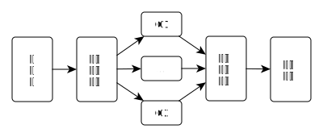

$$
\renewcommand{\argmax}{\operatorname{argmax}}
\renewcommand{\sign}{\operatorname{sign}}
$$

```{r setup, include=FALSE}
library(knitr)
library(tidyverse)
options(servr.deamon = TRUE)
options(htmltools.dir.version = FALSE)
```

<div class="content-page">
  <p class="content-page-title">目录</p>
  <li class="content-page-list">Bagging</li>
  <li class="content-page-list">Boosting</li>
  <li class="content-page-list">Stacking</li>
</div>

---
class:

# 集成学习

传统的机器学习算法（例如：决策树，人工神经网络，支持向量机，朴素贝叶斯等）的目标都是寻找一个最优的分类器尽可能的将训练数据分开。集成学习（Ensemble Learning）算法的基本思想就是通过将多个分类器组合，从而实现一个预测效果更好的集成分类器。集成算法可以说从一方面验证了中国的一句老话：三个臭皮匠，赛过诸葛亮。Thomas G. Dietterich<sup>[1, 2]</sup>指出了集成算法在统计，计算和表示上的有效原因：

**统计上的原因**：一个学习算法可以理解为在一个假设空间
$\mathcal{H}$中选找到一个最好的假设。但是，当训练样本的数据量小到不够用来精确的学习到目标假设时，学习算法可以找到很多满足训练样本的分类器。所以，学习算法选择任何一个分类器都会面临一定错误分类的风险，因此将多个假设集成起来可以降低选择错误分类器的风险。

.footnote[
[1] T. G. Dietterich, “Ensemble methods in machine learning,” in Multiple classifier systems, pp. 1–15, Springer, 2000.

[2] T. G. Dietterich, “Ensemble learnig,” The handbook of brain theory and neural networks, vol. 2, pp. 110–125, 2002.
]

---
class:

# 集成学习

**计算上的原因**：很多学习算法在进行最优化搜索时很有可能陷入局部最优的错误中，因此对于学习算法而言很难得到一个全局最优的假设。事实上人工神经网络和决策树已经被证实为是一个NP问题<sup>[1, 2]</sup>。集成算法可以从多个起始点进行局部搜索，从而分散陷入局部最优的风险。

**表示上的原因**：在多数应用场景中，假设空间
$\mathcal{H}$中的任意一个假设都无法表示（或近似表示）真正的分类函数
$f$。因此，对于不同的假设条件，通过加权的形式可以扩大假设空间，从而学习算法可以在一个无法表示或近似表示真正分类函数
$f$的假设空间中找到一个逼近函数
$f$的近似值。

.footnote[
[1] L. Hyafil and R. L. Rivest, “Constructing optimal binary decision trees is np-complete,” Information Processing Letters, vol. 5, no. 1, pp. 15–17, 1976.

[2] A. L. Blum and R. L. Rivest, “Training a 3-node neural network is np-complete,” Neural Networks, vol. 5, no. 1, pp. 117–127, 1992.
]

---
class: inverse, center, middle

# Bagging

---
class:

# Bagging

.pull-left[
Bagging是有Breiman于1996年提出<sup>[1]</sup>，基本思想如下：

1. 每次采用有放回的抽样从训练集中取出
$n$个训练样本组成新训练集。

2. 利用新的训练集，训练得到
$M$个子模型
$\{h_1, h_2, ..., h_M\}$。

3. 对于分类问题，采用投票的方法，得票最多子模型的分类类别为最终的类别；对于回归问题，采用简单的平均方法得到预测值。
]

.pull-right[
<pre class="convert-pseudocode" caption="Bagging算法">
\REQUIRE 学习算法$L$，子模型个数$M$，训练数据集$T$
\ENSURE Bagging算法$h_f\left(x\right)$
\PROCEDURE{Bagging}{$L, M, T$}
    \FOR{$m$ = $1$ to $M$}
        \STATE $T_m \gets$ boostrap sample from training set $T$
        \STATE $h_m \gets L\left(T_m\right)$
    \ENDFOR
    \STATE $h_f\left(x\right) \gets \mathbb{argmax}_{y \in Y} \sum_{m}^{M} h_i\left(x\right)$
    \RETURN $h_f\left(x\right)$
\ENDPROCEDURE
</pre>
]

.footnote[
[1] L. Breiman, “Bagging predictors,” Machine learning, vol. 24, no. 2, pp. 123–140, 1996.
]

---
class:

# Bagging

假设对于一个包含
$M$个样本的数据集
$T$，利用自助采样，则一个样本始终不被采用的概率是
$\left(1 - \frac{1}{M}\right)^M$，取极限有：

$$lim_{x \to \infty} \left(1 - \dfrac{1}{M}\right)^M = \dfrac{1}{e} \approx 0.368$$

即每个学习器仅用到了训练集中
$63.2\%$的数据集，剩余的
$36.8\%$的训练集样本可以用作验证集对于学习器的泛化能力进行包外估计（out-of-bag estimate）。

---
class:

# 随机森林

随机森林（Random Forests）<sup>[1]</sup>是一种利用决策树作为基学习器的Bagging集成学习算法。随机森林模型的构建过程如下

- 数据采样

作为一种Bagging的集成算法，随机森林同样采用有放回的采样，对于总体训练集
$T$，抽样一个子集
$T_{sub}$最为训练样本集。除此之外，假设训练集的特征个数为
$d$，每次仅选择
$k\left(k < d\right)$个构建决策树。因此，随机森林处理能够做到样本扰动外，还添加了特征扰动，对于特征的选择个数，推荐值
$k = \log_2 d$。

- 树的构建

每次根据采样得到的数据和特征，构建一棵决策树。在构建决策树的过程中，会让决策树生长完全而不进行剪枝。构建出的若干棵决策树则组成了最终的随机森林。

.footnote[
[1] L. Breiman, “Random forests,” Machine learning, vol. 45, no. 1, pp. 5–32, 2001.
]

---
class:

# 随机森林

随机森林在众多分类算法中表现十分出众<sup>[1]</sup>，其主要的优点包括：

1. 由于随机森林引入了样本扰动和特征扰动，从而很大程度上提高了模型的泛化能力，尽可能地避免了过拟合现象的出现。

2. 随机森林可以处理高维数据，无需进行特征选择，在训练过程中可以得出不同特征对模型的重要性程度。

3. 随机森林的每个弱分类器采用决策树，方法简单且容易实现。同时每个弱分类器之间没有相互依赖关系，整个算法易并行化。

.footnote[
[1] M. Fernández-Delgado, E. Cernadas, S. Barro, and D. Amorim, “Do we need hundreds of classifiers to solve real world classification problems?,” The Journal of Machine Learning Research, vol. 15, no. 1, pp. 3133–3181, 2014.
]

---
class: inverse, center, middle

# Boosting

---
class:

# Boosting

Boosting是一种提升算法，可以将弱的学习算法提升（boost）为强的学习算法。其基本思路如下：

1. 利用初始训练样本集训练得到一个基学习器。

2. 提高被基学习器误分的样本的权重，使得那些被错误分类的样本在下一轮训练中可以得到更大的关注，利用调整后的样本训练得到下一个基学习器。

3. 重复上述步骤，指导得出
$M$个学习器。

4. 对于分类问题，采用有权重的投票方式；对于回归问题，采用加权平均得到预测值。

---
class:

# Adaboost

Adaboost<sup>[1]</sup>是Boosting算法中最具代表性的一个。原始的Adaboost算法用于解决二分类问题，因此对于一个训练集

$$T = \{\left(x_1, y_1\right), \left(x_2, y_2\right), ..., \left(x_n, y_n\right)\}$$

其中
$x_i \in \mathcal{X} \subseteq \mathbb{R}^n$，
$y_i \in \mathcal{Y} = \{-1, +1\}$，首先初始化训练集的权重

$$\begin{split}
D_1 =& \left(w_{11}, w_{12}, ..., w_{1n}\right) \\
 w_{1i} =& \dfrac{1}{n}, i = 1, 2, ..., n
\end{split}$$

根据每一轮训练集的权重
$D_m$，对训练集数据进行抽样得到
$T_m$，再根绝
$T_m$可以得到每一轮的基学习器
$h_m$。

.footnote[
[1] Y. Freund and R. E. Schapire, “A decision-theoretic generalization of on-line learning and an application to boosting,” Journal of computer and system sciences, vol. 55, no. 1, pp. 119–139, 1997.
]

---
class:

# Adaboost

通过计算可以得出基学习器
$h_m$的误差为
$\epsilon_m$，根据基学习器的误差计算得出该基学习器在最终学习器中的系数

$$\alpha_m = \dfrac{1}{2} \ln \dfrac{1 - \epsilon_m}{\epsilon_m}$$

更新训练集的权重

$$\begin{split}
D_{m+1} =& \left(w_{m+1, 1}, w_{m+1, 2}, ..., w_{m+1, n}\right) \\
w_{m+1, i} =& \dfrac{w_{m, i}}{Z_m} \exp \left(-\alpha_m y_i h_m\left(x_i\right)\right) \\
Z_m =& \sum_{i = 1}^{n} w_{m, i} \exp \left(-\alpha_m y_i h_m \left(x_i\right)\right)
\end{split}$$

其中
$Z_m$为规范化因子，从而保证
$D_{m+1}$为一个概率分布。

---
class:

.pull-left[
# Adaboost

最终根据构建的
$M$个基学习器得到最终的学习器：

$$h_f\left(x\right) = \sign\left(\sum_{m=1}^{M} \alpha_i h_m\left(x\right)\right)$$

AdaBoost算法过程如由所示：

]

.pull-right[
<br />
<pre class="convert-pseudocode" caption="AdaBoost算法">
\REQUIRE 学习算法$L$，子模型个数$M$，训练数据集$T$
\ENSURE AdaBoost算法$h_f\left(x\right)$
\PROCEDURE{AdaBoost}{$L, M, T$}
    \STATE $D_1\left(x\right) \gets 1 / n$
    \FOR{$m$ = $1$ to $M$}
        \STATE $T_{sub} = $ sample from training set $T$ with weights
        \STATE $h_m = L\left(T_{sub}\right)$
        \STATE $\epsilon_m\gets Error\left(h_m\right)$
        \IF{$\epsilon_m > 0.5$}
            \STATE \textbf{break}
        \ENDIF
        \STATE $\alpha_m \gets \dfrac{1}{2} \ln \dfrac{1 - \epsilon_m}{\epsilon_m}$
        \STATE $D_{m+1} \gets \dfrac{D_m \exp \left(-\alpha_m y h_m\left(x\right)\right)}{Z_m}$
    \ENDFOR
    \STATE $h_f\left(x\right) = \mathbf{sign}\left(\sum_{m=1}^{M} \alpha_i h_m\left(x\right)\right)$
    \RETURN $h_f\left(x\right)$
\ENDPROCEDURE
</pre>
]

---
class:

# GBM

GBM（Gradient Boosting Machine）是另一种基于Boosting思想的集成算法，GBM还有很多其他的叫法，例如：GBDT，GBRT，MART等等。GBM算法由3个主要概念构成：Gradient Boosting（GB），Regression Decision Tree（DT或RT）和Shrinkage。

从GBM的众多别名中可以看出，GBM中使用的决策树并非我们最常用的分类树，而是回归树。分类树主要用于处理响应变量为因子型的数据，例如天气（可以为晴，阴或下雨等）。回归树主要用于处理响应变量为数值型的数据，例如商品的价格。当然回归树也可以用于二分类问题，对于回归树预测出的数值结果，通过设置一个阈值即可以将数值型的预测结果映射到二分类问题标签上，即
$\mathcal{Y} = \{-1, +1\}$。

对于Gradient Boosting而言，首先，Boosting并不是Adaboost中的Boost的概念，也不是Random Forest中的冲抽样。在Adaboost中，Boost是指在生成每个新的基学习器，跟根据上一轮基学习器分类对错对训练集设置不同的权重，使得在上一轮中分类错误的样本在生成新的基学习器时更被重视。GBM中在应用Boost概念时，每一轮所使用的数据集没有经过重抽样，也没有更新样本的权重，而是每一轮选择了不用的回归的目标值，即上一轮计算得出的残差（Residual）。其次，Gradient是指在新一轮中在残差减少的梯度（Gradient）上建立新的基学习器。

---
class:

# GBM

下面通过一个年龄预测的示例介绍GBM的工作流程。存在4个人
$P = \{p_1, p_2, p_3, p_4\}$，他们对应的年龄为
$14, 16, 24, 26$。其中
$p_1, p_2$分别是高一和高三学生，
$p_3, p_4$分别是应届毕业生和工作两年的员工。利用决策树模型进行训练可以得到如图所示的结果：

.center[

]

.footnote[
[1] 示例修改自：http://suanfazu.com/t/gbdt-die-dai-jue-ce-shu-ru-men-jiao-cheng/135
]

---
class:

# GBM

利用GBM训练得到模型，由于数据量少，在此限定每个基学习器中的叶子节点最多为2个，即树的深度最大为1层。训练得到的结果如图所示：

.pull-left[
.center[

]
]

.pull-right[
.center[

]
]

在训练第一棵树过程中，利用年龄作为预测值，根据计算可得由于
$p_1, p_2$年龄相近，
$p_3, p_4$年龄相近被划分为两组。通过计算两组中真实年龄和预测的年龄的差值，可以得到第一棵树的残差
$R = \{-1, 1, -1, 1\}$。因此在训练第二棵树的过程中，利用第一棵树的残差作为预测值，最终所有人的年龄均正确被预测，即最终所有的残差均为
$0$。

---
class:

# GBM

.pull-left[
则对于训练集中的4个人利用训练得到额GBM模型预测的结果如下：

- $p_1$：14岁高一学生。购物较少，经常问学长问题，预测年龄
$Age = 15 - 1 = 14$。
- $p_2$：16岁高三学生。购物较少，经常被学弟问问题，预测年龄
$Age = 15 + 1 = 16$。
- $p_3$：24岁应届毕业生。购物较多，经常问师兄问题，预测年龄
$Age = 25 - 1 = 24$。
- $p_4$：26岁2年工作经验员工。购物较多，经常被师兄问问题，预测年龄
$Age = 25 + 1 = 26$。
]

.pull-right[
<pre class="convert-pseudocode" caption="GBM算法">
\REQUIRE 子模型个数$M$，训练数据集$T$
\ENSURE GBM算法$h_f\left(x\right)$
\PROCEDURE{GBM}{$M, T$}
    \STATE $F_1\left(x\right) \gets \sum_{i = 1}^{N} y_i / N$
    \FOR {$m$ = $1$ to $M$}
        \STATE $r_m \gets y - F_m \left(x\right)$
        \STATE $T_m \gets \left(x, r_m\right)$
        \STATE $h_m \gets RegressionTree \left(T_m\right)$
        \STATE $\alpha_m \gets \dfrac{\sum_{i = 1}^{N} r_{im} h_m \left(x_i\right)}{\sum_{i = 1}^{N} h_m \left(x_i\right)^2}$
        \STATE $F_m \left(x\right) = F_{m-1} \left(x\right) + \alpha_m h_m \left(x\right)$
    \ENDFOR
    \STATE $h_f\left(x\right) =  F_M \left(x\right)$
    \RETURN $h_f\left(x\right)$
\ENDPROCEDURE
</pre>
]

---
class:

# GBM

在GBM中也应用到了Shrinkage的思想，其基本思想可以理解为在每一轮利用残差学习得到的回归树仅学习到了一部分知识，即无法完全信任一棵树的结果。因此，Shrinkage思想认为在新的一轮学习中，不利用全部残差训练模型，而只利用其中一部分，即：

$$r_m = y - s F_m \left(x\right), 0 \leq s \leq 1$$

注意，这里的Shrinkage和学习算法中Gradient的步长是两个不相关的概念。Shrinkage设置小一些可以避免发生过拟合现象；而Gradient中的步长如果设置太小则会陷入局部最优，如果设置过大又容易结果不收敛。

---
class: inverse, center, middle

# Stacking

---
class:

# Stacking

Stacking<sup>[1, 2]</sup>方法又称为Stacked Generalization，是一种基于分层模型组合的集成算法。Stacking算法的基本思想如下：

1. 利用初级学习算法对原始数据集进行学习，同时生成一个新的数据集。
2. 根据从初级学习算法生成的新数据集，利用次级学习算法学习并得到最终输出。

对于初级学习器，可以是相同类型也可以是不同类型的，同时在生成新的数据集的过程中，其相应变量仍为原始数据集中的相应变量。Stacking算法的流程如图所示：

.center[

]

.footnote[
[1] D. H. Wolpert, “Stacked generalization,” Neural networks, vol. 5, no. 2, pp. 241–259, 1992. <br />
[2] L. Breiman, “Stacked regressions,” Machine learning, vol. 24, no. 1, pp. 49–64, 1996.
]

---
class:

# Stacking

次级学习器的训练集是有初级学习器产生的，如果直接利用初级学习器的训练集生成次级学习器的训练集，则过拟合风险会比较大<sup>[1]</sup>。因此，一般利用在训练初始学习器中未使用过的样本来产生次级学习器的训练样本。以
$k$折交叉检验为例：初始的训练集
$T$被随机划分为
$k$个大小相近的集合
$T_1, T_2, ..., T_k$。令
$T_j$和
$\bar{T_j}$表示第
$j$折的测试集和训练集。则对于
$M$个初级学习算法，其学习器
$h_m^{\left(j\right)}$是根据训练集
$\bar{T_j}$生成的，对于测试集
$T_j$中的每个样本
$x_i$，得到
$z_{im} = h_m^{\left(j\right)} \left(x_i\right)$。则根据
$x_i$所产生的次级学习器的训练样本为
$\left(\left(z_{i1}, z_{i2}, ..., z_{iM}\right), y_i\right)$。最终利用
$M$个初级学习器产生的训练集
$T' = \{\left(z_i, y_i\right)\}_{i=1}^N$训练次级学习器。

.footnote[
[1] 周志华, 机器学习. 清华大学出版社, 2016.
]

---
class: center, middle

# Thanks


本作品采用 [CC BY-NC-SA 4.0](http://creativecommons.org/licenses/by-nc-sa/4.0/) 进行许可