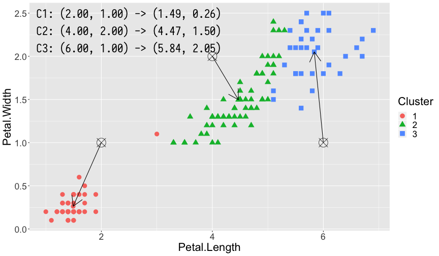
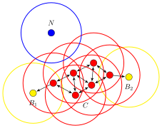

class: content

```{r setup, include=FALSE}
library(tidyverse)
options(htmltools.dir.version = FALSE)
```

<div class="content-page">
  <p class="content-page-title">目录</p>
  <li class="content-page-list">K-means</li>
  <li class="content-page-list">层次聚类</li>
  <li class="content-page-list">基于密度的聚类</li>
</div>

---
class: section, center, middle

# K-means

---
class:

# K-means

K-means 是一种简单的迭代性的聚类算法。对于数据集 $D = \{x_1, x_2, ..., x_n\}$，其中 $x_i \in \mathbb{R}^d$，需要指定利用 K-means 算法对数据划分成 $k$ 个簇。对于数据集 $D$ 的每个点 $x_i$ 仅属于一个簇 $S_i$，则 K-means 算法的目标函数可以表示为：

$$\underset{S}{\text{argmin}} \sum_{i=1}^{k} \sum_{x \in S_i} \|x - \mu_i\|_2^2$$

其中 $\mu_i$ 是簇 $S_i$ 的均值向量。从的目标函数不难看出，K-means 是通过一种“紧密程度”的形式对数据进行划分的，衡量这种“紧密程度”一般我们会用到“距离”的概念。距离可以理解为在集合 $M$ 上的一个度量（Metric），即

$$dist: M \times M \to \mathbb{R}$$

---
class:

# K-means

对于集合 $M$ 中的 $x, y, z$，下列条件均成立：

1. $dist\left(x, y\right) \geq 0$（非负性）
2. $dist\left(x, y\right) = 0$ 当且仅当 $x = y$（同一性）
3. $dist\left(x, y\right) = dist\left(y, x\right)$（对称性）
4. $dist\left(x, z\right) \leq dist\left(x, y\right) + dist\left(y, z\right)$（三角不等式）

对于点 $x = \left(x_1, x_2, ..., x_n\right)$ 和点 $y = \left(y_1, y_2, ..., y_n\right)$，常用的距离为 $p$ 阶明可夫斯基距离（Minkowski distance）：

$$dist\left(x, y\right) = \left(\sum_{i=1}^{n} |x_i - y_i|^p\right)^{\frac{1}{p}}$$

---
class:

# K-means

当 $p = 1$ 时，称之为曼哈顿距离（Manhattan distance）或出租车距离：

$$dist_{man}\left(x, y\right) = \sum_{i=1}^{n} |x_i - y_i|$$

当 $p = 2$ 时，称之为欧式距离（Euclidean distance）：

$$dist_{ed}\left(x, y\right) = \sqrt{\sum_{i=1}^{n} \left(x_i - y_i\right)^2}$$

曼哈顿距离和欧式距离直观比较如图所示：

.center[

]

---
class:

# K-means

对于 K-means 算法，具体的计算过程如下：

1. 指定簇的个数为 $k$，并随机设置 $k$ 个簇的中心，对于簇 $S_i$ 其中心为 $\mu_i$。
2. 计算数据集 $D = \{x_1, x_2, ..., x_n\}$ 中的所有点 $x_j$ 到每个簇的中心 $\mu_i$ 的距离 $dist\left(x_j, \mu_i\right)$。
3. 对于点 $x_j$，从其到每个簇中心 $\mu_i$ 的距离中选择距离最短的簇作为本轮计算中该点所隶属的簇。
4. 对于隶属于同一个簇的样本 $D_{S_i}$，计算这些样本点的中心，作为该簇新中心 $\mu'_i$。
5. 重复执行步骤 2 到步骤 4 直至簇中心不再发生变化或超过最大迭代次数。

通过上述步骤的计算，K-means 算法可以将样本点划分为 $k$ 个簇，并得到每个簇的最终中心 $\mu_i$。

利用 K-means 算法，我们对 iris 数据集进行聚类分析。iris 数据集包含了 Sepal.Length，Sepal.Width，Petal.Length，Petal.Width 以及花的种类共 5 列数据。为了能够更直观的演示，我们进采用 Petal.Length 和 Petal.Width 两列数据。K-means 是一种无监督的学习算法，因此我们并没有先验知识知道数据最适合分为几个簇，同时 K-means 算法又是一个对于聚类中心初始点敏感的算法，因此同样为了便于演示效果，在此我们设置簇的个数 $k = 3$，
$3$ 个簇对应的初始中心点分别为 $\mu_1 = \left(2, 1\right), \mu_2 = \left(4, 2\right), \mu_3 = \left(6, 1\right)$。

---
class:

# K-means

```{r, echo=F, out.width='66%', fig.align='center'}

```

.center[K-means 第 1 轮]

---
class:

# K-means

```{r, echo=F, out.width='66%', fig.align='center'}
knitr::include_graphics('images/kmeans-example-round-2.png')
```

.center[K-means 第 2 轮]

---
class:

# K-means

```{r, echo=F, out.width='66%', fig.align='center'}
knitr::include_graphics('images/kmeans-example-round-3.png')
```

.center[K-means 第 3 轮]

---
class:

# K-means

```{r, echo=F, out.width='66%', fig.align='center'}
knitr::include_graphics('images/kmeans-example-round-7.png')
```

.center[K-means 第 7 轮]

---
class:

# K-means

第 1 轮，第 2 轮，第 3 轮和第 7 轮（最终轮）计算得出的结果。其中每幅图左上角 3 组坐标分别表示了 3 个簇的中心更新前和更新后的位置。图中的 **⦻** 号即为更新前簇的中心，箭头指向的方向即为更新后簇的中心，每轮计算中隶属不同簇的样本点利用颜色和形状加以了区分。

K-means 算法在一般数据集上可以的到较好的聚类效果，但同时也存在若干问题：

1. K-means 算法需要预先设置聚类个数 $k$。
2. K-means 是一个对于簇中心点起始位置敏感的算法，设置不同的簇中心点的起始位置可能得到不同的聚类结果。
3. 噪音数据对 K-means 算法的聚类结果影响较大。
4. 只能发现球状簇。

---
class:

# K-means

```{r eval=F}
kmeans(x, centers, iter.max = 10, nstart = 1, algorithm = c("Hartigan-Wong", "Lloyd", "Forgy", "MacQueen"),
       trace = FALSE)
```

常用参数如下表所示：

| 参数        | 描述                                                         |
| ----------- | ------------------------------------------------------------ |
| `x`         | 数据                                                         |
| `centers`   | 聚类个数                                                     |
| `iter.max`  | 最大迭代次数                                                 |
| `nstart`    | 随机选择中心点的数量                                         |
| `algorithm` | K-means 使用的算法，`'Hartigan-Wong', 'Lloyd', 'Forgy', 'MacQueen'` |

---
class:

# K-means

.pull-left[
```{r eval=F}
iris_ <- iris[, 3:4]

iris_kmeans <- kmeans(iris_, 3, nstart = 25)

iris_res <- dplyr::bind_cols(
    iris_,
    Cluster = as.factor(iris_kmeans$cluster))

p <- ggplot(iris_res,
            aes(Petal.Length, Petal.Width)) +
    geom_point(aes(color = Cluster,
                   shape = Cluster))

print(p)
```
]

.pull-right[

```{r echo=F, fig.height=6}
iris_ <- iris[, 3:4]
iris_kmeans <- kmeans(iris_, 3, nstart = 25)
iris_res <- dplyr::bind_cols(iris_, Cluster = as.factor(iris_kmeans$cluster))
p <- ggplot(iris_res, aes(Petal.Length, Petal.Width)) +
    geom_point(aes(color = Cluster, shape = Cluster), size = 3) +
    theme(text = element_text(size = 25))
print(p)
```
]

---
class:

# K-means

```{r eval=F}
factoextra::fviz_cluster(iris_kmeans, data=iris_, geom=c('point'))
```

```{r echo=F, fig.width=14, fig.height=6}
p <- factoextra::fviz_cluster(iris_kmeans, data = iris_, geom = c('point'), main = NULL) +
    theme(text = element_text(size = 30))
print(p)
```

---
class: section, center, middle

# 层次聚类

---
class:

# 层次聚类

.pull-left[
层次聚类（hierarchical clustering）不同于 K-means 那种基于划分的聚类，通过对数据集在不同层次上进行划分，直至达到某种条件。层次聚类根据分层的方法不同，可以分为凝聚（agglomerative）层次聚类和分裂（divisive）层次聚类。

AGNES（Agglomerative Nesting）算法是一种凝聚层次聚类算法，其基本思想如下：

1. 将数据集中每个样本作为一个簇。
2. 在每一轮计算中，找出两个距离最近的簇进行合并，生成一个新的簇。
3. 重复步骤 2，直至达到预设的聚类簇的个数。
]

.pull-right[

]

.footnote[
[1] 图片来源：https://www.datanovia.com/en/lessons/agglomerative-hierarchical-clustering/
]

---
class:

# 层次聚类

因此，对于 AGNES 算法而言，最关键的是如何计算两个簇之间的距离，对于簇 $C_i$ 和簇 $C_j$，常用的距离计算方法有：

- 最小距离，即两个簇内部样本点之间距离的最小值：
$$dist_{min} = \min \{dist\left(x, y\right) | x \in C_i, y \in C_j\}$$
- 最大距离，即两个簇内部样本点之间距离的最大值：
$$dist_{max} = \max \{dist\left(x, y\right) | x \in C_i, y \in C_j\}$$
- 平均距离，即两个簇内部样本点之间距离的均值：
$$dist_{avg} = \dfrac{1}{|C_i| |C_j|} \sum_{x \in C_i} \sum_{y \in C_j} dist\left(x, y\right)$$
- 重心距离，即两个簇重心之间的距离：
$$dist_{med} = dist\left(Median_{C_i}, Median_{C_j}\right)$$

---
class:

# 层次聚类

DIANA（Divisive Analysis）算法指一种分裂层次聚类算法，其基本思想如下：

1. 将数据集中全部样本作为一个簇。
2. 在每一轮计算中，对于“最大”的簇 $C$，找到 $C$ 中与其他点的平均相异度最大的点 $p_0$，将其放在一个新的簇 $C_{new}$ 中，剩余的点此时所组成的簇为 $C_{old}$。
3. 在簇 $C_{old}$ 找到一个距离簇 $C_{new}$ 最近，且距离小于到簇 $C_{old}$ 的点 $p_i$，并将其加入到簇 $C_{new}$ 中。
4. 重复步骤 3，直至无法找到符合条件的点 $p_i$，此时得到两个新簇 $C_{old}$ 和 $C_{new}$。
5. 重复步骤 2 和步骤 3，直至达到预设的聚类簇的个数。

在 DIANA 算法中，衡量一个簇 $C$ 的大小，一般利用簇的直径，即簇中任意两个样本之间距离的最大值；衡量簇 $C$ 中一个点 $p$ 的平均相异度，一般利用该点到簇中其他点距离的平均值。

---
class:

# 层次聚类

以 R 中 cluster 扩展包中的 animals 数据集为例，animals 数据集记录了 20 种不同昆虫和动物的 6 种属性值，数据示例如表所示，列分别为：温血， 会飞，脊椎动物，濒危，群居动物，有毛发：

| 样本 \\ 特征 | war | fly | ver | end | gro | hai |
| :----------- | :-- | :-- | :-- | :-- | :-- | :-- |
| ant          | 1   | 1   | 1   | 1   | 2   | 1   |
| bee          | 1   | 2   | 1   | 1   | 2   | 2   |
| cat          | 2   | 1   | 2   | 1   | 1   | 2   |
| ...          | ... | ... | ... | ... | ... | ... |
| spi          | 1   | 1   | 1   | NA  | 1   | 2   |
| wha          | 2   | 1   | 2   | 2   | 2   | 1   |

---
class:

# 层次聚类

.pull-left[
利用 AGNES 和 DIANA 算法对 animals 数据集进行层次聚类分析，可以得到层次聚类分析的树状图（dendrogram），如图所示：

```{r eval=F}
require(cluster)
data('animals')

animals_agnes <- agnes(animals)
plot(animals_agnes, which.plot = 2,
     main = 'AGNES 算法')

animals_diana <- diana(animals)
plot(animals_diana, which.plot = 2,
     main = 'DIANA 算法')
```
]

.pull-right[
```{r include=F}
require(cluster)
data('animals')
animals_agnes <- agnes(animals)
animals_diana <- diana(animals)
library(showtext)
```
```{r echo=F, fig.height=3}
showtext_auto()
plot(animals_agnes, which.plot = 2, main = 'AGNES 算法')
```
```{r echo=F, fig.height=3}
showtext_auto()
plot(animals_diana, which.plot = 2, main = 'DIANA 算法')
```
]

---
class: section, center, middle

# 基于密度的聚类

---
class:

# 基于密度的聚类

基于密度的聚类（density-based clustering）是一种通过样本的稠密程度划分聚类簇的方法。不同于基于距离的 K-means 和层次聚类方法往往只能生成球状的聚类簇，基于密度的聚类可以发现任意形状的聚类簇。

DBSCAN（density-based spatial clustering of applications with noise）是一种基于密度的聚类算法。DBSCAN 算法最重要的两个参数为 $\epsilon$ 和 $MinPts$，两个参数分别确定了领域半径和定义了核心点的阈值，通过这两个参数可以刻画样本分布的稠密程度。对于数据集 $D = \{x_1, x_2, ..., x_n\}$，引入如下概念和记号：

- $\epsilon$ 邻域（
$\epsilon$ neighborhood）

  $$N_\epsilon \left(x\right) = \{y \in X | dist\left(x, y\right) \leq \epsilon\}$$
对于 $x \in D$，称 $N_\epsilon \left(x\right)$ 为 $x$ 的 $\epsilon$ 邻域。

- 密度（density）

  $$\rho \left(x\right) = |N_\epsilon \left(x\right)|$$
对于 $x \in D$，称 $\rho \left(x\right)$ 为 $x$ 的密度。

---
class:

# 基于密度的聚类

.pull-left[
- 核心点（core point）

  对于 $x \in D$，若 $\rho \left(x\right) \geq MinPts$，则称 $x$ 为一个核心点。假设 $D$ 中所有核心点构成的集合为 $D_{core}$，记 $D_{n-core} = D \setminus D_{core}$ 为所有非核心点的集合。

- 边界点（border point）

  对于 $x \in D_{n-core}$，且 $\exists y \in D$，满足
$$y \in N_\epsilon \left(x\right) \cap D_{core}$$
即点 $x$ 所在的 $\epsilon$ 邻域中存在核心点，则称 $x$ 为 $D$ 的边界点，记所有的边界点的集合为 $D_{border}$。

- 噪音点（noise point）
]

.pull-right[
  记 $D_{noise} = D \setminus \left(D_{core} \cup D_{border}\right)$，对于 $x \in D_{noise}$，则称 $x$ 为噪音点。

核心点，边界点和噪音点示例如图所示：

```{r, echo=F, fig.align='center'}

```

其中 $C$ 为 6 个核心点，
$B_1$ 和 $B_2$ 为 2 个边界点，
$N$ 为 1 个噪音点。
]

---
class:

# 基于密度的聚类

.pull-left[
- 密度直达（directly density-reachable）

  对于 $x, y \in D$，若 $x \in D_{core}$，并且 $y \in N_\epsilon \left(x\right)$，则称 $y$ 由 $x$ 密度直达。

- 密度可达（density-reachable）

  若存在一个序列 $p_1, p_2, ..., p_m \in D$，满足 $p_{i+1}$ 由 $p_i$ 密度直达，则称 $p_m$ 由 $p_1$ 密度可达。

- 密度相连（density-connected）

  对于 $x, y, z \in D$，若 $y$ 和 $z$ 均由 $x$ 密度可达，则称 $y$ 和 $z$ 密度相连。
]

.pull-right[
- 簇（cluster）

  对于非空子集 $C \in D$，如果称 $C$ 为一个簇，则对于 $x, y \in D$ 满足：
  1. 连接性（connectivity）：对于 $x, y \in C$，则 $x$ 和 $y$ 密度相连。
  2. 最大性（maximality）：对于 $x \in C$，且 $y$ 由 $x$ 密度可达，则 $y \in C$。

根据如上概念，DBSCAN 算法的基本为：从一个核心点 $x$ 出发，寻找到 $x$ 密度可达的所有样本点的集合 $X = \{x' \in D | x' \ \text{由} \ x \ \text{密度可达}\}$，则 $X$ 即为一个满足要求的簇。
]

---
class:

.pull-left[
# 基于密度的聚类

DBSCAN 算法如下：

<pre class="convert-pseudocode" caption="DBSCAN 算法">
\REQUIRE 数据集 $D$，参数 $\left(\epsilon, MinPts\right)$
\ENSURE 簇划分 $C = \{C1, C2, ..., C_k\}$
\PROCEDURE{DBSCAN}{$D, \epsilon, MinPts$}
    \STATE 初始化核心对象集合：$I \gets \varnothing$
    \FOR{$i$ = $1$ to $n$}
        \STATE 对于样本 $x_i$，生成 $\epsilon$ 邻域 $N_\epsilon \left(x_i\right)$
        \IF{$\rho \left(x_i\right) \geq MinPts$}
            \STATE $I \gets I \cup \{x_i\}$
        \ENDIF
    \ENDFOR
    \STATE 初始化聚类个数：$k \gets 0$
    \STATE 初始化未访问到集合：$U \gets D$
    \STATE \COMMENT{接下文}
\ENDPROCEDURE
</pre>
]

.pull-right[
<br />
<pre class="convert-pseudocode">
\PROCEDURE{DBSCAN}{$D, \epsilon, MinPts$}
    \STATE \COMMENT{接上文}
    \WHILE{$I \neq \varnothing$}
        \STATE 当前为访问的样本集合：$U_{old} \gets U$
        \STATE 随机选取一个核心点 $p \in I$，并初始化一个队列 $Q \gets \{p\}$
        \STATE $U \gets U \setminus \{p\}$
        \WHILE{$Q \neq \varnothing$}
            \STATE $q \gets Q$ 的队首
            \IF{$\rho \geq MinPts$}
                \STATE $R \gets N_\epsilon \left(q\right) \cap U$
                \STATE $Q \gets Q \cup R$
                \STATE $U \gets U \setminus R$
            \ENDIF
        \ENDWHILE
        \STATE $k \gets k+1$
        \STATE 生成簇 $C_k \gets U_{old} \setminus U$
        \STATE $I \gets I \setminus C_k$
    \ENDWHILE
    \RETURN $C = \{C_1, C_2, ..., C_k\}$
\ENDPROCEDURE
</pre>
]

---
class:

# 基于密度的聚类

.pull-left[
相比 K-means 算法，DBSCAN 算法有如下优势：

1. 不需要事先指定簇的个数 $k$。
2. 可以发现任意形状的簇。
3. 对噪音数据不敏感。

尽管相比 K-means，DBSCAN 算法有很多优势，但是对于不同的数据集，DBSCAN 算法的参数 $\epsilon$ 和 $MinPts$ 有时很难选取和优化。

一个非球形簇的数据分别利用 DBSCAN 算法和 K-means 算法进行聚类分析，对比结果如图所示：
]

.pull-right[.center[
```{r, echo=F, out.width='70%'}
knitr::include_graphics('images/DBSCAN-and-Kmeans-comparision-Kmeans.svg')
knitr::include_graphics('images/DBSCAN-and-Kmeans-comparision-DBSCAN.svg')
```
]]

---
class:

# 基于密度的聚类

```{r eval=F}
dbscan(x, eps, minPts = 5, weights = NULL, borderPoints = TRUE, ...)
```

常用参数如下表所示：

| 参数           | 描述                                                        |
| -------------- | ----------------------------------------------------------- |
| `x`            | 数据                                                        |
| `eps`          | 用于确定邻域的最小距离                                      |
| `minPts`       | 用于确定一个点是否为核心点的样本个数                        |
| `borderPoints` | `TURE` 则为一般 DBSCAN 算法，`FALSE` 则将边界点当作噪音处理 |

---
class:

# 基于密度的聚类

.pull-left[
```{r}
library(dbscan)

set.seed(123)
a <- seq(0, 2*pi, by = pi/50)

x_1 <- 10 * cos(a) + runif(length(a), 0, 1)
y_1 <- 10 * sin(a) + runif(length(a), 0, 1)
x_2 <- 5 * cos(a) + runif(length(a), 0, 1)
y_2 <- 5 * sin(a) + runif(length(a), 0, 1)

points <- data.frame(
    x = c(x_1, x_2),
    y = c(y_1, y_2)
)
```
]

.pull-right[
```{r}
points_dbscan <- dbscan(
  points, eps = 3.5, minPts = 10)

points_dbscan
```
]

---
class:

# 基于密度的聚类

.pull-left[
```{r eval=F}
points_plt <- dplyr::bind_cols(
    points,
    Cluster=as.factor(points_dbscan$cluster))

p <- ggplot(points_plt, aes(x, y)) +
    geom_point(aes(color = Cluster,
                   shape = Cluster))

print(p)
```
]

.pull-right[
```{r echo=F, fig.height=5}
points_plt <- dplyr::bind_cols(points, Cluster = as.factor(points_dbscan$cluster))

p <- ggplot(points_plt, aes(x, y)) +
    geom_point(aes(color = Cluster, shape = Cluster), size = 3) +
    theme(text = element_text(size = 25))
print(p)
```
]

---
class: thanks, center, middle

# Thanks


本作品采用 [**CC BY-NC-SA 4.0**](https://creativecommons.org/licenses/by-nc-sa/4.0/) 进行许可

Copyright © [**范叶亮 | Leo Van**](https://leovan.me), All Rights Reserved.