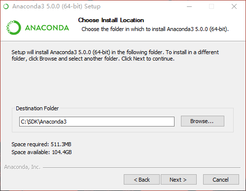
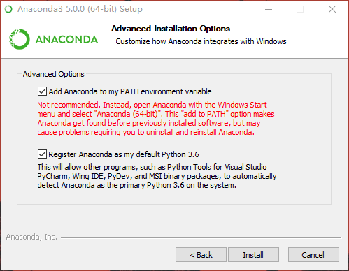

# 环境配置

## 系统环境配置

1. 本教程仅用于Windows系统的相关环境配置。

2. 在有足够空间的磁盘建立一个不含空格的目录，用于安装相关环境，例如：D:/SDK，后续将用${SDK}代表这个目录。

3. 强烈建议安装最新版本Typora（[下载地址](http://typora.io)），后续大部分文档为Markdown格式，Typora便于浏览和编辑相关文档。

4. 安装Git，便于更新Git仓库，安装相关选项如图所示，其他选项默认即可：

   

   

5. Git相关操作详见[在线教程](https://www.liaoxuefeng.com/wiki/0013739516305929606dd18361248578c67b8067c8c017b000)。

## R安装和配置

1. 获取最新版的Microsoft R Open版本（[下载地址](https://mran.microsoft.com/download/)）。

2. 将R安装在${SDK}目录中，R的安装根目录我们定义为${R_ROOT}，相关选项如图所示：

   

3. 打开${R_ROOT}/etc目录，使用文本编辑器打开Rprofile.site文件，找到如下代码位置：

   ```{r}
   r["CRAN"] <- RevoUtils::getRevoRepos()
   ```

   将其注释并替换为：

   ```{r}
   # r["CRAN"] <- RevoUtils::getRevoRepos()
   r["CRAN"] <- "https://mirrors.ustc.edu.cn/CRAN"
   ```

   这样我们可以使用国内的CRAN更快的下载扩展包。

## RStudio安装和配置

1. 获取最新版Preview版本的RStudio（[下载地址](https://www.rstudio.com/products/rstudio/download/preview/)）。

2. 将RStudio安装在${SDK}目录中，相关选项如图：

   

3. 安装完毕后打开，从菜单栏依次单击 Tools -> Global Options...打开配置对话框。

4. 基本配置选项如下，其他配置用户可自行设置：

   - Code -> Editing -> General -> Tab Width -> **4**
   - Code -> Display -> General -> Show margin -> **TRUE**
   - Code -> Saving -> Serialization -> Default text encoding -> **UTF-8**

## Jupyter安装和配置

1. 下载最新版本Anaconda Python 3.6（[下载地址](https://www.anaconda.com/download/)）。

2. 将Anaconda Python 3.6安装在${SDK}目录中，Anaconda3的安装根目录我们定义为${ANACONDA3_ROOT}，相关选项如图：

   

   

3. 启动命令提示符，键入如下命令更换conda源：

   ```{bash}
   conda config --add channels https://mirrors.tuna.tsinghua.edu.cn/anaconda/pkgs/free/
   conda config --set show_channel_urls yes
   ```

4. 安装完Jupyter后，在此命令行中进入R的安装目录，运行R，键入如下命令安装R Jupyter Kernel：

   ```{r}
   install.packages(c('repr', 'IRdisplay', 'evaluate', 'crayon', 'pbdZMQ', 'devtools', 'uuid', 'digest'))
   devtools::install_github('IRkernel/IRkernel')
   IRkernel::installspec()
   ```
   出现如下类似结果表明安装成功：

   ```{text}
   [InstallKernelSpec] Installed kernelspec ir in C:\Users\Leo\AppData\Roaming\jupyter\kernels\ir
   ```

5. 下载最新版本nteract（[下载地址](https://nteract.io/)），直接安装即可。