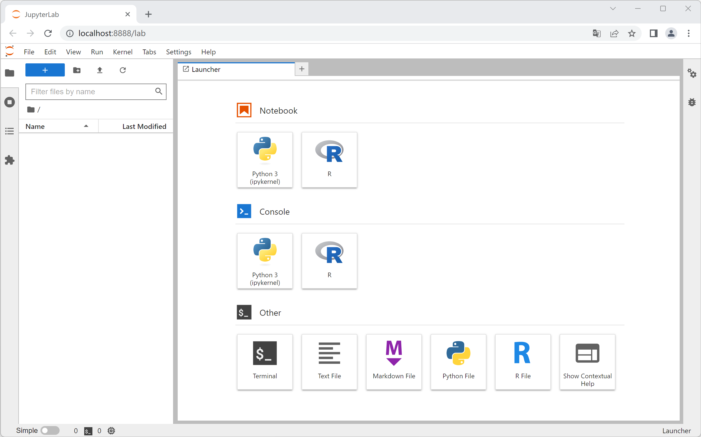
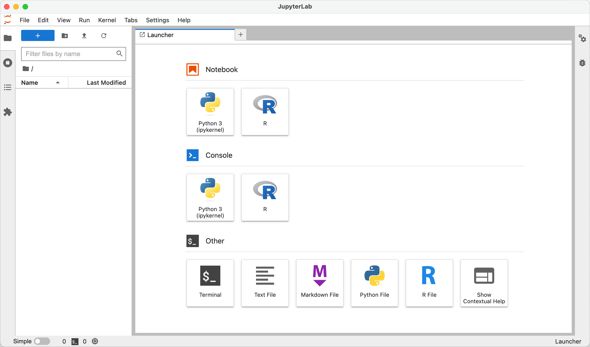

# 开发环境

## Windows

> 建议使用 64 位 Windows 10 以上版本系统。

### 命令行

建议安装最新版的 PowerShell 作为命令行环境，相关下载和配置详见[官网](https://learn.microsoft.com/zh-cn/powershell/)。

打开 PowerShell 命令行，输入如下命令安装 scoop：

```powershell
Set-ExecutionPolicy RemoteSigned -Scope CurrentUser
irm get.scoop.sh | iex
```

[scoop](https://scoop.sh/) 是一个用于 Windows 的命令行包安装管理器，其可以方便用户在命令行中安装并管理应用和扩展包。

运行如下命令测试 scoop 是否成功安装：

```powershell
scoop --version
```

如果能得到类似如下输出，则说明安装成功：

```
Current Scoop version:
chore(release): Bump to version 0.5.3 (resync)
```

运行如下命令为 scoop 添加额外的应用清单：

```powershell
scoop bucket add extras
```

### Git

输入如下命令安装 [Git](https://git-scm.com/)：

```powershell
scoop install git
```

运行如下命令测试 Git 是否成功安装：

```powershell
git --version
```

如果能得到类似如下输出，则说明安装成功：

```
git version 2.52.0.windows.1
```

### R

输入如下命令安装 [R](https://cloud.r-project.org/bin/windows/base/) 和 [Rtools](https://cloud.r-project.org/bin/windows/Rtools/)：

```powershell
scoop install r rtools
```

运行如下命令测试 R 是否成功安装：

```powershell
R --version
```

如果能得到类似如下输出，则说明安装成功：

```
R version 4.5.2 (2025-10-31) -- "[Not] Part in a Rumble"
Copyright (C) 2025 The R Foundation for Statistical Computing
```

输入如下命令安装 [RStuido](https://posit.co/download/rstudio-desktop/)：

```powershell
scoop install rstudio
```

打开 RStudio 以检查是否成功安装。

### Python

输入如下命令安装 [Python](https://www.python.org/)：

```powershell
scoop install python312
```

运行如下命令测试 Python 是否成功安装：

```powershell
python --version
```

如果能得到类似如下输出，则说明安装成功：

```
Python 3.12.12
```

### Jupyter

输入如下命令安装 [JupyterLab](https://jupyter.org/)：

```bash
pip install jupyterlab
```

将 Python 相关文件路径添加到 `{HOME}\Documents\.Renviron` 文件的 `PATH` 环境变量中：

```
PATH={PYTHON_PATH}\\Scripts;%PATH%
```

其中 `{HOME}` 为用户目录，`{PYTHON_PATH}` 为 Python 的根目录。

在命令行中输入 `R` 启动 R 命令行，在 R 命令行中运行如下命令安装 [IRkernel](https://irkernel.github.io/)：

```r
install.packages('IRkernel')
IRkernel::installspec()
```

退出 R 命令行，运行如下命令启动 JupyterLab：

```bash
jupyter-lab
```

系统会自动打开浏览器并显示 JupyterLab 页面：



## macOS

> 建议使用 macOS 11 以上版本系统。

### 命令行

打开终端，输入如下命令安装 homebrew：

```bash
/bin/bash -c "$(curl -fsSL https://raw.githubusercontent.com/Homebrew/install/HEAD/install.sh)"
```

[Homebrew](https://brew.sh/) 是一个用于 macOS 的命令行包安装管理器，其可以方便用户在命令行中安装并管理应用和扩展包。

运行如下命令测试 scoop 是否成功安装：

```bash
brew --version
```

如果能得到类似如下输出，则说明安装成功：

```
Homebrew 5.0.6-64-gb64029d
```

### Git

输入如下命令安装 [Git](https://git-scm.com/)：

```bash
brew install git
```

运行如下命令测试 Git 是否成功安装：

```bash
git --version
```

如果能得到类似如下输出，则说明安装成功：

```
git version 2.50.1 (Apple Git-155)
```

### R

输入如下命令安装 [R](https://cloud.r-project.org/bin/windows/base/) 和 [Rtools](https://cloud.r-project.org/bin/windows/Rtools/)：

```bash
brew install --cask r
```

运行如下命令测试 R 是否成功安装：

```bash
R --version
```

如果能得到类似如下输出，则说明安装成功：

```
R version 4.5.2 (2025-10-31) -- "[Not] Part in a Rumble"
Copyright (C) 2025 The R Foundation for Statistical Computing
```

输入如下命令安装 [RStuido](https://posit.co/download/rstudio-desktop/)：

```bash
brew install rstudio
```

打开 RStudio 以检查是否成功安装。

### Python

输入如下命令安装 [Python](https://www.python.org/)：

```bash
brew install python@3.12
```

运行如下命令测试 Python 是否成功安装：

```bash
python --version
```

如果能得到类似如下输出，则说明安装成功：

```
Python 3.12.12
```

### Jupyter

输入如下命令安装 [JupyterLab](https://jupyter.org/)：

```bash
pip install jupyterlab
```

将 Python 相关文件路径添加到 `{HOME}/.Renviron` 文件的 `PATH` 环境变量中：

```
PATH={PYTHON_PATH}/bin:$PATH
```

其中 `{HOME}` 为用户目录，`{PYTHON_PATH}` 为 Python 的根目录。

在命令行中输入 `R` 启动 R 命令行，在 R 命令行中运行如下命令安装 [IRkernel](https://irkernel.github.io/)：

```r
install.packages('IRkernel')
IRkernel::installspec()
```

退出 R 命令行，运行如下命令启动 JupyterLab：

```bash
jupyter-lab
```

系统会自动打开浏览器并显示 JupyterLab 页面：


