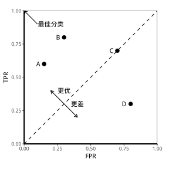
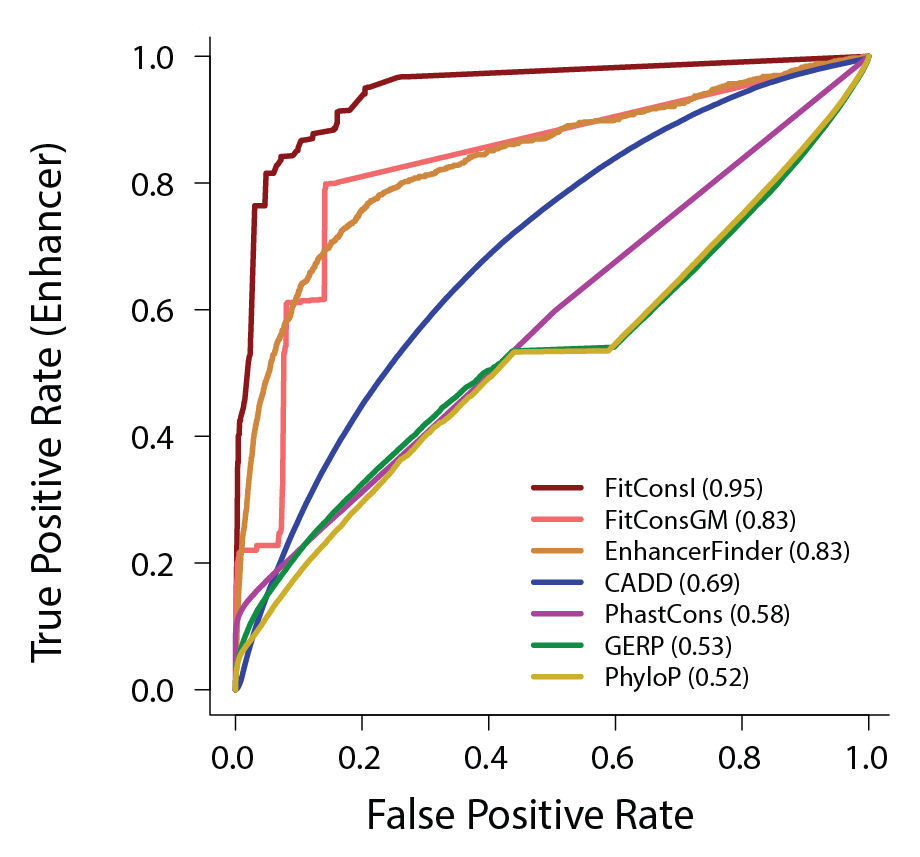
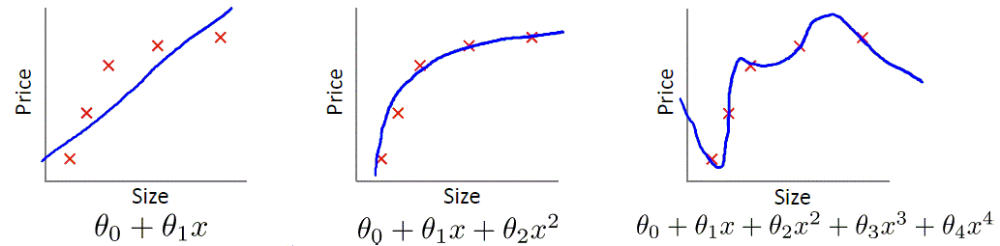
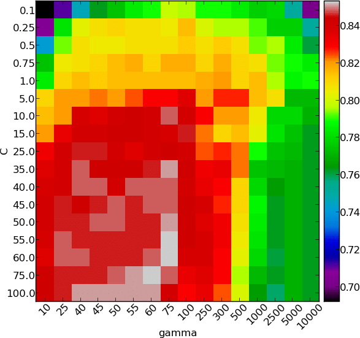

$$
\renewcommand{\sign}{\operatorname{sign}}
\renewcommand{\avg}{\operatorname{avg}}
\renewcommand{\dist}{\operatorname{dist}}
\renewcommand{\diam}{\operatorname{diam}}
\renewcommand{\cen}{\operatorname{cen}}
$$

```{r setup, include=FALSE}
library(knitr)
library(tidyverse)
options(servr.deamon = TRUE)
options(htmltools.dir.version = FALSE)
```

<div class="content-page">
  <p class="content-page-title">目录</p>
  <li class="content-page-list">模型性能评估</li>
  <li class="content-page-list">模型生成和选择</li>
  <li class="content-page-list">超参数优化</li>
</div>

---
class: inverse, center, middle

# 模型性能评估

---
class:

# 模型性能评估

对学习器的泛化性能进行评估，不仅需要有效可行的实验评估方法，还需要有衡量模型泛化能力的评价标准，也就是性能度量（performance measure）。性能度量反映了任务需求，在对比不同模型的能力时，使用不同的性能度量往往会导致不同的评判结果，这意味着模型的“好坏”是相对的，什么样的模型时好的，不仅仅取决于算法和数据，还决定于任务需求。

---
class:

# 回归问题性能评估

- 平均绝对误差（mean absolute error, MAE）

$$\text{MAE} = \dfrac{1}{n} \sum_{i=1}^{n}{\left| f\left(x_i\right) - y_i \right|}$$
- 平均绝对百分比误差（mean absolute percentage error, MAPE）

$$\text{MAPE} = \dfrac{1}{n} \sum_{i=1}^{n}{\left| \dfrac{f\left(x_i\right) - y_i}{y_i} \right|}$$

- 均方误差（mean squared error, MSE）

$$\text{MSE} = \dfrac{1}{n} \sum_{i=1}^{n}{\left( f\left(x_i\right) - y_i \right) ^ 2}$$
&nbsp;&nbsp;&nbsp;&nbsp;&nbsp;&nbsp;&nbsp;&nbsp;
其中，
$SSE = \sum_{i=1}^{n} \left(f\left(x_i\right) - y_i\right)^2$，称之为残差平方和。

---
class:

# 回归问题性能评估

- 均方根误差（root-mean-square error, RMSE）

$$\text{RMSE} = \sqrt{\text{MSE}} = \sqrt{\dfrac{1}{n} \sum_{i=1}^{n}{\left( f\left(x_i\right) - y_i \right) ^ 2}}$$

- 误差标准差

$$\sigma_{e} = \sqrt{\dfrac{1}{n} \sum_{i=1}^{n}{\left(e_i - \bar{e}\right) ^ 2}}$$
&nbsp;&nbsp;&nbsp;&nbsp;&nbsp;&nbsp;&nbsp;&nbsp;
其中，
$e_i$表示使用的误差，
$\bar{e} = \dfrac{1}{n} \sum_{i=1}^{n}{e_i}$

---
class:

# 回归问题性能评估

$R^2$称为确定或多重确定（在多重线性回归中）的系数，一般而言，
$R^2$越大，模型与数据拟合得越好，其值在0与100%之间变动。

$$R^2 = \dfrac{SSR}{SST}, SSR = \sum_{i=1}^{n} \left(f\left(x_i\right) - \bar{y}\right)^2, SST = \sum_{i=1}^{n} \left(y_i - \bar{y}\right)^2, \bar{y} = \dfrac{1}{n} \sum_{i=1}^{n} y_i$$

$R^2$不只是模型误差的函数，它的定义中包含了两个模型的比较：一个是当前被分析的模型，一个是所谓的常数模型，即只利用因变量均值进行预测的模型。因此，
$R^2$回答的是“我的模型是否比一个常数模型更好？”这样一个问题，然而我们通常想要回答的是另一个完全不同的问题：“我的模型是否比真实的模型更差？”

除了
$R^2$以外，通常还有一种称之为调整后的
$R^2$，因为
$R^2$表示了自变量对因变量的解释程度，随着自变量的增加，模型的
$R^2$总是会增大，因此需要根据自变量的个数对
$R^2$进行相应的调整。调整后的
$R^2$包含了自变量个数对模型的影响，从而可以帮助我们更好的选择模型。

---
class:

# 分类问题性能评估

分类问题可以划分为两类：二分类问题和多分类问题。两种不同的分类问题的性能评估方法略有不同，相对而言二分类问题的评估指标体系更为复杂一些。

- 误差和精度

误差和精度是性能评估的两个最基本的指标。这两个指标具有很好的普适性，同时适用于二分类和多分类问题。类似于值预测问题中的各种误差，误差是指分类错误的样本数占样本总数的比例，相反的精度是指分类正确的样本数占样本总数的比例，误差的精度的定义如下：

$$err = \dfrac{1}{n} \sum_{i=1}^{n} \sign \left(f\left(x_i\right) \neq y_i\right)$$

$$acc = \dfrac{1}{n} \sum_{i=1}^{n} \sign \left(f\left(x_i\right) = y_i\right)$$

其中，
$f\left(x\right)$表示模型的预测值，
$\sign$函数当其内部条件满足是为
$1$不满足时为
$0$。

---
class:

# 分类问题性能评估

- 准确率，召回率和F Score

准确率，召回率和F Score是评价二分类问题的重要评价指标。二分类问题是日常生活中一种常见的分类问题，例如预测明天是否会下雨，一个贷款客户在未来是否会发生违约等等。对于二分类分为，其目标变量分为两种，我们将其标记为正样本（1）和负样本（0）。样本通过分类器的预测会出现4中不同情况，分别是：真正例（True Positive），即将正样本预测为了正样本；假正例（False Positive），即将负样本预测为了正样本；真反例（True Negative），即将负样本预测为了负样本；假反例（False Negative），即将正样本预测为了负样本。对于4种不同的情况，我们可以利用一个混淆矩阵来表示分类器的分类结果：

| 真实情况 \\ 预测结果 | 正样本      | 负样本      |
| :------------------- | :---------- | :---------- |
| **正样本**           | 真正例（TP）| 假反例（FN）|
| **负样本**           | 假正例（FP）| 真反例（TN）|

---
class:

# 分类问题性能评估

根据4种不同的预测结果，可以定义准确率（Precision）和召回率（Recall）如下：

$$\text{Precision} = \dfrac{\text{TP}}{\text{TP} + \text{FP}}, \text{Recall} = \dfrac{\text{TP}}{\text{TP} + \text{FN}}$$

准确率和召回率是两个互相矛盾的评价指标，一个值越大往往另一个值就越小。不难想象两个极端情况，我们一个都不预测为正样本，因为准确率的分子和分母均为0，也可以说我们的准确率为100%，但此时的召回率却为0；或是我们将所有样本都预测为正样本，则召回率为100%，但此时准确率却很低，仅为正样本占样本总数的比例。

对分类问题，我们往往会构建一个概率模型，即对样本产生一个数值型的概率预测，同时我们会设置一个阈值
$\theta$，如果预测值大于阈值，则属于正类，如果预测值小于阈值，则属于负类。因此，我们将所有的样本按照属于属于正样本的概率从大到小进行排序，逐步改变阈值
$\theta$，则可以绘制出一张准确率和召回率的关系曲线，简称“P-R曲线”。

---
class:

# 分类问题性能评估

.pull-left[
从图中可以看出曲线
$C_1$完全“包住”了曲线
$C_2$和
$C_3$，此时我们可以断言
$C_1$对应的分类器的性能要优于
$C_2$和
$C_3$对应的分类器。但对于
$C_2$和
$C_3$对应的分类器而言，优于两条曲线有交叉，因此仅通过曲线我们很难判定孰优孰劣。同种我们还标注了3个点，当准确率等于召回率是，我们称这个点为“平衡点”(Break-Even Point，BEP)，因此如果用平衡点来衡量
$C_2$(BEP=0.75)和
$C_3$(BEP=0.7)对应的分类器，则
$C_2$对应的分类器性能更优。
]

.pull-right[

]

---
class:

# 分类问题性能评估

- F Score

相比于准确率和召回率，F Score综合考虑了两个评价指标：

$$\dfrac{1}{F_{\beta}} = \dfrac{1}{1 + {\beta}^2} \left(\dfrac{1}{P} + \dfrac{{\beta}^2}{R}\right)$$

$$F_{\beta} = \dfrac{\left(1 + {\beta}^2\right) \cdot P \cdot R}{{\beta}^2 \cdot P + R}$$

其中
$\beta$用于控制准确率和召回率的相对重要程度，若
$\beta = 1$则为标准的F1；若
$0 < \beta < 1$时，则准确率更重要；若
$\beta > 1$时，则召回率更重要。因此，用户可以根据实际的业务需求决定
$\beta$值，从而控制准确率和召回率的相对重要程度。

---
class:

# 分类问题性能评估

- ROC和AUC

.pull-left[
ROC（Receiver Operation Characteristic，接收者操作特征）曲线，首先是由二战中的电子工程师和雷达工程师发明的，用来侦测战场上的敌军载具，后来逐渐被用于医学、无线电、生物学、犯罪心理学以及数据挖掘和机器学习领域。类似P-R曲线，但ROC曲线的横轴为“假正例率”（False Positive Rate， FPR），纵轴为“真正例率”（True Positive Rate，TPR）：

$$\text{TPR} = \dfrac{\text{TP}}{\text{TP} + \text{FN}}, \text{FPR} = \dfrac{\text{FP}}{\text{TN} + \text{FP}}$$
]

.pull-right[

]

---
class:

# 分类问题性能评估

- ROC和AUC

.pull-left[
在进行学习器的比较式，与P-R图相似，若一个学习器的ROC曲线被另一个学习器的曲线完全“包住”，则可断言后者的性能优于前者，若两个学习器的ROC曲线发生交叉，则难以一般性地断言两者孰优孰劣。此时如果一定要进行比较，则较为合理的依据是比较ROC曲线下的面积，及AUC（Area Under ROC Curve）。

$$\text{AUC} = \dfrac{1}{2} \sum_{i=1}^{n-1}{\left(x_{i+1} - x_i\right)\left(y_i + y_{i+1}\right)}$$
]

.pull-right[

]

---
class:

# 分类问题性能评估

- 多分类 Log Loss

$$\text{LogLoss} = - \dfrac{1}{n} \sum_{i=1}^{n} \sum_{j=1}^{m}{y_{i, j} \log \left(p_{i, j}\right)}$$

其中，
$n$为数据集个数；
$m$为标签类个数；
如果样本
$i$的分类为
$j$，则
$y_{i, j}$为
$1$，否则为
$0$；
$p_{i, j}$为样本
$i$为类型
$j$的概率。

---
class:

# 聚类问题性能评估

- 聚类结果簇内越紧密，簇间越分离越好。
- 聚类结果与人工判断结果越吻合越好。

聚类性能度量大致有两类：一类是将聚类结果与某个“参考模型”（reference model）进行比较，称为“外部指标”（external index）；另一类是直接考查聚类结果而不利用任何参考模型，称为“内部指标”（internal index）。对数据集
$D = \{x_1, x_2, ..., x_n\}$，假定通过聚类给出的簇划分为
$\mathcal{C} = \{C_1, C_2, ..., C_k\}$，参考模型给出的簇划分为
$\mathcal{C}^* = \{C_1^*, C_2^*, ..., C_k^*\}$。相应地，令
$\lambda$与
$\lambda^*$分别表示与
$C$和
$C^*$对应的簇标记向量.我们将样本两两配对考虑，定义：

$$a = |SS|, SS = \{(x_i, x_j) | \lambda_i = \lambda_j, \lambda_i^* = \lambda_j^*, i < j\}$$
$$b = |SD|, SD = \{(x_i, x_j) | \lambda_i = \lambda_j, \lambda_i^* \neq \lambda_j^*, i < j\}$$
$$c = |DS|, DS = \{(x_i, x_j) | \lambda_i \neq \lambda_j, \lambda_i^* = \lambda_j^*, i < j\}$$
$$d = |DD|, DD = \{(x_i, x_j) | \lambda_i \neq \lambda_j, \lambda_i^* \neq \lambda_j^*, i < j\}$$

---
class:

# 聚类问题性能评估

**外部指标**

- Jaccard系数（Jaccard Coefficient，JC）
$$\text{JC} = \dfrac{a}{a + b + c}$$
- FM指数（Fowlkes and Mallows Index，FMI）
$$\text{FMI} = \sqrt{\dfrac{a}{a + b} \cdot \dfrac{a}{a + c}}$$
- Rand指数（Rand Index，RI）
$$\text{RI} = \dfrac{2 \left(a + d\right)}{n \left(n - 1\right)}$$

上述三值均在
$[0, 1]$区间，值越大越好。

---
class:

# 聚类问题性能评估

**内部指标**：考虑聚类结果的簇划分
$\mathcal{C} = \{C_1, C_2, ..., C_k\}$，定义：

簇
$C$内样本间的平均距离：
$$\avg \left(C\right) = \dfrac{2}{\left|C\right| \left(\left|C\right| - 1\right)} \sum_{1 \leq i \leq j \leq \left|C\right|}{\dist \left(x_i, x_j\right)}$$

簇
$C$内样本间最远距离：
$$\diam \left(C\right) = \max_{1 \leq i \leq j \leq \left|C\right|} \dist \left(x_i, x_j\right)$$

簇
$C_i$与
$C_j$最近样本件的距离
$$d_{\min} \left(C_i, C_j\right) = \min_{x_i \in C_i, x_j \in C_j} \dist \left(x_i, x_j\right)$$

簇
$C_i$与
$C_j$中心点间的距离
$$d_{\cen} \left(C_i, C_j\right) = \dist \left(\mu_i, \mu_j\right)$$

---
class:

# 聚类问题性能评估

- DB指数（Davies-Bouldin Index，DBI）类比簇间相似度
$$\text{DBI} = \dfrac{1}{k} \sum_{i=1}^{k}{\max_{j \neq i} \left(\dfrac{\avg \left(C_i\right) + \avg \left(C_j\right)}{d_{\cen} \left(\mu_i, \mu_j\right)}\right)}$$
- Dunn指数（Dunn Index，DI）类比簇内相似度
$$\text{DI} = \min_{1 \leq i \leq k} \left\{ \min_{j \neq i} \left(\dfrac{d_{\min} \left(C_i, C_j\right)}{\max_{1 \leq l \leq k} \diam \left(C_l\right)}\right) \right\}$$

DBI的值越小越好，DI相反，越大越好。

---
class: inverse, center, middle

# 模型生成和选择

---
class:

# 拟合问题

在构建机器学习模型的时候，我们希望新样本也能够表现的很好。为了达到这个目的，应该从训练样本中尽可能学出适用于所有潜在样本的“普遍规律”，这样才能在遇到新样本时做出正确的判别。
然而，当学习器把训练样本学得“太好”了的时候，很可能已经把训练样本自身的一些特点当作了所有潜在样本都会具有的普适性质，这样就会导致泛化性能下降。这种现象在机器学习中称为**“过拟合”（overfitting)**。与“过拟合”相对的是**“欠拟合”（underfitting)**，这是指对训练样本的一般性质尚未学好。



---
class:

# 评估方法

通常，我们可以通过实验测试来对学习器的泛化误差进行评估并进而做出选择。为此，需使用一个测试集（testing set）来测试学习器对新样本的判别能力，然后以测试集上的测试误差（testing error）作为泛化误差的近似。通常，我们假设测试样本也是从样本真实分布中独立同分布采样而来。但需要注意，测试集应该尽可能与训练集互斥，即测试样本尽量不在训练集中出现、未在训练过程中使用过。

> 若测试样本被用作训练了，则得到的将是过于“乐观”的估计结果。

---
class:

# 留出法

**留出法（hold-out）**直接将数据集 
$D$划分为两个互斥的集合，其中一个集合作为训练集 
$S$，另一个作为测试集 
$T$，即 
$D = S \cup T$，
$S \cap T = \varnothing$。在 
$S$上训练出模型后，用 
$T$来评估其测试误差，作为对泛化误差的估计。

以二分类任务为例，假定 
$D$包含 
$1000$个样本，将其划分为包含 
$700$样本的 
$S$，和包含 
$300$样本的 
$T$。用 
$S$进行训练后，如果模型在 
$T$上有 
$90$个样本分类错误，那么其准确率为 
$(210/300)×100\%=70\%$，相应的，错误率为 
$(90/300)×100\%=30\%$。

需要注意的是，训练/测试集的划分要尽可能保持数据分布的一致性，避免因数据划分过程引入额外的偏差而对最终结果产生影响，例如在分类任务中至少要保持样本的类别比例相似。如果从采样(sampling)的角度来看待数据集的划分过程，则保留类别比例的采样方式通常称为分层采样(stratified sampling)。另一个问题是，即便给定训练/测试集的样本比例后，对数据集的不同划分将导致不同的训练/测试集，相应的，模型评估的结果也会有差别。因此，单次使用留出法得到的估计结果往往不够稳定可靠，在使用留出法时，一般要采用若干次随机划分、重复进行实验评估后取平均值作为留出法的评估结果。常见做法是将大约2/3 ∼ 4/5的样本用于训练，剩余样本用于测试。

---
class:

# 交叉验证

**交叉验证法（cross validation）**先将数据集 
$D$划分为 
$k$个大小相似的互斥子集，即 
$D = D_1 \cup D_2 \cup ... \cup D_k$，
$D_i \cap D_j = \varnothing (i \neq j)$。每个子集 
$D_i$都尽可能保持数据分布的一致性，即从 
$D$中通过分层采样得到。然后，每次用 
$k − 1$个子集的并集作为训练集，余下的那个子集作为测试集；这样就可获得 
$k$组训练/测试集，从而可进行 
$k$次训练和测试，最终返回的是这 
$k$个测试结果的均值。

与留出法相似，把数据集 
$D$划分为 
$k$个子集同样存在多种划分方式。为减小因样本划分不同而引入的差别，
$k$折交叉验证通常要随机使用不同的划分重复 
$p$次，最终的评估结果是这 
$p$次
$k$折交叉验证结果的均值，例如常见的有“10次10折交叉验证”。

假定数据集 
$D$包含 
$m$个样本，若令 
$k = m$，则得到了交叉验证法的一个特例：留一法（Leave-One-Out）。显然，留一法不受随机样本划分方式的影响，因为只有一种划分方式。而且留一法的训练集只比数据集少了一个样本，因而被实际评估的模型与期望评估的用 
$D$训练出的模型很相似，因而留一法的评估结果往往被认为比较准确。但是当数据集比较大时，训练 
$m$个模型的计算开销可能是难以忍受的。

---
class:

# 自助法

留出法和交叉验证法由于保留了一部分样本用于测试，因而实际评估的模型所使用的训练集比 
$D$小，这必然会引入一些因训练样本规模不同而导致的估计偏差。留一法受训练样本规模变化的影响较小，但计算复杂度又太高了。

**自助法（bootstrapping）**是一个比较好的解决方案，它直接以自助采样法（boostrap sampling）为基础。给定包含 
$m$个样本的数据集 
$D$，我们对它进行采样产生数据集 
$D′$：每次随机从 
$D$中挑选一个样本，将其拷贝放入 
$D′$，然后再将该样本放回初始数据集 
$D$中，使得该样本在下次采样时仍可能被采到；这个过程重复执行 
$m$次之后，我们就得到了包含 
$m$个样本的数据集 
$D′$，这就是自助采样的结果。

---
class:

# 自助法

显然，
$D$中有一部分样本会在 
$D′$中多次出现，而另一部分样本不出现。可以做一个简单的估计，样本在 
$m$次采样中始终不被采到的概率是 
$(1 − \frac{1}{m}) ^ m$，取极限得到：

$$\lim_{m \to \infty} \left(1 - \dfrac{1}{m}\right) ^ m \to \dfrac{1}{e} \approx 0.368$$

即通过自助采样，初始数据集 
$D$中约有 
$36.8\%$的样本未出现在采样数据集 
$D′$中。于是我们可以把 
$D′$用作训练集，把 
$D − D′$用作测试集；这样，实际评估的模型与期望评估的模型都使用 
$m$个训练样本，而我们仍有数据总量的约 
$1/3$的没在训练集中出现的样本用于测试。这样的测试结果，也称为包外估计（out-of-bag estimate）。

> 自助法在数据集较小、难以有效划分训练/测试集时很有用；然而，自助法产生的数据集改变了初始数据集的分布，这会引入估计偏差，因此，在初始数据量足够时，留出法和交叉验证更常用一些。

---
class:

# 偏差和方差

对学习算法除了通过实验估计其泛化性能，我们往往还希望了解它“为什么”具有这样的性能。**偏差-方差分解（bias-variance decomposition）**是解释学习算法泛化性能的一种重要工具，它试图对学习算法的期望泛化错误率进行拆解。

算法在不同训练集上学得的结果很可能不同，即便这些训练集是来自同一个分布。对测试样本 
$\boldsymbol{x}$，令
$y_D$为
$\boldsymbol{x}$在数据集中的标记，
$y$为
$\boldsymbol{x}$的真实标记（有可能出现噪声使得
$y_D\ne y$。），
$f(\boldsymbol{x};D)$为训练集
$D$上学得模型
$f$在
$\boldsymbol{x}$上的预测输出。以回归任务为例，学习算法的期望预测为：

$$\bar{f}(\boldsymbol{x})=\mathbb{E}_D[f(\boldsymbol{x};D)]$$

使用样本数相同的不同训练集产生的方差为：

$$var(\boldsymbol{x}) = \mathbb{E}_D \big[\big(f(\boldsymbol{x};D) - \bar{f}(\boldsymbol{x})\big) ^ 2 \big]$$

噪声为：

$$\varepsilon ^ 2 = \mathbb{E}_D \big[(y_D - y) ^ 2 \big]$$

---
class:

# 偏差和方差

泛化误差可以分解为偏差、方差与噪声之和：

$$E = bias ^ 2 (\boldsymbol{x}) + var (\boldsymbol{x}) + \varepsilon ^ 2$$

偏差
$bias^2(\boldsymbol{x})=\big(\bar{f}(\boldsymbol{x})-y\big)^2$ 度量了学习算法的期望预测与真实结果的偏离程度，即刻画了学习算法本身的拟合能力。

方差
$var(\boldsymbol{x})=\mathbb{E}_D\big[\big(f(\boldsymbol{x};D)-\bar{f}(\boldsymbol{x})\big)^2\big]$ 度量了同样大小的训练集的变动所导致的学习性能的变化，即刻画了数据扰动所造成的影响。

噪声
$\varepsilon^2=\mathbb{E}_D\big[(y_D-y)^2\big]$ 则表达了在当前任务上任何学习算法所能达到的期望泛化误差的下界，即刻画了学习问题本身的难度。

偏差-方差分解说明，泛化性能是由学习算法的能力、数据的充分性以及学习任务本身的难度所共同决定的。给定学习任务，为了取得好的泛化性能，则需要使偏差较小，即能够充分拟合数据，并且使方差较小，即使得数据扰动产生的影响小。

---
class:

# 偏差和方差

.pull-left[
一般来说，偏差与方差是有冲突的，这称为偏差-方差窘境（bias-variance dilemma）。

训练不足时，学习器拟合能力不够强，训练数据的扰动不足以使学习器产生显著变化，此时偏差主导泛化错误率。

随着训练程度加深，学习器拟合能力逐渐增强，训练数据的扰动渐渐能被学习器学到，方差逐渐主导泛化错误率。
]

.pull-right[

]

在训练程度充足后，学习器的拟合能力已非常强，训练数据发生的轻微扰动都会导致学习器发生显著变化，若训练数据自身的、非全局的特性被学习器学到了，则将发生过拟合。

---
class: inverse, center, middle

# 超参数优化

---
class:

# 超参数优化

模型的**参数**和**超参数**二者有着本质上的区别：模型参数是模型内部的配置变量，可以用数据估计模型参数的值，例如：回归中的权重，决策树分类点的阈值等；模型超参数是模型外部的配置，必须手动设置参数的值，例如：随机森林树的个数，聚类方法里面类的个数，或者主题模型里面主题的个数等。

常用的超参数优化方法有：

- **搜索算法**：网格搜索，随机搜索等
- **进化和群体算法**：遗传算法，粒子群算法等
- **贝叶斯优化**

---
class:

# 网格搜索

网格搜索法算法就是通过交叉验证的方法去寻找最优的模型参数。模型的每个参数有很多个候选值，我们每个参数组合做一次交叉验证，最后得出交叉验证分数最高的，就是我们的最优参数。

.pull-left[
```{r eval=F}
parm_grid <- expand.grid(
  interaction.depth=c(1, 5, 9),
  n.trees = (1:30) * 50,
  shrinkage = 0.1,
  n.minobsinnode = 20
)

gbm_model <- train(
    Class ~ ., 
    data = train_data,
    method = 'gbm',
    ...,
    tuneGrid = parm_grid
)
```
]

.pull-right[

]

---
class: center, middle

# Thanks


本作品采用 [CC BY-NC-SA 4.0](http://creativecommons.org/licenses/by-nc-sa/4.0/) 进行许可