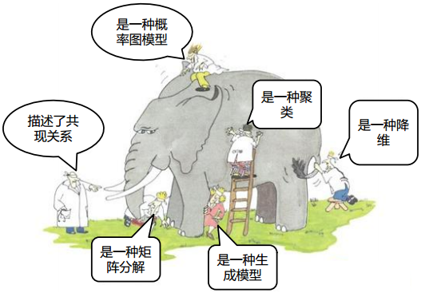
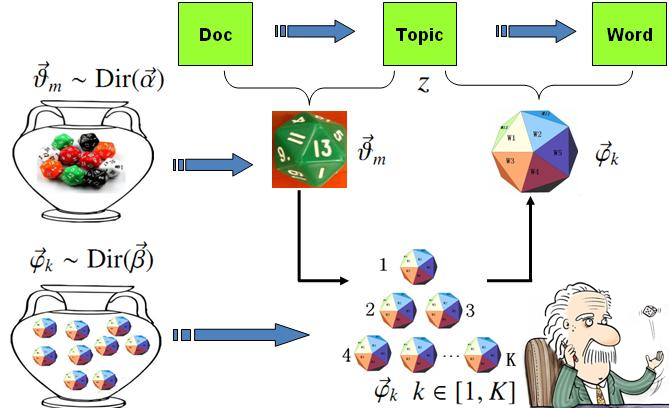
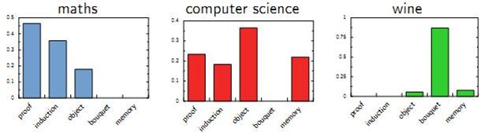
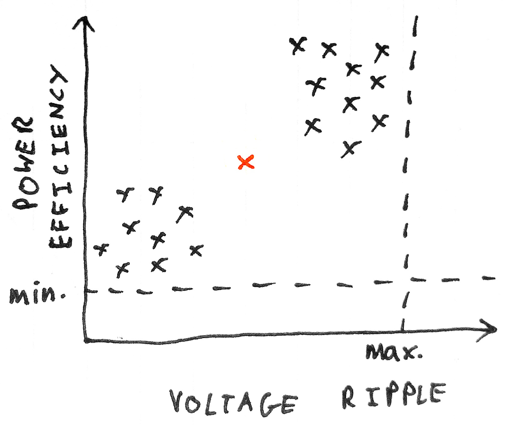
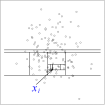
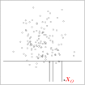

```{r setup, include=FALSE}
library(knitr)
library(tidyverse)
options(servr.deamon = TRUE)
options(htmltools.dir.version = FALSE)
```

<div class="content-page">
  <p class="content-page-title">目录</p>
  <li class="content-page-list">自然语言处理</li>
  <li class="content-page-list">异常检测</li>
</div>

---
class: inverse, center, middle

# 自然语言处理

---
class:

# 自然语言处理

.center[
### 什么是自然语言处理?
]

- **自然语言**就是我们一般人平常所用的，所写的中文，英文，日文等语言文字 (广义来说，也包含语音)。
- 所谓的**“自然”**是相对于**“人工”**或**“程序”**语言而言。
- 就处理的型态来讲，大概可分为三类：**分析**, **转换**及**生成**。
- **分析 (Analysis)**：就是通过统计模型 (Statistical Models)，推理 (Inferences), 模式识别 / 分类 (Pattern Recognition / Classification)，机器学习 (Machine Learning) 等方法，去“分析”文字的内涵，结构，了解其在讲什么。
- **转换 (Transfer)**：分析之后，可以将其“转换”成另一种形式的信息，作进一步的应用。 如转到另一种语言的深层结构 (自动翻译)，或数据库 (数据仓储)。
- **生成 (Generation)**：有时候，我们也会把某些有用，但是比较抽象的信息，用文字写出来，或用语音说出来，这叫“生成”或“合成”。

---
class:

# 自然语言处理


```{r include=F}
library(wordcloud2)
nlp_tasks <- data.frame(
    word = c('机器翻译', '自动摘要', '情感分析', '信息检索', '问答系统',
             '文本分类', '文本朗读', '拼字校正', '词典自动建构', '实体识别'),
    freq = c(40, 36, 26, 14, 48,
             30, 28, 16, 16, 28)
)
wordcloud2(nlp_tasks, size = 0.4)
```

.center[
### 自然语言处理能做些什么？


]

---
class:

# 中文分词

**中文分词（Chinese Word Segmentation）** 指的是将一个汉字序列切分成一个一个单独的词。分词就是将连续的字序列按照一定的规范重新组合成词序列的过程。我们知道，在英文的行文中，单词之间是以空格作为自然分界符的，而中文只是字、句和段能通过明显的分界符来简单划界，唯独词没有一个形式上的分界符，虽然英文也同样存在短语的划分问题，不过在词这一层上，中文比之英文要复杂的多、困难的多。

中文分词的主要困难在于分词歧义。**“结婚的和尚未结婚的”**，应该分成**“结婚／的／和／尚未／结婚／的”**，还是**“结婚／的／和尚／未／结婚／的”**？人来判断很容易，要交给计算机来处理就麻烦了。问题的关键就是，“和尚未”里的“和尚”也是一个词，“尚未”也是一个词，从计算机的角度看上去，两者似乎都有可能。对于计算机来说，这样的分词困境就叫做“交集型歧义”。

常用的分词算法有3类：基于字符串匹配的分词方法、基于理解的分词方法和基于统计的分词方法。

---
class:

# 中文分词

.pull-left[
```{r warning=F, message=F}
# 载入jieba分词扩展包
library(jiebaR)

# 构建最简单的分词器
segmentor <- worker()
text <- '这是第一行文本。'
segment(text, segmentor)

# 默认不分行输出
text <- c('这是1。',
          '这是2。')
segment(text, segmentor)
```
]

.pull-right[
```{r warning=F}
# 分行输出
text <- c('这是第一行文本',
          '这是第二行文本')
segmentor <- worker(bylines=T)
segment(text, segmentor)

# 保留标点
text <- c('这是，测试符号！')
segmentor <- worker(symbol=T)
segment(text, segmentor)
```
]

---
class:

# 中文分词

.pull-left[
```{r}
# 停止词文件
sw <- '../Data/stop-words.txt'
readLines(sw)

# 添加停止词
text <- '这是测试的停止词！'
segmentor <- worker(
    stop_word = sw)
segment(text, segmentor)
```

.footnote[
[1]. 现代汉语语料库加工规范<br/>
&nbsp;&nbsp;&nbsp;&nbsp;&nbsp;&nbsp;&nbsp;&nbsp;—— 词语切分与词性标注
]
]

.pull-right[
```{r}
# 未添加用户新词
text <- '这是一个新词'
segmentor <- worker()
segment(text, segmentor)

# 添加用户新词 [1]
new_user_word(segmentor,
    '这是一个新词', 'n')
segment(text, segmentor)
```
]

---
class:

# 关键词抽取

**关键词抽取**的一般步骤为：

.center[
**分词 > 过滤 > 候选关键词 > 选择 > 关键词**
]

从候选关键词中选出文章的关键词需要通过关键词抽取算法实现，而关键词抽取算法可以根据是否需要人工标注的语料进行训练而分为有监督的提取和无监督的提取。

有监督的提取需要人工标注的语料进行训练，人工预处理的代价较高。而无监督的抽取算法直接利用需要提取关键词的文本即可进行关键词的提取，因此适用性较强。

关键词抽取中无监督的抽取算法可分为三大类：

1. 基于统计特征的，如TF-IDF
2. 基于词图模型的，如TextRank
3. 基于主题模型的，如LDA

---
class:

# TF-IDF算法

**TF-IDF（Term Frequency-Inverse Document Frequency）**算法是一种基于统计特征的非常经典的算法，通过计算一个词的TF值和IDF值的乘积作为该值的得分，然后根据得分从大到小对词语排序，选择分数高的词语作为关键词。

**TF**值指词语在文本中出现的频率，如某篇文章分词并过滤停止词后的词语的数量为
$n$，而其中的某个词语
$w$出现的个数为
$m$,则词
$w$的TF值为：
$TF\left(w\right) = \dfrac{m}{n}$

**IDF**值则指词语在整个语料库中的出现的频率大小。这里首先要指出的是TF-IDF算法是针对一个语料库（也就是多篇文档进行）进行关键词提取的算法。假如语料库中共有
$N$篇文档，而出现了词语
$w$的文档数为
$M$。则词
$w$的IDF值为：
$IDF\left(w\right) = \log_2 \dfrac{N}{M}$

则词
$w$的TF-IDF值为：
$TF\left(w\right) * IDF\left(w\right)$，根据这个值对候选词从大到小排序，选择前n个作为候选关键词即可。

---
class:

# TF-IDF算法

```{r}
kw_extractor <- worker('keywords', topn = 6)
text <- paste0(
    '从天空坠落的猛雷声，打乱，了人生，打碎，花样的青春，打散，了纯真，', 
    '随记忆尘封的嚎啕声，沉淀，怨与恨，沉着，或许是福分，',
    '沉沦，变幻的，爱的浮生，',
    '看淡了绝望才不浓无奈才不痛，敢亲吻下一阵风起和云涌，',
    '能幸福一分钟甚至一秒钟，就快幸福吧趁还能抱紧，未亡的梦，',
    '看淡了才不再奢求才迎向自由，肯接受只有无形的能不朽，',
    '用眼里的空洞去无视沉重，岁月不倒流就让泪倒流，腌渍离愁，',
    '狂风停，云也该放开手，淡淡地走。')
keywords(text, kw_extractor)
```

---
class:

# 主题模型

**主题模型（Topic Model）**在机器学习和自然语言处理等领域是用来在一系列文档中发现抽象主题的一种统计模型。

.center[

]

---
class:

# 主题模型

1. 为什么说是一种概率图模型，因为涉及到了贝叶斯和马尔科夫链。
2. 为什么说描述了共现关系，因为我们最终得到的结果可以描述成topic-word的共现矩阵。
3. 为什么说是一种矩阵分解，因为其中一种做法是LSA/LSI（Latent Semantic Analysis/Indexing），该模型是通过对word-topic矩阵进行分解。
4. 为什么说是一种生成模型，因为这个一个无监督的算法。
5. 为什么说是一种聚类，因为同一个topic的文章可以理解为一类文章。
6. 为什么说是一种降维，因为用一个topic表示一篇文章时，如果我们仅用这个topic下word概率大的那些word表征这篇文章，这不就是对文章本身的一个降维吗？

---
class:

# 上帝掷骰子的游戏<sup>[1]</sup>

.center[

]

[1] LDA数学八卦，靳志辉

---
class:

# 什么是主题

.center[
### **Topic** 就是 **Word** 上的概率分布


]

---
class: inverse, center, middle

# 异常检测

---
class:

# 异常检测

**异常检测（Anomaly Detection）**是指对不符合预期模式或数据集中异常项目、事件或观测值的识别。通常异常的样本可能会导致银行欺诈、结构缺陷、医疗问题、文本错误等不同类型的问题。异常也被称为离群值、噪声、偏差和例外。

.pull-left[

]

.pull-right[
<br />

]

---
class:

# 异常检测

异常检测技术用于各种领域，如入侵检测、欺诈检测、故障检测、系统健康监测、传感器网络事件检测和生态系统干扰检测等。它通常用于在预处理中删除从数据集的异常数据。在监督式学习中，去除异常数据的数据集往往会在统计上显著提升准确性。

常用的异常检测算法有：

- 基于密度的方法：最近邻居法、局部异常因子等
- One-Class SVM
- 基于聚类的方法
- Isolation Forest
- AutoEncoder

---
class:

# 箱线图

箱线图（Boxplot），是利用数据中的五个统计量：最小值、第一四分位数、中位数、第三四分位数与最大值来描述数据的一种方法，它也可以粗略地看出数据是否具有有对称性，分布的分散程度等信息。

.center[

]

$$\begin{split}
LowerLimit &= \max \{Q_1 - 1.5 * IQR, Minimum\} \\
UpperLimit &= \min \{Q_3 + 1.5 * IQR, Maximum\} \\
IQR &= Q_3 - Q_1
\end{split}$$

---
class:

# Isolation Forest

Isolation，意为孤立、隔离，是名词，Forest是森林，合起来就是“孤立森林”了，也有叫“独异森林”，并没有统一的中文叫法，大家更习惯用其英文的名字isolation forest，简称iForest<sup>[1, 2]</sup>。

iForest算法用于挖掘异常数据，或者说离群点挖掘，总之是在一大堆数据中，找出与其它数据的规律不太符合的数据。通常用于网络安全中的攻击检测和流量异常等分析，金融机构则用于挖掘出欺诈行为。对于找出的异常数据，然后要么直接清除异常数据，如数据清理中的去除噪声数据，要么深入分析异常数据，比如分析攻击、欺诈的行为特征。

.footnote[
[1] Liu, Fei Tony, Kai Ming Ting, and Zhi-Hua Zhou. "Isolation forest." Data Mining, 2008. ICDM'08. Eighth IEEE International Conference on. IEEE, 2008.

[2] Liu, Fei Tony, Kai Ming Ting, and Zhi-Hua Zhou. "Isolation-based anomaly detection." ACM Transactions on Knowledge Discovery from Data (TKDD) 6.1 (2012): 3.
]

---
class:

# Isolation Forest

iForest属于非监督学习的方法，假设我们用一个随机超平面来切割数据空间, 切一次可以生成两个子空间。之后我们再继续用一个随机超平面来切割每个子空间，循环下去，直到每子空间里面只有一个数据点为止。iForest由
$t$个iTree（Isolation Tree）孤立树组成，每个iTree是一个二叉树结构，其实现步骤如下：

1. 从训练集中随机选择
$\phi$个点样本点，放入树的根节点。
2. 随机指定一个特征，在当前节点数据中随机产生一个切割点
$p$，切割点产生于当前节点数据中指定维度的最大值和最小值之间。
3. 以此切割点生成了一个超平面，将当前数据空间划分为2个子空间：小于
$p$的数据作为当前节点的左孩子，大于等于
$p$的数据作为当前节点的右孩子。
4. 在孩子节点中递归步骤2和3，不断构造新的孩子节点，直到孩子节点中只有一个数据或孩子节点已到达限定高度。

获得
$t$个iTree之后，iForest 训练就结束，然后我们可以用生成的iForest来评估测试数据了。对于一个训练数据
$x$，我们令其遍历每一棵iTree，然后计算
$x$最终落在每个树第几层。然后我们可以得出
$x$在每棵树的高度平均值。获得每个测试数据的平均深度后，我们可以设置一个阈值，其平均深度小于此阈值的即为异常。

---
class:

# Isolation Forest

.pull-left[

]

.pull-right[

]

---
class:

# Isolation Forest

.pull-left[
```{r eval=F}
library(devtools)
install_github(
    'Zelazny7/isofor')
library(isofor)

x <- c(rnorm(1000, 0, 0.5),
  rnorm(1000 * 0.05, -1.5, 1))
y <- c(rnorm(1000, 0, 0.5),
  rnorm(1000 * 0.05,  1.5, 1))
data <- data.frame(x, y)

if_model <- iForest(
    data, 100, 32)
p <- predict(if_model, data)
ol <- c(rep(0, 1000), 
  rep(1, (0.05 * 1000))) + 2
col <- ifelse(
    p > quantile(p, 0.95),
    'red', 'blue')
```
]

.pull-right[
```{r eval=F}
plot(x, y, col=col, pch=ol)
```
```{r echo=F, warning=F, message=F}
library(isofor)

x <- c(rnorm(1000, 0, 0.5),
  rnorm(1000 * 0.05, -1.5, 1))
y <- c(rnorm(1000, 0, 0.5),
  rnorm(1000 * 0.05,  1.5, 1))
ol <- c(rep(0, 1000), 
  rep(1, (0.05 * 1000))) + 2
data <- data.frame(x, y)

if_model <- iForest(
    data, 100, 32)
p <- predict(if_model, data)

col <- ifelse(
    p > quantile(p, 0.95),
    'red', 'blue')
plot(x, y, col=col, pch=ol, cex.axis=2, cex.lab=2, cex=1.5)
```
]

---
class: center, middle

# Thanks


本作品采用 [CC BY-NC-SA 4.0](http://creativecommons.org/licenses/by-nc-sa/4.0/) 进行许可