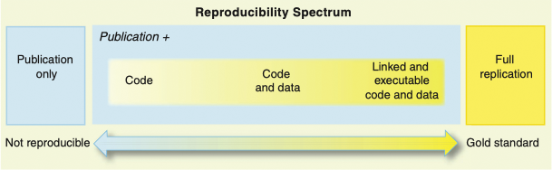
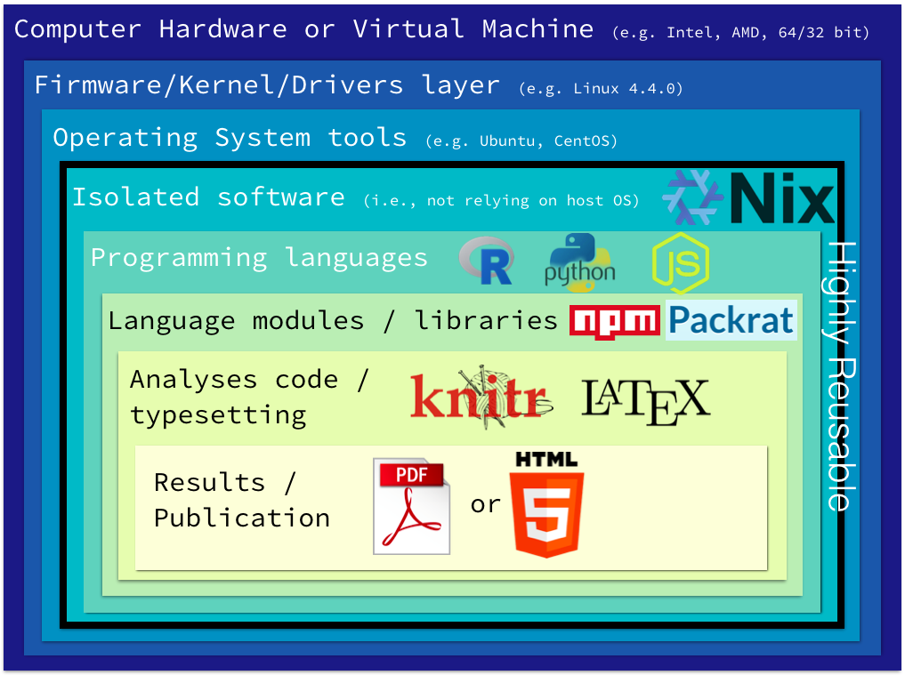

class: content

```{r setup, include=FALSE}
library(knitr)
library(tidyverse)
options(servr.deamon = TRUE)
options(htmltools.dir.version = FALSE)
```

<div class="content-page">
  <p class="content-page-title">目录</p>
  <li class="content-page-list">Markdown</li>
  <li class="content-page-list">R Markdown</li>
  <li class="content-page-list">Jupyter</li>
  <li class="content-page-list">版本控制</li>
</div>

---
class: section, center, middle

# 可重复性研究

---
class:

# 可重复性研究

.center[

]

.footnote[
[1] 图片来源：https://github.com/mickaeltemporao/reproducible-research-in-python
]

---
class:

# 可重复性研究

The goal of reproducible research is to tie specific instructions to data analysis and experimental data so that scholarship can be recreated, better understood and verified <sup>[1]</sup>.

所谓可重复的统计研究，就是一个研究结果既可以在作者手中生成出来，也可以 “移植” 到他人的平台中用同样的工具重复生成出来，就像物理或化学或生物实验一样，需要每一位实验者在相同条件下都能观察到实验结果 <sup>[2]</sup>。

```{r, echo=F, fig.align='center', out.width='60%'}

```

.footnote[
[1] https://cran.r-project.org/web/views/ReproducibleResearch.html  
[2] https://cosx.org/2010/11/reproducible-research-in-statistics  
[3] 图片来源：Peng, Roger D. "Reproducible research in computational science." _Science_ 334.6060 (2011): 1226-1227.
]

---
class:

# 可重复性研究

```{r, echo=F, out.width='50%', fig.align='center'}

```

.footnote[
[1]. 图片来源：https://mozillafoundation.github.io/2017-fellows-sf/re-papers/
]

---
class: section, center, middle

# Markdown

---
class:

# Markdown

Markdown 是一个由约翰（John Gruber）创建了一种轻量级标记语言。它允许人们使用易读易写的纯文本格式编写文档，然后转换成有效的 XHTML（或者 HTML）文档。本节内容主要参考了约翰对 Markdown 的介绍<sup>[1]</sup>。

Markdown 最大的特点是其易读性和易写性，Markdown 文件可以直接以纯文本形式发布，而不会像 HTML 那样包含许多标签。Markdown 的语法是有一些符号构成，其种类不是很多，仅对应了 HTML 标记中的一小部分。Markdown 是一种书写格式，发布时程序会将 Markdown 文件转换成 HTML 格式文件。因此对于不在 Markdown 覆盖范围内的标签，可以直接将 HTML 标签写在 Markdown 文档中，同时不需要额外标注是 HTML 标签还是 Markdown 标签。

Markdown 文件中，在 HTML 区块标签中的 Markdown 语法不会被处理。

.footnote[
[1] J. Gruber, “Markdown project.” http://daringfireball.net/projects/markdown/.
]

---
class:

# Markdown

- 段落和换行

一个段落通常是由一个或多个空行分割的一个或多个连续的文本行所组成。只要是看起来是空的行即可视为空行，例如：某一行包含了空格或制表符，但其仍被视为空行。普通段落不应该用空格或制表符进行缩进。

“由一个或多个连续的文本行所组成”这句话暗示了 Markdown 允许段落内部强制换行。和其他的文本转 HTML 格式不同，其他的格式会将每个换行符都转换成 `<br/>` 标签。如果需要使用 Markdown 插入 `<br/>` 时，需要在待插入位置输入两个以上的空格并按回车实现。尽管这样可能相对费事，但是把每个换行符都转换成 `<br/>` 标签对于 Markdown 来说并不适合，因为 Markdown 在区块引用和多段落的列表中使用了换行来进行排版，这样不仅方便使用，同时也便于阅读。

---
class:

# Markdown

- 标题

Markdown 支持两种标题语法：一种是利用 `=`（最高等级标题）和 `-`（第二等级标题），例如：

```md
这是 H1
===
这是 H2
------
```

任何数量的 `=` 和 `-` 都是等效的，显示效果如下：

.pull-left[
这是 H1
===
]

.pull-right[
这是 H2
------
]

---
class:

# Markdown

- 标题

另一种是利用在行首插入 1 至 6 个 `#` 号，对应 1 至 6 级标题，例如：

.pull-left[
```md
# 这是 H1 #
## 这是 H2 ##
### 这是 H3 ###
```
]

.pull-right[
```md
#### 这是 H4
##### 这是 H5
###### 这是 H6
```
]

为了美观，可以在标题的后面也加上 `#` 号，行尾的 `#` 号的数量可以不和行首的保持一致，行首的 `#` 号决定了标题的等级，显示效果如下：

.grid[
.grid-cell-1of6[
# 这是 H1 #
]

.grid-cell-1of6[
## 这是 H2 ##
]

.grid-cell-1of6[
### 这是 H3 ###
]

.grid-cell-1of6[
#### 这是 H4
]

.grid-cell-1of6[
##### 这是 H5
]

.grid-cell-1of6[
###### 这是 H6
]
]

---
class:

# Markdown

- 区块引用

.pull-left[
Markdown 可以使用类似 email 中的 `>` 的引用模式。在每一行前面加上 `>`，或只在段落的第一行前面加上 `>` 都可以实现区块引用的效果，例如：

```md
> 这是一个包含两个段落的区块引用。
> 我还是第一段。
>
> 我是第二段。
```

> 这是一个包含两个段落的区块引用。
> 我还是第一段。
>
> 我是第二段。
]

.pull-right[
区块应用可以嵌套，例如

```md
> 第一级
>
> > 第二级
>
> 回到第一级
```


> 第一级
>
> > 第二级
>
> 回到第一级
]

---
class:

# Markdown

- 列表

对于无序的列表，可以使用星号 `*`，加号 `+` 或减号 `-` 作为标记，不同符号的效果是相同的；对于有序的列表，可以使用数字紧跟一个英文句号作为标记，数字的连续型和正确性并不影响有序列表的输出效果，但 Markdown 会将第一个数字作为起始值。

.pull-left[
```md
 * 红色
 * 绿色
 * 蓝色

 + Leo
 + Jack

 1. 红色
 2. 绿色
 4. 蓝色
```
]

.pull-right[
* 红色
* 绿色
* 蓝色

+ Leo
+ Jack

1. 红色
2. 绿色
4. 蓝色
]

---
class:

# Markdown

- 代码

对于和程序相关的写作通常会包含大量的代码区块，通常对于这些代码我们不希望以一般的格式对其进行排版，而是希望代码区块保持原始的样子。

.pull-left[
Markdown 中使用三个 \` 号加上语言表示插入代码块：

` ```python`<br/>
`# Demo function`<br/>
`def demo_func(x, y, z=1):`<br/>
`    return (x + y) * z`<br/>
` ``` `

Markdown 会将其转换为：

```python
# Demo function
def demo_func(x, y, z=1):
    return (x + y) * z
```
]

.pull-right[

Markdown 中使用 \` 将文本包围起来可以将行内文本转换成代码：

使用 \`<span>print()<span>\` 函数打印信息。

Markdown 会将其转换为：

使用 `print()` 函数打印信息。
]

---
class:

# Markdown

- 分隔线

在 Markdown 中可以使用 3 个及以上的星号 `*`，减号 `-` 或下划线 `_` 来建立一个分隔线。构建分割线的行内不能够有其他的符号，但在星号，减号和下划线之间可以插入空格，例如：

`* * *`<br/>
`***`<br/>
`*****`<br/>
`- - -`<br/>
`---------------------------------------`<br/>

分割线的显示效果如下：

---------------------------------------

---
class:

# Markdown

- 链接

Markdown 支持两种样式的链接语法：行内样式和参考样式。

对于任何一种样式，链接文字都需要用方括号 `[]` 进行标记。

对于行内样式的链接，仅需在方括号的标记后面紧跟一对圆括号，并在圆括号内插入网址链接即可。如果需要对连接加上标题文字，可以在链接后面有双引号将标题问题包起来即可。例如：

`[Google](https://www.google.com "Google主页") 是一家美国的跨国科技企业。`<br/>

Markdown会将其转换为：

[Google](https://www.google.com "Google主页") 是一家美国的跨国科技企业。

---
class:

# Markdown

- 强调

Markdown 中使用星号 `*` 和下划线 `_` 作为强调的标记符号。被单个星号或下划线包围的文字转换后会被 `<em>` 标签包围，被两个星号或下划线包围的文字转换后会被 `<strong>` 包围，例如：

.pull-left[
`*single asterisks*`<br/>
`_单个下划线_`<br/>
`**两个星号**`<br/>
`__double underscores__`<br/>
]

.pull-right[
*single asterisks* <br />
_单个下划线_ <br />
**两个星号** <br />
__double underscores__
]

强调标记可以插在文档的任意位置，但需要注意以什么符号开始就需要以什么符号结束。同时需要保证在星号和下划线的两边不能出现空白，否则他们会被当做普通符号处理。如果需要插入一对星号或下划线的时候，可以在其前面添加反斜杠 `\` 进行转义。

---
class:

# Markdown

- 图片

Markdown 中插入图片的方式和插入链接的方式类似，图片插入语法示例如下：

``<br/>
``

其中方括号内为图片的替换文本，小括号内为图片的路径，后面可以选择性的加上标题。

目前 Markdown 暂时还无法指定图片的宽度和高度，如果需要的话，可以使用原生的 HTML 标签 ``。

---
class:

# Markdown

- 表格

表格并不是 Markdown 核心规范的一部分，但是 GFM（Github Flavored Markdown）一部分。在 Markdown 中，表格的示例如下：

.pull-left[
```md
| Item    | Quantity | Price |
| ------- | :------: | ----: |
| Water   | 10       | $0.99 |
| Cheese  | 2        | $2.99 |
| Egg     | 6        | $0.49 |
```
]

.pull-right[
| Item    | Quantity | Price |
| ------- | :------: | ----: |
| Water   | 10       | $0.99 |
| Cheese  | 2        | $2.99 |
| Egg     | 6        | $0.49 |
]

<br/>

其中列之间用 `|` 进行分割，表头和数据之间用单独的一行进行分割，并且每列内 `-` 的个数至少为 3 个。表头和数据的分割行内，可以使用英文冒号 `:` 定义数据列的对其方式，默认（不添加 `:`）为左对齐，在 `-` 两个均添加一个 `:` 为居中对其，仅在 `-` 的右侧添加一个 `:` 为右对齐。

---
class:

# Markdown

- 转义字符

在 Markdown 中有很多符号最为了 Markdown 语法的标记符号，因此当需要将这些符号作为普通文本是，需要在其前面加上反斜杠进行转义。需要在其前面加上反斜杠进行转义的符号有：

.pull-left[
- \\   反斜线
- \`   反引号
- \*   星号
- \_   下划线
- \{\}  花括号
- \[\]  方括号
]

.pull-right[
- \(\)  小括号
- \#   井字号
- \+   加号
- \-   减号
- \.   英文句号
- \!   惊叹号
]

---
class:

# Markdown 公式

在 Markdown 中通过 MathJax <sup>[1]</sup> 可以嵌入 LaTeX 公式，例如：

1. `$equation$` 用于行内公式（注意 `$` 符号内侧不能由空白符号）。

    例如：`$a = \sum_{i=1}^{n}{i}$` 显示为： $a = \sum_{i=1}^{n}{i}$

2. `$`<span style="display:none;"></span>`$equation$`<span style="display:none;"></span>`$` 用于显示的公式。

    例如：`$`<span style="display:none;"></span>`$a = \sum_{i=1}^{n}{i}$`<span style="display:none;"></span>`$` 显示为： $$a = \sum_{i=1}^{n}{i}$$

.footnote[
[1] https://www.mathjax.org/
]

---
class: section, center, middle

# R Markdown

---
class:

# R Markdown

R Markdown 是一种利用 R 语言创建动态文档，演示文稿和报告的语言。它包含了 Markdown 的核心语法和嵌入式的R语言代码块，从而可以使 R 代码的结果直接包含在最终的文档中。R Markdown 文档可以完全被重现，因为任何时刻底层的 R 语言代码或数据发生改变，最终生成的文档也被重新生成。R Markdown 包含了很多增强特性：

1. 多种输出格式（包括 HTML，PDF 和 MS WORD）。
2. 支持创作 Beamer，ioslides 和 Slidy 样式的演示文档。
3. 支持表格和参考文献的 Markdown 语法。
4. 用于个性化 HTM L和 PDF 的接口（包括 CSS，headers 和 footers）。
5. 用于个性化 PDF 输出的原始 LaTeX 支持。
6. 利用 R 脚本编译 HTML，PDF 或 MS WORD 笔记。
7. 可扩展性：创建自定义模板或定义新的输出格式。
8. 利用 Shiny 创建可以交互性 R Markdown 文档。

尽管用户可以按照 R Markdown 的语法要求书写 R Markdown 文档，并利用 rmakrdown 扩展包中的 `render()` 函数渲染文档并生成最终的文档，但利用 knitr 扩展包会让生成一份优美的文档变得更加“优美”。

---
class:

# R Markdown

- R 代码块

.pull-left[
在 R Markdown 中，通过如下方式嵌入 R 代码块：
    `r ''````{r}
    summary(cars)
    ```
]

.pull-right[
```{r}
summary(cars)
```
]

在 R 代码块中可以指定相应参数，例如：

    `r ''````{r, echo=FALSE, fig.width=8, fig.height=6}
    plot(cars)
    ```

---
class:

# R Markdown

- 行内执行 R 代码

R Markdown 还支持在文本行内执行 R 代码，待执行的 R 代码需要用反引号包围起来并在开头添加 `r`，例如：

```md
行内计算的结果为 `r 1+1`
```

则输出的结果为:

行内计算的结果为 `r 1+1`

---
class:

# R Markdown

- 图像编码和打包

当 R Markdown 被转化为 HTML 时，文件中用相应图像将直接被打包进最终生成的 HTML 文件中。图像通过 base64 编码，然后利用 data URI 插入被编码的图像，从而产生一个独立的 web 页面。图像编码和打包使得在分享时不需要再打包任何其他附件文件，可以将生成的 HTML 文件作为邮件附件，在公共文件夹中分享，或者在 web 服务中将其配置成单独的 HTML 文件。

.footnote[
[1] R Markdown Reference Guide: https://www.rstudio.org/links/r_markdown_reference_guide <br/>
[2] R Markdown Cheatsheet: https://www.rstudio.org/links/r_markdown_cheat_sheet
]

---
class:

# 输出类型

.pull-left[
- 报告

    - 自带：多种输出格式：HTML, PDF（需 TeX 环境支持，例如：TeX Live），Word
    - [rticles](https://github.com/rstudio/rticles)：多种 LaTeX 排版格式文档，其中 CTeX Documents 支持中文
    - [tufte](https://github.com/rstudio/tufte)：Tufte 格式排版（3 种输出类型，中文支持），[示例](https://rstudio.github.io/tufte/)
]

.pull-right[
- 幻灯片

    - 自带：HTML（ioslide, Slidy），PDF（Beamer）
    - [xaringan](https://github.com/yihui/xaringan)

- 博客

    - [blogdown](https://github.com/rstudio/blogdown)

- 书籍

    - [bookdown](https://bookdown.org/yihui/bookdown)
]

.footnote[
[1] R Markdown Formats: https://rmarkdown.rstudio.com/formats.html  
[2] R Markdown Gallery: https://rmarkdown.rstudio.com/gallery.html
]

---
class: section, center, middle

# Jupyter

---
class:

# Jupyter Notebook

```{r, echo=F, out.width='66%', fig.align='center'}
knitr::include_graphics('images/jupyter-notebook.png')
```

---
class:

# JupyterLab

```{r, echo=F, out.width='66%', fig.align='center'}
knitr::include_graphics('images/jupyterlab.png')
```

---
class: section, center, middle

# 版本控制

---
class:

# 版本控制

什么是“版本控制”？我为什么要关心它呢？ 版本控制是一种记录一个或若干文件内容变化，以便将来查阅特定版本修订情况的系统。

如果你是位图形或网页设计师，可能会需要保存某一幅图片或页面布局文件的所有修订版本（这或许是你非常渴望拥有的功能），采用版本控制系统（VCS）是个明智的选择。 有了它你就可以将某个文件回溯到之前的状态，甚至将整个项目都回退到过去某个时间点的状态，你可以比较文件的变化细节，查出最后是谁修改了哪个地方，从而找出导致怪异问题出现的原因，又是谁在何时报告了某个功能缺陷等等。 使用版本控制系统通常还意味着，就算你乱来一气把整个项目中的文件改的改删的删，你也照样可以轻松恢复到原先的样子。 但额外增加的工作量却微乎其微。

.footnote[
[1] Pro Git: https://git-scm.com/book/zh/v2
]

---
class:

# 版本控制

- 本地版本控制系统

许多人习惯用复制整个项目目录的方式来保存不同的版本，或许还会改名加上备份时间以示区别。 这么做唯一的好处就是简单，但是特别容易犯错。 有时候会混淆所在的工作目录，一不小心会写错文件或者覆盖意想外的文件。为了解决这个问题，人们很久以前就开发了许多种本地版本控制系统，大多都是采用某种简单的数据库来记录文件的历次更新差异。

- 集中化的版本控制系统

接下来人们又遇到一个问题，如何让在不同系统上的开发者协同工作？ 于是，集中化的版本控制系统（Centralized Version Control Systems，简称 CVCS）应运而生。 这类系统，诸如 CVS、Subversion 以及 Perforce 等，都有一个单一的集中管理的服务器，保存所有文件的修订版本，而协同工作的人们都通过客户端连到这台服务器，取出最新的文件或者提交更新。 多年以来，这已成为版本控制系统的标准做法。

这种做法带来了许多好处，特别是相较于老式的本地 VCS 来说。 现在，每个人都可以在一定程度上看到项目中的其他人正在做些什么。 而管理员也可以轻松掌控每个开发者的权限，并且管理一个 CVCS 要远比在各个客户端上维护本地数据库来得轻松容易。

---
class:

# 版本控制

- 集中化的版本控制系统

事分两面，有好有坏。 这么做最显而易见的缺点是中央服务器的单点故障。 如果宕机一小时，那么在这一小时内，谁都无法提交更新，也就无法协同工作。 如果中心数据库所在的磁盘发生损坏，又没有做恰当备份，毫无疑问你将丢失所有数据——包括项目的整个变更历史，只剩下人们在各自机器上保留的单独快照。 本地版本控制系统也存在类似问题，只要整个项目的历史记录被保存在单一位置，就有丢失所有历史更新记录的风险。

- 分布式版本控制系统

于是分布式版本控制系统（Distributed Version Control System，简称 DVCS）面世了。 在这类系统中，像 Git、Mercurial、Bazaar 以及 Darcs 等，客户端并不只提取最新版本的文件快照，而是把代码仓库完整地镜像下来。 这么一来，任何一处协同工作用的服务器发生故障，事后都可以用任何一个镜像出来的本地仓库恢复。 因为每一次的克隆操作，实际上都是一次对代码仓库的完整备份。

更进一步，许多这类系统都可以指定和若干不同的远端代码仓库进行交互。籍此，你就可以在同一个项目中，分别和不同工作小组的人相互协作。 你可以根据需要设定不同的协作流程，比如层次模型式的工作流，而这在以前的集中式系统中是无法实现的。

---
class:

# Git


同生活中的许多伟大事物一样，Git 诞生于一个极富纷争大举创新的年代。Linux 内核开源项目有着为数众多的参与者。 绝大多数的 Linux 内核维护工作都花在了提交补丁和保存归档的繁琐事务上（1991 至 2002 年间）。到 2002 年，整个项目组开始启用一个专有的分布式版本控制系统 BitKeeper 来管理和维护代码。

到了 2005 年，开发 BitKeeper 的商业公司同 Linux 内核开源社区的合作关系结束，他们收回了 Linux 内核社区免费使用 BitKeeper 的权力。 这就迫使 Linux 开源社区（特别是 Linux 的缔造者 Linus Torvalds）基于使用 BitKeeper 时的经验教训，开发出自己的版本系统。 他们对新的系统制订了若干目标：

- 速度
- 简单的设计
- 对非线性开发模式的强力支持（允许成千上万个并行开发的分支）
- 完全分布式
- 有能力高效管理类似 Linux 内核一样的超大规模项目（速度和数据量）

自诞生于 2005 年以来，Git 日臻成熟完善，在高度易用的同时，仍然保留着初期设定的目标。 它的速度飞快，极其适合管理大项目，有着令人难以置信的非线性分支管理系统（参见 [Git 分支](https://git-scm.com/book/zh/v2/ch00/ch03-git-branching)）。

---
class:

# GitHub

GitHub 是通过 Git 进行版本控制的软件源代码托管服务平台。GitHub 同时提供付费账户和免费账户。这两种账户都可以建立公开或私有的代码仓库，但付费用户支持更多功能。根据在 2009 年的 Git 用户调查，GitHub 是最流行的 Git 存取站点。除了允许个人和组织建立和存取保管中的代码以外，它也提供了一些方便社会化共同软件开发的功能，即一般人口中的社群功能，包括允许用户追踪其他用户、组织、软件库的动态，对软件代码的改动和 bug 提出评论等。GitHub 也提供了图表功能，用于概观显示开发者们怎样在代码库上工作以及软件的开发活跃程度。

GitHub 里面的项目可以透过标准的Git命令进行访问和操作。同时，所有的 Git 命令都可以用到 GitHub 项目上面。网站提供了一系列社交网络具有的功能，例如赞（star）、关注（follow）、评论。用户可以透过复刻（fork）他人项目的形式参与开发，并可透过协作示意图来查看有多少开发者参与了开发并追踪最新的复刻版本。此外网站还有 Wiki 等功能。

<br/>

.center[
<span>


</span>
]

---
class: thanks, center, middle

# Thanks


本作品采用 [CC BY-NC-SA 4.0](https://creativecommons.org/licenses/by-nc-sa/4.0/) 进行许可