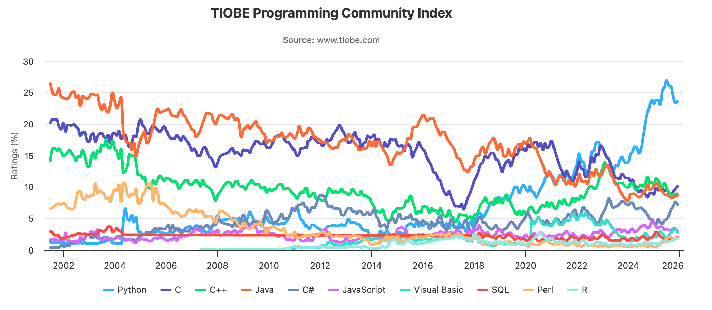
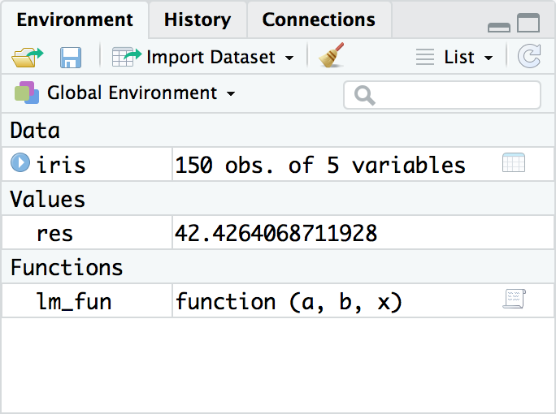

## 目录 {.content}

- R 基础语法
- R 对象和函数
- R 数据结构
- R 语言编码风格

# R 基础语法

## R 语言简介

R ^[<https://zh.wikipedia.org/wiki/R语言>] 语言是一种自由软件编程语言与操作环境，主要用于统计分析、绘图以及数据挖掘。R 由统计学家罗斯·伊哈卡 ^[<https://zh.wikipedia.org/wiki/罗斯·伊哈卡>] 和罗伯特·杰特曼 ^[<https://zh.wikipedia.org/wiki/罗伯特·杰特曼>] 开发，现在由 R 核心小组负责开发。

R 语言以 S 语言为基础，增加了 Scheme 语言中词法作用域这一机制，使程序员得以将代码中某一对象的适用范围限制到一小段代码之中。R 的后台程序大多由 C 语言、FORTRAN 语言和 R 自己写成。

用户可以用 R 来进行一些基本的统计检验，构建线性及非线性的模型，对时间序列加以分析，或对数据进行分类与聚类分析。R 的另一强项是绘图功能，画出的图表能够达到专业出版物的要求，也可加入数学符号。计算强度较大时，用户可在程序中嵌入 C、C++ 以及 FORTRAN 语言以帮助运算。

## R 语言趋势

::: {.center}
{fig-align="center" width=100%}
:::

## R 语法特点

R 语言是一种解释型（Interpreter）编程语言，在 R 中变量名和函数名有严格的区分大小写。在 R 语言中赋值符号使用 `<-`，而非传统的 `=`。尽管 R 语言支持使用 `=` 进行赋值操作，但通常这被认为是不地道的语法，当然使用 `<-` 也会存在一定的问题。`x <- 5` 则表示将 `5` 赋值给变量 `a`，而非表示变量 `a` 小于 `-5`。

这就要求用户在编写 R 语言程序时保持良好的代码书写习惯，在合适的位置添加空格，良好的书写习惯应将上述表达式写为 `x < -5`。R 语言具有类似 C 语言（如 C 、C++、C# 和 Java）的一些特征，例如函数使用大括号包围，同时又具有一些独特之处，例如 R 语言的每行代码结束无需使用 `;`，R 语言使用 `#` 作为注释标记，位于 `#` 后面的文本将被识别为注释信息而被 R 语言解释器忽略。

```{r}
# 这是一行注释
res <- (2 + 4) * 5 / 2 ^ -0.5
res
```

## R 控制流

:::: {.columns}
::: {.column width="50%"}
分支语句

```{r}
#| eval: false

if (condition_1) {
  statement_1
} else if (condition_2) {
  statement_2
} else if (condition_3) {
  statement_3
} ... {
  ...
} else {
  statement_N
}
```
:::

::: {.column width="50%"}
循环语句

```{r}
#| eval: false

for (i in 1:9) {
  print(i)
}
```

```{r}
#| eval: false

i <- 1

while(i <= 9) {
  print(i)
  i <- i + 1
}
```
:::
::::

## R 工作空间

:::: {.columns}
::: {.column width="50%"}
在 RStudio 中，所有用于定义的对象都会在环境（Environment）窗口中显示，如右图所示。工作环境的本质是 R 的工作空间（workspace），其中储存了用户定义的所有对象。

用户可以利用 `rm()` 从环境中删除变量：

```{r}
rm(res)
```

用户可以使用下例方式清除环境中的所有变量：

```{r}
rm(list = ls(all.names = TRUE))
```
:::

::: {.column width="50%"}
{fig-align="center" width=80%}
:::
::::

# R 对象和函数

## R 对象

:::: {.columns}
::: {.column width="50%"}
R 语言系一种面向对象（object oriented）及函数导向（function directed）的编程语言。因此，对象及函数是成功使用 R 语言的两大关键要素。R 语言是面向对象的，这意味着它符合传统对象的含义。传统对象是指可发送和接收信息的实体。在 R 语言中，所有操作的实体都称之为对象（Object），函数（Function）也不例外。对象可以存储数字，字符串，向量，甚至是函数。R 语言常见的对象类型见右表，用户可以利用 `mode()` 和 `typeof()` 函数查看对象的类型或存储模式。
:::

::: {.column width="50%"}
::: {.center}
| 类型      | 说明   | 示例          |
| --------- | ------ | ------------- |
| integer   | 整型数 | 1, 2, 3       |
| double    | 浮点数 | 1.0, 2.9, 3.0 |
| logical   | 布尔   | TRUE, FALSE   |
| character | 字符串 | "ch"          |
| complex   | 复数   | 1 + 2i        |
| builtin   | 函数等 | max, min      |
| list      | 列表   | list(1, 2)    |
:::
:::
::::

## R 对象

:::: {.columns}
::: {.column width="33%"}
```{r}
int <- 5L
```

```{r}
mode(int)
```

```{r}
typeof(int)
```

```{r}
vec <- c(1, 2)
mode(vec)
```

```{r}
typeof(vec)
```
:::

::: {.column width="34%"}
```{r}
tf <- vec %% 2 == 0
mode(tf)
```

```{r}
typeof(tf)
```

```{r}
str <- c("A", "B")
mode(str)
```

```{r}
typeof(str)
```
:::

::: {.column width="33%"}
```{r}
df <- data.frame(vec, str)
mode(df)
```

```{r}
typeof(df)
```

```{r}
lst <- list(vec, str)
mode(lst)
```

```{r}
typeof(lst)
```
:::
::::

## R 函数

作为一个函数式编程语言，R 语言中的函数自然占据着至关重要的地位。R 语言中内置很多函数（当然这些函数也包含在包中，这些包在 R 启动时会自动加载，包的相关内容在下节中会详细介绍）。我们日常生活中经常使用到的数学或统计运算基本上都已经含盖了, 如右表所示。

| 函数           | 说明                   | 函数      | 说明       |
| -------------- | ---------------------- | --------- | ---------- |
| `log(x)`       | 以 e 为底 x 的对数     | `exp(x)`  | x 的指数   |
| `log10(x)`     | 以 10 为底 x 的对数    | `sum(x)`  | x 的加和   |
| `log(x, base)` | 以 base 为底 x 的对数  | `prod(x)` | x 的连乘   |
| `round(x, n)`  | 四舍五入 x 为 n 位小数 | `mean(x)` | x 的均值   |
| `max(x)`       | x 中的最大值           | `var(x)`  | x 的方差   |
| `min(x)`       | x 中的最小值           | `sd(x)`   | x 的标准差 |

## R 函数

:::: {.columns}
::: {.column width="50%"}
R 语言中的函数每个参数都对应一个参数名称，例如函数 `log()` 的原型为 `function (x, base = exp(1))`，用户在使用时可以不指定参数名称，例如：

```{r}
log(100, 10)
```

对于具有默认参数值的参数，如果采用默认值可以省略该参数，例如：

```{r}
log(100)
```
:::

::: {.column width="50%"}
当用户省略默认值时，只能够省略右边连续的默认参数。当指定参数的名称时，用户可以采用任意顺序传入参数值而不会影响函数的结果，例如：

```{r}
log(x = 100, base = 10)
```

```{r}
log(base = 10, x = 100)
```
:::
::::

## R 扩展包

:::: {.columns}
::: {.column width="50%"}
R 中的扩展包（package）是一种数据，函数和代码的组合，包为 R 语言提供丰富的扩展函数和数据集。在 R 的初始安装版本中已经包括了很多包及数据集, 用户可以从 R 环境菜单栏中的“程序包”选项或利用命令行 `installed.packages()` 来确认想用的包是否已按经安装。例如：

```{r}
#| eval: false

install.packages("minpack.lm")
```

用户还可以根据自己所处的网络环境指定 CRAN 镜像站点以获得更快速的下载。

```{r}
#| eval: false

install.packages("minpack.lm", repos = "xxx")
```
:::

::: {.column width="50%"}
除了在 CRAN上 有大量的扩展包外，其他代码托管网站，如 Github 也有很多扩展包。对于位于 Github 上的扩展包，用户需要利用 devtools 包中的 `install_github()` 函数安装。例如：

```{r}
#| eval: false

install.packages("devtools")
library(devtools)
install_github("xxx/xxx")
```

包安装完毕后，在使用其中的数据和函数之前，需要将包载入工作空间。

```{r}
#| eval: false

library(minpack.lm)
```
:::
::::

# R 数据结构

## R 数据结构

数据结构是为用来存储数据和函数操作所产出的对象所设计。我们可认为函数是运算（actions）而数据结构系运算所产出的对象。一个函数的输入参数（arguments）和它所返回的对象是数据结构。因此,我们也可认为函数是数据结构的运算子（operators）。

R 语言提供了 5 个主要的数据结构：**向量（Vector）**，**矩阵（Matrix）**，**数组（Array）**，**数据框（Data Frame）**, 和**列表（List）**。这些结构系特别设计用于优化数据的存储，存取，处理或分析。数据结构可通过其数据维数（1 维，2 维或 N 维）和数据类型（同构或异构）来区分。

## 向量

:::: {.columns}
::: {.column width="50%"}
向量（Vector）可以理解为一个一维“数组”（非 R 语言中的数组，类似 C++ 和 Java 中的数组），在 R 中，创建向量最简单的方式就是利用 `c()` 函数将所需的数据组合成一个向量。

向量只能存储一种类型的数据，若类型不同，系统会自动转换为兼容的数据类型。

R语言不同于 C++ 和 Java 等语言，向量（对应于 C++ 和 Java 中的数组）的下标起始值为 1 而非 0。
:::

::: {.column width="50%"}
```{r}
nums <- c(1, 2, 3)
nums
```

```{r}
multi <- c(1, "B", TRUE)
multi
```

```{r}
nums[2]
```
:::
::::

## 向量

:::: {.columns}
::: {.column width="50%"}
创建 1 到 6，间隔为 1 的向量：

```{r}
seq_1 <- 1:6
seq_1
```

创建 1 到 10，间隔为 2 的向量：
```{r}
seq_2 <- seq(1, 10, by = 2)
seq_2
```
:::

::: {.column width="50%"}
创建值为 6 个重复的 1 的向量：
```{r}
rep_1 <- rep(1, 6)
rep_1
```

可以通过 `length()` 函数获取向量的长度：
```{r}
length(seq_1)
```
:::
::::

## 矩阵

:::: {.columns}
::: {.column width="50%"}
矩阵（Matrix）可以理解为一个二维数组，在 R 中，利用 `matrix()` 函数创建矩阵。`matrix()` 函数定义如下：

```{r}
#| eval: false

matrix(
  data = NA, nrow = 1, ncol = 1, byrow = FALSE,
  dimnames = NULL
)
```
:::

::: {.column width="50%"}
`matrix()` 函数参数列表如下：

::: {.center}
| 参数       | 说明             |
| ---------- | ---------------- |
| `data`     | 构造矩阵所用数据 |
| `nrow`     | 行数             |
| `ncol`     | 列数             |
| `byrow`    | 是否按行填充数据 |
| `dimnames` | 行和列的名称     |
:::
:::
::::

## 矩阵

:::: {.columns}
::: {.column width="50%"}
```{r}
m_1 <- matrix(1:12, 3, 4)
m_1
```

```{r}
data <- c(
  "Leo", "Male", "24", "Olivia", "Female", "22")
rnames <- c("row1", "row2")
cnames <- c("name", "gender", "age")
```
:::

::: {.column width="50%"}
```{r}
m_2 <- matrix(
  data = data, nrow = 2, ncol = 3,
  byrow = TRUE, dimnames = list(rnames, cnames))
m_2
```

用 `dim()` 函数获取矩阵的行数和列数：

```{r}
dim(m_1)
```
:::
::::

## 矩阵

:::: {.columns}
::: {.column width="50%"}
用户何以使用 `m[i, j]` 访问矩阵 m 的第 i 行第 j 列的元素，使用 `m[i, ]` 访问矩阵 m 的第 i 行所有列的元素，使用 `m[, j]` 访问矩阵 m 的所有行第 j 列的元素，同时，矩阵有类似向量的多个元素选择和赋值等操作。

```{r}
m_1[1, 2]
```

```{r}
m_1[2, ]
```
:::

::: {.column width="50%"}
```{r}
m_1[1:2, 3:4]
```

修改矩阵的行数和列数：

```{r}
dim(m_1) <- c(2, 6)
m_1
```
:::
::::

## 数组

数组（Array）可以理解为一个多维“数组”，在 R 中利用 `array()` 函数创建数组。`array()` 函数定义如下：

```{r}
#| eval: false

array(data = NA, dim = length(data), dimnames = NULL)
```

其中，data 为构造数组所用数据，dim 为维度数，dimnames 为维度名称。

```{r}
data <- c(25, 23, 30, 34, 18, 19, 20, 22)
dim_1 <- c("Day_1", "Day_2")
dim_2 <- c("Loc_1", "Loc_2", "Loc_3", "Loc_4")
arr_1 <- array(data, dim = c(2, 4), dimnames = list(dim_1, dim_2))
arr_1
```

## 数组

:::: {.columns}
::: {.column width="50%"}
一个 3 维数组的例子：

```{r}
data <- c(
  "28", "90%", "102", "30", "80%", "100",
  "20", "69%", "90", "24", "86%", "97")
dim_1 <- c(
  "Temperature", "Humidity", "PM2.5")
dim_2 <- c("Day_1", "Day_2")
dim_3 <- c("BJ", "TJ")
arr <- array(
  data = data, dim = c(3, 2, 2),
  dimnames = list(dim_1, dim_2, dim_3)
)
```
:::

::: {.column width="50%"}
```{r}
arr
```
:::
::::

## 列表

列表（List）可以理解为 R 中任意对象的一个集合。不同于向量，矩阵和数组，列表可以存储不同类型的数据。在 R 中用户可以利用 `list()` 创建列表，例如：

```{r}
lst <- list(1, c("Leo", "Tom"), max)
lst
```

## 列表

:::: {.columns}
::: {.column width="50%"}
访问列表中的元素时，使用两个中括号，例如：`lst[[2]]`。单个中括号对于列表而言是返回列表中的某个元素（仍是一个列表）。

```{r}
lst[[2]]
```

```{r}
lst[2]
```
:::

::: {.column width="50%"}
当列表中的元素有名称时，用户可以根据名称直接访问列表中的元素，例如：

```{r}
names(lst) <- c("num", "name", "fun")
lst$num
```

```{r}
lst$name
```
:::
::::

## 数据框

数据框（Data Frame）可以理解为 R 中不同数据类型（非任意对象，不包含函数等）的集合。作为 R 中最常用的数据结构之一，在 R 中利用 `data.frame()` 创建数据框，例如：

```{r}
id <- c(1, 2, 3)
name <- c("Leo", "Tom", "Olivia")
gender <- c("Male", "Male", "Female")
score <- c(90, 88, 96)
students <- data.frame(id, name, gender, score, stringsAsFactors = F)
students
```

```{r}
students$name
```

## 因子

:::: {.columns}
::: {.column width="50%"}
因子可以理解为其他向量元素的分类，在 R 中利用 `factor()` 创建因子：

```{r eval=F}
factor(
  x = character(), levels, labels = levels,
  exclude = NA, ordered = is.ordered(x), nmax = NA)
```
:::

::: {.column width="50%"}
`factor()` 函数参数列表如下：

::: {.center}
| 参数      | 说明             |
| --------- | ---------------- |
| `x`       | 向量数据         |
| `levels`  | 因子水平         |
| `labels`  | 因子标签         |
| `ordered` | 因子水平是否排序 |
| `nmax`    | 因子数量上限     |
:::
:::
::::

## 因子

```{r}
stu_gender <- factor(c("Male", "Female", "Male", "Male"))
stu_gender
```

```{r}
stu_gender <- factor(c("Male", "Female", "Male", "Male"), ordered = T)
stu_gender
```

```{r}
levels(stu_gender)
```

## 日期和时间

在 R 语言中，有专门的类型来表示日期和时间，同时提供了日期和时间相关的操作。对于日期，R 中利用 Date 类型进行存储。用户可以利用 `as.Date()` 函数将一个字符串转化为日期，例如：

```{r}
day <- as.Date("2025-12-21")
day
```

对于 Date 类型的日期数据，其背后存储的是距离 1970 年 1 月 1 日的天数。

```{r}
typeof(day)
```

```{r}
unclass(day)
```

## 日期和时间

:::: {.columns}
::: {.column width="50%"}
用户可以指定字符串的格式进行转换，`as.Date()` 函数默认会尝试使用 `%Y-%m-%d` 和 `%Y/%m/%d` 两种格式进行转换，其中 `%Y` 表示年，`%m` 表示月，`%d` 表示天。

```{r}
day <- as.Date("2025/12/21")
day
```

```{r}
day <- as.Date("2025.12.21", format = "%Y.%m.%d")
day
```
:::

::: {.column width="50%"}
对于 Date 类型的日期数据，用户可以直接对其进行计算和比较。

```{r}
day_1 <- as.Date("2025-12-21")
day_2 <- as.Date("2025-02-22")
day_1 - day_2
```

```{r}
day_1 > day_2
```
:::
::::

## 日期和时间

对于时间，R 中利用 POSIXct 和 POSIXlt 两种类型进行存储。用户可以利用 `as.POSIXct()` 将一个字符串转化成时间，例如：

```{r}
tm <- as.POSIXct("2015-06-01 12:02:59")
tm
```

POSIXct 类型数据和 Date 类型数据十分相似，其背后存储的是距离 1970 年 1 月 1 日 00:00:00 的秒数。在将字符串转化为时间时，用户同样可以指定格式，例如：`format="%Y-%m-%d %H:%M:%S"`，其中 `%Y`，`%m` 和 `%d` 与 Date 类型中的格式含义相同，`%H` 表示时，`%M` 表示分，`%S` 表示秒。除此之外，用户还可以指定时区，例如：`tz="UTC"`。

## 日期和时间

POSIXlt 类型数据背后利用一个列表存储时间，因此 POSIXlt 类型的相关操作较少，但是比较方便获取时间中的元素。

```{r}
tm <- as.POSIXlt("2015-06-01 12:02:59")
names(unclass(tm))
```

对于日期和时间，R 提供了几个通用处理函数。

:::: {.columns}
::: {.column width="50%"}
```{r}
tm$sec  # 获取指定字段
```

```{r}
months(tm, FALSE)  # 获取月份
```
:::

::: {.column width="50%"}
```{r}
weekdays(tm, FALSE)  # 获取星期
```

```{r}
quarters(tm, FALSE)  # 获取季度
```
:::
::::

## 时间序列

时间序列可以理解为一个数值型元素的向量，因为时间序列应用在很多场景中，因此 R 中为其提供了一个单独的类型来管理。在 R 中利用 `ts()` 函数创建时间序列，`ts()` 函数定义如下：

```{r}
#| eval: false

ts(
  data = NA, start = 1, end = numeric(), frequency = 1, deltat = 1, ts.eps = getOption("ts.eps"),
  class = if(nseries > 1) c("mts", "ts", "matrix", "array") else "ts", names = )
```

:::: {.columns}
::: {.column width="50%"}
| 参数        | 说明                             |
| ----------- | -------------------------------- |
| `data`      | 构造时间序列所需数据             |
| `start`     | 时间序列的起点和偏移量（可省略） |
| `end`       | 时间序列的终点和偏移量（可省略） |
| `frequency` | 每个观察点的数据采样量           |

: {tbl-colwidths="[20,80]"}
:::

::: {.column width="50%"}
| 参数     | 说明                                                         |
| -------- | ------------------------------------------------------------ |
| `deltat` | 观察点内采样点距离（1/12 表示每个观察点之间有 12 个数据，与 `frequency` 保留一个）  |
| `ts.eps` | 时间序列的比较允许误差（当时间序列的 `freauency` 的绝对误差小于 `ts.eps` 时，认为相同） |

: {tbl-colwidths="[20,80]"}
:::
::::

## 时间序列

:::: {.columns}
::: {.column width="50%"}
```{r}
ts_1 <- ts(1:9, frequency = 4, start = c(2012, 3))
ts_1
```

R 提供了几个用于提取时间序列属性的函数：

```{r}
# 获取起点和偏移量
start(ts_1)
```
:::

::: {.column width="50%"}
```{r}
# 获取终点和偏移量
end(ts_1)
```

```{r}
# 获取观察点的采样量
frequency(ts_1)
```

```{r}
# 获取观察点内采样点的距离
deltat(ts_1)
```
:::
::::

## 类型转换

在进行类型转换前，首先我们需要清楚待转换的对象是什么类型。R 语言提供了一系列函数判断对象的类型，这些函数的特点是以 `is.` 开头，例如：

```{r}
is.integer(1.1)
```

```{r}
is.vector(c(1, 2, 3))
```

同样，R 语言也提供了一系列的函数用于对象的类型转换，这些函数的特点是以 `as.` 开头。在 R 语言中，不是所有的类型之间都能够相互转换。例如：数值型对象可以向字符型对象转换，但字符型对象并不一定能够转换成合理的数值型对象。

## 类型转换

:::: {.columns}
::: {.column width="50%"}
存储类型的转换：

| 函数              | 说明                                                         |
| ----------------- | ------------------------------------------------------------ |
| `as.integer()`    | 转换为整数（当转换为整数时，小数部分将被删除，非四舍五入。） |
| `as.double()`     | 转换为浮点数                                                 |
| `as.numeric()`    | 转换为数值型（同 `as.double()`，S4 方法）                    |
| `as.character()`  | 转换为字符型                                                 |
| `as.logical()`    | 转换为布尔型                                                 |

: {tbl-colwidths="[30,70]"}
:::

::: {.column width="50%"}
数据结构的转换：

| 函数              | 说明         |
| ----------------- | ------------ |
| `as.vector()`     | 转换为向量   |
| `as.matrix()`     | 转换为矩阵   |
| `as.array()`      | 转换为数组   |
| `as.list()`       | 转换为列表   |
| `as.data.frame()` | 转换为数据框 |

: {tbl-colwidths="[30,70]"}

进行数据类型转换时，并不一定会得到所期望的结果。
:::
::::

## 类型转换

:::: {.columns}
::: {.column width="50%"}
向量转换为矩阵还可以利用 `cbind()` 和 `rbind()` 两个函数。`cbind()` 是将向量按照列拼接成矩阵，`rbind()` 是将向量按照行拼接成矩阵。

```{r}
v_1 <- c(1, 3, 5)
v_2 <- c(2, 4, 6)
res_c <- cbind(v_1, v_2)
res_c
```
:::

::: {.column width="50%"}
```{r}
res_r <- rbind(v_1, v_2)
res_r
```

向量转换为因子利用 `as.factor()`，例如：

```{r}
v <- c("A", "B", "A")
v_f <- as.factor(v)
v_f
```
:::
::::

## 特殊常量

在 R 语言中除了数值，字符串等常量外，还有 4 个特殊常量：`NULL`，`NA`，`Inf` 和 `NaN`。

:::: {.columns}
::: {.column width="50%"}
`NULL` 是指一个空对象，常用在自定义函数时指定参数的默认值。

`NA` 是指缺失值，用来表示不存在的数据。用户在读取文本文件时，通常会指定表示缺失值的字符串 `na.string`。

`NaN` 表示无法表示的数值（Not a Number）。例如：

```{r}
0 / 0
```
:::

::: {.column width="50%"}
`Inf` 表示无穷大，包括正无穷大 `Inf` 和负无穷大 `-Inf`。例如：

```{r}
1 / 0
```

```{r}
-1 / 0
```
:::
::::

# R 语言编码风格

## R 语言编码风格

尽管编码格式不是强制性的要求，但是良好的编码风格可以使写成的代码更易阅读。

### 文件名

文件名应尽量全面的表达所包含的内容，例如：一个用于计算平均成绩的 R 脚本的文件可以取名为：`calculate_avg_score.R`

### 变量和函数

在很多语言的变量和函数编码风格中驼峰命名法和匈牙利命名法都已经被采用，但在 R 中我们更加倾向使用 R 特有的编码风格。R 语言中，变量名称中字母全部采用小写，单词之间用 `.` 或 `_` 连接，例如：平均成绩可以表示为：`avg.score` 或 `avg_score`

R 语言中，函数名采用大驼峰式命名法，即每一个单词的首字母大写，单词之间无空格和连接符，例如：计算总成绩的函数名可以表示为：`CalculateTotalScore`

## R 语言编码风格

### 空格和缩进

同其他编程语言一样，单行建议不超过 80 个英文字符。不同层级的代码需要缩进，一般建议使用 4 个空格而不是使用 Tab，更不可两者混用。在运算符（`+`，`-`，`*`，`/` 等）和赋值符号（`<-`）的前后建议用 1 个空格分割，如：`v <- 5 + 4 / 2`。

在调用函数指定参数名时，`=` 的前后可以不必须用空格分割。同英文书写规范类似，R 语言在 `,` 前不加空格，在后面加 1 个空格作为分隔，例如：`mean(score[, 1])`。

## R 语言编码风格

在控制语句中，小括号应用关键字保持 1 个空格的间隔，同时花括号应与前面的内容保持 1 个空格的间隔。当不同条件下仅有一行代码时，建议用户也使用花括号将其包围，这样可以避免当用户添加代码时忘记添加花括号。

:::: {.columns}
::: {.column width="50%"}
::: {.callout-tip appearance="simple"}
```{r}
#| eval: false

if (score >= 60) {
  print("Good boy!")
} else {
  print("Work harder!")
}
```
:::

::: {.callout-tip appearance="simple"}
```{r}
#| eval: false

while (has_new_line) {
  print(new_line)
}
```
:::
:::

::: {.column width="50%"}
::: {.callout-important appearance="simple"}
```{r}
#| eval: false

if (condition) {
  print("true")
}
else {
  print("false")
}
```
:::

::: {.callout-important appearance="simple"}
```{r}
#| eval: false

if (condition)
  print("true")
else
  print("false")
```
:::
:::
::::

## R 语言编码风格

### 文件注释

文件注释位于 R 脚本的开头，主要包括版权信息，作者信息，文件内容描述，日期等相关信息。建议的示例：

```{r}
#| eval: false

# -----------------------------------------------------------------
# This R script is lincensed under GPL.
# http://www.gnu.org/licenses/gpl.html
# -----------------------------------------------------------------
# Description:
# This R script is used for calculating average score
# Author: Leo Van
# Date: 2025-12-21
# -----------------------------------------------------------------
```

## R 语言编码风格

### 函数注释

函数注释位于函数定义的上方，主要包括函数的描述，参数值和返回值等相关信息。建议的示例：

```{r}
#| eval: false

#' Description:
#' Calculate the average score of specific class and subject
#'
#' @param class Name of class
#' @param subject Name of subject
#' @param na.omit Omit NA values or not (Default: TRUE)
#' @return Average score of specific class and subject.
CalculateAvgScore <- function(class, subject, na.omit=TRUE) {
  # detail of function
}
```

## R 语言编码风格

### 一般注释

在 R 脚本中，作者有必要在合适的位置（例如：不同功能块之前）作出相关说明。同时对于后续要进一步改进或修正的部分，也应做出恰当的注释。建议的示例：

```{r}
#| eval: false

# TODO: Need improve the algorithm to reduce the running time.
# FIX: None numeric value may cause exception.
```

除了要保持良好的注释习惯以外，合理的排版（代码书写顺序）同样至关重要。一个合理的顺序能够帮助 R 脚本的其他阅读者很快的理解所要表达的意图。

1. 文件注释
2. 相关包的载入 `require()` 或 `library()`
3. 其他R脚本的载入 `source()`
4. 函数定义
5. 运行代码（纯函数脚本非必须）

## R 语言编码风格

### 其他

除了上述的 R 编码风格建议外，还有一些需要用户在使用中注意事项：

1. 使用 R 语言地道的赋值符号 `<-`，而非 `=`（尽管支持）。
2. 对于可能出现错误和异常，但希望继续运行的代码，建议使用 `tryCatch()` 进行处理，避免造成程序退出。
3. 对于致命性问题，建议使用 `stop()`，打印问题信息，并返回上层代码。
4. 测试代码应单独保存在另一个文件中，文件名建议在源文件名后加 `_test` 以作标识。

## 感谢倾听 {.end .center}

**本作品采用 [{#fig-license height=1em}](https://github.com/leovan/data-science-introduction-with-r/blob/main/LICENSE) 授权**

**版权所有 &copy;** [**范叶亮 Leo Van**](https://leovan.me)
