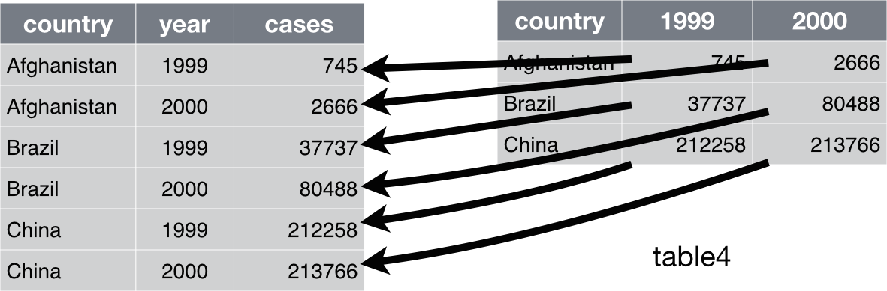
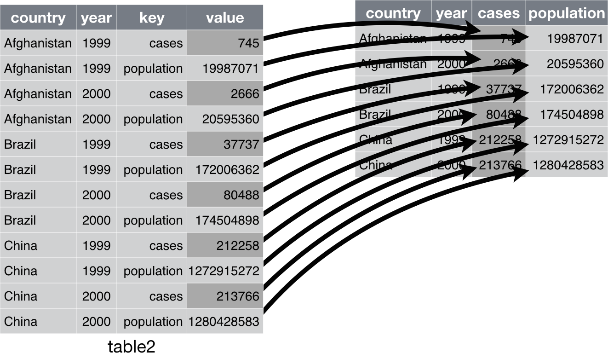
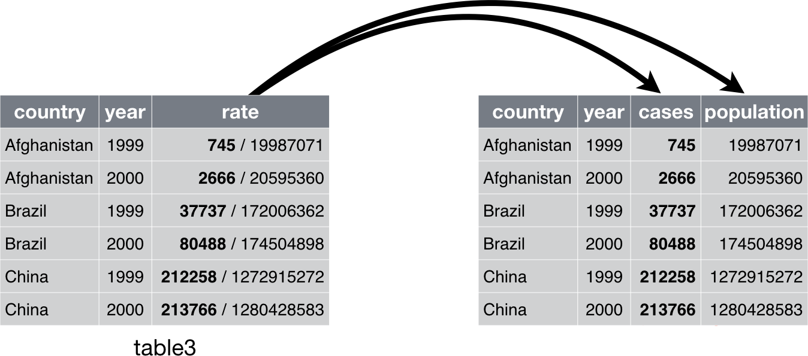
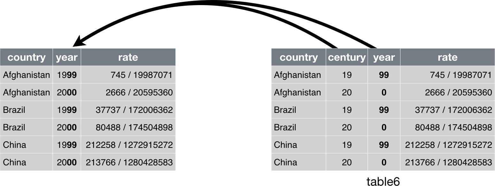

class: content

```{r init-r, include=FALSE}
library(tidyverse)
options(htmltools.dir.version = FALSE)
```

<div class="content-page">
  <p class="content-page-title">目录</p>
  <li class="content-page-list">大神的工具箱</li>
  <li class="content-page-list">数据导入和导出</li>
  <li class="content-page-list">数据转换和规整</li>
</div>

---
class: section, center, middle

# 大神的工具箱

---
class:

# 大神 Hadley Wickham

.pull-left[

]

.pull-right[
## Hadley Wickham

**Chief Scientist** at **RStudio**

Adjunct Professor of Statistics at the University of Auckland, Stanford University, and Rice University

R packages: ggplot2, dplyr, tidyr, stringr, lubridate, readr...

Website: http://hadley.nz
]

---
class:

# 大神的工具箱 Tidyverse


.center[
图片来源：https://www.storybench.org/getting-started-with-tidyverse-in-r/
]

---
class:

# Tibble 数据框

tibble 是一种简单数据框，它对传统数据框 data.frame 的功能进行了一些修改，以便更易于使用。使用 `as_tibble()` 函数可以将数据框转换为 tibble：

```{r}
as_tibble(iris)
```

---
class:

# Tibble 数据框

.pull-left[
可以通过 `tibble()` 函数使用一个向量来创建新 tibble。`tibble()` 会自动重复长度为 1 的输入，并可以使用刚刚创建的新变量：

```{r}
tibble(
  x = 1:3,
  y = 1,
  z = x ^ 2 + y
)
```
]

.pull-right[
`tibble()` 函数的功能要少得多：它不能改变输入的类型（例如，不能将字符串转换为因子）、变量的名称，也不能创建行名称。

可以在 tibble 中使用在 R 中无效的变量名称，要想引用这样的变量，需要使用反引号 `` ` `` 将它们括起来：

```{r}
tibble(
  `:)` = "smile",
  ` ` = "space",
  `2000` = "number"
)
```
]

---
class:

# Tibble 数据框

.pull-left[
tibble 的打印方法进行了优化，只显示前 10 行结果，并且列也是适合屏幕的，这种方式非常适合大数据集。除了打印列名，tibble 还会打印出列的类型，这项非常棒的功能借鉴于 `str()` 函数。

```r
tibble(
  a = lubridate::now() + runif(1e3) * 86400,
  b = lubridate::today() + runif(1e3) * 30,
  c = 1:1e3,
  d = runif(1e3),
  e = sample(letters, 1e3, replace = TRUE)
)
```
]

.pull-right[
```{r echo=F, warning=F}
tibble(
  a = lubridate::now() + runif(1e3) * 86400,
  b = lubridate::today() + runif(1e3) * 30,
  c = 1:1e3,
  d = runif(1e3),
  e = sample(letters, 1e3, replace = TRUE)
)
```
]

---
class:

# 管道操作

.pull-left[
管道是一种强大的工具，可以清楚地表示由多个操作组成的一个操作序列。

一系列的动作最简单的方法是将每个中间步骤保存为一个新对象：

```r
foo_foo <- little_bunny()
foo_foo_1 <- hop(foo_foo, through = forest)
foo_foo_2 <- scoop(foo_foo_1, up = field_mice)
foo_foo_3 <- bop(foo_foo_2, on = head)
```

这种方法的最大缺点是，你必须为每个中间结果建立一个变量。这样会造成两个问题：代码中充斥着大量不必要的变量；你必须在每一行代码中小心翼翼地修改变量后缀。
]

.pull-right[
使用管道，可以表示为：

```r
foo_foo |>
  hop(through = forest) |>
  scoop(up = field_mouse) |>
  bop(on = head)
```

管道的工作原理就是进行“词法变换”。 在这种方式背后， R 会重新组合管道代码，按照重写中间变量的方式来运行。当执行以上示例中的管道操作时，实际上 R 执行的是类似以下的代码：

```r
my_pipe <- function(.) {
  . <- hop(., through = forest)
  . <- scoop(., up = field_mice)
  bop(., on = head)
}
my_pipe(foo_foo)
```
]

---
class:

# 管道操作

.pull-left[
管道不能支持以下两类函数：

- 使用当前环境的函数。例如，`assign()` 函数会在当前环境中使用给定名称创建一个新变量。
- 使用惰性求值的函数。具有这种问题的一个函数是 `tryCatch()`，它可以捕获并处理程序错误。

管道是一种功能强大的工具，但并不是你的唯一选择，也不是“万能药”。管道最大的用武之地是重写一段较短的线性操作序列。

对于以下几种情形，我们认为最好不要使用管道：
]

.pull-right[
- 操作步骤超过 10（参考值）个。 这种情况下，应该使用有意义的变量来保存中间结果。这样会使得调试更加容易，因为你更容易检查中间结果；还可以使得代码更容易理解，因为有意义的变量名称可以帮助别人明白你的代码意图。
- 有多个输入和输出。如果需要处理的不是一个基本对象，而是组合在一起的两个或多个对象，就不要使用管道。
- 操作步骤构成一张具有复杂依赖关系的有向图。管道基本上是一种线性操作，如果使用它来表示复杂的关系，通常会使得代码混乱不清。
]

---
class: section, center, middle

# 数据导入和导出

---
class:

# 数据导入

readr 的多数函数用于将平面文件转换为数据框。

- `read_csv()` 读取逗号分隔文件、`read_csv2()` 读取分号分隔文件（这在用 `,` 表示小数位的国家非常普遍）、`read_tsv()` 读取制表符分隔文件、`read_delim()` 可以读取使用任意分隔符的文件。
- `read_fwf()` 读取固定宽度的文件。既可以使用 `fwf_widths()` 函数按照宽度来设定域，也可以使用 `fwf_positions()` 函数按照位置来设定域。`read_table()` 读取固定宽度文件的一种常用变体，其中使用空白字符来分隔各列。
- `read_log()` 读取 Apache 风格的日志文件（但需要检查是否安装了 [webreadr](https://github.com/Ironholds/webreadr) 包）。

---
class:

# 数据导入

.pull-left[
```r
read_csv(
  file,
  col_names = TRUE,
  col_types = NULL,
  locale = default_locale(),
  na = c("", "NA"),
  quoted_na = TRUE,
  quote = "\"",
  comment = "",
  trim_ws = TRUE,
  skip = 0,
  n_max = Inf,
  guess_max = min(1000, n_max),
  progress = show_progress(),
  skip_empty_rows = TRUE
)
```
]

.pull-right[
| 参数        | 描述                                                    |
| ----------- | ------------------------------------------------------- |
| `file`      | 文件、连接或文本                                        |
| `col_names` | `TRUE` 表示包含列名，`FALSE` 表示不包含列名，或指定列名 |
| `col_types` | 列类型                                                  |
| `na`        | 缺失值字符串表示                                        |
| `quote`     | 引号文本的引号                                          |
| `comment`   | 注释行的起始字符                                        |
| `skip`      | 跳过读取的行数                                          |
]

---
class:

# 数据导入

`read_csv()` 函数的第一个参数是最重要的，该参数是要读取的文件的路径：

```{r}
heights <- read_csv("data/heights.csv")
```

当运行 `read_csv()` 时，它会打印一份数据列说明，给出每个列的名称和类型。

---
class:

# 数据导入

.pull-left[
readr 使用一种启发式过程来确定每列的类型：先读取文件的前 1000 行，然后使用（相对保守的）某种启发式算法确定每列的类型。可以使用字符向量模拟这个过程，先使用 `guess_parser()` 函数返回 readr 最可信的猜测，接着 `parse_guess()` 函数使用这个猜测来解析列：

```{r}
guess_parser("2010-10-01")
guess_parser("15:01")
```
]

.pull-right[
```{r}
guess_parser(c("TRUE", "FALSE"))
guess_parser(c("1", "5", "9"))
guess_parser(c("12,352,561"))
str(parse_guess("2010-10-10"))
```
]

---
class:

# 数据导入

相比于 `read.csv()` 函数，readr 中的函数具有如下优势：

- 一般来说，它们比基础模块中的函数速度更快（约快 10 倍）。因为运行时间很长的任务都会有一个进度条，所以你可以看到哪个函数更快。如果只考虑速度的话，还可以尝试使用 `data.table::fread()` 。这个函数与 tidyverse 的兼容性不是很好，但确实更快一些。
- 它们可以生成 tibble， 并且不会将字符向量转换为因子，不使用行名称，也不会随意改动列名称。这些都是使用 R 基础包时常见的令人沮丧的事情。
- 它们更易于重复使用。 R 基础包中的函数会继承操作系统的功能，并依赖环境变量，因此，可以在你的计算机上正常运行的代码在导入他人计算机时，不一定能正常运行。

---
class:

# 数据导入

要想将其他类型的数据导入 R 中，我们建议首先从下列的 tidyverse 包开始。它们当然远非完美，但确实是一个很好的起点。对矩形数据来说：

- haven 可以读取 SPSS、Stata 和 SAS 文件。
- readxl 可以读取 Excel 文件（.xls 和 .xlsx 均可）。
- 配合专用的数据库后端程序（如 RMySQL、RSQLite、RPostgreSQL等），DBI 可以对相应数据库进行 SQL 查询，并返回一个数据框。

使用 jsonlite（由 JeroenOoms 开发）读取 JSON 串，使用 xml2 读取 XML 文件。Jenny Bryan 在 https://jennybc.github.io/purrr-tutorial/ 中提供了一些非常好的示例。

对于其他的文件类型，可以学习一下 [R 数据导入 / 导出手册](https://cran.r-project.org/doc/manuals/r-release/R-data.html)，以及 [rio 包](https://github.com/leeper/rio)。

---
class:

# 数据导出

.pull-left[
readr 还提供了两个非常有用的函数，用于将数据写回到磁盘：`write_csv()` 和 `write_tsv()`。这两个函数输出的文件能够顺利读取的概率更高，因为：

- 它们总是使用 UTF-8 对字符串进行编码。
- 它们使用 ISO 8601 格式来保存日期和日期时间数据，以便这些数据在何种环境下都更容易解析。

```r
write_csv(challenge, 'challenge.csv')
```

如果想要将 CSV 文件导为 Excel 文件，可以使用 `write_excel_csv()` 函数，该函数会在文件开头写入一个特殊字符（字节顺序标记），告诉 Excel 这个文件使用的是 UTF-8 编码。
]

.pull-right[
`write_rds()` 和 `read_rds()` 函数是对基础函数 `readRDS()` 和 `saveRDS()` 的统一包装。前者可以将数据保存为 R 自定义的二进制格式，称为 RDS 格式。

```r
write_rds(challenge, 'challenge.rds')
read_rds('challenge.rds')
```

feather 包实现了一种快速二进制格式，可以在多个编程语言间共享，feather 要比 RDS 速度更快，而且可以在 R 之外使用。

```r
library(feather)
write_feather(challenge, 'challenge.feather')
read_feather('challenge.feather')
```
]

---
class: section, center, middle

# 数据转换和规整

---
class:

# 数据转换

为了介绍 dplyr 中的基本数据操作，我们需要使用 `nycflights13::flights` 数据集。这个数据框包含了 2013 年从纽约市出发的所有 336776 次航班的信息。该数据来自于美国交通统计局，可以使用 `?flights` 查看其说明文档：

```{r include=F}
options(tibble.print_max = 6, tibble.print_min = 6)
```

```{r}
library(nycflights13)
flights
```

---
class:

# 数据筛选

`filter()` 函数可以基于观测的值筛选出一个观测子集。第一个参数是数据框名称，第二个参数以及随后的参数是用来筛选数据框的表达式。例如，我们可以使用以下代码筛选出 1 月 1 日的所有航班：

```{r}
filter(flights, month == 1, day == 1)
```

---
class:

# 数据筛选

`filter()` 中的多个参数是由“与”组合起来的：每个表达式都必须为真才能让一行观测包含在输出中。如果要实现其他类型的组合，你需要使用布尔运算符： `&` 表示“与”、 `|` 表示“或”、 `!` 表示“非”。下图给出了布尔运算的完整集合。

<br/>

```{r echo=F, fig.align='center', out.width='60%'}
knitr::include_graphics("images/transform-logical.png")
```

---
class:

# 数据排列

`arrange()` 函数的工作方式与 `filter()` 函数非常相似，但前者不是选择行，而是改变行的顺序。它接受一个数据框和一组作为排序依据的列名（或者更复杂的表达式）作为参数。如果列名不只一个，那么就使用后面的列在前面排序的基础上继续排序：

```{r}
arrange(flights, year, month, day)
```

---
class:

# 数据排列

使用 `desc()` 可以按列进行降序排序，缺失值总是排在最后：

```{r}
arrange(flights, desc(dep_delay))
```

---
class:

# 数据选择

如今，数据集有几百甚至几千个变量已经司空见惯。这种情况下，如何找出真正感兴趣的那些变量经常是我们面临的第一个挑战。通过基于变量名的操作，`select()` 函数可以让你快速生成一个有用的变量子集。

.pull-left[
按名称选择列：

```{r}
select(flights, year, month, day)
```
]

.pull-right[
选择“year”和“day”之间的所有列（包括“year”和“day”）：

```{r}
select(flights, year:day)
```
]

---
class:

# 数据选择

选择不在“year”和“day”之间的所有列（不包括“year”和“day”）：

```{r}
select(flights, -(year:day))
```

---
class:

# 数据选择

在 `select()` 函数中还可以使用一些辅助函数。

- `starts_with("abc")` ：匹配以 `abc` 开头的名称。
- `ends_with("xyz")` ：匹配以 `xyz` 结尾的名称。
- `contains("ijk")` ：匹配包含 `ijk` 的名称。
- `matches("(.)\\1")` ：选择匹配正则表达式的那些变量。这个正则表达式会匹配名称中有重复字符的变量。
- `num_range("x", 1:3)` ：匹配 `x1`、`x2` 和 `x3`。

使用 `?select` 命令可以获取更多信息。

---
class:

# 添加新变量

除了选择现有的列，我们还经常需要添加新列，新列是现有列的函数，这就是 `mutate()` 函数的作用。`mutate()` 总是将新列添加在数据集的最后，因此我们需要先创建一个具有更少变量的数据集，以便能够看到新变量。

.grid[
.grid-cell-1of3[
```r
flights_sml <- select(flights,
  year:day,
  ends_with("delay"),
  distance,
  air_time
)

mutate(flights_sml,
  gain = dep_delay - arr_delay,
  speed = distance / air_time * 60
)
```
]

.grid-cell-2of3[
```{r echo=F}
flights_sml <- select(flights,
  year:day,
  ends_with("delay"),
  distance,
  air_time
)

mutate(flights_sml,
  gain = dep_delay - arr_delay,
  speed = distance / air_time * 60
)
```
]
]

---
class:

# 数据分组摘要

.pull-left[
`group_by()` 可以将分析单位从整个数据集更改为单个分组。接下来，在分组后的数据框上使用 dplyr 函数时， 它们会自动地应用到每个分组。

例如，如果对按日期分组的一个数据框应用与上面完全相同的代码，那么我们就可以得到每日平均延误时间：

```r
flights |>
  group_by( year, month, day) |>
  summarise(delay = mean(dep_delay, na.rm = TRUE))
```
]

.pull-right[
```{r echo=F, message=F}
flights |>
  group_by( year, month, day) |>
  summarise(delay = mean(dep_delay, na.rm = TRUE))
```
]

---
class:

# 数据分组摘要

.pull-left[
假设我们想要研究每个目的地的距离和平均延误时间之间的关系，需要如下 3 步：

1. 按照目的地对航班进行分组。
2. 计算距离、平均延误时间和航班数量。
3. 通过筛选除去噪声点和火奴鲁鲁机场，因为到达该机场的距离几乎是到离它最近机场的距离的 2 倍。

```{r message=F}
delays <- flights |>
  group_by(dest) |>
  summarise(
    count = n(),
    dist = mean(distance, na.rm = TRUE),
    delay = mean(arr_delay, na.rm = TRUE)
  ) |>
  filter(count > 20, dest != "HNL")
```
]

.pull-right[
```{r include=F}
p <- ggplot(data = delays, mapping = aes(x = dist, y = delay)) +
  geom_point(aes(size = count), alpha = 1/3) +
  geom_smooth(se = FALSE)
ggsave('generated/dplyr-summarise-delays.png', width = 5, height = 4, dpi = 100)
```


]

---
class:

# 数据分组摘要

聚合操作中包括一个计数 `n()` 或非缺失值的计数 `sum(!is_na())` 是个好主意。这样你就可以检查一下，以确保自己没有基于非常少量的数据作出结论。例如，我们查看一下具有最长平均延误时间的飞机（通过机尾编号进行识别）：

.pull-left[
```{r message=F}
not_cancelled <- flights |>
  filter(!is.na(dep_delay), !is.na(arr_delay))

delays <- not_cancelled |>
  group_by(tailnum) |>
  summarise(
    delay = mean(arr_delay)
  )
```
]

.pull-right[
```{r include=F}
p <- ggplot(data = delays, mapping = aes(x = delay)) +
  geom_freqpoly(binwidth = 10)
ggsave('generated/dplyr-summarise-delays-mean.png', width = 5, height = 3.5, dpi = 100)
```


]

---
class:

# 数据分组摘要

当使用多个变量进行分组时，每次的摘要统计会用掉一个分组变量。这样就可以轻松地对数据集进行循序渐进的分析：

.pull-left[
```{r message=F}
daily <- group_by(flights, year, month, day)
(per_day <- summarize(daily, flights = n()))
```
]

.pull-right[
```{r message=F}
summarise(per_day, flights = sum(flights))
```
]

如果想要取消分组，并回到未分组的数据继续操作，那么可以使用 `ungroup()` 函数。

---
class:

# 数据规整

我们可以通过不同方式表示相同的数据，但并不是所有方式表示的数据都易于使用。构建一个整齐易用的数据有如下 3 条准则：

1. 每个变量必须有自己的一列。
2. 每个观测值必须有自己的一行。
3. 每个值必须有自己的一个单元格。

这 3 条准则如下图所示：

```{r echo=F, fig.align='center', out.width='60%'}
knitr::include_graphics('images/tidyr-column-row-cell.png')
```

---
class:

# 数据重塑

一种常见的问题是数据集中某些列名不是变量名，而是变量值。以 `table4` 为例，列名 `1999` 和 `2000` 为变量年份的值，列 `1999` 和 `2000` 里面的值则为变量 `cases` 的值，每一行代表两个观测值，而非一个。

为了整理这样的数据集，我们需要将有问题的列旋转到一对新的变量中。

<br/>

```{r echo=F, fig.align='center', out.width='80%'}

```

---
class:

# 数据重塑

.pull-left[
为了完成这个操作，我们需要 3 个参数：

1. 那些表示值而非名称列的集合。
2. 这些列的名称的新变量名。
3. 这些列的值的新变量名。

```{r}
table4a
```
]

.pull-right[
```{r}
table4a |>
  pivot_longer(
    c(`1999`, `2000`),
    names_to = "year",
    values_to = "cases")
```
]

---
class:

# 数据重塑

`pivot_wider()` 是 `pivot_longer()` 的反向操作，当观测值分散在多行中时，可以利用它进行处理。

<br/>

```{r echo=F, fig.align='center', out.width='60%'}

```

---
class:

# 数据重塑

.pull-left[
为了完成这个操作，我们需要 2 个参数：

1. 用于获取变量名称的列。
2. 用于获取变量值的列。

```{r}
table2
```
]

.pull-right[
```{r}
table2 |>
    pivot_wider(
      names_from = type,
      values_from = count)
```
]

---
class:

# 数据重塑

`separate()` 可以通过分隔符将一列拆分为多列。

```{r echo=F, fig.align='center', out.width='80%'}

```

---
class:

# 数据重塑

.pull-left[
```{r}
table3
```
]

.pull-right[
```{r}
table3 |>
  separate(
    rate,
    into = c("cases", "population"),
    sep = '/')
```
]

---
class:

# 数据重塑

`unite()` 是 `separate()` 的反向操作，利用它可以将多个列合并成为一列。

```{r echo=F, fig.align='center', out.width='80%'}

```

---
class:

# 数据重塑

.pull-left[
```{r}
table5
```
]

.pull-right[
```{r}
table5 |>
  unite(new, century, year)
```
]

---
class: thanks, center, middle

# 感谢倾听


本作品采用 [**CC BY-NC-SA 4.0**](https://github.com/leovan/data-science-introduction-with-r/blob/main/LICENSE) 授权

版权所有 © [**范叶亮**](https://leovan.me)