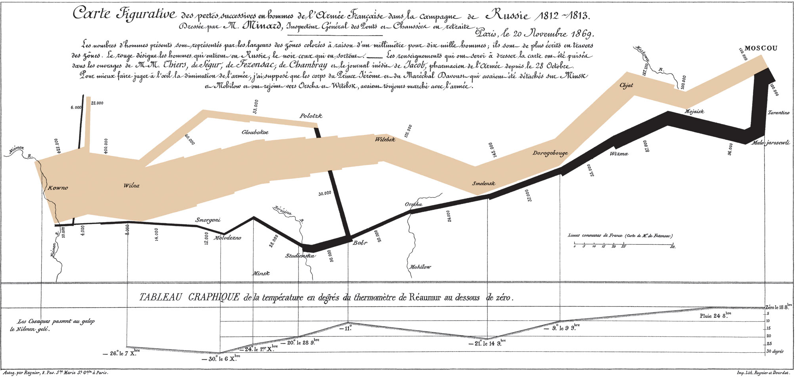
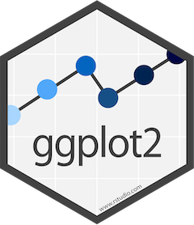
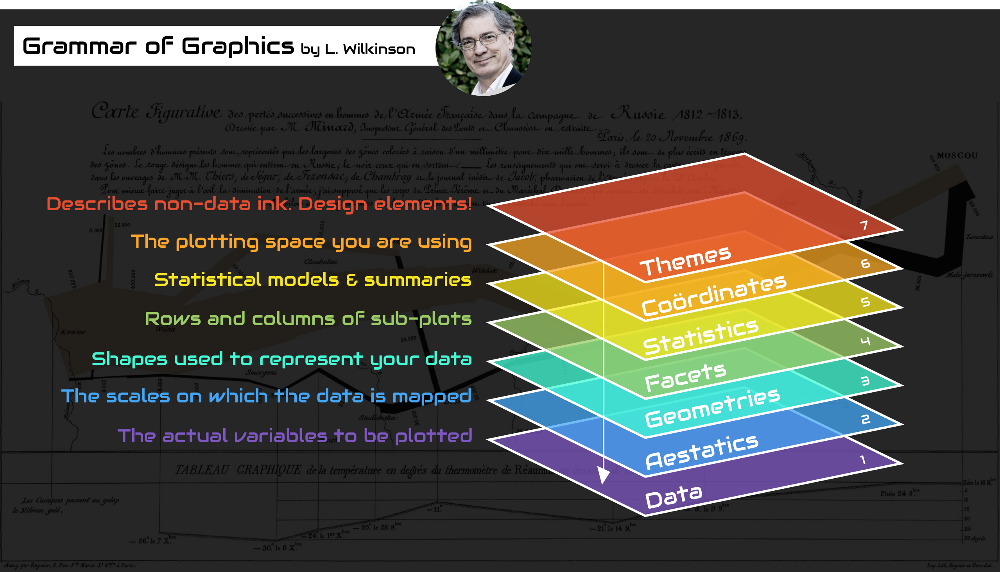
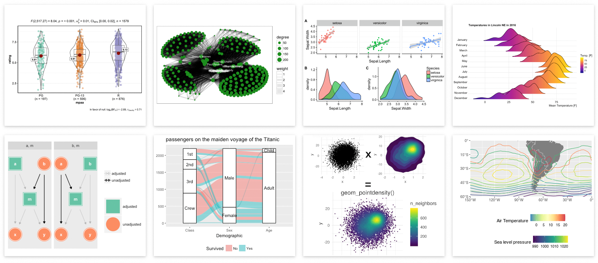
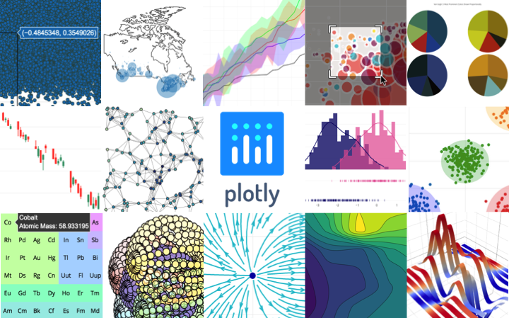
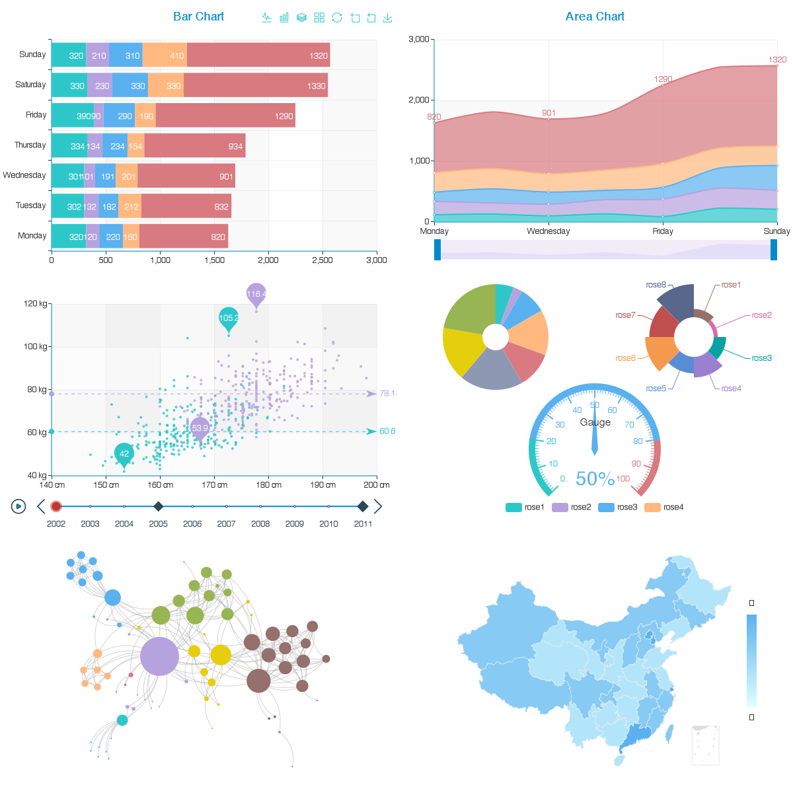

class: content

```{r init-r, include=FALSE}
library(tidyverse)
options(htmltools.dir.version = FALSE)
```

<div class="content-page">
  <p class="content-page-title">目录</p>
  <li class="content-page-list">数据可视化</li>
  <li class="content-page-list">ggplot2</li>
  <li class="content-page-list">基于 Web 的绘图库</li>
</div>

---
class: section, center, middle

# 数据可视化

---
class:

# 数据可视化

**数据可视化（Data Visualization）** <sup>[1]</sup> 被许多学科视为与视觉传达含义相同的现代概念，它涉及到数据的可视化表示的创建和研究，数据可视化既是一门**艺术**也是一门**科学**。

为了清晰有效地传递信息，数据可视化使用统计图形、图表、信息图表和其他工具。可以使用点、线或条对数字数据进行编码，以便在视觉上传达定量信息。 有效的可视化可以帮助用户分析和推理数据和证据。它使复杂的数据更容易理解和使用。用户可能有特定的分析任务（如进行比较或理解因果关系），以及该任务要遵循的图形设计原则。表格通常用于用户查找特定的度量，而各种类型的图表用于显示一个或多个变量的数据中的模式或关系。

数据可视化主要旨在借助于图形化手段，清晰有效地传达与沟通信息。但是，这并不就意味着，数据可视化就一定因为要实现其功能用途而令人感到枯燥乏味，或者是为了看上去绚丽多彩而显得极端复杂。为了有效地传达思想概念，美学形式与功能需要齐头并进，通过直观地传达关键的方面与特征，从而实现对于相当稀疏而又复杂的数据集的深入洞察。然而，设计人员往往并不能很好地把握设计与功能之间的平衡，从而创造出华而不实的数据可视化形式，无法达到其主要目的，也就是传达与沟通信息。

.footnote[
[1] https://zh.wikipedia.org/wiki/数据可视化
]

---
class:

# 数据可视化

.pull-left[.center[
<br/>

### 一图胜千言

### One look is worth a thousand words.

### A picture is worth a thousand words.
]]

.pull-right[.center[

]]

.footnote[
[1] https://zh.wikipedia.org/wiki/一畫勝千言
]

---
class:

# 数据可视化

```{r, echo=F, out.width='80%', fig.align='center'}

```

.center[
法国工程师[查尔斯·约瑟夫·密纳德](https://zh.wikipedia.org/wiki/%E6%9F%A5%E5%B0%94%E6%96%AF%C2%B7%E7%BA%A6%E7%91%9F%E5%A4%AB%C2%B7%E5%AF%86%E7%BA%B3%E5%BE%B7)于 1861 年绘制的关于拿破仑帝国入侵俄罗斯的信息图
]

---
class:

# 数据可视化

```{r, echo=F, out.width='70%', fig.align='center'}

```

.center[
图片来源：https://cloud.baidu.com/product/sugar.html
]

---
class:

# 图形语法

Wilkinson <sup>[1]</sup> 创建了一套用来描述所有统计图形深层特性的语法规则，该语法回答了“什么是统计图形”这一个问题。一张统计图有如下独立的图形部件所组成 <sup>[2]</sup>：

- 最基础的部分是你想要可视化的**数据（data）**以及一系列数据中的变量对应到图形属性的**映射（mapping）**；
- **几何对象（geom）**代表你在图中实际看到的图形元素，如点、线、多边形等；
- **统计变换（stats）**是对数据进行的某种汇总。例如：将数据分组技术以创建直方图，或将一个二维的关系利用线性模型进行解释。统计变换是可选的，但通常非常有用；
- **标度（scale）**的作用是将数据的取值映射到图形空间，例如用颜色，大小或形状来表示不同的取值。展现标度的常见做法是绘制图例和坐标轴，它们实际上是从图形到数据的一个映射，使读者可以从图形中读取原始的数据。
- **坐标系（coord）**描述了数据是如何映射到图形所在的平面的，它同时提供了看图所需的坐标轴和网格线。我们通常使用的是笛卡尔座标系，但也可以将其变换为其他类型，如极坐标和地图投影。
- **分面（facet）**描述了如何将数据分解为各个子集，以及如何对子集作图并联合进行展示。分面可叫做条件作图或网格作图。

.footnote[
[1] Wilkinson, Leland. "The grammar of graphics." _Handbook of Computational Statistics_. Springer, Berlin, Heidelberg, 2012. 375-414.  
[2] Wickham, Hadley. _ggplot2: elegant graphics for data analysis_. Springer, 2016.
]

---
class:

# 图形语法

.grid[
.grid-cell-1of3[
- R 实现  
  [ggplot2](https://ggplot2.tidyverse.org/) 
- Python 实现  
  [plotnine](https://plotnine.readthedocs.io/) 
- JavaScript 实现  
  [AntV | G2](https://g2.antv.vision/) 
]

.grid-cell-2of3[


.center[图片来源：https://medium.com/@TdeBeus]
]
]

---
class: section, center, middle

# ggplot2

---
class:

# ggplot2

.pull-left[
ggplot2 实现了图形语法 ，这是一套用来描述和构建图形的连贯性语法规则。

我们使用第一张图来回答问题：大引擎汽车比小引擎汽车更耗油吗？你可能已经有了答案，但应该努力让答案更精确一些。引擎大小与燃油效率之间是什么关系？是正相关，还是负相关？是线性关系，还是非线性关系？

为了绘制 `mpg` 的图形，运行以下代码将 `displ` 放在 `x` 轴，`hwy` 放在 `y` 轴：

```r
ggplot(data = mpg) +
  geom_point(mapping = aes(x = displ, y = hwy))
```
]

.pull-right[
```{r include=F}
p <- ggplot(data = mpg) +
  geom_point(mapping = aes(x = displ, y = hwy))
ggsave('generated/ggplot2-mgp-displ-hwy.png', width = 5, height = 4, dpi = 100)
```


]

---
class:

# 图形属性映射

.pull-left[
可以向二维散点图中添加第三个变量，比如 `class`，方式是将它映射为**图形属性** 。图形属性是图中对象的可视化属性，其中包括数据点的大小、形状和颜色。通过改变图形属性的值，可以用不同的方式来显示数据点（如下图所示）。因为已经使用“value”这个词来表示数据的值，所以下面使用“level”（水平）这个词来表示图形属性的值。我们来改变一个点的大小、形状和颜色的水平，分别让它变小、变为三角形和变为蓝色。

通过将图中的图形属性映射为数据集中的变量，可以传达出数据的相关信息。例如，可以 将点的颜色映射为变量 class ，从而揭示每辆汽车的类型：
]

.pull-right[
```r
ggplot(data = mpg) + geom_point(
  mapping = aes(x = displ, y = hwy, color = class))
```

```{r include=F}
p <- ggplot(data = mpg) +
  geom_point(mapping = aes(x = displ, y = hwy, color = class))
ggsave('generated/ggplot2-mgp-displ-hwy-color-class.png', width = 5, height = 3.5, dpi = 100)
```


]

---
class:

# 图形属性映射

.pull-left[
要想将图形属性映射为变量， 需要在函数 aes() 中将图形属性名称和变量名称关联起来。ggplot2 会自动为每个变量值分配唯一的图形属性水平（本例中是唯一的颜色），这个过程称为**标度变换**。ggplot2 还会添加一个图例，以表示图形属性水平和变量值之间的对应关系。

对你所使用的每个图形属性来说，函数 `aes()` 都可以将其名称与一个待显示变量关联起来。`aes()` 将图层中使用的每个图形属性映射集合在一起，然后传递给该图层的映射参数。这一语法强调了关于 `x` 和 `y` 的重要信息：数据点的 x 轴位置和 y 轴位置本身就是图形属性，即可以映射为变量来表示数据信息的可视化属性。

还可以手动为几何对象设置图形属性。例如，我们可以让图中的所有点都为蓝色：
]

.pull-right[
```r
ggplot(data = mpg) + geom_point(
  mapping = aes(x = displ, y = hwy), color = "blue")
```

```{r include=F}
p <- ggplot(data = mpg) +
  geom_point(mapping = aes(x = displ, y = hwy), color = "blue")
ggsave('generated/ggplot2-mgp-displ-hwy-color-blue.png', width = 5, height = 3.5, dpi = 100)
```


]

---
class:

# 几何对象

.grid[
.grid-cell-1of3[
```{r include=F}
p <- ggplot(data = mpg) +
  geom_point(mapping = aes(x = displ, y = hwy))
ggsave('generated/ggplot2-mgp-displ-hwy-point.png', width = 5, height = 3, dpi = 100)

p <- ggplot(data = mpg) +
  geom_smooth(mapping = aes(x = displ, y = hwy))
ggsave('generated/ggplot2-mgp-displ-hwy-smooth.png', width = 5, height = 3, dpi = 100)
```


]

.grid-cell-2of3[
两张图有同样的 `x` 变量和 `y` 变量，而且描述的是同样的数据。但这两张图并不一样，它们各自使用不同的可视化对象来表示数据。在 ggplot2 语法中，我们称它们使用了不同的**几何对象**。

几何对象是图中用来表示数据的几何图形对象。我们经常根据图中使用的几何对象类型来描述相应的图。例如，条形图使用了条形几何对象，折线图使用了直线几何对象，箱线图使用了矩形和直线几何对象。散点图打破了这种趋势，它们使用点几何对象。如左面的两 幅图所示，我们可以使用不同的几何对象来表示同样的数据。上侧的图使用了点几何对象，下侧的图使用了平滑曲线几何对象，以一条平滑曲线来拟合数据。

ggplot2 中的每个几何对象函数都有一个 `mapping` 参数。但是，不是每种图形属性都适合每种几何对象。你可以设置点的形状，但不能设置线的“形状”，而可以设置线的线型。
]
]

---
class:

# 几何对象

.pull-left[
```r
# 上图
ggplot(data = mpg) +
  geom_point(mapping = aes(x = displ, y = hwy))

# 下图
ggplot(data = mpg) +
  geom_smooth(mapping = aes(x = displ, y = hwy))
```

要想在同一张图中显示多个几何对象，可以向 `ggplot()` 函数中添加多个几何对象函数：

```r
ggplot(data = mpg) +
  geom_point(mapping = aes(x = displ, y = hwy)) +
  geom_smooth(mapping = aes(x = displ, y = hwy))
```
]

.pull-right[
```{r include=F}
p <- ggplot(data = mpg) +
  geom_point(mapping = aes(x = displ, y = hwy)) +
  geom_smooth(mapping = aes(x = displ, y = hwy))
ggsave('generated/ggplot2-mgp-displ-hwy-point-smooth.png', width = 5, height = 4, dpi = 100)
```


]

---
class:

# 几何对象

.pull-left[
但是，这样代码就产生了一些重复。假如你想将 y 轴上的变量从 `hwy` 改成 `cty` ，那么就要在两个地方修改这个变量，但你或许会漏掉一处。避免这种重复的方法是将一组映射传递给 `ggplot()` 函数。 ggplot2 会将这些映射作为全局映射应用到图中的每个几何对象中。 换句话说，以下代码将绘制出与上面代码同样的图：

```r
ggplot(data = mpg,
       mapping = aes(x = displ, y = hwy)) +
  geom_point() +
  geom_smooth()
```

如果将映射放在几何对象函数中，那么 ggplot2 会将其看作这个图层的局部映射，它将使 用这些映射扩展或覆盖全局映射， 但仅对该图层有效 。这样一来，我们就可以在不同的图 层中显示不同的图形属性：
]

.pull-right[
```r
ggplot(data = mpg,
       mapping = aes(x = displ, y = hwy)) +
  geom_point(mapping = aes(color = class)) +
  geom_smooth()
```

```{r include=F}
p <- ggplot(data = mpg, mapping = aes(x = displ, y = hwy)) +
  geom_point(mapping = aes(color = class)) +
  geom_smooth()
ggsave('generated/ggplot2-mgp-displ-hwy-point-color-class-smooth.png', width = 5, height = 3.5, dpi = 100)
```


]

---
class:

# 几何对象

.pull-left[
同理，你也可以为不同的图层指定不同的数据。下图中的平滑曲线表示的只是 `mpg` 数据集的一个子集，即微型车。`geom_smooth()` 函数中的局部数据参数覆盖了 `ggplot()` 函数中的全局数据参数，当然仅对这个图层有效：

```r
ggplot(data = mpg,
       mapping = aes(x = displ, y = hwy)) +
  geom_point(mapping = aes(color = class)) +
  geom_smooth(data = filter(
    mpg, class == "subcompact"), se = FALSE)
```
]

.pull-right[
```{r include=F}
p <- ggplot(data = mpg, mapping = aes(x = displ, y = hwy)) +
  geom_point(mapping = aes(color = class)) +
  geom_smooth(data = filter(mpg, class == "subcompact"), se = FALSE)
ggsave('generated/ggplot2-mgp-displ-hwy-point-color-class-smooth-subcompact.png', width = 5, height = 3.5, dpi = 100)
```


]

---
class:

# 统计变换

.pull-left[
`geom_bar()` 函数可以绘制的基本条形图，右面的条形图显示了 `diamonds` 数据集中按照 `cut` 变量分组的各种钻石的总数量。

```r
ggplot(data = diamonds) +
  geom_bar(mapping = aes(x = cut))
```

条形图 x 轴显示的是 `cut`，这是 `diamonds` 数据集中的一个变量。y 轴显示的是 `count `，但 `count` 不是 `diamonds` 中的变量。
]

.pull-right[
```{r include=F}
p <- ggplot(data = diamonds) +
  geom_bar(mapping = aes(x = cut))
ggsave('generated/ggplot2-diamonds-bar-cut.png', width = 5, height = 4, dpi = 100)
```


]

---
class:

# 统计变换

绘图时用来计算新数据的算法称为 stat（statistical transformation，统计变换 ）。下图描述了 `geom_bar()` 函数的统计变换过程。

```{r echo=F, fig.align='center', out.width='60%'}
knitr::include_graphics('images/ggplot2-visualization-stat-bar.png')
```

通过查看 `stat` 参数的默认值，你可以知道几何对象函数使用了哪种统计变换。例如，`?geom_bar` 显示出 `stat` 的默认值是 `count`，这说明 `geom_bar()` 使用 `stat_count()` 函数进行统计变换。

---
class:

# 统计变换

.pull-left[
通常来说，几何对象函数和统计变换函数可以互换使用。例如，你可以使用 `stat_count()` 替换 `geom_bar()` 来重新生成前面那张图：

```r
ggplot(data = diamonds) +
  stat_count(mapping = aes(x = cut))
```

可以这样做的原因是，每个几何对象函数都有一个默认统计变换，每个统计变换函数都有一个默认几何对象。一般情况下，这意味着你在使用几何对象函数时不用担心底层的统计变换。想要显式使用某种统计变换的 3 个原因如下。
]

.pull-right[
- 你可能想要覆盖默认的统计变换。
- 你可能想要覆盖从统计变换生成的变量到图形属性的默认映射。
- 你可能想要在代码中强调统计变换。

ggplot2 提供了 20 多个统计变换以供你使用。每个统计变换都是一个函数，因此你可以按 照通用方式获得帮助，例如 `?stat_bin`。如果想要查看全部的统计变换，可以使用 ggplot2 速查表。
]

---
class:

# 位置调整

条形图还有一项神奇的功能，你可以使用 `color` 或者 `fill` 图形属性来为条形图上色：

.pull-left[
```r
ggplot(data = diamonds) +
  geom_bar(mapping = aes(x = cut, colour = cut))
```

```{r include=F}
p <- ggplot(data = diamonds) +
  geom_bar(mapping = aes(x = cut, color = cut))
ggsave('generated/ggplot2-diamonds-bar-color-cut.png', width = 5, height = 3.2, dpi = 100)
```


]

.pull-right[
```r
ggplot(data = diamonds) +
  geom_bar(mapping = aes(x = cut, fill = cut))
```

```{r include=F}
p <- ggplot(data = diamonds) +
  geom_bar(mapping = aes(x = cut, fill = cut))
ggsave('generated/ggplot2-diamonds-bar-fill-cut.png', width = 5, height = 3.2, dpi = 100)
```


]

---
class:

# 位置调整

.pull-left[
如果将 `fill` 图形属性映射到另一个变量（如 `clarity`），那么条形会自动分块堆叠起来。每个彩色矩形表示 `cut` 和 `clarity` 的一种组合。

```r
ggplot(data = diamonds) +
  geom_bar(mapping = aes(x = cut, fill = clarity))
```

这种堆叠是由 `position` 参数设定的 位置调整 功能自动完成的。如果不想生成堆叠式条形图，你还可以使用以下 3 种选项之一："identity" 、"fill" 和 "dodge" 。
]

.pull-right[
```{r include=F}
p <- ggplot(data = diamonds) +
  geom_bar(mapping = aes(x = cut, fill = clarity))
ggsave('generated/ggplot2-diamonds-bar-fill-clarity.png', width = 5, height = 4, dpi = 100)
```


]

---
class:

# 位置调整

.pull-left[
`position = "identity"` 将每个对象直接显示在图中。这种方式不太适合条形图，因为条形会彼此重叠。为了让重叠部分能够显示出来，我们可以设置 `alpha` 参数为一个较小的数，从而使得条形略微透明；或者设定 `fill = NA`，让条形完全透明：

```r
ggplot(data = diamonds,
       mapping = aes(x = cut, fill = clarity)) +
  geom_bar(alpha = 1/5, position = "identity")
```
]

.pull-right[
```{r include=F}
p <- ggplot(data = diamonds, mapping = aes(x = cut, fill = clarity)) +
  geom_bar(alpha = 1/5, position = "identity")
ggsave('generated/ggplot2-diamonds-bar-fill-clarity-position-identity.png', width = 5, height = 4, dpi = 100)
```


]

---
class:

# 位置调整

.pull-left[
`position = "fill"` 的效果与堆叠相似，但每组堆叠条形具有同样的高度，因此这种条形图可以非常轻松地比较各组间的比例：

```r
ggplot(data = diamonds) +
  geom_bar(mapping = aes(x = cut, fill = clarity),
           position = "fill")
```
]

.pull-right[
```{r include=F}
p <- ggplot(data = diamonds) +
  geom_bar(mapping = aes(x = cut, fill = clarity), position = "fill")
ggsave('generated/ggplot2-diamonds-bar-fill-clarity-position-fill.png', width = 5, height = 4, dpi = 100)
```


]

---
class:

# 位置调整

.pull-left[
`position = "dodge"` 将每组中的条形依次并列放置，这样可以非常轻松地比较每个条形表示的具体数值：

```r
ggplot(data = diamonds) +
  geom_bar(mapping = aes(x = cut, fill = clarity),
           position = "dodge")
```
]

.pull-right[
```{r include=F}
p <- ggplot(data = diamonds) +
  geom_bar(mapping = aes(x = cut, fill = clarity), position = "dodge")
ggsave('generated/ggplot2-diamonds-bar-fill-clarity-position-dodge.png', width = 5, height = 4, dpi = 100)
```


]

---
class:

# 坐标系

.grid[
.grid-cell-1of3[
```{r include=F}
p <- ggplot(data = mpg, mapping = aes(x = class, y = hwy)) +
  geom_boxplot()
ggsave('generated/ggplot2-mgp-displ-hwy-box.png', width = 5, height = 3, dpi = 100)

p <- ggplot(data = mpg, mapping = aes(x = class, y = hwy)) +
  geom_boxplot() +
  coord_flip()
ggsave('generated/ggplot2-mgp-displ-hwy-box-coord-flip.png', width = 5, height = 3, dpi = 100)
```


]

.grid-cell-2of3[
坐标系可能是 ggplot2 中最复杂的部分。默认的坐标系是笛卡儿直角坐标系，可以通过其独立作用的 x 坐标和 y 坐标找到每个数据点。偶尔也会用到一些其他类型的坐标系。

`coord_flip()` 函数可以交换 x 轴和 y 轴。当想要绘制水平箱线图时，这非常有用。它也非常适合使用长标签，但要想在 x 轴上不重叠地安排好它们是非常困难的：

```r
ggplot(data = mpg, mapping = aes(x = class, y = hwy)) +
  geom_boxplot()

ggplot(data = mpg, mapping = aes(x = class, y = hwy)) +
  geom_boxplot() +
  coord_flip()
```
]
]

---
class:

# 坐标系

.grid[
.grid-cell-1of3[
```{r include=F}
nz <- map_data("nz")

p <- ggplot(nz, aes(long, lat, group = group)) +
  geom_polygon(fill = "white", colour = "black")
ggsave('generated/ggplot2-nz-long-lat.png', width = 5, height = 3, dpi = 100)

p <- ggplot(nz, aes(long, lat, group = group)) +
  geom_polygon(fill = "white", colour = "black") +
  coord_quickmap()
ggsave('generated/ggplot2-nz-long-lat-coord-quickmap.png', width = 5, height = 3, dpi = 100)
```


]

.grid-cell-2of3[
`coord_quickmap()` 函数可以为地图设置合适的纵横比。当使用 ggplot2 绘制空间数据时，这个函数特别重要：

```r
nz <- map_data("nz")

ggplot(nz, aes(long, lat, group = group)) +
  geom_polygon(fill = "white", colour = "black")

ggplot(nz, aes(long, lat, group = group)) +
  geom_polygon(fill = "white", colour = "black") +
  coord_quickmap()
```
]
]

---
class:

# 坐标系

.grid[
.grid-cell-1of3[
```{r include=F}
bar <- ggplot(data = diamonds) +
  geom_bar(
    mapping = aes(x = cut, fill = cut),
    show.legend = FALSE,
    width = 1
  ) +
  theme(aspect.ratio = 1) +
  labs(x = NULL, y = NULL)

p <- bar + coord_flip()
ggsave('generated/ggplot2-diamonds-bar-cut-coord-flip.png', width = 5, height = 3, dpi = 100)

p <- bar + coord_polar()
ggsave('generated/ggplot2-diamonds-bar-cut-coord-polar.png', width = 5, height = 3, dpi = 100)
```


]

.grid-cell-2of3[
`coord_polar()` 函数使用极坐标系。极坐标系可以揭示出条形图和鸡冠花图间的一种有趣联系：

```r
bar <- ggplot(data = diamonds) +
  geom_bar(
    mapping = aes(x = cut, fill = cut),
    show.legend = FALSE,
    width = 1
  ) +
  theme(aspect.ratio = 1) +
  labs(x = NULL, y = NULL)

bar + coord_flip()

bar + coord_polar()
```
]
]

---
class:

# 分面

.pull-left[
添加额外变量的一种方法是使用图形属性。另一种方法是将图分割成多个**分面**，即可以显示数据子集的子图。这种方法特别适合添加分类变量。

要想通过单个变量对图进行分面，可以使用函数 `facet_wrap()` 。其第一个参数是一个公式，创建公式的方式是在 `~` 符号后面加一个变量名（这里所说的“公式”是 R 中的一种数据结构，不是数学意义上的公式）。传递给 `facet_wrap()` 的变量应该是离散型的。

```r
ggplot(data = mpg) +
  geom_point(mapping = aes(x = displ, y = hwy)) +
  facet_wrap(~ class, nrow = 2)
```
]

.pull-right[
```{r include=F}
p <- ggplot(data = mpg) +
  geom_point(mapping = aes(x = displ, y = hwy)) +
  facet_wrap(~ class, nrow = 2)
ggsave('generated/ggplot2-mpg-displ-hwy-point-facet-wrap-class.png', width = 5, height = 4, dpi = 100)
```


]

---
class:

# 分面

.pull-left[
要想通过两个变量对图进行分面，需要在绘图命令中加入函数 `facet_grid()` 第一个参数也是一个公式，但该公式包含由 `~` 隔开的两个变量名。

```r
ggplot(data = mpg) +
  geom_point(mapping = aes(x = displ, y = hwy)) +
  facet_grid(drv ~ cyl)
```
]

.pull-right[
```{r include=F}
p <- ggplot(data = mpg) +
  geom_point(mapping = aes(x = displ, y = hwy)) +
  facet_grid(drv ~ cyl)
ggsave('generated/ggplot2-mpg-displ-hwy-point-facet-grid-drv-cyl.png', width = 5, height = 4, dpi = 100)
```


]

---
class:

# ggplot2 扩展

```{r echo=F, fig.align='center', out.width='90%'}

```

.center[
ggplot2 扩展: https://exts.ggplot2.tidyverse.org/
]

---
class: section, center, middle

# 基于 Web 的绘图库

---
class:

# Plotly

.pull-left[
Plotly 的 R 库（plotly）<sup>[1]</sup> 是一个开源的交互式绘图库，它支持 40 多种不同类型的图表，涵盖了统计、金融、地理、科学和 3 维等多种用例。

plotly 建立在 Plotly JavaScript 库的基础之上，这使得 R 用户可以构建精美的交互式可视化，这些可视化效果可以显示在 Jupyter Notebook，保存至独立的 HTML 文件，或者使用 R 构建的 Web 应用中。
]

.pull-right[.center[
```{r, echo=F, out.width="30%"}

```

```{r, echo=F, out.width="100%"}

```
]]

.footnote[
[1] 官网：https://plotly.com/r/  
[2] Cheatsheet：https://images.plot.ly/plotly-documentation/images/r_cheat_sheet.pdf
]

---
class:

# Echarts & echarts4r

.pull-left[
ECharts <sup>[1]</sup> 是一个使用 JavaScript 实现的开源可视化库，可以流畅的运行在 PC 和移动设备上，兼容当前绝大部分浏览器（IE8/9/10/11，Chrome，Firefox，Safari 等），底层依赖矢量图形库 ZRender，提供直观，交互丰富，可高度个性化定制的数据可视化图表。

ECharts 提供了常规的折线图、柱状图、散点图、饼图、K 线图，用于统计的盒形图，用于地理数据可视化的地图、热力图、线图，用于关系数据可视化的关系图、treemap、旭日图，多维数据可视化的平行坐标，还有用于 BI 的漏斗图，仪表盘，并且支持图与图之间的混搭。

echarts4r <sup>[2]</sup> 是 Echarts 的 R 绑定。
]

.pull-right[.center[
```{r, echo=F, out.width="30%"}

```

```{r, echo=F, out.width="80%"}

```
]]

.footnote[
[1] Echarts 官网：https://echarts.apache.org/  
[2] echarts4r 官网：https://echarts4r.john-coene.com/
]

---
class: thanks, center, middle

# Thanks


本作品采用 [**CC BY-NC-SA 4.0**](https://creativecommons.org/licenses/by-nc-sa/4.0/) 进行许可

Copyright © [**范叶亮 | Leo Van**](https://leovan.me), All Rights Reserved.