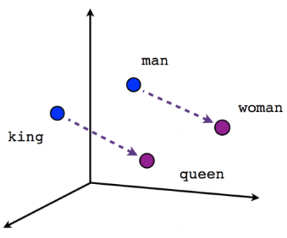

class: content

```{r init-r, include=FALSE}
library(tidyverse)
library(caret)
library(mice)
library(VIM)
library(ROSE)
options(htmltools.dir.version = FALSE)
```

<div class="content-page">
  <p class="content-page-title">目录</p>
  <li class="content-page-list">数据预处理</li>
  <li class="content-page-list">特征变换和编码</li>
  <li class="content-page-list">特征提取，选择和监控</li>
</div>

---
class:

# 特征工程

在现实生活中，所有的事物都具有多种多样的属性（Attribute），例如：对于一个“人”，有性别，年龄，身高，体重等属性。在数据科学中，我们将一个所考察的对象的属性集合称之为特征（Feature）或特征集。特征工程（Feature Engineering）顾名思义是对特征进行一系列加工操作的过程，对于特征工程有多种不同的定义：

1. 特征工程是利用对数据的业务理解构建适合特定机器学习算法的特征的过程 <sup>[1]</sup>。
2. 特征工程是将原始数据转换成特征的过程。这些特征能够更好的将根本问题表达表述成预测模型，同时利用不可直接观测的数据提高模型准确性 <sup>[2]</sup>。
3. 特征工程就是人工设计模型的输入变量 $x$ 的过程 <sup>[3]</sup>。

.footnote[
[1] Wikipedia, “Feature engineering.” https://en.wikipedia.org/wiki/Feature_engineering  
[2] Brownlee, “Discover feature engineering, how to engineer features and how to get good at it.” http://machinelearningmastery.com/discover-feature-engineering-how-to-engineer-features-and-how-to-get-good-at-it/  
[3] T. Malisiewicz, “What is feature engineering?.” https://www.quora.com/What-is-feature-engineering
]

---
class:

# 特征工程

从数据挖掘过程的角度，对“传统的”特征工程给出如下定义。特征工程就是指从原始数据（即通过现实生活中的实际业务发生产生的数据）加工得到最终用于特定的挖掘算法的输入变量的过程。此处之所以强调是“传统的”特征工程主要是用于区分其和近期基于深度学习等方法的自动特征生成。因此，据此本书将特征工程划分为如下几个阶段：

.pull-left[
- ### 数据预处理
- ### 特征变换和编码
]

.pull-right[
- ### 特征提取和选择
- ### 特征监控
]

---
class: section, center, middle

# 数据预处理

---
class:

# 数据清洗

.pull-left[
在实际的项目中，数据从生产和收集过程中往往由于机器或人的问题导致脏数据的生成，这些脏数据包括缺失，噪声，不一致等等一系列问题数据。脏数据的产生是不可避免的，但在后期的建模分析过程中，如果直接使用原始数据进行建模分析，则得到的结果会受到脏数据的影响从而表现很差。

.center[
### Data Cleaning -> Data Laundering ->
### Data Scrubbing -> Data Massaging
]
]

.pull-right[.center[

]]

.footnote[
[1] 图片来源：https://xkcd.com/1838/
]

---
class:

# 缺失值处理

缺失值是指数据中未被记录的特征值，在 R 语言中用 `NA` 表示。在机器学习模型中比不是所有的方法都接受包含缺失值的数据用于建模分析，因此，在分析建模前我们需要对数据中的缺失值进行处理。

最简单的检查数据缺失值的方法是利用 `summary()` 函数对数据进行探索性分析，例如：对 `airquality` 数据集进行缺失值检测，该数据集统计了 1973 年 5 月到 9 月之间纽约每天的空气质量，包括臭氧（Ozone），日照（Solar.R），风力（Wind）和温度（Temp）。

```{r}
summary(airquality[, 1:4])
```

---
class:

# 缺失值处理

对于数据缺失的情况，Rubin <sup>[1]</sup> 从缺失机制的角度分为 3 类：完全随机缺失（missing completely at random，MCAR），随机缺失（missing at random）和非随机缺失（missing not at random，MNAR）。在 Missing Data <sup>[2]</sup> 中定义有，对于一个数据集，变量 $Y$ 存在数据缺失，如果 $Y$ 的缺失不依赖于 $Y$ 和数据集中其他的变量，称之为 MCAR。如果在控制其他变量的前提下，变量 $Y$ 不依赖于 $Y$ 本身，称之为 MAR，即：

$$P \left(Y_{missing} | Y, X\right) = P \left(Y_{missing} | X\right)$$

如果上式不满足，则称之为 MNAR。例如：在一次人口调研中，我们分别收集了用户的年龄和收入信息，收入信息中存在缺失值，如果收入的缺失值仅依赖于年龄，则缺失值的类型为 MAR，如果收入的缺失值依赖于收入本身，则缺失值的类型为 MNAR。通过进一步分析，我们得到高收入者和低收入者在收入上的缺失率更高，因此收入的缺失类型属于 MNAR。

.footnote[
[1] Rubin, Donald B. "Inference and missing data." _Biometrika_ 63.3 (1976): 581-592.  
[2] Allison, Paul D. _Missing data_. Vol. 136. Sage publications, 2001.
]

---
class:

# 缺失值处理

.pull-left[
在对缺失值进行处理之前，我们需要对缺失值有一个更加详细的了解，在 R 中 mice 扩展包的 `md.pattern()` 函数提供了一个探索缺失值模式的方法。

`md.pattern()` 函数将数据中所有的缺失情况进行了汇总，在汇总的结果中，0 表示缺失值，1 表示非缺失值，每一行都是一个缺失模式。每一行的第一个数字表示该缺失模式下样本的数量，最后一个数字表示该缺失模式下缺失变量的个数，例如第二行表示仅 Ozone 缺失的样本共有 35 个。最后一行统计了每个变量出现缺失的次数。
]

.pull-right[
```{r}
md.pattern(airquality, plot = FALSE)
```
]

---
class:

# 缺失值处理

VIM 扩展包还提供了可视化分析缺失值的方法，首先是 `aggr()`：

```{r fig.height=3.5, fig.width=14}
aggr(airquality, prop = F, numbers = T)
```

左边的柱状图表示每个变量出现缺失值的次数或占比，右边由颜色块组成的矩阵，每一行表示一种缺失模式，右侧的数字表示该缺失模式出现的次数。

---
class:

# 缺失值处理

.pull-left[
```{r fig.height=3.5, fig.width=7, results='hide'}
matrixplot(airquality)
```
]

.pull-right[
```{r fig.height=3.5, fig.width=7}
marginplot(tao[, c('Air.Temp', 'Humidity')])
```
]

VIM 还提供了一种可视化分析两个变量间缺失值关系的方法 `marginplot()`。左下角的 3 个数字分别表示两个变量缺失的数量以及同时缺失的数量。对于两组箱线图，外侧（左和下侧）的表示另一个变量缺失的情况下，该变量的箱线图，内侧（右和上侧）的表示该变量的整体箱线图。右上的为两个变量的散点图。如果一个变量的缺失属于完全随机缺失的话，则每组箱线图中的两个箱线图应该有较高的相似度。

---
class:

# 缺失值处理

.pull-left[
**删除法**

删除法就是删除包含缺失值的数据（样本），但是这种方法仅在完全随机缺失的情况下是有效的。因此在进行删除前我们需要考虑样本的数量以及删除包含缺失值的样本是否会导致偏差的出现。

- `na.fail`：仅当数据中不存在缺失值是返回对象，否则产生错误
- `na.omit`：返回剔除缺失值的对象
- `na.exclude`：同 `na.omit`，但残差和预测值同样本保持长度一致
- `na.pass`：不做任何处理，直接返回
]

.pull-right[
**插补法**

插补法是删除缺失值占比较高的特征，在删除特征我们还需要权衡其对预测结果的重要性。如果该特征对最终的预测结果影响较小，则我们可以直接删除该特征；相反如果该特征对预测结果影响较大，直接删除会对模型造成较大的影响，此时我们需要利用其它的方法对该特征的缺失值进行填补。

其中最简单的方式是利用均值，中位数或众数等统计量对其进行简单插补。这种插补方法是建立在完全随机缺失的前提假设下，同时会造成变量方差变小。
]

---
class:

# 删除重复值

去重处理是指对于数据中重复的部分进行删除操作，对于一个数据集，我们可以从“样本”和“特征”两个角度去考虑重复的问题。

- 样本去重

从“样本”的角度，相同的事件或样本（即所有特征的值均一致）重复出现是可能发生的。但从业务理解的角度上考虑，并不是所有的情况都允许出现重复样本，例如：我们考察一个班级的学生其平时表现和最终考试成绩之间的相关性时，假设利用学号作为学生的唯一标识，则不可能存在两个学号完全相同的学生。则这种情况下我们就需要对于重复的“样本”做出取舍。

---
class:

# 删除重复值

对于如下学生属性的数据框，我们分别以“id”或“id”和“gender”两种不同唯一性判断标准对数据框进行重复值判断：

```{r}
students <- data.frame(
	id = c(1, 2, 3, 3, 4, 4),
	gender = c('F', 'M', 'F', 'F', 'M', 'F')
)
print(dim(students))
print(length(unique(students[, c('id')])))
print(dim(unique(students[, c('id', 'gender')])))
```

---
class:

# 删除重复值

- 特征去重

从“特征”的角度，不同的特征在数值上有差异，但其背后表达的物理含义可能是相同的。例如：一个人的月均收入和年收入两个特征，尽管在数值上不同，但其表达的都是一个人在一年内的收入能力，两个特征仅相差常数倍。因此，对于仅相差常数倍的特征需要进行去重处理，保留任意一个特征即可。

.pull-left[
- 常量特征剔除

对于常量或方差近似为零的特征，其对于样本之间的区分度贡献为零或近似为零，这些特征对于后面的建模分析没有任何意义。对于常量特征，我们可以通过如下方法进行识别：
]

.pull-right[
```{r}
students <- data.frame(
    id = c(1, 2, 3),
    gender = c('F', 'M', 'M'),
    grade = c(6, 6, 6),
    height = c(1.7, 1.81, 1.75)
)
sapply(students, function(x) length(unique(x)))
```
]

---
class:

# 删除重复值

对于识别方差近似为零的特征，我们可以利用 caret 扩展包中的 `nearZeroVar()` 函数，函数定义如下：

```{r eval=F}
nearZeroVar(x, freqCut = 95/5, uniqueCut = 10, saveMetrics = FALSE, names = FALSE, foreach = FALSE,
            allowParallel = TRUE)
```

| 参数          | 说明                                                    | 默认值  |
| :------------ | :------------------------------------------------------ | :------ |
| `x`           | 向量，矩阵或数据框                                      |         |
| `freqCut`     | 最高频次和次高频次样本数的截断比例                      | 95/5    |
| `uniqueCut`   | 非重复的样本占总体样本的截断百分比                      | 10      |
| `saveMetrics` | `FALSE` 则返回常量和近似常量的列；`TRUE` 则返回更过信息 | `FALSE` |
| `names`       | `FALSE` 则返回列号；`TRUE` 则返回列名                   | `FLASE` |

---
class:

# 删除重复值

我们利用 `nearZeroVar()` 函数对上文中的学生的各个特征进行常量和方差近似为零的常量特征检查：

```{r}
nearZeroVar(students)
nearZeroVar(students, saveMetrics = T)
```

其中，freqRatio 为最高频次和次高频次样本数的比例，percentUnique 为非重复的样本占总体样本的百分比，zeroVar 表示是否是常量，nzv 表示是否是方差近似为零的特征。

---
class:

# 异常值处理

异常值是指样本中存在的同样本整体差异较大的数据，异常数据可以划分为两类：

1. 异常值不属于该总体，而是从另一个总体错误抽样到样本中而导致的较大差异。
2. 异常值属于该总体，是由于总体所固有的变异性而导致的较大差异。

对于数值型的单变量，我们可以利用拉依达准则对其异常值进行检测。假设总体 $x$ 服从正态分布，则：

$$P\left(|x - \mu| > 3 \sigma\right) \leq 0.003$$

其中 $\mu$ 表示总体的期望，
$\sigma$ 表示总体的标准差。因此，对于样本中出现大于 $\mu + 3\sigma$ 或小于 $\mu - 3\sigma$ 的数据的概率是非常小的，从而可以对大于 $\mu + 3\sigma$ 和小于 $\mu - 3\sigma$ 的数据予以剔除。

---
class:

# 异常值检测

**异常检测（Anomaly Detection）**是指对不符合预期模式或数据集中异常项目、事件或观测值的识别。通常异常的样本可能会导致银行欺诈、结构缺陷、医疗问题、文本错误等不同类型的问题。异常也被称为离群值、噪声、偏差和例外。

.pull-left[
```{r, echo=F, out.width='80%', fig.align='center'}

```
]

.pull-right[
<br/>

```{r, echo=F, out.width='80%', fig.align='center'}

```
]

---
class:

# 异常检测

.pull-left[
异常检测技术用于各种领域，如入侵检测、欺诈检测、故障检测、系统健康监测、传感器网络事件检测和生态系统干扰检测等。它通常用于在预处理中删除从数据集的异常数据。在监督式学习中，去除异常数据的数据集往往会在统计上显著提升准确性。

常用的异常检测算法有：

- 基于密度的方法：最近邻居法、局部异常因子等
- One-Class SVM
- 基于聚类的方法
- Isolation Forest
- AutoEncoder
]

.pull-right[
```{r, echo=F, out.width='75%', fig.align='center'}

```
]

.footnote[
[1] 图片来源：https://scikit-learn.org/stable/modules/outlier_detection.html
]

---
class:

# 异常检测

箱线图（Boxplot），是利用数据中的五个统计量：最小值、第一四分位数、中位数、第三四分位数与最大值来描述数据的一种方法，它也可以粗略地看出数据是否具有有对称性，分布的分散程度等信息。

```{r, echo=F, out.width='60%', fig.align='center'}

```

$$\begin{split}
LowerLimit &= \max \{Q_1 - 1.5 * IQR, Minimum\} \\
UpperLimit &= \min \{Q_3 + 1.5 * IQR, Maximum\} \\
IQR &= Q_3 - Q_1
\end{split}$$

---
class:

# 异常检测

Isolation Forest，Isolation 意为孤立、隔离，是名词，Forest 是森林，合起来就是“孤立森林”了，也有叫“独异森林”，并没有统一的中文叫法，大家更习惯用其英文的名字 isolation forest，简称 iForest <sup>[1, 2]</sup>。

iForest 算法用于挖掘异常数据，或者说离群点挖掘，总之是在一大堆数据中，找出与其它数据的规律不太符合的数据。通常用于网络安全中的攻击检测和流量异常等分析，金融机构则用于挖掘出欺诈行为。对于找出的异常数据，然后要么直接清除异常数据，如数据清理中的去除噪声数据，要么深入分析异常数据，比如分析攻击、欺诈的行为特征。

.footnote[
[1] Liu, Fei Tony, Kai Ming Ting, and Zhi-Hua Zhou. "Isolation forest." _2008 Eighth IEEE International Conference on Data Mining_. IEEE, 2008.  
[2] Liu, Fei Tony, Kai Ming Ting, and Zhi-Hua Zhou. "Isolation-based anomaly detection." _ACM Transactions on Knowledge Discovery from Data (TKDD)_ 6.1 (2012): 1-39.
]

---
class:

# 异常检测

iForest 属于非监督学习的方法，假设我们用一个随机超平面来切割数据空间，切一次可以生成两个子空间。之后我们再继续用一个随机超平面来切割每个子空间，循环下去，直到每子空间里面只有一个数据点为止。iForest 由 $t$ 个 iTree（Isolation Tree）孤立树组成，每个 iTree 是一个二叉树结构，其实现步骤如下：

1. 从训练集中随机选择 $\phi$ 个点样本点，放入树的根节点。
2. 随机指定一个特征，在当前节点数据中随机产生一个切割点 $p$，切割点产生于当前节点数据中指定维度的最大值和最小值之间。
3. 以此切割点生成了一个超平面，将当前数据空间划分为 2 个子空间：小于 $p$ 的数据作为当前节点的左孩子，大于等于 $p$ 的数据作为当前节点的右孩子。
4. 在孩子节点中递归步骤 2 和 3，不断构造新的孩子节点，直到孩子节点只有一个数据或孩子节点已到达限定高度。

获得 $t$ 个 iTree 之后，iForest 训练就结束，然后我们可以用生成的 iForest 来评估测试数据了。对于一个训练数据 $x$，我们令其遍历每一棵 iTree，然后计算 $x$ 最终落在每个树第几层。然后我们可以得出 $x$ 在每棵树的高度平均值。获得每个测试数据的平均深度后，我们可以设置一个阈值，其平均深度小于此阈值的即为异常。

---
class:

# 异常检测

.pull-left[
```{r eval=F}
remotes::install_github('Zelazny7/isofor')

library(isofor)

x <- c(rnorm(1000, 0, 0.5),
       rnorm(1000 * 0.05, -1.5, 1))
y <- c(rnorm(1000, 0, 0.5),
       rnorm(1000 * 0.05,  1.5, 1))
data <- data.frame(x, y)

if_model <- iForest(data, 100, 32)
p <- predict(if_model, data)
ol <- c(rep(0, 1000), rep(1, (0.05 * 1000))) + 2
col <- ifelse(p > quantile(p, 0.95), 'red', 'blue')

plot(x, y, col=col, pch=ol)
```
]

.pull-right[
```{r echo=F, warning=F, message=F, fig.width=7, fig.height=6}
library(isofor)

x <- c(rnorm(1000, 0, 0.5),
       rnorm(1000 * 0.05, -1.5, 1))
y <- c(rnorm(1000, 0, 0.5),
       rnorm(1000 * 0.05,  1.5, 1))
data <- data.frame(x, y)

if_model <- iForest(data, 100, 32)
p <- predict(if_model, data)
ol <- c(rep(0, 1000),
  rep(1, (0.05 * 1000))) + 2
col <- ifelse(p > quantile(p, 0.95),
  'red', 'blue')

plot(x, y, col = col, pch = ol, cex.axis = 2, cex.lab = 2, cex = 1.5)
```
]

---
class:

# 数据采样

**简单随机抽样**：从总体 N 个单位中随机地抽取 n 个单位作为样本，使得每一个容量为样本都有相同的概率被抽中。特点是：每个样本单位被抽中的概率相等，样本的每个单位完全独立，彼此间无一定的关联性和排斥性。

```{r}
x <- 1:10
sample(x, 5, replace = F)
sample(x, 5, replace = T)
dplyr::sample_n(as.data.frame(x), 5, replace = F)$x
```

---
class:

# 数据采样

**分层抽样**：将抽样单位按某种特征或某种规则划分为不同的层，然后从不同的层中独立、随机地抽取样本。从而保证样本的结构与总体的结构比较相近，从而提高估计的精度。

.pull-left[
```{r}
iris_ <- iris[c(1:50, 51:60, 101:130), ]
ct <- table(iris_$Species)
print(ct)
n <- round(as.numeric(ct) * 0.8)
s_i <- sampling::strata(iris_,
    stratanames = 'Species',
    size = n, method = 'srswor')
```
]

.pull-right[
```{r}
head(s_i, 3)
s <- iris_[s_i$ID_unit, ]
table(s$Species)
```
]

---
class:

# 数据采样

**欠采样和过采样**：在处理有监督的学习问题的时候，我们经常会碰到不同分类的样本比例相差较大的问题，这种问题会对我们构建模型造成很大的影响，因此从数据角度出发，我们可以利用欠采样或过采样处理这种现象。

.pull-left[
```{r}
library(ROSE)
data(hacide)
table(hacide.train$cls)
us <- ovun.sample(cls ~ ., data = hacide.train,
    method = 'under', N = 400, seed = 112358)
```
]

.pull-right[
```{r}
table(us$data$cls)
os <- ovun.sample(cls ~ ., data = hacide.train,
    method = 'over', N = 1200, seed = 112358)
table(os$data$cls)
```
]

---
class:

# 数据集分割

.pull-left[
将数据分割为训练集和测试集的目的是要确保机器学习算法可以从中获得有用价值的信息。因此没必要将太多信息分配给测试集。然而，测试集越小，泛化误差的估计就越不准确。将数据集分割为训练集和测试集就是对两者的平衡。

在实践中，最常用的分割比例为 60:40，70:30，80:20，具体取决于数据集的规模，对于大数据集分割比例为 90:10 或 99:1 也是常见和适当的做法。

一般的做法是在模型训练和评估后保留测试数据，然后在整个数据集上再进行训练，以提高模型的性能。虽然通常推荐这种做法，但它可能会导致较差的泛化性能。
]

.pull-right[
```{r}
library(caret)

iris_split <- createDataPartition(
  y = iris$Species, p = 0.8, list = FALSE)

train_data <- iris[iris_split, ]
table(train_data$Species)

test_data <- iris[-iris_split, ]
table(test_data$Species)
```
]

---
class: section, center, middle

# 特征变换和编码

---
class:

# 无量纲化

**归一化**一般是指将数据的取值范围缩放到 $\left[0, 1\right]$ 之间，当然部分问题也可能会缩放到 $\left[-1, 1\right]$ 之间。针对一般的情况，归一化的结果可以表示为：

$$x' = \dfrac{x - x_{\min}}{x_{\max} - x_{\min}}$$

其中，
$x_{\min}$ 表示 $x$ 中的最小值，
$x_{\max}$ 表示 $x$ 中的最大值。

通过归一化，我们可以消除不同量纲下的数据对最终结果的影响。例如，我们通过身高（单位：米）和体重（单位：公斤）来衡量两个人之间的差异，两个人的的体重相差 20 公斤，身高相差 0.1 米，因此在这样的量纲下衡量这两个人的差异时，体重的差异会把身高的差异遮盖掉，但这往往不是我们想要的结果。但通例如我们假设体重的最小值和最大值分别为 0 和 200 公斤，身高的最小值和最大值分别为 0 和 2 米，因此归一化后体重和身高的差距变为 0.1 和 0.05，因此通过归一下则可以避免这样的问题的出现。

---
class:

# 无量纲化

.pull-left[
```{r}
normalize <- function(x) {
    # 计算极值
    x_min <- min(x)
    x_max <- max(x)

    # 归一化
    x_n <- (x - x_min) /
        (x_max - x_min)

    # 将极值作为结果的属性
    attr(x_n, 'min') <- x_min
    attr(x_n, 'max') <- x_max

    # 返回归一化后结果
    x_n
}
```
]

.pull-right[
```{r}
sample <- c(1, 2, 3, 4, 5, 6)

print(sample)

sample_n <- normalize(sample)

print(sample_n)
```
]

---
class:

# 无量纲化

.pull-left[
标准化的目的是为了让数据的均值为 0，标准差为 1，标准化还称为 Z-score，标准化的结果可以表示为：

$$x' = \dfrac{x - \bar{X}}{S}$$

其中，
$\bar{X}$ 为 $x$ 的均值，
$S$ 为 $x$ 的标准差。

在 R 中可以利用 `scale()` 函数进行标准化。其中，参数 `center` 表示是否中心化数据，即是否减去数据的均值；参数 `scale` 表示是否标准化，即是否除以数据的标准差。
]

.pull-right[
```{r}
sample <- c(1, 2, 3, 4, 5, 6)
sample_c <- scale(sample, center = T, scale = T)
print(sample_c)
```
]

---
class:

# 无量纲化

.grid[
.grid-cell-2of3[
通过标准化得到的新的数据均值为 0 和标准差为 1 的新特征，这些新特征在后续处理中会有很多好处。例如：我们将标准差统一到 1，从信息论角度，方差可以表示其中蕴含的信息量越大，信息量越大对模型的影响就也大，因此我们将其标准化到 1，这样就消除了最开始不同变量具有不同的影响程度的差异。

除此之外，去量纲化在利用梯度下降等方法求最优解的时候也具有重要的作用。在利用梯度下降等方法求最优解的时候，每次我们都会朝着梯度下降的最大方向迈出一步，但当数据未经过去量纲化的原始数据时，每次求解得到的梯度方向可能和真实的误差最小的方向差异较大，这样就会可能导致收敛的速度很慢甚至无法收敛。而通过去量纲化后的数据，其目标函数会变得更“圆”，此时每一步梯度的方向和真实误差最小的方向的偏差就会比较小，模型就可以很快收敛到误差最小的地方。
]

.grid-cell-1of6[
<br/><br/><br/>

]

.grid-cell-1of6[
<br/><br/><br/><br/><br/><br/>

]
]

---
class:

# 分箱

.pull-left[
分箱是一种数据预处理技术，用于减少次要观察误差的影响，是一种将多个连续值分组为较少数量的“分箱”的方法。分箱的一些优势如下：

- 离散化后的特征对异常数据有更强的鲁棒性。
- 逻辑回归属于广义线性模型，表达能力受限，单变量离散化为 $N$ 个后，每个变量有单独的权重，为模型引入了非线性，提升模型表达能力，加大拟合。
- 离散化后可以进行特征交叉，由 $M + N$ 个变量变为 $M \times N$ 个变量，进一步引入非线性提升表达能力。
- 可以将缺失作为独立的一类带入模型。
- 将所有变量变换到相似的尺度上。
]

.pull-right[.center[


]]

---
class:

# 分箱

```{r}
price <- c(4, 8, 15, 21, 21, 24, 25, 28, 34)
```

.pull-left[
```{r}
p_1 <- cut(price, breaks = 3)
# 等宽分箱
# 箱1：4, 8
# 箱2：15, 21, 21, 24
# 箱3：25, 28, 34
```
]

.pull-right[
```{r}
p_2 <- Hmisc::cut2(price, g = 3)
# 等深分箱
# 箱1：4, 8, 15
# 箱2：21, 21, 24
# 箱3：25, 28, 34
```
]

---
class:

# 哑变量化

在 R 语言中对包括因子类型变量数据建模时，一般会将其自动处理为虚拟变量或哑变量，这样我们就可以将因子类型的数据转化为数值型数据使用。

.pull-left[
```{r}
customers <- data.frame(
    gender = c('M', 'F', 'M'),
    age = c(22, 26, 34)
)
dmy <- caret::dummyVars(~., customers)
print(dmy)
```
]

.pull-right[
```{r}
newers <- data.frame(
    gender = c('M', 'F', NA),
    age = c(45, 54, 23)
)
newers_ <- predict(dmy, newers)
print(newers_)
```
]

---
class: section, center, middle

# 特征提取，选择和监控

---
class:

# 特征提取

.pull-left[
- 人工特征提取
  - **SQL**
  - **SQL**
  - **SQL**
- 降维
  - 主成分分析
  - 线性判别分析
  - 多维标度法
  - 等距映射算法
  - 局部线性嵌入
  - 流行学习 <sup>[1]</sup>：SNE，t-SNE，LargeVis
]

.pull-right[
- 表示学习
  - 文本，图像，序列...
  - Something2Vec <sup>[2]</sup>

.pull-left[

]

.pull-right[

]

.center[
King - Man + Woman = Queen
<br />
Walking - Wakled + Swam = Swimmming
]
]

.footnote[
[1] https://leovan.me/cn/2018/03/manifold-learning/  
[2] https://gist.github.com/nzw0301/333afc00bd508501268fa7bf40cafe4e
]

---
class:

# 主成分分析

.pull-left[
主成分分析（Principal Components Analysis，PCA）由 Pearson <sup>[1]</sup> 于 1901 年提出。主成分分析可以将多个相关变量转化为少数几个不相关变量的统计分析方法。通过主成分分析 PCA 量保留原始信息的基础上，尽可能提出更少的不相关变量（主成分），可以对数据进行有效的降维。

右图是 PCA 的投影的一个表示，蓝色的点是原始的点，带箭头的橘黄色的线是投影的向量，
$p_1$ 表示特征值最大的特征向量，
$p_2$ 表示特征值次大的特征向量。
]

.pull-right[

]

.footnote[
[1] Pearson, Karl. "LIII. On lines and planes of closest fit to systems of points in space." _The London, Edinburgh, and Dublin Philosophical Magazine and Journal of Science_ 2.11 (1901): 559-572.
]

---
class:

# 主成分分析

```{r}
require(graphics)
head(USArrests, 3)
pca <- prcomp(USArrests, scale = TRUE)
summary(pca)
```

---
class:

# 主成分分析

```{r}
pca_ <- predict(pca, USArrests)
head(pca_, 3)
head(pca$x, 3)
```

---
class:

# 特征选择

**特征选择**本质上继承了奥卡姆剃刀的思想，从一组特征中选出一些最有效的特征，使构造出来的模型更好。

- 避免过度拟合，改进预测性能
- 使学习器运行更快，效能更高
- 剔除不相关的特征使模型更为简单，容易解释

**过滤方法（Filter Methods）**：按照发散性或者相关性对各个特征进行评分，设定阈值或者待选择阈值的个数，选择特征。

- 方差选择法：选择方差大的特征。
- 相关关系 & 卡方检验：特征与目标值的相关关系。
- 互信息法：一个随机变量包含另一个随机变量的信息量。

---
class:

# 特征选择

**封装方法（Wrapper Methods）**：是利用学习算法的性能来评价特征子集的优劣。因此，对于一个待评价的特征子集，Wrapper 方法需要训练一个分类器，根据分类器的性能对该特征子集进行评价，学习算法包括决策树、神经网络、贝叶斯分类器、近邻法以及支持向量机等。Wrapper 方法缺点主要是特征通用性不强，当改变学习算法时，需要针对该学习算法重新进行特征选择。

**集成方法（Embedded Methods）**：在集成法特征选择中，特征选择算法本身作为组成部分嵌入到学习算法里。最典型的即决策树算法。包括基于惩罚项的特征选择法和基于树模型的特征选择法。

---
class:

# 过滤方法

.pull-left[
mlr3filters 扩展包提供了过滤方法进行特征选择。需要先构建一个过滤方法的类，每个 `Filter` 类都具有一个 `.$calculate()` 方法用于计算相关的过滤指标。

```{r echo=F}
set.seed(1)
library(mlr3)
```

```{r}
library(mlr3filters)
filter <- FilterJMIM$new()

task <- tsk('iris')
filter$calculate(task)

as.data.table(filter)
```
]

.pull-right[
一些过滤方法支持修改指定的超参数：

```{r}
filter_cor <- FilterCorrelation$new()
filter_cor$param_set
```
]

---
class:

# 过滤方法

.pull-left[
```{r}
filter_cor$param_set$values <-
  list(method = 'spearman')
filter_cor$param_set
```
]

.pull-right[
除了利用 R6 类构建一个过滤器，还可以使用内置的工具函数构建一个过滤器：

```{r}
filter <- flt('cmim')
filter
```
]

---
class:

# 过滤方法

.pull-left[
所有的 `Learner` 都具有一个 `importance` 属性可以用于特征选择。对于一些学习器（例如 `classif.ranger`），过滤方法需要在构建时指定。

```{r}
library('mlr3learners')

lrn <- lrn(
  'classif.ranger', importance = 'impurity')
```
]

.pull-right[
之后可以使用 `mlr3filters::FilterImportance` 类来使用算法内置的方法进行过滤：

```{r}
task <- tsk('iris')
filter <- flt('importance', learner = lrn)
filter$calculate(task)
head(as.data.table(filter), 3)
```
]

---
class:

# 封装方法

.pull-left[
封装方法可以通过 `mlr3fselect` 得到支持，`mlr3fselect` 的核心类包括：

- `FSelectInstanceSingleCrit`，`FSelectInstanceMultiCrit`：这两个类用于描述特征选择问题和存储结果。
- `FSelector`：该类为用于实现特征选择算法的基类。

下面我们将对用于预测患者是否患有糖尿病的 Pima 数据集进行特征选择。
]

.pull-right[
```{r}
library(mlr3fselect)

task <- tsk('pima')
print(task)
```
]

---
class:

# 封装方法

.pull-left[
首先我们需要选择分类方法，之后指定用于确定特征子集性能的重采样策略和性能评价指标：

```{r}
learner <- lrn('classif.rpart')
hout <- rsmp('holdout')
measure <- msr('classif.ce')
```

最后，我们需要在 `Terminators` 中选择一个停止准则。可用的 `Terminators` 包括：
]

.pull-right[
- `TerminatorClockTime`：在指定时间后停止。
- `TerminatorEvals`：在指定迭代次数后停止。
- `TerminatorPerfReached`：在达到一个指定性能指标后停止。
- `TerminatorStagnation`：在性能指标不再有提升后停止。
- `TerminatorCombo`：上述情况的组合。
]

---
class:

# 封装方法

.grid[
.grid-cell-1of3[
指定一个 20 轮的迭代，将所有部分放入 `FSelectInstanceSingleCrit` 中。

```{r}
library('mlr3fselect')

evals20 <- trm('evals', n_evals = 20)

instance <- FSelectInstanceSingleCrit$new(
  task = task,
  learner = learner,
  resampling = hout,
  measure = measure,
  terminator = evals20
)
```
]

.grid-cell-2of3[
```r
instance
```

```{r echo=F}
instance
```
]
]

---
class:

# 封装方法

.pull-left[
在开始特征选择前，我们需要指定一个 `FSelector` 定义的算法。`mlr3fselect` 目前实现了如下算法：

- `FSelectorRandomSearch`：随机搜索
- `FSelectorExhaustiveSearch`：增强搜索
- `FSelectorSequential`：序列搜索
- `FSelectorRFE`：递归式特征消除
- `FSelectorDesignPoints`：Design Points

```{r}
fselector <- fs('random_search')
```

在执行特征选择时，我们需要将 `FSelectInstanceSingleCrit` 传入到 `FSelector` 的 `$optimize()` 方法中。
]

.pull-right[
```{r include=F}
fselector$optimize(instance)
```

```r
fselector$optimize(instance)
```

整个算法执行过程如下：

- 由 `FSelector` 生成至少一份特征子集。
- 对于每份特征子集，`Learner` 针对 `Task` 利用提供的 `Resampling` 进行拟合。所有执行的结果将存储在 `FSelectInstanceSingleCrit` 中。
- `Terminator` 控制特征选择过程何时结束。
- 根据观测到的最优性能指标确定特征子集。
- 通过 `$result_feature_set` 可以获取最优的特征子集，通过 `$result_y` 获取对应的性能指标。
]

---
class:

# 封装方法

.pull-left[
```{r}
instance$result_feature_set
instance$result_y
```

之后则可以用优化的特征子集在全量数据上训练模型。
]

.pull-right[
```{r}
task$select(instance$result_feature_set)
learner$train(task)
```

训练好的模型则可以用于预测外部数据，需要注意的是要避免使用该模型预测任务中的观测数据。因为在进行特征选择的过程中已经使用过这些观测数据，利用这些数据进行评估将会高估模型的性能。如果想要在当前任务实现统计上的无偏估计，需要执行嵌套重采样。
]

---
class:

# 特征监控

.pull-left[
在数据分析和挖掘中，特征占据着很重要的地位。因此，我们需要对重要的特征进行监控与有效性分析，了解模型所用的特征是否存在问题，当某个特别重要的特征出问题时，需要做好备案，防止灾难性结果。

- 数据缺失
- 数据异常
- ......
]

.pull-right[

]

---
class: thanks, center, middle

# 感谢倾听


本作品采用 [**CC BY-NC-SA 4.0**](https://github.com/leovan/data-science-introduction-with-r/blob/main/LICENSE) 授权

版权所有 © [**范叶亮**](https://leovan.me)