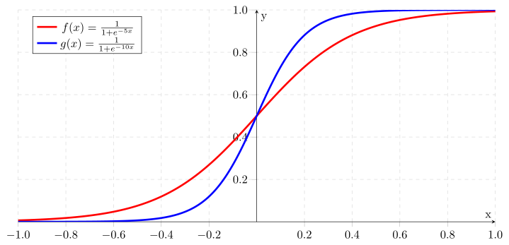
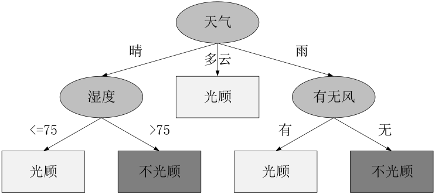

class: content

```{r init-r, include=FALSE}
library(knitr)
options(htmltools.dir.version = FALSE)
opts_knit$set(global.par = TRUE)
```

<div class="content-page">
  <p class="content-page-title">目录</p>
  <li class="content-page-list">逻辑回归</li>
  <li class="content-page-list">决策树</li>
</div>

---
class: section, center, middle

# 逻辑回归

---
class:

# 逻辑回归

逻辑回归（Logistic Regression）的起源主要分为几个阶段，从开始想到 logistic 这个词，到发现 logistic function，再推导出 logit function，最后才命名 logistic regression。这些过程都是大量的研究者们共同努力发现的，只是在历史的长河中，很多人被渐渐遗忘了。

---
class:

# 逻辑方程

.pull-left[
广义逻辑曲线：

$$f\left(t\right) = A + \dfrac{K - A}{\left(C + Q e ^ {-Bt}\right) ^ {1 / v}}$$

其中:

$A$ 为曲线下界  
$K$ 为曲线上界  
$B$ 为增长率  
$v > 0$ 影响曲线的增长率  
$Q$ 与 $f\left(0\right)$ 相关  
$C$ 一般取值为 $1$

]

.pull-right[
Sigmoid曲线：

$$
f\left(t\right) = \dfrac{1}{1 + e ^ {-t}} = \dfrac{e ^ t}{1 + e ^ t}
$$

$$
f'\left(t\right) = \dfrac{e ^ t}{\left(1 + e ^ t\right) ^ 2} = f\left(t\right) \left(1 - f\left(t\right)\right)
$$

.center[
```{r, echo=F, out.width="80%"}

```
]
]

---
class:

# 逻辑回归模型

逻辑回归（Logistic Regression）模型是一种分类模型，这里，我们利用条件概率分布
$P\left(Y | X\right)$表示，这里随机变量
$X$取值为实数，随机变量
$Y$取值为
$1$或
$0$。我们通过监督学习的方法来估计模型参数：

$$P\left(Y=1|x\right) = \dfrac{\exp \left(w \cdot x + b\right)}{1 + \exp \left(w \cdot x + b\right)}$$

$$P\left(Y=0|x\right) = \dfrac{1}{1 + \exp \left(w \cdot x + b\right)}$$

其中：
$x \in \mathbb{R} ^ n$为输入，
$Y \in {0, 1}$为输出，
$w \in \mathbb{R} ^ n$和
$b \in \mathbb{R}$为模型参数，其中
$w$称之为权重，
$b$称之为偏置。

---
class:

# 逻辑回归模型

逻辑回归（Logistic Regression）模型是一种分类模型，这里，我们利用条件概率分布 $P\left(Y | X\right)$ 表示，这里随机变量 $X$ 取值为实数，随机变量 $Y$ 取值为 $1$ 或 $0$。我们通过监督学习的方法来估计模型参数：

$$P\left(Y=1|x\right) = \dfrac{\exp \left(w \cdot x + b\right)}{1 + \exp \left(w \cdot x + b\right)}$$

$$P\left(Y=0|x\right) = \dfrac{1}{1 + \exp \left(w \cdot x + b\right)}$$

其中：
$x \in \mathbb{R} ^ n$ 为输入，
$Y \in {0, 1}$ 为输出，
$w \in \mathbb{R} ^ n$ 和 $b \in \mathbb{R}$
为模型参数，其中，
$w$ 称之为权重，
$b$ 称之为偏置。

---
class:

# 逻辑回归

在 R 语言中，我们利用 `glm()` 进行线性模型拟合，`glm()` 函数定义如下：

```{r eval=F}
glm(formula, family = gaussian, data, weights, subset, na.action, start = NULL, etastart, mustart, offset,
    control = list(...), model = TRUE, method = "glm.fit", x = FALSE, y = TRUE, contrasts = NULL, ...)
```

.center[
`glm()` 函数主要参数列表
]

| 参数      | 说明                                           |
| :-------- | :--------------------------------------------- |
| `formula` | 模型函数表达式                                 |
| `family`  | 链接方式，逻辑回归：`binomial(link = "logit")` |
| `data`    | 数据集                                         |
| `control` | 控制GLM拟合的控制信息                          |

---
class:

# 逻辑回归

.pull-left[
```{r warning=F}
data(iris)

iris2 <- iris[iris$Species != 'virginica', ]
iris2$Setosa <- ifelse(iris2$Species == 'setosa', 1, 0)

lr <- glm(
  Setosa ~ Sepal.Length + Sepal.Width +
    Petal.Length + Petal.Width,
  family = binomial(link = 'logit'), data = iris2)

predict(lr, iris2[c(1, 2, 51, 52), 1:4], type = 'response')
```
]

.pull-right[
```{r eval=F}
summary(lr)
```

```
# Call:
# glm(formula = Setosa ~ Sepal.Length + Sepal.Width +
      Petal.Length + Petal.Width,
      family = binomial(link = "logit"), data = iris2)

# ...

# Coefficients:
#                Estimate Std. Error z value Pr(>|z|)
# (Intercept)      -6.556 601950.495       0        1
# Sepal.Length      9.879 194223.317       0        1
# Sepal.Width       7.418  92924.482       0        1
# Petal.Length    -19.054 144516.044       0        1
# Petal.Width     -25.033 216059.004       0        1
```
]

---
class: section, center, middle

# 决策树

---
class:

# 决策树

.pull-left[
决策树（Decision Tree）是机器学习和数据挖掘中的一套分类和回归方法。决策树是由节点和有向边构成的树形分类模型，其中树的叶子节点表示弄个分类，非叶子结点表示一个用于树枝分叉的特征属性。

例如：高尔夫俱乐部的经理通过周天气预报寻找什么时候人们会打高尔夫，以适时调整雇员数量。在 2 周时间内我们得到以下记录：天气状况有晴，云和雨；气温用华氏温度表示；相对湿度用百分比；还有有无风；以及顾客是不是在这些日子光顾俱乐部，如右表所示。
]

.pull-right[
| 日期 | 天气 | 气温 | 湿度 | 风  | 光顾 |
| :--- | :--- | :--- | :--- | :-- | :--- |
| 1    | 晴   | 85   | 85   | 无  | 否   |
| 2    | 晴   | 80   | 90   | 有  | 否   |
| 3    | 多云 | 83   | 78   | 无  | 是   |
| 4    | 雨   | 70   | 96   | 无  | 是   |
| 5    | 雨   | 68   | 80   | 无  | 是   |
| 6    | 雨   | 65   | 70   | 有  | 否   |
| 7    | 多云 | 64   | 65   | 有  | 是   |
| ...  | ...  | ...  | ...  | ... | ...  |
]

---
class:

# 决策树

Golf 数据集对应得到的决策树如图所示。根节点代表整个训练样本集，通过在每个节点对某个属性的测试验证，递归得将数据集分成更小的数据集。某一节点对应的子树对应着原数据集中满足某一属性的部分数据集。递归过程一直进行下去，直到某一节点对应的子树对应的数据集都属于同一个类为止。决策树的生成主要有三个步骤：

.pull-left[
- 特征的选择：特征选择是指从数据集中的多个属性特种中选择具有分类能力的特征。不同的特征选择策略将导致不同决策树的生成。
- 决策树生成：决策树生成是指利用选择的特征，递归的构建决策树。
- 决策树剪枝：决策树剪枝是指为了防止过拟合现象，对于过于复杂的决策树进行简化的过程。
]

.pull-right[

]

---
class:

# 决策树特征选择

特征选择主要解决的问题的用来进行划分特征空间的特征的顺序以及特征自身的划分依据等。根据数据集可知，是否有客户光顾高尔夫俱乐部受到天气，气温，湿度和有无风四个变量的制约。其中，天气和有无风为离散型变量，气温和湿度为连续型变量。那么在构建决策树时，会有两个基本问题：

1. 依次选择哪些特征作为划分节点，才能够保证每个节点都能够具有最好的分类能力？
2. 对于连续型变量，选择什么值作为划分依据？

决策树主要从信息论的角度处理这两个问题，具体的选择依据有**信息增益**，**信息增益率**和 **Gini 系数**等。

---
class:

# 熵 Entropy

首先我们需要理解什么是熵（Entropy）。熵最早是用来表示物理学中一个热力系统无序的程度，后来依据香农的信息论，熵用来衡量一个随机变量的不确定性程度。对于一个随机变量 $X$，其概率分布为：

$$P\left(X = x_i\right) = p_i, \quad i = 1, 2, ..., n$$

.pull-left[
则随机变量 $X$ 的熵定义如下：

$$H\left(X\right) = - \sum_{i=1}^{n} p_i \log p_i$$

例如抛一枚硬币，假设硬币正面向上 $X=1$ 的概率为 $p$，硬币反面向上 $X=0$ 的概率为 $1-p$。则对于抛一枚硬币那个面朝上这个随机变量 $X$ 的熵为：

$$H\left(p\right) = - p \log p - \left(1-p\right) \log \left(1-p\right)$$
]

.pull-right[
则熵 $H\left(p\right)$ 随概率 $p$ 变化如图所示：

.center[
```{r echo=F, dpi=300, fig.width=8, fig.height=5, message=FALSE, warning=FALSE, out.width='80%', fig.retina=1}
library(tidyverse)
x = seq(0, 1, by=0.01)
y = -x * log2(x) - (1 - x) * log2(1- x)
df = data.frame(x=x, y=y)
ggplot(df, aes(x=x, y=y)) +
  geom_line() +
  theme(text=element_text(size=24)) +
  xlab('p') + ylab('H(p)')
```
]
]

???

从图可以看出，当 $p=0.5$ 时熵最大，也就是说抛一枚硬币，当正反两面朝上的概率相同时，熵最大，也就是说系统最复杂。对于公式，当取以 2 为底的对数时，熵的单位为比特（bit），当取自然对数时，熵的单位为纳特（nat），当取以 10 为底的对数时，熵的单位为哈特（hart）。

---
class:

# 信息增益

对于随机变量 $\left(X, Y\right)$，其联合概率分布为：

$$P\left(X = x_i, Y = y_i\right) = p_{ij}, \quad i = 1,2,...,n; \quad j = 1,2,...,m$$

则条件熵 $H\left(Y | X\right)$ 表示在已知 $X$ 的条件下 $Y$ 的不确定性，定义如下：

$$H\left(Y | X\right) = \sum_{i=1}^{n} p_i H \left(Y | X = x_i\right)$$

信息增益（information gain）表示在已知特征 $X$ 对于类 $Y$ 的不确定性的减少程度。则特征 $A$ 对于数据集 $D$ 的信息增益 $G\left(D, A\right)$，可以用数据集的熵 $H\left(D\right)$ 和已知特征 $A$ 的前提下的经验熵 $H\left(D, A\right)$ 之差来表示：

$$G\left(D, A\right) = H\left(D\right) -  H\left(D, A\right)$$

---
class:

# 信息增益

利用高尔夫俱乐部光顾数据，计算变量“天气”对于系统的信息增益。首先计算整个系统的熵 $H\left(D\right)$，

$$H\left(D\right) =  -\dfrac{9}{14} \log_2 \dfrac{9}{14} -\dfrac{5}{14} \log_2 \dfrac{5}{14} = 0.940$$

变量“天气”共有 3 种取值类型：“晴”，“雨”和“多云”，因此在已知变量“天气”的前提下，系统的条件熵 $H\left(D, A\right)$，

$$\begin{split}
H\left(D, A\right) = & \dfrac{5}{14} H\left(D_1\right) + \dfrac{5}{14} H\left(D_2\right) + \dfrac{4}{14} H\left(D_3\right) \\
= & \dfrac{5}{14} \left(-\dfrac{2}{5} \log_2 \dfrac{2}{5} - \dfrac{3}{5} \log_2 \dfrac{3}{5}\right) + \dfrac{5}{14} \left(-\dfrac{3}{5} \log_2 \dfrac{3}{5} - \dfrac{2}{5} \log_2 \dfrac{2}{5}\right) \\
& + \dfrac{4}{14} \left(-\dfrac{4}{4} \log_2 \dfrac{4}{4} - \dfrac{0}{4} \log_2 \dfrac{0}{4}\right) \\
= & 0.347 + 0.347 + 0 = 0.693
\end{split}$$

其中 $D_1$，
$D_2$ 和 $D_3$ 分别表示当“天气”取值“晴”，“雨”和“多云”时的子系统。则在已知变量“天气”的前提下，系统的熵增益为 $G\left(D, A\right) = 0.940 - 0.693 = 0.247$。

---
class:

# 信息增益率

信息增益率（information gain ratio）为特征 $A$ 对于数据集 $D$ 的信息增益 $G\left(D, A\right)$ 与数据集 $D$ 关于特征 $A$ 的熵 $H_A\left(D\right)$ 的比：

$$G_r\left(D, A\right) = \dfrac{G\left(D, A\right)}{H_A\left(D\right)}$$

其中，
$H_A\left(D\right) = - \sum_{i=1}^{n} \dfrac{\left|D_i\right|}{\left|D\right|} \log_2 \dfrac{\left|D_i\right|}{\left|D\right|}$，
$D_i$ 表示特征 $A$ 的第 $i$ 种取值。

则高尔夫俱乐部光顾数据集关于特征“天气”的熵 $H_A\left(D\right)$：

$$H_A\left(D\right) = -\dfrac{5}{14} \log_2 \dfrac{5}{14} - \dfrac{5}{14} \log_2 \dfrac{5}{14} - \dfrac{4}{14} \log_2 \dfrac{4}{14} = 1.577$$

则信息增益率 $G_r\left(D, A\right) = \dfrac{0.247}{1.577} = 0.156$。

---
class:

# Gini 指数

.pull-left[
对于一个随机变量 $X$，其概率分布为：

$$P\left(X = x_i\right) = p_i, \quad i = 1, 2, ..., n$$

则随机变量 $X$ 的 Gini 指数定义如下：

$$\textrm{Gini}\left(p\right) = \sum_{i=1}^{n} p_i \left(1 - p_i\right) = 1 - \sum_{i=1}^{n} p_i^2$$

假设特征 $A$ 有 $n$ 中取值，可以将数据集划分为 $D_1, D_2, ..., D_n$，则在已知特征 $A$ 的前提下，数据集 $D$ 的 Gini 指数定义为：

$$\textrm{Gini}\left(D, A\right) = \sum_{i=1}^{n} \dfrac{\left|D_i\right|}{\left|D\right|} \textrm{Gini}\left(D_i\right)$$

则特征“天气”的 Gini 指数：
]

.pull-right[
$$\begin{split}
&\textrm{Gini}\left(D, A\right) \\
=& \dfrac{5}{14} \textrm{Gini}\left(D_1\right) + \dfrac{5}{14} \textrm{Gini}\left(D_2\right) + \dfrac{4}{14} \textrm{Gini}\left(D_3\right) \\
=& \dfrac{5}{14} \left[1 - \left(\dfrac{2}{5}\right)^2 - \left(\dfrac{3}{5}\right)^2 \right] + \\
& \dfrac{5}{14} \left[1 - \\
\left(\dfrac{3}{5}\right)^2 - \left(\dfrac{2}{5}\right)^2 \right] + \\
& \dfrac{4}{14} \left[1 - \left(\dfrac{4}{4}\right)^2 - \left(\dfrac{0}{4}\right)^2 \right] \\
=& 0.171 + 0.171 + 0 \\
=& 0.343
\end{split}$$

其中 $D_1$，
$D_2$ 和 $D_3$ 分别表示当“天气”取值“晴”，“雨”和“多云”时的子系统。
]

---
class:

# 连续型变量处理方法

上面介绍了对于离散型变量如何计算熵增益，熵增益率和 Gini 指数，但对于连续型变量如何计算着三个指标呢？

把需要处理的样本（对应根节点）或样本子集（对应子树）按照连续变量的大小从小到大进行排序，假设该属性对应的不同的属性值一共有 $N$ 个，那么总共有 $N-1$ 个可能的候选分割阈值点，每个候选的分割阈值点的值为上述排序后的属性值链表中两两前后连续元素的中点，那么我们的任务就是从这个 $N-1$ 个候选分割阈值点中选出一个，使得前面提到的信息论标准最大。

例如，对于高尔夫数据集，我们来处理温度属性，来选择合适的阈值。首先按照温度大小对对应样本进行排序如表：

| 温度 | 64 | 65 | 68 | 69 | 70 | 71 | 72 | 72 | 75 | 75 | 80 | 81 | 83 | 85 |
| :--- | :- | :- | :- | :- | :- | :- | :- | :- | :- | :- | :- | :- | :- | :- |
| 光顾 | 是 | 否 | 是 | 是 | 是 | 否 | 否 | 是 | 是 | 是 | 否 | 是 | 是 | 否 |

---
class:

# 连续型变量处理方法

那么可以看到有 13 个可能的候选阈值点，比如 $middle[64,65]$，
$middle[65,68]$，...，
$middle[83,85]$。例如，选择 $middle[71,72]$ 时，当温度 $<71.5$ 是，有 4 个“是”和 2 个“否”，当温度 $>71.5$ 时，有 5 个“是”和 3 个“否”，此时的条件熵 $H\left(D,A\right)$，

$$\begin{split}
H\left(D, A\right) = & \dfrac{6}{14} H\left(D_1\right) + \dfrac{8}{14} H\left(D_2\right) \\
= & \dfrac{6}{14} \left(-\dfrac{2}{6} \log_2 \dfrac{2}{6} - \dfrac{4}{6} \log_2 \dfrac{4}{6}\right) \\
& + \dfrac{8}{14} \left(-\dfrac{3}{8} \log_2 \dfrac{3}{8} - \dfrac{5}{8} \log_2 \dfrac{5}{8}\right) \\
= & 0.393 + 0.545 \\
= & 0.939
\end{split}$$

因此，通过对所有可能的阈值点计算条件熵可以找出熵增益最大阈值点。连续变量的熵增益率和 Gini 指数计算类似。

---
class:

# 决策树生成 - CART算法

.pull-left[
<pre class="convert-pseudocode" caption="CART 算法">
\REQUIRE 数据集 $D$，特征集 $A$，阈值 $\epsilon$
\ENSURE 决策树 $Tree$
\PROCEDURE{CART}{$D, A, \epsilon$}
    \STATE $Tree \gets \left\lbrace\right\rbrace$
    \IF{All data in D belong to class $C_k$}
        \STATE $Tree \gets$ single node with class of $C_k$
        \STATE terminate
    \ENDIF
    \FORALL{attribute $D_i \in D$}
        \STATE Compute information gain if we split on $D_i$
    \ENDFOR
    \STATE $G_{min} \gets$ Minimum Gini
    \STATE \COMMENT{接下文}
\ENDPROCEDURE
</pre>
]

.pull-right[
<pre class="convert-pseudocode">
\PROCEDURE{CART}{$D, A, \epsilon$}
    \STATE \COMMENT{接上文}
    \IF{$G_{min} > \epsilon$}
        \STATE $C \gets$ Class with most examples
        \STATE $Tree \gets$ single node with $C$
        \STATE terminate
    \ENDIF
    \STATE $A_{best} \gets$ Best attribute with $G_{min}$
    \STATE $Tree \gets$ Create a decision node that in the root with $A_{best}$
    \STATE $D_s \gets$ All sub datasets of $D$ based on attribute $A_{best}$
    \FORALL{data $D_{si} \in D_s$}
        \STATE $Tree_{si} \gets$ \Call{CART}{$D_{si}, A_{si}, \epsilon$}
        \STATE Attach $Tree_{si}$ to the $Tree$
    \ENDFOR
    \RETURN $Tree$
\ENDPROCEDURE
</pre>
]

???

CART 算法是由 Breiman 等人提出的一种决策树学习方法。CART 算法在生成决策树的过程中，采用 Gini 指数进行特征选择。

---
class:

# 决策树剪枝

决策树对于训练样本来说，可以得到一个 100% 准确的分类器。算法生成的决策树非常的详细而且庞大，每个属性都被详细地加以考虑。但是如果训练样本中包含了一些错误，按照前面的算法，这些错误也会 100% 被决策树学习了，这就产生了过拟合现象。因此，为了解决这个问题，我们需要对生成的决策树进行简化，这个简化的过程就称之为剪枝。

---
class:

# 决策树剪枝

决策树的剪枝有多重算法，但其目的都是为了平衡决策树的准确性和复杂度。假设一棵树 $T$ 的叶子节点的个数为 $|T|$，
$t$ 为树 $T$ 的叶子节点，这个叶子节点共有 $N_t$ 个样本点，其中数据类 $c$ 的样本点共有 $N_{tc}$  个，则可以定义决策树学习的损失函数为：

$$Loss\left(T, \alpha\right) = \sum_{t=1}^{|T|} N_t H_t\left(T\right) + \alpha |T|$$

其中，
$\alpha \ge 0$ 为参数，
$H_t \left(T\right)$ 为叶子节点 $t$ 上的经验熵。上式中的前项记做：

$$E\left(T\right) = \sum_{t=1}^{|T|} N_t H_t\left(T\right)$$

$$Loss\left(T, \alpha\right) = E\left(T\right) + \alpha |T|$$

其中 $E\left(T\right)$ 表示模型在训练集上的预测误差，
$\alpha|T|$ 表示模型的复杂度。当 $\alpha$ 较大时，意味着我们希望选择复杂度较小的决策树（叶子节点较少），反之，意味着我们希望选择对于训练集的预测误差较小但相对复杂度较大的决策树。当 $\alpha$ 的值确定后，我们可以通过最小化损失函数来得到最终的决策树。

---
class:

# 决策树

在 R 语言中，我们利用 rpart 包中的 `rpart()` 函数生成决策树，`rpart()` 函数定义如下：

```{r eval=F}
rpart(formula, data, weights, subset, na.action = na.rpart, method,
      model = FALSE, x = FALSE, y = TRUE, parms, control, cost, ...)
```

| 参数      | 说明                                                         |
| :-------- | :----------------------------------------------------------- |
| `formula` | 用于表示决策树特征的方程（或数据框）                         |
| `data`    | 数据集                                                       |
| `weight`  | 可选的特征权重                                               |
| `method`  | 四种取值：连续：“anova”，离散型：“class”，计数型(泊松过程)：“poisson”；生存分析型：“exp”。 |
| `parms`   | 生成决策树的三个参数：先验概率，损失矩阵，分类的度量方。     |
| `control` | 控制rpart算法的详细参数（详见rpart.control）                 |

---
class:

# 决策树

```{r eval=F}
rpart.control(minsplit=20, minbucket=round(minsplit/3), cp = 0.01, maxcompete = 4, maxsurrogate = 5,
              usesurrogate = 2, xval = 10, surrogatestyle = 0, maxdepth = 30, ...)
```

| 参数         | 说明                                         | 默认值     |
| :----------- | :------------------------------------------- | :--------- |
| `minsplit`   | 用于分割节点所允许的最小样本数               | 20         |
| `minbucket`  | 叶子节点所允许的最小样本数                   | minsplit/3 |
| `cp`         | 决策树复杂性参量，用于指定剪枝采用的阈值     | 0.01       |
| `maxcompete` | 在输出中保留的参与特征选择时的竞争特征的个数 | 4          |
| `xval`       | 交叉检验次数                                 | 10         |
| `maxdepth`   | 树的最大深度（32位及机器上最大允许值为30）   | 30         |

---
class:

# 决策树

```{r}
library(rpart)

dst <- rpart(Species ~., iris, method = 'class', parms = list(split = 'gini'),
             control = rpart.control(minbucket = 1))
printcp(dst)
```

---
class:

# 决策树

用户可以利用 `plot()` 函数绘制生成的决策时，但绘图效果差强人意，用户可以利用 rpart.plot 包中的 `rpart.plot()` 函数绘制生成更美观的决策树，`rpart.plot()` 定义如下：

```{r eval=F}
rpart.plot(x=stop("no 'x' arg"), type=0, extra=0, under=FALSE, clip.right.labs=TRUE, fallen.leaves=FALSE,
           branch=if(fallen.leaves) 1 else .2, uniform=TRUE, digits=2, varlen=-8, faclen=3, cex=NULL, tweak=1,
           compress=TRUE, ycompress=uniform, snip=FALSE, ...)
```

- `type`：绘图类型：0-4 共 5 种可能值（具体含义详见帮助文档），默认值：0
- `extra`：节点的额外信息：0-9 共 10 种可能值（详见帮助文档），默认值：0
- `under`：是否将文字绘制在方框下面（当 `extra > 0` 时有效），默认值：`FALSE`
- `fallen.leaves`：是否在底部显示所有叶子节点，默认值：`FALSE`
- `branch`：树枝的形状（0-1 之间），默认值：取决于 `fallen.leaves`
- `digits`：数值的显示位数，默认值：2
- `varlen`：变量名字的长度，默认值：-8
- `faclen`：因子型变量名字的长度，默认值：3
- `cex`：文字的大小（`NULL` 表示自动计算），默认值：`NULL`

---
class:

# 决策树

.pull-left[
```r
library(rpart.plot)

rpart.plot(dst, extra = 1)
```
]

.pull-right[
```{r include=F}
library(rpart.plot)

png('generated/decision-tree.png', width = 960, height = 800, res = 150)
par(
  mar = c(0, 0, 0, 0),
  oma = c(0, 0, 0, 0))
rpart.plot(dst, extra = 1)
dev.off()
```


]

---
class: thanks, center, middle

# Thanks


本作品采用 [**CC BY-NC-SA 4.0**](https://creativecommons.org/licenses/by-nc-sa/4.0/) 进行许可

Copyright © [**范叶亮 | Leo Van**](https://leovan.me), All Rights Reserved.