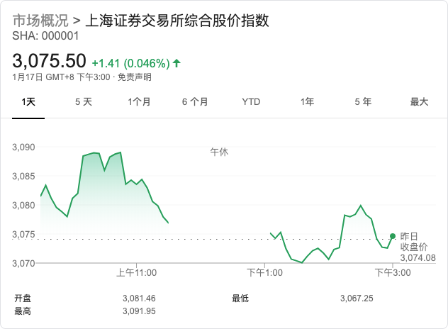
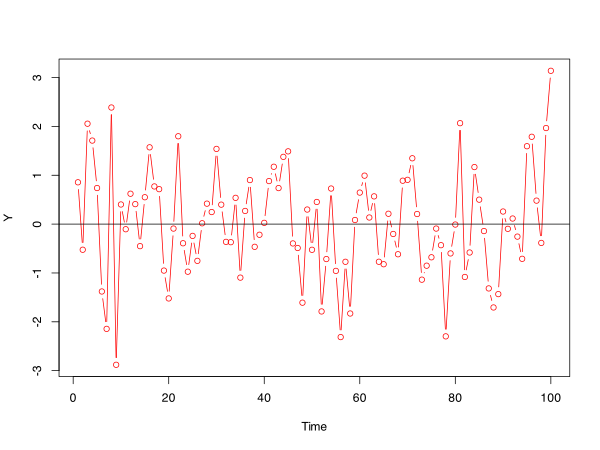
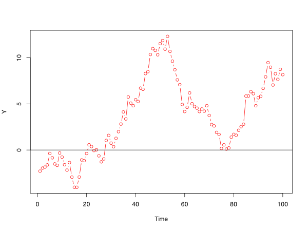
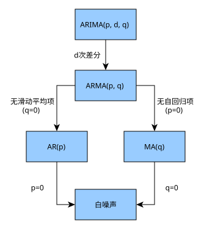
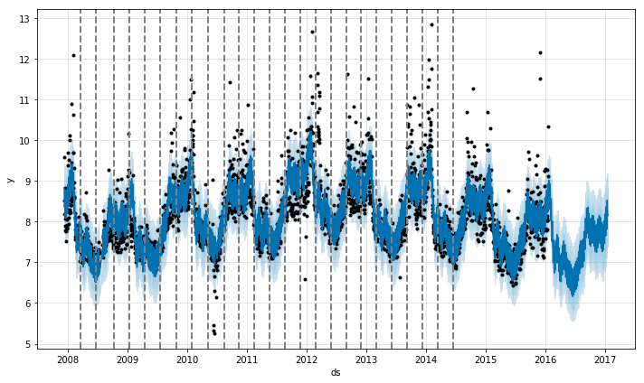
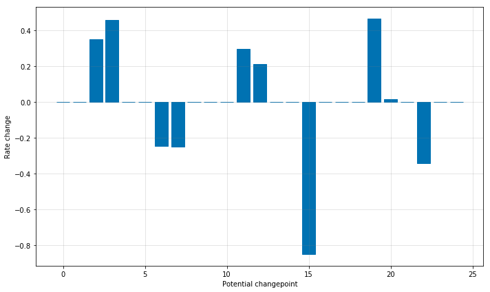
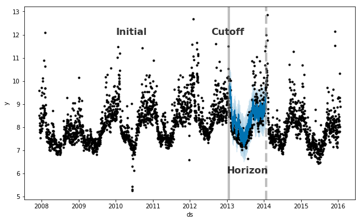

```{r}
#| include: false

library(tidyverse)

theme_set(theme_gray(base_size = 14))
```

## 目录 {.content}

- 时间序列
- ARIMA 模型
- 季节性分析
- Prophet

# 时间序列

## 时间序列

**时间序列**是现实生活中经常会碰到的数据形式。例如北京市连续一年的日平均气温、某股票的股票价格、电商平台上某件商品的日销售件数等等。时间序列分析的目的是挖掘时间序列中隐含的信息与模式，并借此对此序列数据进行评估以及对序列的后续走势进行预测。

:::: {.columns}
::: {.column width="50%"}
{fig-align="center" width=88%}
:::

::: {.column width="50%"}
{fig-align="center" width=100%}
:::
::::

## 时间序列

假设存在一个时间序列：$\left\{Y_t | t = 0, \pm 1, \pm 2, ...\right\}$

**均值**定义为：$\mu_t = E\left(Y_t\right)$

**方差**定义为：$\sigma_{t}^{2} = E \left(\left(Y_t - \mu_t\right)^2\right)$

**自协方差**定义为：$\gamma_{t, s} = Cov\left(Y_t, Y_s\right) = E\left(\left(Y_t - \mu_t\right) \left(Y_s - \mu_s\right)\right)$

**自相关系数**定义为：$\rho_{t, s} = \dfrac{\gamma_{t, s}}{\sqrt{\gamma_{t, t} \gamma_{s, s}}}$

如果忽略元素来自时间序列这一事实，各统计量的意义与普通的统计学中无异。

## 白噪声

:::: {.columns}
::: {.column width="50%"}
考虑一个时间序列，其中每一个元素为独立同分布变量，且均值为 0。这种时间序列叫做白噪声。之所以叫这个名字，是因为对这种序列的频域分析表明其中平等的包含了各个频率，和物理中的白光类似。

每个元素服从 $N\left(0, 1\right)$，均值 $\mu_t = 0$，方差 $\sigma_t^2 = 1$。每个元素独立，对于任何 $t \neq s$，$\gamma_{t, s} = 0$，$\rho_{t, s} = 0$。

我们一般用 $e$ 表示白噪声，将白噪声序列写作：

$$
\left\{e_1, e_2, ..., e_t, ...\right\}
$$
:::

::: {.column width="50%"}
```{r}
#| eval: false
#| include: false

Y <- ts(rnorm(100, mean = 0, sd = 1))
plot(Y, type = "b", col = "red")
abline(h = 0)
```

{fig-align="center" width=100%}
:::
::::

## 白噪声

考虑一个时间序列，在 $t$ 时刻的值是白噪声前 $t$ 个值之和，设 $\left\{e_1, e_2, ..., e_t, ...\right\}$ 为标准正态的白噪声，则：

:::: {.columns}
::: {.column width="50%"}
$$
\begin{split}
Y_1 &= e_1 \\
Y_2 &= e_1 + e_2 \\
&\vdots \\
Y_t &= e_1 + e_2 + ... + e_t \\
&\vdots
\end{split}
$$

$\mu_t = E\left(e_1 + ... + e_t\right) = E\left(e_1\right) + ... + E\left(e_t\right) = 0$  
$\sigma_t^2 = Var\left(e_1 + ... + e_t\right) = Var\left(e_1\right) + ... + Var\left(e_t\right) = t \sigma^2$

统计上可以看出随机游走的“趋势性”实际是个假象，因为其均值一直是白噪声的均值，不存在偏离的期望。但方差与时间呈线性增长并且趋向于无穷大，这意味着只要时间够长，随机游走的序列值可以偏离均值任意远，但期望永远在均值处。物理与经济学中很多现象被看做是随机游走，例如分子布朗运动，股票价格走势等。
:::

::: {.column width="50%"}
```{r}
#| eval: false
#| include: false

Y <- ts(rnorm(100, mean = 0, sd = 1));
for (i in 2:length(Y)) {
  Y[i] <- Y[i] + Y[i-1];
}
plot(Y, type = "b", col = "red");
abline(h = 0)
```

{fig-align="center" width=100%}
:::
::::

## 平稳性

平稳性是时间序列分析中很重要的一个概念。一般的，认为一个时间序列是平稳的，如果它同时满足一下两个条件：

1. 均值函数是一个常数函数
2. 自协方差函数只与时滞有关，与时间点无关

一般的时间序列分析往往针对平稳序列，对于非平稳序列会通过某些变换将其变为平稳的。

# ARIMA 模型

## ARIMA 模型

:::: {.columns}
::: {.column width="50%"}
**ARIMA** 模型（Autoregressive Integrated Moving Average model），差分整合移动平均自回归模型，又称整合移动平均自回归模型（移动也可称作滑动），是时间序列预测分析方法之一。

$\text{ARIMA} \left(p, d, q\right)$ 中，$\text{AR}$ 是自回归，$p$ 为自回归项数；$\text{MA}$ 为滑动平均，$q$ 为滑动平均项数，$d$ 为使之成为平稳序列所做的差分次数（阶数）。
:::

::: {.column width="50%"}
{fig-align="center" width=60%}
:::
::::

## AR 模型

具有如下结构的模型为 $p$ 阶自回归模型，记为 $AR\left(p\right)$：

$$
Y_t = e_t + \phi_1 Y_{t-1} + \phi_2 Y_{t-2} + ... + \phi_p Y_{t-p}
$$

$AR\left(p\right)$ 模型有三个限制条件：

1. $\phi_p \neq 0$，这个限制条件可以保证模型的最高阶数为 $p$；
2. $e_t \sim N \left(0, \sigma_t^2\right)$，这个限制条件要求随机干扰序列 $e_t$ 是均值为零的白噪声序列。
3. $E\left(Y_s e_t\right) = 0, \forall s < t$，这个条件限制当前的随机干扰与过去的数据序列值无关。

通常上述三个条件为 AR 模型的默认条件，因此常将 $AR\left(p\right)$ 模型简记为：

$$
Y_t = \sum_{i=1}^{p}{\phi_i Y_{t-i}} + e_t
$$

## MA 模型

具有如下结构的模型为 $q$ 阶滑动平均模型，记为 $MA\left(q\right)$：

$$
Y_t = e_t - \theta_1 e_{t-1} - \theta_2 e_{t-2} - ... - \theta_q e_{t-q}
$$

$MA\left(q\right)$ 模型有两个限制条件：

1. $\theta_q \neq 0$，这个限制条件可以保证模型的最高阶数为 $q$；
2. $e_t \sim N \left(0, \sigma_t^2\right)$，这个限制条件要求随机干扰序列 $e_t$ 是均值为零白噪声序列。

通常上述两个条件为MA模型的默认条件，因此常将 $MA\left(q\right)$ 模型简记为：

$$
Y_t = e_t - \sum_{i=1}^{q}{\theta_i e_{t-i}}
$$

## ARMA 模型

如果一个时间序列兼有 AR 和 MA 部分，并且是平稳的，则构成 ARMA 模型。一般 $ARMA\left(p, q\right)$ 的表达式为：

$$
Y_t = e_t + \sum_{i=1}^{p}{\phi_i Y_{t-i}} - \sum_{j=1}^{q}{\theta_j e_{t-j}}
$$

令：

$$
\Phi\left(L\right) = 1 - \phi_1 L - \phi_2 L^2 - ... - \phi_p L^p
$$

$$
\Theta\left(L\right) = 1 + \theta_1 L + \theta_2 L^2 + ... + \theta_q L^q
$$

则上式可简写为：

$$
\Phi\left(L\right)Y_t = \delta + \Theta\left(L\right) e_t
$$

其中，$L$ 称之为滞后算子。

## ARIMA 模型

ARIMA 和 ARMA 的区别就是，将公式中 $Y_t$ 替换为差分算子，即：

$$
\Phi\left(L\right) \Delta^d Y_t = \delta + \Theta\left(L\right) e_t
$$

差分算子为：

$$
\begin{split}
\Delta Y_t &= Y_t - Y_{t-1} = Y_t - L Y_t = \left(1 - L\right) Y_t \\
\Delta^2 Y_t &= \Delta Y_t - \Delta Y_{t-1} = \left(1 - L\right) Y_t - \left(1 - L\right) Y_{t-1} = \left(1 - L\right)^2 Y_t \\
\Delta^d Y_t &= \left(1 - L\right)^d Y_t
\end{split}
$$

参数优化：

1. 确定差分阶数 $d$，从而保证差分后的时间序列是平稳的。
2. 确定 AR 和 MA 模型的参数 $p$ 和 $q$，例如 AIC 等。

## ARIMA 模型

:::: {.columns}
::: {.column width="50%"}
自相关函数（ACF）：延迟为 $k$ 时，这是相距 $k$ 个时间间隔的序列值之间的相关性。

偏自相关函数（PACF）。延迟为 $k$ 时，这是相距 $k$ 个时间间隔的序列值之间的相关性，同时剔除了中间 $k-1$ 个随机变量的干扰。

拖尾即始终有非零取值，不会在 $k$ 大于某个常数后就恒等于零（或在 0 附近随机波动）。
截尾即在大于某个常数 $k$ 后快速趋于 0。

- AR 模型：自相关系数拖尾，偏相关系数截尾
- MA 模型：自相关系数截尾，偏相关系数拖尾
- ARMA 模型：自相关系数和偏相关系数均拖尾
:::

::: {.column width="50%"}
利用 ACF 和 PACF 图的拖尾和截尾性质判断 ARMA 模型的方法如下表所示：

::: {.center}
| 模型                     | ACF          | PACF         |
| ------------------------ | ------------ | ------------ |
| 白噪音                   | 全部为零     | 全部为零     |
| $AR \left(p\right)$      | 拖尾         | $p$ 阶后截尾 |
| $MA \left(q\right)$      | $q$ 阶后截尾 | 拖尾         |
| $ARMA \left(p, q\right)$ | $q$ 阶后拖尾 | $p$ 阶后拖尾 |
:::
:::
::::

## ARIMA 模型

:::: {.columns}
::: {.column width="50%"}
`skirts.txt` 数据记录了 1866 年到 1911 年每年女人们裙子的直径：

```{r}
#| eval: false

skirts <- read_csv("data/skirts.txt", skip = 4)

skirts_ts <- ts(skirts, start = c(1866))

skirts_df <- data.frame(
  time = time(skirts_ts),
  skirt = unname(skirts)
)

ggplot(skirts_df, aes(time, skirt)) +
  geom_line()
```
:::

::: {.column width="50%"}
```{r}
#| include: false

skirts <- read_csv("data/skirts.txt", skip = 4)

skirts_ts <- ts(skirts, start = c(1866))

skirts_df <- data.frame(
  time = time(skirts_ts),
  skirt = skirts$SKIRTS
)

p <- ggplot(skirts_df, aes(time, skirt)) +
  geom_line()
ggsave("tmp/skirts-arima.png", width = 5, height = 4, dpi = 150)
```

{fig-align="center" width=100%}
:::
::::

## ARIMA 模型

```{r}
#| eval: false

auto.arima(y, d = NA, D = NA, max.p = 5, max.q = 5, max.P = 2, max.Q = 2, max.order = 5, max.d = 2, max.D = 1,
  start.p = 2, start.q = 2, start.P = 1, start.Q = 1, stationary = FALSE, seasonal = TRUE,
  ic = c("aicc", "aic", "bic"), stepwise = TRUE, trace = FALSE, approximation = (length(x)>150 | frequency(x)>12),
  truncate = NULL, xreg = NULL, test = c("kpss", "adf", "pp"), seasonal.test = c("ocsb", "ch"), allowdrift = TRUE,
  allowmean = TRUE, lambda = NULL, biasadj = FALSE, parallel = FALSE, num.cores = 2, x = y, ...)
```

- `p, q, d, P, Q, D` 为 ARIMA 参数。
- `ic` 为定阶方法。
- `seasonal` 为是否使用季节性 ARIMA 模型。
- `trace` 为是否显示模型选择过程。

## ARIMA 模型

:::: {.columns}
::: {.column width="50%"}
```{r}
library(forecast)
skirts_arima <- auto.arima(
  skirts_ts, seasonal = F, trace = T)
```
:::

::: {.column width="50%"}
```{r}
forecast(skirts_arima, h = 6)
```
:::
::::

## ARIMA 模型

```{r}
#| eval: false

skirts_arima |> forecast(h = 6) |> autoplot(lim.size = 3) +
  theme(text = element_text(size = 25)) + theme(title = element_blank())
```

```{r}
#| include: false

p <- skirts_arima |> forecast(h = 6) |> autoplot(lim.size = 3) +
  theme(text = element_text(size = 25)) + theme(title = element_blank())
ggsave("tmp/skirts-arima-forecast.png", width = 14, height = 5, dpi = 150)
```

::: {.center}
{fig-align="center" width=100%}
:::

# 季节性分析

## 季节性分析

STL (Seasonal-Trend decomposition procedure based on Loess) ^[Cleveland, Robert B., William S. Cleveland, and Irma Terpenning. "STL: A seasonal-trend decomposition procedure based on loess." _Journal of Official Statistics_ 6.1 (1990): 3.] 为时序分解中一种常见的算法，基于局部回归（Loess）将某时刻的数据 $Y_v$ 分解为趋势分量（trend component）、周期分量（seasonal component）和余项（remainder component）:

$$
Y_v = T_v + S_v + R_v \quad v = 1, ..., N
$$

## 季节性分析

:::: {.columns}
::: {.column width="50%"}
`nybirths.txt` 数据记录了从 1946 年 1 月到 1959 年 12 月的纽约每月出生人口数量，纽约每月出生人口数量是在夏季有峰值、冬季有低谷的时间序列。

```{r}
#| eval: false

nybirths <- read_csv(
  "data/nybirths.txt", col_names = F)

nybirths_ts <- ts(
  nybirths, frequency = 12, start = c(1946, 1))

nybirths_df <- data.frame(
  time = time(nybirths_ts), nybirths = unname(nybirths))

ggplot(nybirths_df, aes(time, nybirths)) +
  geom_line()
```
:::

::: {.column width="50%"}
```{r}
#| include: false

nybirths <- read_csv("data/nybirths.txt")

nybirths_ts <- ts(
  nybirths, frequency = 12, start = c(1946, 1))

nybirths_df <- data.frame(
  time = time(nybirths_ts), nybirths = nybirths$NYBIRTHS)

p <- ggplot(nybirths_df, aes(time, nybirths)) +
  geom_line()
ggsave("tmp/nybirths.png", width = 5, height = 4, dpi = 150)
```

{fig-align="center" width=100%}
:::
::::

## 季节性分析

利用滑动平均进行季节性分解：

```{r}
#| eval: false

decompose(x, type = c("additive", "multiplicative"), filter = NULL)
```

- `x` 为时间序列
- `type` 为时间序列类型，`additive` 为相加，`multiplicative` 为相乘。

利用 Loess 进行季节性分解：

```{r}
#| eval: false

stl(x, s.window, s.degree = 0, t.window = NULL, t.degree = 1, l.window = nextodd(period), l.degree = t.degree,
  s.jump = ceiling(s.window/10), t.jump = ceiling(t.window/10), l.jump = ceiling(l.window/10), robust = FALSE,
  inner = if(robust) 1 else 2, outer = if(robust) 15 else 0, na.action = na.fail)
```

## 季节性分析

```{r}
#| eval: false

nybirths_components <- decompose(nybirths_ts)
plot(nybirths_components)
```

```{r}
#| include: false

old_par <- par()
png("tmp/nybirths-components.png", width = 1800, height = 700, res = 150)
par(mai = c(0, 0, 0, 0), oma = c(0, 0, 0, 0))

nybirths_components <- decompose(nybirths_ts)
plot(nybirths_components)

dev.off()
par(old_par)
```

::: {.center}
{fig-align="center" width=100%}
:::

## 季节性分析

```{r}
#| eval: false

library(ggseas)
ggsdc(nybirths_df, aes(time, nybirths), method = "decompose") + geom_line()
```

```{r}
#| include: false

library(ggseas)
p <- ggsdc(nybirths_df, aes(time, nybirths), method = "decompose") + geom_line()
ggsave("tmp/nybirths-components-ggseas.png", width = 14, height = 5, dpi = 150)
```

{fig-align="center" width=100%}

# Prophet

## Prophet

Prophet ^[<https://facebook.github.io/prophet/>] ^[Taylor, Sean J., and Benjamin Letham. "Forecasting at scale." _The American Statistician_ 72.1 (2018): 37-45.] 是一个基于加法模型的时间序列预测算法，其中非线性趋势通过年，周，日的季节性和节假日效应进行拟合。它最适合具有强烈季节性影响和多个季节历史数据的时间序列。Prophet 对数据缺失和趋势变化具有鲁棒性，通常可以很好地处理异常值。

- 准确且快速：Prophet 在 Facebook 的许多应用中用于对计划和目标设定进行可靠的预测。在大多数情况下，我们发现它的效果要比其他任何方法都要好。Prophet 利用 [Stan](https://mc-stan.org/) 拟合模型，可以在几秒钟内获得预测结果。
- 全自动：无需人工干预即可获得杂乱数据的合理预测。Prophet 对异常值，数据缺失以及时间序列中的急剧变化具有鲁棒性。
- 可调整的预测：Prophet 为用户提供了许多可调整项，可以通过领域知识设置易于理解的参数从而改善预测效果。
- 可在 R 或 Python 中使用：在 R 和 Python 中均实现了 Prophet，其共享相同的基础 Stan 代码。

## Prophet 入门

:::: {.columns}
::: {.column width="50%"}
Prophet 使用 sklearn 的 API，在创建 Prophet 实例后可以调用其 `fit` 和 `predict` 方法。

Prophet 的输入为包含两列数据（`ds` 和 `y`）的数据框。其中 `ds`（datestamp）为 pandas 可接受的数据格式，理想情况下日期格式为 `YYYY-MM-DD`，日期时间格式为 `YYYY-MM-DD HH:MM:SS`。`y` 列必须为数值类型，表示我们所需要预测的值。

我们以 Wikipedia 中 [Peyton Manning](https://en.wikipedia.org/wiki/Peyton_Manning) 页面浏览量 ^[<https://github.com/facebook/prophet/blob/master/examples/example_wp_log_peyton_manning.csv>] 的时间序列为例来说明 Prophet 的相关功能。
:::

::: {.column width="50%"}
```{r message=F}
library(prophet)

df <- read_csv(
  "data/example_wp_log_peyton_manning.csv")
head(df)
```
:::
::::

## Prophet 入门

:::: {.columns}
::: {.column width="50%"}
通过调用 `prophet()` 函数可以拟合模型，第一个参数为历史数据。

```{r}
m <- prophet(df)
```
:::

::: {.column width="50%"}
预测时，需要构建一个同样包含 `ds` 列的数据框。利用 `make_future_dataframe()` 工具函数可以构建一个合适的包含未来日期的数据框：

```{r}
future <- make_future_dataframe(m, periods = 365)
tail(future)
```
:::
::::

## Prophet 入门

:::: {.columns}
::: {.column width="50%"}
利用 `predict()` 函数可以获取预测值，预测值保存在数据框的 yhat 列内。

```{r}
forecast <- predict(m, future)
tail(forecast[
  c("ds", "yhat", "yhat_lower", "yhat_upper")])
```
:::

::: {.column width="50%"}
利用 `plot()` 可以对预测结果进行可视化：

```{r}
#| eval: false

plot(m, forecast)
```

```{r}
#| include: false

p <- plot(m, forecast)
ggsave("tmp/peyton-manning-forecast.png", p, width = 6, height = 4, dpi = 150)
```

{fig-align="center" width=100%}
:::
::::

## Prophet 入门

:::: {.columns}
::: {.column width="50%"}
利用 `prophet_plot_components()` 函数可以展示预测值的组成部分。

默认情况下包含趋势，年季节性，周季节性。当模型包含节假日效应时，图中也会展现该部分。

```{r}
#| eval: false

prophet_plot_components(m, forecast)
```
:::

::: {.column width="50%"}
```{r}
#| include: false

old_par <- par()
png("tmp/peyton-manning-forecast-components.png", width = 1200, height = 1000, res = 150)
par(mai = c(0, 0, 0, 0), oma = c(0, 0, 0, 0))

prophet_plot_components(m, forecast)

dev.off()
par(old_par)
```

{fig-align="center" width=100%}
:::
::::

## Prophet 预测增长

:::: {.columns}
::: {.column width="50%"}
默认情况下 Prophet 利用线性模型进行预测。在预测增长时，通常会设置一个最大可达到的点，例如：市场总规模，人口总数等。我们称其为承载能力，也就是预测在这个点达到饱和。

Prophet 使用可指定承载能力的 Logistic Growth Trend 模型进行预测，以 Wikipedia 上 [R (programming language)](https://en.wikipedia.org/wiki/R_%28programming_language%29) 页面的访问日志为例：

```{r}
df = read_csv("data/example_wp_log_R.csv")
```
:::

::: {.column width="50%"}
通过 `cap` 列指定承载能力：

```{r}
df$"cap" <- 8.5
```

需要注意的是必须为数据框的每一行都设置 `cap`，并且必须是一个常量。如果市场规模增长的话，那么 `cap` 可以为一个增长的序列。

```{r}
m <- prophet(df, growth = "logistic")
```
:::
::::

## Prophet 预测增长

:::: {.columns}
::: {.column width="50%"}
类似之前，我们需要创建一个用于预测的数据框，除此之外我们还需要指定一个承载能力。

在这里，我们将承载能力设置为同历史值相同，并预测未来 5 年的结果：

```{r}
#| eval: false

future <- make_future_dataframe(m, periods = 1826)
future$cap <- 8.5

fcst <- predict(m, future)
plot(m, fcst)
```
:::

::: {.column width="50%"}
```{r}
#| include: false

future <- make_future_dataframe(m, periods = 1826)
future$cap <- 8.5
fcst <- predict(m, future)
p <- plot(m, fcst)
ggsave("tmp/r-forecasting-growth.png", p, width = 6, height = 5, dpi = 150)
```

{fig-align="center" width=100%}
:::
::::

## Prophet 预测增长

:::: {.columns}
::: {.column width="50%"}
Logistic Growth 模型同时可以处理预测饱和的最小值，指定最小值的方式同预测增长一样：

```{r}
#| eval: false

df$y <- 10 - df$y
df$cap <- 6
df$floor <- 1.5

future$cap <- 6
future$floor <- 1.5

m <- prophet(df, growth = "logistic")

fcst <- predict(m, future)
plot(m, fcst)
```
:::

::: {.column width="50%"}
```{r}
#| include: false

df$y <- 10 - df$y
df$cap <- 6
df$floor <- 1.5
future$cap <- 6
future$floor <- 1.5
m <- prophet(df, growth = "logistic")
fcst <- predict(m, future)
p <- plot(m, fcst)
ggsave("tmp/r-saturating-minimum.png", p, width = 6, height = 5, dpi = 150)
```

{fig-align="center" width=100%}
:::
::::

## Prophet 趋势突变点

:::: {.columns}
::: {.column width="50%"}
从之前的示例中可以发现，实时的时间序列在其轨迹中经常会有突变。默认情况下，Prophet 会自动检测这些突变点，并对趋势做适当调整。如果在对趋势建模时发生了一些问题，例如：Prophet 不小心忽略了一个趋势速率的变化或者对历史数据趋势变化存在过拟合现象，希望对趋势的调整过程做更好地控制的话，可以使用下面介绍几种的方法。
:::

::: {.column width="50%"}
Prophet 首先通过在大量潜在的突变点（变化速率突变）中进行识别来监测突变点。之后对趋势变化的幅度做稀疏化（等同于 L1 正则化），实际上 Prophet 在建模时会存在很多变化速率突变的点，但只会尽可能少地使用它们。
:::
::::

## Prophet 趋势突变点

:::: {.columns}
::: {.column width="50%"}
以之前的 [Peyton Manning](https://en.wikipedia.org/wiki/Peyton_Manning) 页面的浏览量数据为例，默认情况下，Prophet 会识别出 25 个潜在的突变点（均匀分布在在前 80% 的时间序列数据中）。下图中的竖线指出这些潜在的突变点所在的位置：

{fig-align="center" width=100%}
:::

::: {.column width="50%"}
虽然存在很多变化速率可能会突变的点，但由于做了稀疏先验，绝大多数突变点并不会包含在建模过程中。如下图示，通过观察对每个突变点绘制的速率变化值图，可以发现这一点：

{fig-align="center" width=100%}
:::
::::

## Prophet 趋势突变点

:::: {.columns}
::: {.column width="50%"}
潜在突变点的数量可以通过设置 `n_changepoints` 参数来指定，但最好还是利用调整正则化过程来自动修正。

```{r}
#| eval: false

df = read_csv("data/example_wp_log_peyton_manning.csv")

m <- prophet(df)
future <- make_future_dataframe(m, periods = 365)
forecast <- predict(m, future)

plot(m, forecast) + add_changepoints_to_plot(m)
```

默认情况下，仅在时间序列的前 80％ 推断突变点，以便有足够的空间来预测趋势并避免在时间序列末尾过拟合。默认值在大多数情况下是适用的，通过 `changepoint_range` 可以对其进行设置。
:::

::: {.column width="50%"}
```{r}
#| include: false

df = read_csv("data/example_wp_log_peyton_manning.csv")
m <- prophet(df)
future <- make_future_dataframe(m, periods = 365)
forecast <- predict(m, future)
p <- plot(m, forecast) + add_changepoints_to_plot(m)
ggsave("tmp/peyton-manning-changepoints.png", p, width = 6, height = 5, dpi = 150)
```

{fig-align="center" width=100%}
:::
::::

## Prophet 趋势突变点

:::: {.columns}
::: {.column width="50%"}
如果趋势变化过拟合（过于灵活）或欠拟合（灵活性不够），可以通过 `changepoint.prior.scale` 参数调整稀疏先验程度。默认情况下，参数值为 0.05，增加这个值会导致趋势拟合得更加灵活：

```{r}
#| eval: false

m <- prophet(df, changepoint.prior.scale = 0.5)

future <- make_future_dataframe(m, periods = 365)
forecast <- predict(m, future)

plot(m, forecast)
```
:::

::: {.column width="50%"}
```{r}
#| include: false

m <- prophet(df, changepoint.prior.scale = 0.5)
future <- make_future_dataframe(m, periods = 365)
forecast <- predict(m, future)
p <- plot(m, forecast)
ggsave("tmp/peyton-manning-changepoints-increase-trend-flexibility.png", p, width = 6, height = 5, dpi = 150)
```

{fig-align="center" width=100%}
:::
::::

## Prophet 趋势突变点

:::: {.columns}
::: {.column width="50%"}
减少这个值，会导致趋势拟合得灵活性降低。

```{r}
#| eval: false

m <- prophet(df, changepoint.prior.scale = 0.001)

forecast <- predict(m, future)

plot(m, forecast)
```
:::

::: {.column width="50%"}
```{r}
#| include: false

m <- prophet(df, changepoint.prior.scale = 0.001)
forecast <- predict(m, future)
p <- plot(m, forecast)
ggsave("tmp/peyton-manning-changepoints-decrease-trend-flexibility.png", p, width = 6, height = 5, dpi = 150)
```

{fig-align="center" width=100%}
:::
::::

## Prophet 趋势突变点

:::: {.columns}
::: {.column width="50%"}
通过参数 `changepoints` 可以手动指定突变点而不是自动检测。

```{r}
#| eval: false

m <- prophet(df, changepoints = c("2014-01-01"))

forecast <- predict(m, future)

plot(m, forecast)
```
:::

::: {.column width="50%"}
```{r}
#| include: false

m <- prophet(df, changepoints = c("2014-01-01"))
forecast <- predict(m, future)
p <- plot(m, forecast)
ggsave("tmp/peyton-manning-changepoints-specify-locations.png", p, width = 6, height = 5, dpi = 150)
```

{fig-align="center" width=100%}
:::
::::

## Prophet 季节性和节假日效应

:::: {.columns}
::: {.column width="50%"}
对节假日进行建模时需要创建一个新数据框，其包含两列（节假日 `holiday` 和日期戳 `ds` ）。数据框必须包含所有出现的节假日，无论是历史数据中还是待预测的数据中。如果这些节假日并没有在待预测的数据中被注明， Prophet 也会利用历史数据对它们建模，但预测未来时却不会使用这些模型来预测。

在这个数据框基础上再新建两列 `lower_window` 和 `upper_window` ，从而将节假日的时间扩展成一个区间 `[lower_window, upper_window]` 。例如将平安夜也加入到 “圣诞节” 里，就设置 `lower_window=-1`， `upper_window=0`；如果想将黑色星期五加入到 “感恩节” 里，就设置 `lower_window=0`, `upper_window=1`。

下面我们创建一个数据框，其中包含了所有 Peyton Manning 参加过的决赛日期：
:::

::: {.column width="50%"}
```{r}
playoffs <- tibble(
  holiday = "playoff",
  ds = as.Date(c(
    "2008-01-13", "2009-01-03", "2010-01-16",
    "2010-01-24", "2010-02-07", "2011-01-08",
    "2013-01-12", "2014-01-12", "2014-01-19",
    "2014-02-02", "2015-01-11", "2016-01-17",
    "2016-01-24", "2016-02-07")),
  lower_window = 0, upper_window = 1
)
superbowls <- tibble(
  holiday = "superbowl",
  ds = as.Date(c(
    "2010-02-07", "2014-02-02", "2016-02-07")),
  lower_window = 0, upper_window = 1
)
holidays <- bind_rows(playoffs, superbowls)
```
:::
::::

## Prophet 季节性和节假日效应

:::: {.columns}
::: {.column width="50%"}
上述代码中我们将超级碗的日期记录在了决赛的日期数据框中，也记录在了超级碗的日期数据框中。这会造成超级碗日期的效应会在决赛日期的作用下叠加两次。

一旦这个数据框创建好了，就可以通过传入 `holidays` 参数使其在预测时考虑上节假日效应。这里我们仍以 Peyton Manning 的数据为例：

```{r}
m <- prophet(df, holidays = holidays)

forecast <- predict(m, future)
```

可通过 `forecast` 数据框，来展示节假日效应：
:::

::: {.column width="50%"}
```{r}
forecast |>
  select(ds, playoff, superbowl) |>
  filter(abs(playoff + superbowl) > 0) |>
  tail(10)
```
:::
::::

## Prophet 季节性和节假日效应

:::: {.columns}
::: {.column width="50%"}
在组成部分图中，如右图所示，也可以看到节假日效应。可以发现，在决赛日期附近有一个穿透，而在超级碗日期时穿透则更为明显。

```{r}
#| eval: false

prophet_plot_components(m, forecast)
```

可以利用 `plot_forecast_component()` 函数绘制各个组成部分，例如 `plot_forecast_component(m, forecast, "superbowl")` 仅绘制超级碗节假日部分。
:::

::: {.column width="50%"}
```{r}
#| include: false

old_par <- par()
png("tmp/peyton-manning-holidays-components.png", width = 1200, height = 1000, res = 150)
par(mai = c(0, 0, 0, 0), oma = c(0, 0, 0, 0))

prophet_plot_components(m, forecast)

dev.off()
par(old_par)
```

{fig-align="center" width=100%}
:::
::::

## Prophet 季节性和节假日效应

:::: {.columns}
::: {.column width="50%"}
可以利用 `add_country_holidays()` 方法使用内置的特定国家地区的节假日。指定国家地区的名称，则除了利用 `holidays` 设置的节假日外，这些国家地区的主要节日也会被添加到模型中。

```{r}
m <- prophet(holidays = holidays)
m <- add_country_holidays(m, country_name = "US")
m <- fit.prophet(m, df)
```

利用 `train_holiday_names` 可以查看所包含的节假日：
:::

::: {.column width="50%"}
```{r}
m$train.holiday.names
```
:::
::::

## Prophet 季节性和节假日效应

:::: {.columns}
::: {.column width="50%"}
每个国家中的节假日由 holidays 扩展包提供，可用的国家及其名称详见[这里](https://github.com/dr-prodigy/python-holidays)。除此之外，Prophet 还提供了以下国家的节假日：巴西（BR），印度尼西亚（ID），印度（IN），马来西亚（MY），越南（VN），泰国（TH），菲律宾（PH），土耳其（ TU），巴基斯坦（PK），孟加拉国（BD），埃及（EG），中国（CN）和俄罗斯（RU）。

在 R 中，1995 至 2044 年的节假日数据保存在包的 `data-raw/tmp_holidays.csv` 文件中。如上所述，国家地区级别的节假日也将展现在组成部分图中：

```{r}
#| eval: false

forecast <- predict(m, future)
prophet_plot_components(m, forecast)
```
:::

::: {.column width="50%"}
```{r}
#| include: false

old_par <- par()
png("tmp/peyton-manning-country-level-holidays.png", width = 1200, height = 1000, res = 150)
par(mai = c(0, 0, 0, 0), oma = c(0, 0, 0, 0))

forecast <- predict(m, future)
prophet_plot_components(m, forecast)

dev.off()
par(old_par)
```

{fig-align="center" width=100%}
:::
::::

## Prophet 季节性和节假日效应

:::: {.columns}
::: {.column width="50%"}
季节性是利用一个 Partial Fourier Sum 进行估计的，具体计算过程详见论文。Wikipedia 中的[这张图](https://en.wikipedia.org/wiki/Fourier_series#/media/File:Fourier_Series.svg)描述了一个 Partial Fourier Sum 是如何逼近一个任意的周期性信号的。Partial Sum 中项的个数决定了季节性变化的快慢。年度季节性的默认傅立叶阶数为 10：

```{r}
#| eval: false

m <- prophet(df)

prophet:::plot_yearly(m)
```
:::

::: {.column width="50%"}
```{r}
#| include: false

m <- prophet(df)
p <- prophet:::plot_yearly(m)
ggsave("tmp/peyton-manning-plot-yearly-10.png", p, width = 6, height = 5, dpi = 150)
```

{fig-align="center" width=100%}
:::
::::

## Prophet 季节性和节假日效应

:::: {.columns}
::: {.column width="50%"}
通常情况下默认值是合适的，但当季节性需要拟合更高偏离的变化时则可以增加这个参数值。当增加到 20 时：

```{r}
#| eval: false

m <- prophet(df, yearly.seasonality = 20)

prophet:::plot_yearly(m)
```

增加傅立叶项的个数可以使季节性拟合更快的变化周期，但同时也可能导致过拟合。
$N$ 个傅立叶项对应到周期建模中 $2N$ 个变量。
:::

::: {.column width="50%"}
```{r}
#| include: false

m <- prophet(df, yearly.seasonality = 20)
p <- prophet:::plot_yearly(m)
ggsave("tmp/peyton-manning-plot-yearly-20.png", p, width = 6, height = 5, dpi = 150)
```

{fig-align="center" width=100%}
:::
::::

## Prophet 季节性和节假日效应

:::: {.columns}
::: {.column width="52%"}
如果时间序列长度在两个周期以上，Prophet 将会默认拟合周和年的季节性，对于日以下尺度时间序列会拟合日季节性。利用 `add_seasonality()` 方法可以添加其他季节性，例如：月，季度，小时尺度的季节性。

该函数的参数分别为：季节性名称，以天为单位的季节性周期，以及季节性傅立叶阶数。默认情况下，Prophet 对于周季节性使用傅立叶阶数为 3，对于年季节性使用傅立叶阶数为 10。

```{r}
#| eval: false

m <- prophet(weekly.seasonality = FALSE)
m <- add_seasonality(
  m, name = "monthly", period = 30.5, fourier.order = 5)
m <- fit.prophet(m, df)
forecast <- predict(m, future)
prophet_plot_components(m, forecast)
```
:::

::: {.column width="48%"}
```{r}
#| include: false

old_par <- par()
png("tmp/peyton-manning-custom-seasonalities.png", width = 1200, height = 1000, res = 150)
par(mai = c(0, 0, 0, 0), oma = c(0, 0, 0, 0))

m <- prophet(weekly.seasonality = FALSE)
m <- add_seasonality(m, name = "monthly", period = 30.5, fourier.order = 5)
m <- fit.prophet(m, df)
forecast <- predict(m, future)
prophet_plot_components(m, forecast)

dev.off()
par(old_par)
```

{fig-align="center" width=100%}
:::
::::

## Prophet 季节性和节假日效应

:::: {.columns}
::: {.column width="50%"}
在某些情况下，季节性可能取决于其他因素，例如：周的季节性模式在夏季与一年中其他月份会有所不同；日的季节性模式在工作日和休息日是不同的。这些类型的季节性可以利用条件季节性进行建模。

以 Peyton Manning 数据为示例，默认的周季节性假设周季节性模式在一年中是相同的，但我们希望周季节性模式在赛季（每个周日均有比赛）和非赛季是不同的。我们也可以利用条件季节性来构建赛季和非赛季不同的周季节性。
:::

::: {.column width="50%"}
首先，我们向数据框添加一个布尔值列，用于指示当前日期是处于赛季还是非赛季：

```{r}
is_nfl_season <- function(ds) {
  dates <- as.Date(ds)
  month <- as.numeric(format(dates, "%m"))
  return(month > 8 | month < 2)
}

df$on_season <- is_nfl_season(df$ds)
df$off_season <- !is_nfl_season(df$ds)
```

然后，我们禁用内置的周季节性，利用指示性列的两个周季节性进行替换，这意味着季节性仅适用于 `condition.name` 列为 `True` 的日期。
:::
::::

## Prophet 季节性和节假日效应

:::: {.columns}
::: {.column width="50%"}
两个季节性均可以从组成部分图中显示。可以看出，在每周日均进行比赛的赛季，周日和周一会有大量的增长，而在非赛季则完全没有。

```{r}
#| eval: false

m <- prophet(weekly.seasonality = FALSE)
m <- add_seasonality(
  m, name = "weekly_on_season", period = 7,
  fourier.order = 3, condition.name = "on_season")
m <- add_seasonality(
  m, name = "weekly_off_season", period = 7,
  fourier.order = 3, condition.name = "off_season")
m <- fit.prophet(m, df)

future$on_season <- is_nfl_season(future$ds)
future$off_season <- !is_nfl_season(future$ds)
forecast <- predict(m, future)
prophet_plot_components(m, forecast)
```
:::

::: {.column width="50%"}
```{r}
#| include: false

old_par <- par()
png("tmp/peyton-manning-conditional-seasonalities.png", width = 1200, height = 1000, res = 150)
par(mai = c(0, 0, 0, 0), oma = c(0, 0, 0, 0))

m <- prophet(weekly.seasonality=FALSE)
m <- add_seasonality(m, name = "weekly_on_season", period = 7, fourier.order = 3, condition.name = "on_season")
m <- add_seasonality(m, name = "weekly_off_season", period = 7, fourier.order = 3, condition.name = "off_season")
m <- fit.prophet(m, df)

future$on_season <- is_nfl_season(future$ds)
future$off_season <- !is_nfl_season(future$ds)
forecast <- predict(m, future)
prophet_plot_components(m, forecast)

dev.off()
par(old_par)
```

{fig-align="center" width=100%}
:::
::::

## Prophet 季节性和节假日效应

:::: {.columns}
::: {.column width="50%"}
如果发现节假日效应被过度拟合了，通过设置参数 `holidays.prior.scale` 可以调整它们的先验程度来使之平滑，默认情况下，该参数值为 10，这仅包含了很少的正则化，减少这个参数值可以抑制节假日效应。

```{r}
m <- prophet(
  df, holidays = holidays,
  holidays.prior.scale = 0.05)

forecast <- predict(m, future)
```
:::

::: {.column width="50%"}
```{r}
forecast |>
  select(ds, playoff, superbowl) |>
  filter(abs(playoff + superbowl) > 0) |>
  tail(10)
```
:::
::::

## Prophet 季节性和节假日效应

:::: {.columns}
::: {.column width="50%"}
和之前相比，节假日效应有所降低，尤其是对于观测数据最少的超级碗。还有一个参数 `seasonality.prior.scale` 可以类似地调整模型对季节性的数据拟合程度。

通过在数据框中增加一列 `prior_scale` 可以为每个单独的节假日设置不同的先验规模，通过 `add_seasonality()` 可以为每个季节性设置先验程度。例如：设置每周的季节性：

```{r}
#| eval: false

m <- prophet()
m <- add_seasonality(
  m, name = "weekly", period = 7,
  fourier.order = 3, prior.scale = 0.1)
```
:::

::: {.column width="50%"}
使用 `add_regressor()` 方法可以将额外的回归变量添加到模型的线性部分，相关回归数据列必须同时在拟合数据和预测数据中。例如：我们可以添加一个关于 NFL 赛季周日的额外效应，在组成部分图中，这个效应将会在 `extra_regressors` 中显示：

```{r}
#| eval: false

nfl_sunday <- function(ds) {
  dates <- as.Date(ds)
  month <- as.numeric(format(dates, "%m"))
  as.numeric(
    (weekdays(dates) == "Sunday") &
    (month > 8 | month < 2))
}
```
:::
::::

## Prophet 季节性和节假日效应

:::: {.columns}
::: {.column width="50%"}
```{r}
#| eval: false

df$nfl_sunday <- nfl_sunday(df$ds)

m <- prophet()
m <- add_regressor(m, "nfl_sunday")
m <- fit.prophet(m, df)

future$nfl_sunday <- nfl_sunday(future$ds)

forecast <- predict(m, future)
prophet_plot_components(m, forecast)
```
:::

::: {.column width="50%"}
```{r}
#| include: false

old_par <- par()
png("tmp/peyton-manning-add-regressor.png", width = 1200, height = 1000, res = 150)
par(mai = c(0, 0, 0, 0), oma = c(0, 0, 0, 0))

m <- prophet()
m <- add_seasonality(
  m, name = "weekly", period = 7, fourier.order = 3, prior.scale = 0.1)

nfl_sunday <- function(ds) {
  dates <- as.Date(ds)
  month <- as.numeric(format(dates, "%m"))
  as.numeric((weekdays(dates) == "Sunday") & (month > 8 | month < 2))
}
df$nfl_sunday <- nfl_sunday(df$ds)

m <- prophet()
m <- add_regressor(m, "nfl_sunday")
m <- fit.prophet(m, df)

future$nfl_sunday <- nfl_sunday(future$ds)

forecast <- predict(m, future)
prophet_plot_components(m, forecast)

dev.off()
par(old_par)
```

{fig-align="center" width=100%}
:::
::::

## Prophet 乘法型季节性

:::: {.columns}
::: {.column width="50%"}
默认情况下，Prophet 拟合的是加法型季节性，也就是说将季节性加到趋势中获取预测。如下示例为一个加法型季节性不适用的航空旅客数量的时间序列：

```{r}
#| eval: false

df <- read.csv("data/example_air_passengers.csv")

m <- prophet(df)

future <- make_future_dataframe(m, 50, freq = "m")
forecast <- predict(m, future)

plot(m, forecast)
```
:::

::: {.column width="50%"}
```{r}
#| include: false

df <- read.csv("data/example_air_passengers.csv")
m <- prophet(df)
future <- make_future_dataframe(m, 50, freq = "m")
forecast <- predict(m, future)
p <- plot(m, forecast)
ggsave("tmp/air-passengers-numbers-additive-seasonality.png", p, width = 6, height = 5, dpi = 150)
```

{fig-align="center" width=100%}
:::
::::

## Prophet 乘法型季节性

:::: {.columns}
::: {.column width="50%"}
该时间序列具有清晰的年周期性，但预测中的季节性在开始处太大，在结尾处太小。在这个时间序列中，季节型并不像 Prophet 所设想的一样是一个常数加法因子，而是随着趋势增长，这就是乘法型季节性。

Prophet 可以通过设置 `seasonality.mode=` `"multiplicative"` 构建乘法型季节性模型：

```{r}
#| eval: false

m <- prophet(
  df, seasonality.mode = "multiplicative")
forecast <- predict(m, future)
plot(m, forecast)
```
:::

::: {.column width="50%"}
```{r}
#| include: false

m <- prophet(df, seasonality.mode = "multiplicative")
forecast <- predict(m, future)
p <- plot(m, forecast)
ggsave("tmp/air-passengers-numbers-multiplicative-seasonality.png", p, width = 6, height = 5, dpi = 150)
```

{fig-align="center" width=100%}
:::
::::

## Prophet 乘法型季节性

:::: {.columns}
::: {.column width="50%"}
季节性将在组成部分图中展现为趋势的百分比：

```{r}
#| eval: false

prophet_plot_components(m, forecast)
```

通过设置 `seasonality.mode="multiplicative"`，节假日效应也可以建模为乘法模型。任何添加的季节性或回归变量也会使用相同类型的模型，但其也可以单独传入自己所需的类型。例如，下面的示例中设置了一个外部的乘法型季节性模型，但其包括了一个加法型季度季节性因子和一个加法型回归变量：

```{r}
#| eval: false

m <- prophet(seasonality.mode = "multiplicative")
m <- add_seasonality(
  m, "quarterly", period = 91.25,
  fourier.order = 8, mode = "additive")
m <- add_regressor(
  m, "regressor", mode = "additive")
```
:::

::: {.column width="50%"}
```{r}
#| include: false

old_par <- par()
png("tmp/air-passengers-numbers-multiplicative-seasonality-components.png", width = 1200, height = 1000, res = 150)
par(mai = c(0, 0, 0, 0), oma = c(0, 0, 0, 0))

prophet_plot_components(m, forecast)

dev.off()
par(old_par)
```

{fig-align="center" width=100%}
:::
::::

## Prophet 预测区间

:::: {.columns}
::: {.column width="50%"}
默认情况下，Prophet 会对预测值 `yhat` 返回预测区间，这些预测区间的估计需要建立在一些重要的前提假设之下。在预测时，不确定性来源于三个部分：趋势中的不确定性，季节性估计的不确定性和噪声。

预测中，不确定性最大的来源就在于未来趋势的改变。在之前内容中的时间序列示例中，可以发现历史数据具有明显的趋势性。 Prophet 能够检测到并去拟合它，但是我们期望得到的趋势变化又会如何改变呢？或许这无法确定，因此我们需要尽可能地做出最合理的推断，我们假定 “未来将会和历史具有相似的趋势” 。尤其重要的是，我们假定未来趋势的平均变动频率和幅度和我们观测到的历史值是一样的。通过预测这些趋势变化，并计算它们的分布来确定预测区间。
:::

::: {.column width="50%"}
这种测量不确定性的方法具有以下性质：变化速率灵活性更大时（通过增大参数 `changepoint.prior.scale` 的值），预测的不确定性也会随之增大。原因在于如果将历史数据中更多的变化速率加入了模型，也就代表我们认为未来也会变化得更多，就会使得预测区间成为反映过拟合的标志。预测区间的宽度（默认值为 80% ）可以通过设置 `interval.width` 参数来控制：

```{r}
#| include: false

df <- read_csv(
  "data/example_wp_log_peyton_manning.csv")
```

```{r}
m <- prophet(df, interval.width = 0.95)
forecast <- predict(m, future)
```

同样，由于预测区间估计时假定未来将会和过去保持一样的变化频率和幅度，而这个假定可能并不正确，所以预测区间的估计不可能完全准确。
:::
::::

## Prophet 预测区间

:::: {.columns}
::: {.column width="50%"}
默认情况下， Prophet 只会返回趋势和观测值噪声中的不确定性。为了获取季节效应的不确定性，必须进行完整的贝叶斯采样。这可以通过设置 `mcmc.samples` 参数（默认值为 0 ）来实现。以 Peyton Manning 数据为例：

```{r}
#| eval: false

m <- prophet(df, mcmc.samples = 300)
forecast <- predict(m, future)

prophet_plot_components(m, forecast)
```

这将采用 MCMC 采样替代 MAP 估计，并可能需要更长的时间，具体取决于观测的数据量。如果进行了完全采样，就会在组成部分图中看到季节性的不确定性。利用 `m.predictive_samples(future)` 方法可以获得原始的后验预测样本。
:::

::: {.column width="50%"}
```{r}
#| include: false

old_par <- par()
png("tmp/peyton-manning-uncertainty-intervals.png", width = 1200, height = 1000, res = 150)
par(mai = c(0, 0, 0, 0), oma = c(0, 0, 0, 0))

m <- prophet(df, mcmc.samples = 300)
forecast <- predict(m, future)
prophet_plot_components(m, forecast)

dev.off()
par(old_par)
```

{fig-align="center" width=100%}
:::
::::

## Prophet 异常值

:::: {.columns}
::: {.column width="50%"}
异常值主要通过两种方式影响 Prophet 预测结果。下面我们使用之前使用过的 R 语言维基百科主页对数访问量的数据来建模预测，但其中包含了大量错误数据：

```{r}
#| eval: false

df <- read_csv(
  "data/example_wp_log_R_outliers1.csv")
m <- prophet(df)
future <- make_future_dataframe(m, periods = 1096)
forecast <- predict(m, future)
plot(m, forecast)
```

趋势预测似乎是合理的，但预测区间过宽。Prophet 可以处理历史数据中的异常值，但只能通过拟合趋势变化来解决。不确定性模型会以相似的幅度预计未来的趋势变化。
:::

::: {.column width="50%"}
```{r}
#| include: false

df <- read_csv("data/example_wp_log_R_outliers1.csv")
m <- prophet(df)
future <- make_future_dataframe(m, periods = 1096)
forecast <- predict(m, future)
p <- plot(m, forecast)
ggsave("tmp/r-log-outliers-1.png", p, width = 6, height = 5, dpi = 150)
```

{fig-align="center" width=100%}
:::
::::

## Prophet 异常值

:::: {.columns}
::: {.column width="50%"}
处理异常值的最佳方法就是移除他们，Prophet 是能够处理缺失数据的。如果在历史数据中某些行的值为空（NA），但在待预测数据中保留有这个日期，那么 Prophet 会对这些值进行预测。

```{r}
#| eval: false

outliers <- (
  as.Date(df$ds) > as.Date("2010-01-01")
  & as.Date(df$ds) < as.Date("2011-01-01"))
df$y[outliers] <- NA

m <- prophet(df)
forecast <- predict(m, future)

plot(m, forecast)
```
:::

::: {.column width="50%"}
```{r}
#| include: false

outliers <- (as.Date(df$ds) > as.Date("2010-01-01") & as.Date(df$ds) < as.Date("2011-01-01"))
df$y[outliers] = NA
m <- prophet(df)
forecast <- predict(m, future)
p <- plot(m, forecast)
ggsave("tmp/r-log-na.png", p, width = 6, height = 5, dpi = 150)
```

{fig-align="center" width=100%}
:::
::::

## Prophet 异常值

:::: {.columns}
::: {.column width="50%"}
上述这个示例中，异常值虽然影响了预测区间的估计，但却没有影响主要的预测结果 `yhat`。但实际情况并非都是如此，下面这个示例中在添加新的异常值后则影响了主要的预测结果：

```{r}
#| eval: false

df <- read_csv(
  "data/example_wp_log_R_outliers2.csv")

m <- prophet(df)

future <- make_future_dataframe(m, periods = 1096)
forecast <- predict(m, future)

plot(m, forecast)
```
:::

::: {.column width="50%"}
```{r}
#| include: false

df <- read_csv("data/example_wp_log_R_outliers2.csv")
m <- prophet(df)
future <- make_future_dataframe(m, periods = 1096)
forecast <- predict(m, future)
p <- plot(m, forecast)
ggsave("tmp/r-log-outliers-2.png", p, width = 6, height = 5, dpi = 150)
```

{fig-align="center" width=100%}
:::
::::

## Prophet 异常值

:::: {.columns}
::: {.column width="50%"}
下面这个示例中，在 2015 年 6 月份一组异常值破坏了季节性的估计，因此未来的预测值也受到了影响。同样，最好的解决方法就是移除这些异常值：

```{r}
#| eval: false

outliers <- (
  as.Date(df$ds) > as.Date("2015-06-01")
  & as.Date(df$ds) < as.Date("2015-06-30"))
df$y[outliers] <- NA

m <- prophet(df)
forecast <- predict(m, future)

plot(m, forecast)
```
:::

::: {.column width="50%"}
```{r}
#| include: false

outliers <- (as.Date(df$ds) > as.Date("2015-06-01") & as.Date(df$ds) < as.Date("2015-06-30"))
df$y[outliers] = NA
m <- prophet(df)
forecast <- predict(m, future)
p <- plot(m, forecast)
ggsave("tmp/r-log-outliers-2-fixed.png", p, width = 6, height = 5, dpi = 150)
```

{fig-align="center" width=100%}
:::
::::

## Prophet 非日尺度数据

:::: {.columns}
::: {.column width="50%"}
通过在数据框中添加带有时间戳的 `ds` 列可以让 Prophet 预测非日尺度的时间序列。时间戳的格式应为 `YYYY-MM-DD HH:MM:SS`。当使用非日尺度的数据时，模型会自动拟合日尺度的季节性。下面示例为一个以 5 分钟为间隔的 Yosemite 地区每日的气温数据：

```{r}
#| eval: false

df <- read.csv("data/example_yosemite_temps.csv")

m <- prophet(df, changepoint.prior.scale = 0.01)
future <- make_future_dataframe(
  m, periods = 300, freq = 60 * 60)
fcst <- predict(m, future)

plot(m, fcst)
```
:::

::: {.column width="50%"}
```{r}
#| include: false

df <- read.csv("data/example_yosemite_temps.csv")
m <- prophet(df, changepoint.prior.scale = 0.01)
future <- make_future_dataframe(m, periods = 300, freq = 60 * 60)
fcst <- predict(m, future)
p <- plot(m, fcst)
ggsave("tmp/yosemite-temps.png", p, width = 6, height = 5, dpi = 150)
```

{fig-align="center" width=100%}
:::
::::

## Prophet 非日尺度数据

:::: {.columns}
::: {.column width="50%"}
日尺度的季节性将展示在组成部分图中：

```{r}
#| eval: false

prophet_plot_components(m, fcst)
```
:::

::: {.column width="50%"}
```{r}
#| include: false

old_par <- par()
png("tmp/yosemite-temps-components.png", width = 1200, height = 1000, res = 150)
par(mai = c(0, 0, 0, 0), oma = c(0, 0, 0, 0))

prophet_plot_components(m, fcst)

dev.off()
par(old_par)
```

{fig-align="center" width=100%}
:::
::::

## Prophet 非日尺度数据

:::: {.columns}
::: {.column width="50%"}
假设上面的数据集只有 0 时至 6 时的观测值：

```{r}
#| eval: false

df2 <- df |>
  mutate(ds = as.POSIXct(ds, tz = "GMT")) |>
  filter(as.numeric(format(ds, "%H")) < 6)

m <- prophet(df2)

future <- make_future_dataframe(
  m, periods = 300, freq = 60 * 60)
fcst <- predict(m, future)

plot(m, fcst)
```

预测效果似乎很差，未来的波动要比历史数据中大得多。这里的问题是我们仅利用一天中的部分数据（0 时至 6 时）去拟合一整天，因此日尺度的季节性对于一天中剩下的时段是未被很好的估计的。
:::

::: {.column width="50%"}
```{r}
#| include: false

df2 <- df |>
  mutate(ds = as.POSIXct(ds, tz = "GMT")) |>
  filter(as.numeric(format(ds, "%H")) < 6)
m <- prophet(df2)
future <- make_future_dataframe(m, periods = 300, freq = 60 * 60)
fcst <- predict(m, future)
p <- plot(m, fcst)
ggsave("tmp/yosemite-temps-0-6-future-all.png", p, width = 6, height = 5, dpi = 150)
```

{fig-align="center" width=100%}
:::
::::

## Prophet 非日尺度数据

:::: {.columns}
::: {.column width="50%"}
解决的方案是仅对具有历史数据的时间窗口进行预测，本例中我们需要将待预测的数据也限制在 0 时至 6 时：

```{r}
#| eval: false

future2 <- future |>
  filter(as.numeric(format(ds, "%H")) < 6)
fcst <- predict(m, future2)
plot(m, fcst)
```

对于具有规则性间隔的其他数据也适用本原则。例如：如果历史数据仅包含工作日，那么待预测数据也需要仅包含工作日，因为周季节性未对周末进行很好的估计。
:::

::: {.column width="50%"}
```{r}
#| include: false

future2 <- future |>
  filter(as.numeric(format(ds, "%H")) < 6)
fcst <- predict(m, future2)
p <- plot(m, fcst)
ggsave("tmp/yosemite-temps-0-6-future-0-6.png", p, width = 6, height = 5, dpi = 150)
```

{fig-align="center" width=100%}
:::
::::

## Prophet 非日尺度数据

:::: {.columns}
::: {.column width="50%"}
利用 Prophet 可以拟合月尺度数据，但是如果用基于月尺度数据的模型预测未来每日的数据，往往会得到奇怪的结果。下面使用美国零售业的销量数据来预测未来 10 年的情况：

```{r}
#| eval: false

df <- read.csv("data/example_retail_sales.csv")

m <- prophet(
  df, seasonality.mode = "multiplicative")

future <- make_future_dataframe(m, periods = 3652)
fcst <- predict(m, future)

plot(m, fcst)
```
:::

::: {.column width="50%"}
```{r}
#| include: false

df <- read.csv("data/example_retail_sales.csv")
m <- prophet(df, seasonality.mode = "multiplicative")
future <- make_future_dataframe(m, periods = 3652)
fcst <- predict(m, future)
p <- plot(m, fcst)
ggsave("tmp/retail-sales.png", p, width = 6, height = 5, dpi = 150)
```

{fig-align="center" width=100%}
:::
::::

## Prophet 非日尺度数据

:::: {.columns}
::: {.column width="50%"}
这与上面的问题一样，数据集中有着规则的间隔，当拟合年尺度季节性时，它仅包含了每个月的前些数据，剩余日期的季节性因素是未识别且过拟合的。通过 MCMC 可以清楚的看到季节性中的不确定性：

```{r}
#| eval: false

m <- prophet(
  df, seasonality.mode = "multiplicative",
  mcmc.samples = 300)

fcst <- predict(m, future)

prophet_plot_components(m, fcst)
```
:::

::: {.column width="50%"}
```{r}
#| include: false

old_par <- par()
png("tmp/retail-sales-multiplicative-components.png", width = 1200, height = 1000, res = 150)
par(mai = c(0, 0, 0, 0), oma = c(0, 0, 0, 0))

m <- prophet(df, seasonality.mode = "multiplicative", mcmc.samples = 300)
fcst <- predict(m, future)
prophet_plot_components(m, fcst)

dev.off()
par(old_par)
```

{fig-align="center" width=100%}
:::
::::

## Prophet 非日尺度数据

:::: {.columns}
::: {.column width="50%"}
在具有数据的每个月初，季节性具有较低的不确定性，但具有很高的后验方差。在利用 Prophet 拟合月尺度数据时，通过设置 `make_future_dataframe()` 中的 `freq` 可以进行月尺度的预测：

```{r}
#| eval: false

future <- make_future_dataframe(
  m, periods = 120, freq = "month")

fcst <- predict(m, future)

plot(m, fcst)
```
:::

::: {.column width="50%"}
```{r}
#| include: false

future <- make_future_dataframe(m, periods = 120, freq = "month")
fcst <- predict(m, future)
p <- plot(m, fcst)
ggsave("tmp/retail-sales-multiplicative.png", p, width = 6, height = 5, dpi = 150)
```

{fig-align="center" width=100%}
:::
::::

## Prophet 性能评估

:::: {.columns}
::: {.column width="50%"}
Prophet 提供了时间序列交叉检验的功能，用于利用历史数据来衡量预测误差。这是通过在历史数据中选择截止点来完成的，对于每个截止点仅使用之前的数据来拟合模型。之后可以将预测值和真实值进行比较。右图展示了一个 Peyton Manning 的模拟历史预测，其中模型利用历史数据的开始 5 年进行拟合，并对之后的一年进行了预测。

利用 `cross_validation()` 函数可以对一定范围的历史数据自动地进行交叉检验。通过指定预测时间范围（`horizon`），然后指定初始训练时间范围的大小（`initial`）和截止日期之前的时间间隔（`period`）。
:::

::: {.column width="50%"}
默认情况下，初始训练时间范围为预测时间范围的 3 倍，截止点每半个预测周期一个。

{fig-align="center" width=100%}
:::
::::

## Prophet 性能评估

:::: {.columns}
::: {.column width="50%"}
`cross_validation()` 的输出结果为一个在每个模拟预测日期和截止点日期均包含真实值 `y` 和预测值 `yhat` 的数据框。对于 `cutoff` 和 `cutoff + horizon` 之间的每个观测点都会进行预测，然后可以利用此数据框计算 `y` 和 `yhat` 之间的误差。

下面的交叉检验评估了一个 365 天范围内的预测效果，其利用第一个截止点之前的 730 天数据进行训练，然后每 180 天进行一次预测。在这个 8 年的时间序列中，相当于一共有 11 次预测。

```{r}
#| output: false

df.cv <- cross_validation(
  m, initial = 730, period = 180,
  horizon = 365, units = "days")
```
:::

::: {.column width="50%"}
```{r}
head(df.cv)
```

在 R 中 `units` 需要是 `as.difftime` 所接受的类型。
:::
::::

## Prophet 性能评估

:::: {.columns}
::: {.column width="35%"}
`performance_metrics()` 函数可以计算一些有用的预测性能统计量，包括均方误差（MSE），均方根误差（RMSE），平均绝对误差（MAE），平均绝对百分比误差（MAPE）以及 `yhat_lower` 和 `yhat_upper` 的估计范围。这些值通过在 `df.cv` 上利用滑动窗口计算获得，默认情况下每个滑动窗口中包含 10% 的预测，通过 `rolling_window` 参数可以改变这个值。

```{r}
df.p <- performance_metrics(df.cv)
```
:::

::: {.column width="65%"}
```{r}
head(df.p)
```
:::
::::

## Prophet 性能评估

:::: {.columns}
::: {.column width="50%"}
交叉检验的性能指标可以通过 `plot_cross_validation_metric()` 进行可视化。下面的示例中，圆点表示 `df.cv` 中每个预测的绝对百分比误差，蓝色的线为 MAPE，均值是利用滑动窗口中的圆点的值计算得到。从中可以看出，未来一个月的预测误差在 5% 左右，而一年后的误差会增加到 11% 左右。

```{r}
#| eval: false

plot_cross_validation_metric(df.cv, metric = "mape")
```

增加 `rolling_window` 的值会让平均曲线更加平滑。初始范围应该足够长以保证捕获模型的所有组成部分，尤其是季节性和额外的回归变量。对于年季节性至少有一年的数据，对于周季节性至少有一周的数据，等等。
:::

::: {.column width="50%"}
```{r}
#| include: false

p <- plot_cross_validation_metric(df.cv, metric = "mape")
ggsave("tmp/retail-sales-cross-validation-mape.png", p, width = 6, height = 5, dpi = 150)
```

{fig-align="center" width=100%}
:::
::::

## 感谢倾听 {.end .center}

**本作品采用 [{#fig-license height=1em}](https://github.com/leovan/data-science-introduction-with-r/blob/main/LICENSE) 授权**

**版权所有 &copy;** [**范叶亮 Leo Van**](https://leovan.me)
