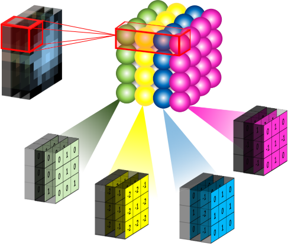

class: content

```{r init-r, include=FALSE}
options(htmltools.dir.version = FALSE)
```

<div class="content-page">
  <p class="content-page-title">目录</p>
  <li class="content-page-list">人工神经网络</li>
  <li class="content-page-list">卷积神经网络</li>
  <li class="content-page-list">循环神经网络</li>
  <li class="content-page-list">深度学习框架</li>
</div>

---
class: section, center, middle

# 人工神经网络

---
class:

# M-P 模型

**人工神经网络** (Artificial Neural Network, ANN) 是一种模仿生物神经网络的结构和功能的数学模型或计算模型，用于对函数进行估计或近似。根据生物的神经元，我们可以构建一个 M-P (MeCulloch-Pitts) 模型：

```{r, echo=F, fig.align='center', out.width='36%'}

```

.center[
M-P 模型
]

---
class:

# M-P 模型

对于一个神经元型 $j$ 主要由 3 部分组成：

1. **输入信号**
连接到神经元 $j$ 上的输入信号分别为 $x_1, ..., x_i, ..., x_n$ 共 $n$ 个，每个信号的权重为 $w_{ij}$ 。同时感知器还包含一个外部偏置 (bias)，记为 $+1$。因此信号 $x_i$ 对于感知器 $j$ 的影响为即为信号 $x_i$ 乘上对应的权重 $w_{ij}$ 加上偏置的影响 $b_j$。
2. **加法器**
输入信号对神经元 $j$ 的影响为各个信号的影响之和，即：
$$u_j = \sum_{i=1}^{n} w_{ij} x_i + b_j$$
因此该操作构成了一个输入信号的线性组合器。
3. **激活函数**
对于神经元 $j$，当输入信号对感知器的总影响 $u_j$ 时，神经元在激活函数 $f$ 的影响下向下发出信号 $O_j$。整个过程可以利用一个激活函数表示：
$$O_j = f\left(\sum_{i=1}^{n} \left(w_{ij} x_i + b\right)\right)$$

---
class:

# 激活函数

神经元利用激活函数 $f\left(v\right)$ 判断是否产生输出信号，常用的激活函数有：

.pull-left[
**阈值函数**是指当自变量的值大于某个阈值是，函数值为 $1$，否则为 $0$，可以表示为：

$$f\left(v\right) = \left\{
\begin{array}{c}
  1 \quad \text{如果 }v \leq 0 \\
  0 \quad \text{如果 }v < 0 \\
\end{array}\right.$$

有些时候我们可能需要值域为 $\left[-1, 1\right]$ 的激活函数，阈值函数可以表示为：

$$f\left(v\right) = \left\{
\begin{array}{c}
  1 \quad \text{如果 }v > 0 \\
  0 \quad \text{如果 }v = 0 \\
  -1 \quad \text{如果 }v < 0 \\
\end{array}\right.$$
]

.pull-right[
```{r, echo=F, message=F, warning=F, dpi=300, fig.height=4, fig.width=6, out.width='100%'}
library(showtext)
showtext_auto()

old_par <- par()

threshold_function1_x <- c(-1, 0, 0, 1)
threshold_function1_y <- c(0, 0, 1, 1)
threshold_function2_x <- c(-1, 0, 0, 1)
threshold_function2_y <- c(-1, -1, 1, 1)

par(bty = 'n', family='Source Han Sans SC', mar = c(2, 2, 2, 2))

plot(
  threshold_function1_x, threshold_function1_y,
  type='l', xlab='', ylab='', lty='solid', lwd=2, col='blue',
  ylim=c(-1, 1))
lines(
  threshold_function2_x, threshold_function2_y,
  type='l', xlab='', ylab='', lty='dashed', lwd=2, col='green')
legend(
  0.2, 0.8, inset=.05, title='激活函数',
  legend=c('TH 1', 'TH 2'),
  lwd=2, col=c('green', 'blue'), lty=c('dashed', 'solid'))

par(old_par)
```
]

---
class:

# 激活函数

.pull-left[
**sigmoid 函数**是人工神经网络中常用的一种激活函数，其形状为一条 “S” 形的曲线。logistic 函数为 sigmoid 函数的一种，其定义为：

$$f\left(v\right) = \dfrac{1}{1 + e^{-\alpha v}}$$

Logistic 函数不同于阈值函数，其在任意一点是连续可微的。**signum 函数**和 sigmoid 函数类似，只是函数值的取值范围为 $\left[-1, -1\right]$。双曲正切函数为 signum 函数的一种，其定义为：


$$f\left(v\right) = \tanh \left(v\right) = \dfrac{e^{v} - e^{-v}}{e^{v} + e^{-v}}$$
]

.pull-right[
```{r, echo=F, warning=F, dpi=300, fig.height=4, fig.width=6, out.width='100%'}
library(showtext)
showtext_auto()

old_par <- par()

logistic_function <- function(x) {
    1 / (1 + exp(-x))
}

logistic_function_x <- seq(-6, 6, by=0.1)
logistic_function_y <- logistic_function(logistic_function_x)

tanh_function <- function(x) {
    tanh(x)
}
tanh_function_x <- seq(-6, 6, by=0.1)
tanh_function_y <- tanh_function(tanh_function_x)

par(bty = 'n', family='Source Han Sans SC', mar = c(2, 2, 2, 2))

plot(
  tanh_function_x, tanh_function_y,
  type='l', xlab='', ylab='', lty='solid', lwd=2, col='blue',
  ylim=c(-1, 1))
lines(
  logistic_function_x, logistic_function_y,
  type='l', xlab='', ylab='', lty='dashed', lwd=2, col='green')
legend(
  0.2, -0.1, inset=.05, title='激活函数',
  legend=c('Logistic', '双曲正切函数'),
  lwd=2, col=c('green', 'blue'), lty=c('dashed', 'solid'))

par(old_par)
```
]

---
class:

# 激活函数

ReLU (Rectified Linear Unit) 是由 Nair <sup>[1]</sup> 等人提出的一种非线性激活函数：

$$f\left(v\right) = \max \left(0, v\right)$$

随着 ReLU 激励函数的引入，神经网络尤其是深度学习技术在一定程度上取得了更大的进展。ReLU 函数的引入解决了传统激活函数的一些问题，例如：

- 对于网络层数较多的神经网络，传统的激活函数 (例如：Sigmod 函数) 由于其两端的导数值趋于 0，会导致在反向计算时出现梯度消失的问题。ReLU 函数在 $> 0$ 时导数为 $1$，从而可以更加有效的完成深层网络的训练。
- ReLU 函数的计算量相对比较小。在反向传播过程计算梯度时，传统激活函数求导时计算量较大，而 ReLU 函数仅需使用比较等简单计算方法，节约大量时间。
- ReLU 函数为单边抑制函数 (当 $x < 0$ 时，ReLU 函数的值为 $0$)，这会使得网络中的部分神将元的输出为 $0$，这样具有稀疏性的网络可以缓解了过拟合问题的发生。

.footnote[
[1] Nair, Vinod, and Geoffrey E. Hinton. "Rectified linear units improve restricted boltzmann machines." _Proceedings of the 27th international conference on machine learning (ICML-10)_. 2010.
]

---
class:

# 激活函数

.pull-left[
类似 ReLU 函数，另一种更加平滑的激活函数叫 SoftPlus <sup>[1]</sup>，函数定义如下：

$$f\left(v\right) = \ln \left(1 + e^{v}\right)$$

该函数的导数是我们之前介绍的 Logistic 函数：

$$f'\left(v\right) = \dfrac{e^{v}}{e^{v} + 1} = \dfrac{1}{1 + e^{-v}}$$
]

.pull-right[
```{r, echo=F, warning=F, dpi=300, fig.height=4, fig.width=6, out.width='100%'}
library(showtext)
showtext_auto()

old_par <- par()

relu <- function(x) {
    sapply(x, function(x) {max(x, 0)})
}

softplus <- function(x) {
    log(1 + exp(x))
}

x <- seq(-2, 2, by=0.1)
relu_y <- relu(x)
softplus_y <- softplus(x)

par(bty = 'n', family='Source Han Sans SC', mar = c(2, 2, 2, 2))

plot(
  x, relu_y,
  type='l', xlab='', ylab='', lty='solid', lwd=2, col='blue',
  ylim=c(0, 2))
lines(
  x, softplus_y,
  type='l', xlab='', ylab='', lty='dashed', lwd=2, col='green')
legend(
  -1.8, 1.8, inset=.05, title='激活函数',
  legend=c('ReLU', 'SoftPlus'),
  lwd=2, col=c('green', 'blue'), lty=c('dashed', 'solid'))

par(old_par)
```
]

.footnote[
[1] Dugas, Charles, et al. "Incorporating second-order functional knowledge for better option pricing." _Advances in neural information processing systems_. 2001.
]

---
class:

# 单层感知器

感知器 (Perceptron) 模型是由 Rosenblatt 于 1958 年提出 <sup>[1]</sup>。感知器模型为一个二分类分类器，利用一个超平面将输入空间 (特征空间) 划分为正负两类。

单层感知器是指对于输入信号，中间不再经过任何隐含层的处理，直接利用激活函数映射到输出的感知器。对于输入空间 (特征空间) $\mathcal{X} \subseteq \mathbb{R}^2$，输出空间为 $\mathcal{Y} = \lbrace+1, -1 \rbrace$，其中 $x \in \mathcal{X}$ 为特征向量，则由输入空间到输出空间的映射：

$$f\left(x\right) = \mathrm{sign} \left(w \cdot x + b\right)$$

其中，
$w \in \mathbb{R}^n$ 为输入特征 $x$ 的权重，
$b \in \mathbb{R}$ 为偏置，
$\mathrm{sign}$ 为激活函数。对于一个线性可分的数据集：

$$T = \lbrace \left(x_1, y_1\right), \left(x_2, y_2\right), ..., \left(x_n, y_n\right) \rbrace$$

一定会存在一个超平面 $w \cdot x + b = 0$ 可以将数据集划分为正负两个部分。对于所有的正样本 $x_i$，有 $w \cdot x_i + b > 0$，对于所有的负样本 $x_j$，有 $w \cdot x_j + b < 0$。

.footnote[
[1] Rosenblatt, Frank. "The perceptron: a probabilistic model for information storage and organization in the brain." _Psychological review_ 65.6 (1958): 386.
]

---
class:

# 单层感知器

对于线性可分数据集，单层感知器的目标就是找到这样一个超平面将数据划分为正负两个部分。在感知器进行学习并确定参数 $w$ 和 $b$ 时，需要构造一个最优化问题。对于最优化问题，我们首先需要确定一个损失函数，通过最小化损失函数求解最优化问题。单层感知器将所有误分类样本点 $x_i \in M$ 到超平面的距离之和作为损失函数，对于样本点 $x_i \in \mathbb{R}^n$，到超平面的距离定义为：

$$D = \dfrac{1}{\left\|w\right\|} \left|w \cdot x_i + b\right|$$

因此误分类样本点 $x_i \in M$ 到超平面的距离之和为：

$$- \dfrac{1}{\left\|w\right\|} \sum_{x_i \in M} y_i \left(w \cdot x_i + b\right)$$

其中 $y_i \in \lbrace+1, -1\rbrace$ 为样本点的误分类。不考虑常数项 $\dfrac{1}{\left\|w\right\|}$，可以得到单层感知器的损失函数：

$$L\left(w, b\right) = - \sum_{x_i \in M} y_i \left(w \cdot x_i + b\right)$$

---
class:

# 单层感知器

从而单层感知器的优化问题可以表示为：

$$\min_{w, b} L\left(w, b\right) = - \sum_{x_i \in M} y_i \left(w \cdot x_i + b\right)$$

求解感知器最优化问题时，首先，任意选取参数 $w_0$ 和 $b_0$，假设误分类点的集合为 $M$，则损失函数 $L\left(w, b\right)$ 梯度为：

$$\begin{split}
\nabla_w L\left(w, b\right) &= - \sum_{x_i \in M} y_i x_i \\
\nabla_b L\left(w, b\right) &= - \sum_{x_i \in M} y_i
\end{split}$$

当利用随机梯度下降法 (Stochastic Gradient Descent）并不会利用整体的梯度去更新参数，而是随机选取一个误分类点 $\left(x_i, y_i\right)$ 对参数 $w, b$ 进行更新：

$$\begin{split}
w &\gets w + \eta y_i x_i \\
b &\gets b + \eta y_i
\end{split}$$

其中，
$0 < \eta \leq 1$ 为每次更新参数的步长，也称之为学习速率 (Learning Rate)。

---
class:

# 多层感知器

单层感知器仅可以处理线性可分数据集，对于线性不可分问题，单层感知器无能为力。我们可以利用“逻辑或”，“逻辑与”和“逻辑异或”形象的描述线性可分问题和线性不可分问题。

对于线性不可分问题，单层感知器络已经无能为力，因此多层感知器 (Multilayer Perceptron, MLP) 应运而生。多层感知器是指在单层感知器的输入层和输出层之间加入隐含层，从而使得感知器可以处理线性不可分问题。

.center[
```{r, echo=F, dpi=300, out.width='40%'}

```
]

---
class:

# 多层感知器

|   类型   |                          结构                          |         决策区域         |                   决策区域形状                    |                     异或问题                     |
| :------: | :----------------------------------------------------: | :----------------------: | :-----------------------------------------------: | :----------------------------------------------: |
| 无隐含层 |  | 一个超平面划分为两个部分 |  |  |
| 单隐含层 |  |    开凸区域或闭凸区域    |  |  |
| 双隐含层 |  |         任意形状         |  |  |

---
class:

# BP 神经网络

BP 神经网络通常是指一种多层前馈神经网络，它是当前神经网络中最具代表的一种神经网络，其核心算法为误差的反向传播算法 (Back Propagation, BP)。BP 神经网络的基本思想可以概括为 **信号的正向传播** 和 **误差的反向传播** 两个过程。

.center[
```{r, echo=F, dpi=300, out.width='40%'}

```
]

其中 $a^{\left(1\right)}_i$ 为输入层，
$a^{\left(2\right)}_i$ 和 $a^{\left(3\right)}_i$为隐含层，
$a^{\left(4\right)}_i$为输出层，
$b$为对应层的偏置。

---
class:

# BP 神经网络

整个BP神经网络训练的过程是一个不断迭代的过程，在每一轮训练过程中连接各个节点之间的权重 $w$ 和偏置 $b$ 都会根据训练集被更新。整个 BP 算法过程描述如下：

首先初始化网络中所有的权重 $w$ 和偏置 $b$。每一轮迭代过程中，根据上一层神经元的输入，连接到下一层的权重和偏置，利用信号的正向传播计算出下一层每个节点神经元的值。对于下一层中的节点 $a_j$，其信号输出值的计算方式如下：

$$y_j = f \left(\sum_{i=1}^{n} w_{ij} x_i + b\right)$$

其中 $x_i$ 为上一层与之相连的神经元，
$w_{ij}$ 为连接的权重，
$b$ 为上一层的偏置，
$f$ 为激活函数。对于一个给定的训练集 $D = \{\left(x^{\left(1\right)}, y^{\left(2\right)}\right),\left(x^{\left(2\right)}, y^{\left(1\right)}\right), ..., \left(x^{\left(m\right)}, y^{\left(m\right)}\right)\}$ 共 $m$ 个样本，其中  $x^{\left(i\right)} \in \mathbb{R}^d, y^{\left(i\right)} \in \mathbb{R}^l$，即输入变量包含 $d$ 个属性 (输入层有 $d$ 个神经元)，输出变量包含 $l$ 个属性 (输出层有 $l$ 个神经元)，上例中输入层有 $2$ 个神经元，输出层有 $1$ 个神经元。对于单个样本 $\left(x, y\right)$，其代价函数为：

$$J \left(w, b; x, y\right) = \dfrac{1}{2} {\|f_{w, b} \left(x\right) - y\|}^2$$

---
class:

# BP 神经网络

对于给定的一个包含 $m$ 个样本的数据集，我们可以定义整体代价函数为：

$$\begin{split}
J \left(w, b\right) &= \dfrac{1}{m} \sum_{i=1}^{m} J \left(w, b; x^{\left(i\right)}, y^{\left(i\right)}\right) + \lambda r\left(w\right) \\
&= \dfrac{1}{m} \sum_{i=1}^{m} \left(\dfrac{1}{2} {\|f_{w, b} \left(x\right) - y\|}^2\right) + \lambda r\left(w\right)
\end{split}$$

其中 $r\left(w\right)$ 为正则化项，
$\lambda$ 为正则化项的参数，其目的是通过减少结构风险防止过拟合。

BP 算法通过梯度下降 (Gradient Descent) 以目标的负梯度方向调整参数，则在每一次迭代中对参数 $w$ 和 $b$ 的更新如下：

$$\begin{split}
w^{\left(l\right)}_{ij} &= w^{\left(l\right)}_{ij} - \alpha \dfrac{\partial}{\partial w^{\left(l\right)}_{ij}} J \left(w, b\right) \\
b^{\left(l\right)}_{i} &= b^{\left(l\right)}_{i} - \alpha \dfrac{\partial}{\partial b^{\left(l\right)}_{ij}} J \left(w, b\right)
\end{split}$$

---
class:

# BP 神经网络

对于一个给定的样本 $\left(x, y\right)$，我们已经通过“前向传导”计算出了网络中所有节点的值，首先，对于输出层 (第 $n_l$ 层)，我们计算其输出值的残差对上一层的影响：

$$\begin{split}
\delta^{\left(n_l\right)}_i &= \dfrac{\partial}{\partial z^{\left(n_l\right)}_i} \dfrac{1}{2} {\|y - f_{w, b} \left(x\right)\|}^2 \\
&= - \left(y_i - a^{\left(n_l\right)}_i\right) f'\left(z^{\left(n_l\right)}_i\right)
\end{split}$$

其中，
$z^{\left(l+1\right)} = w^{\left(l\right)} x + b^{\left(l\right)}$。对于 $l = n_l - 1, n_l - 2, ..., 2$ 层，各层的第 $i$ 个节点的残差影响为：

$$\delta^{\left(l\right)}_i = \left(\sum_{j=1}^{s_l + 1} w^{\left(l\right)}_{ji} \delta^{\left(l+1\right)}_j\right) f' \left(z^{\left(l\right)}_i\right)$$

---
class:

# BP 神经网络

通过计算：

$$\begin{split}
\dfrac{\partial}{\partial w^{\left(l\right)}_{ij}} J \left(w, b; x, y\right) &= a^{\left(l\right)}_j \delta^{\left(l+1\right)}_i \\
\dfrac{\partial}{\partial b^{\left(l\right)}_{ij}} J \left(w, b; x, y\right) &= \delta^{\left(l+1\right)}_i
\end{split}$$

每一次迭代中对参数 $w$ 和 $b$ 的更新为：

$$\begin{split}
w^{\left(l\right)}_{ij} &= w^{\left(l\right)}_{ij} - \alpha a^{\left(l\right)}_j \delta^{\left(l+1\right)}_i \\
b^{\left(l\right)}_{i} &= b^{\left(l\right)}_{i} - \alpha \delta^{\left(l+1\right)}_i
\end{split}$$
---
class:

# BP 神经网络

则对于 $m$ 个样本，利用剃度下降算法实现一次迭代的过程如下：

1. 对于所有 $l$，初始化该层的 $w$ 和 $b$。
2. 对于 $i = 1$ 到 $m$:
   - 利用反向传导算法计算偏导数 $\nabla_{w^{\left(l\right)}}$ 和 $\nabla_{b^{\left(l\right)}}$。
   - 计算 $\Delta w^{\left(l\right)}_{i} = \Delta w^{\left(l\right)}_{i} + \nabla_{w^{\left(l\right)}}$。
   - 更新 $\Delta b^{\left(l\right)}_{i} = \Delta b^{\left(l\right)}_{i} + \nabla_{b^{\left(l\right)}}$。
3. 更新参数
$$\begin{split}
w^{\left(l\right)} &= w^{\left(l\right)} - \alpha \left[\left(\dfrac{1}{m} \sum_{i=1}^{m} \Delta w^{\left(l\right)}_{i}\right) + \lambda r\left(w^{\left(l\right)}\right)\right] \\
b^{\left(l\right)} &= b^{\left(l\right)} - \alpha \left(\sum_{i=1}^{m} \Delta b^{\left(l\right)}_{i}\right)
\end{split}$$

不断的重复上述过程来逐步减小设置的损失函数值 $J \left(w, b\right)$，当达到停止条件时，则可以得到最终训练好的神经网络。

---
class: section, center, middle

# 卷积神经网络

---
class:

# 发展史

卷积神经网络 (Convolutional Neural Network, CNN) 是一种目前广泛用于图像，自然语言处理等领域的深度神经网络模型。1998 年，Lecun 等人提出了一种基于梯度的反向传播算法用于文档的识别。在这个神经网络中，卷积层 (Convolutional Layer) 扮演着至关重要的角色。

随着运算能力的不断增强，一些大型的 CNN 网络开始在图像领域中展现出巨大的优势，2012 年，Krizhevsky 等人提出了 AlexNet 网络结构，并在 ImageNet 图像分类竞赛中以超过之前 11% 的优势取得了冠军。随后不同的学者提出了一系列的网络结构并不断刷新 ImageNet 的成绩，其中比较经典的网络包括：VGG (Visual Geometry Group)，GoogLeNet 和 ResNet。

CNN 在图像分类问题上取得了不凡的成绩，同时一些学者也尝试将其应用在图像的其他领域，例如：物体检测，语义分割，图像摘要，行为识别等。除此之外，在非图像领域 CNN 也取得了一定的成绩。

.footnote[
[1] 卷积神经网络：https://leovan.me/cn/2018/08/cnn/
]

---
class:

# LeNet-5

下图为 Lecun 等人 <sup>[1]</sup> 提出的 LeNet-5 的网络架构：

.center[

]

下面我们针对 CNN 网络中的不同类型的网络层逐一进行介绍。

.footnote[
[1] LeCun, Yann, et al. "Gradient-based learning applied to document recognition." _Proceedings of the IEEE_ 86.11 (1998): 2278-2324.
]

---
class:

# 输入层

.pull-left[
LeNet-5 解决的手写数字分类问题的输入为一张 32x32 像素的灰度图像 (Gray Scale)。日常生活中计算机常用的图像的表示方式为 RGB，即将一张图片分为红色通道 (Red Channel)，绿色通道 (Green Channel) 和蓝色通道 (Blue Channel)，其中每个通道的每个像素点的数值范围为 [0, 255]。灰度图像表示该图片仅包含一个通道，也就是不具备彩色信息，每个像素点的数值范围同 RGB 图像的取值范围相同。因此，一张图片在计算机的眼里就是一个如右图所示的数字矩阵。

在将图像输入到 CNN 网络之前，通常我们会对其进行预处理，因为每个像素点的最大取值为 255，因此将每个像素点的值除以 255 可以将其归一化到 [0, 1] 的范围。
]

.pull-right[

]

---
class:

# 卷积层

在了解卷积层之前，让我们先来了解一下什么是卷积？设 $f\left(x\right), g\left(x\right)$ 是 $\mathbb{R}$ 上的两个可积函数，则卷积定义为：

$$\left(f * g\right) \left(x\right) = \int_{- \infty}^{\infty}{f \left(\tau\right) g \left(x - \tau\right) d \tau}$$

离散形式定义为：

$$\left(f * g\right) \left(x\right) = \sum_{\tau = - \infty}^{\infty}{f \left(\tau\right) g \left(x - \tau\right)}$$

我们用一个示例来形象的理解一下卷积的含义，以离散的形式为例，假设我们有两个骰子，
$f\left(x\right), g\left(x\right)$ 分别表示投两个骰子，
$x$ 面朝上的概率。

$$f \left(x\right) = g \left(x\right) = \begin{cases}
1/6 & x = 1, 2, 3, 4, 5, 6 \\
0 & \text{otherwise}
\end{cases}$$

---
class:

# 卷积层

卷积 $\left(f * g\right) \left(x\right)$ 表示投两个骰子，朝上数字之和为 $x$ 的概率。则和为 $4$ 的概率为：

$$\begin{split}
\left(f * g\right) \left(4\right) &= \sum_{\tau = 1}^{6}{f \left(\tau\right) g \left(4 - \tau\right)} \\
&= f \left(1\right) g \left(4 - 1\right) + f \left(2\right) g \left(4 - 2\right) + f \left(3\right) g \left(4 - 3\right) \\
&= 1/6 \times 1/6 + 1/6 \times 1/6 + 1/6 \times 1/6 \\
&= 1/12
\end{split}$$

这是一维的情况，我们处理的图像为一个二维的矩阵，因此类似的有：

$$\left(f * g\right) \left(x, y\right) = \sum_{v = - \infty}^{\infty}{\sum_{h = - \infty}^{\infty}{f \left(h, v\right) g \left(x - h, y - v\right)}}$$

---
class:

# 卷积层

这次我们用一个抽象的例子解释二维情况下卷积的计算，设 $f, g$ 对应的概率矩阵如下：

$$f =
\left[
    \begin{array}{ccc}
        \color{red}{a_{0, 0}} & \color{orange}{a_{0, 1}} & \color{yellow}{a_{0, 2}} \\
        \color{green}{a_{1, 0}} & \color{cyan}{a_{1, 1}} & \color{blue}{a_{1, 2}} \\
        \color{purple}{a_{2, 0}} & \color{black}{a_{2, 1}} & \color{gray}{a_{2, 2}}
    \end{array}
\right]
,
g =
\left[
    \begin{array}{ccc}
        \color{gray}{b_{-1, -1}} & \color{black}{b_{-1, 0}} & \color{purple}{b_{-1, 1}} \\
        \color{blue}{b_{0, -1}} & \color{cyan}{b_{0, 0}} & \color{green}{b_{0, 1}} \\
        \color{yellow}{b_{1, -1}} & \color{orange}{b_{1, 0}} & \color{red}{b_{1, 1}}
    \end{array}
\right]$$

则 $\left(f * g\right) \left(1, 1\right)$ 计算方式如下：

$$\left(f * g\right) \left(1, 1\right) = \sum_{v = 0}^{2}{\sum_{h = 0}^{2}{f \left(h, v\right) g \left(1 - h, 1 - v\right)}}$$

从这个计算公式中我们就不难看出为什么上面的 $f, g$ 两个概率矩阵的角标会写成上述形式，即两个矩阵相同位置的角标之和均为 $1$。
$\left(f * g\right) \left(1, 1\right)$ 即为 $f, g$ 两个矩阵中对应颜色的元素乘积之和。

---
class:

# 卷积层

在上例中，
$f, g$ 两个概率矩阵的大小相同，而在 CNN 中，
$f$ 为输入的图像，
$g$ 一般是一个相对较小的矩阵，我们称之为卷积核。这种情况下，卷积的计算方式是类似的，只是会将 $g$ 矩阵旋转 $180^{\circ}$ 使得相乘的元素的位置也相同，同时需要 $g$ 在 $f$ 上进行滑动并计算对应位置的卷积值。下图展示了一步计算的具体过程：

.center[
```{r, echo=F, out.width='70%'}

```
]

---
class:

# 卷积层

.pull-left[
一些预设的卷积核对于图片可以起到不同的滤波器效果，例如下面 4 个卷积核分别会对图像产生不同的效果：不改变，边缘检测，锐化和高斯模糊。

$$\left[
    \begin{array}{ccc}
        0 & 0 & 0 \\
        0 & 1 & 0 \\
        0 & 0 & 0
    \end{array}
\right]
,
\left[
    \begin{array}{ccc}
        -1 & -1 & -1 \\
        -1 &  8 & -1 \\
        -1 & -1 & -1
    \end{array}
\right]
,
\left[
    \begin{array}{ccc}
        0  & -1 & 0 \\
        -1 &  5 & -1 \\
        0  & -1 & 0
    \end{array}
\right]
,
\dfrac{1}{16} \left[
    \begin{array}{ccc}
        1 & 2 & 1 \\
        2 & 4 & 2 \\
        1 & 2 & 1
    \end{array}
\right]$$

对 lena 图片应用这 4 个卷积核，变换后的效果如右图所示 (从左到右，从上到下)。整个计算卷积的过程中，利用 3x3 大小 (这个参数称之为 `kernel_size`) 的卷积核对 5x5 大小的原始矩阵进行卷积操作后，结果矩阵并没有保持原来的大小，而是变为了 (5-(3-1))x(5-(3-1)) (即 3x3) 大小的矩阵。这就需要引入 CNN 网络中卷积层的两个常用参数 `padding` 和 `strides`。
]

.pull-right[.center[

]]

---
class:

# 卷积层

.pull-left[
`padding` 是指是否对图像的外侧进行**补零操作**，其取值一般为 `VALID` 和 `SAME` 两种。

`VALID` 表示**不进行补零**操作，对于输入形状为 $\left(x, y\right)$ 的矩阵，利用形状为 $\left(m, n\right)$ 的卷积核进行卷积，得到的结果矩阵的形状则为 $\left(x-m+1, y-n+1\right)$。

`SAME` 表示**进行补零**操作，在进行卷积操作前，会对图像的四个边缘分别向左右补充 $\left(m \mid 2 \right) + 1$ 个零，向上下补充 $\left(n \mid 2 \right) + 1$ 个零 (
$\mid$ 表示整除)，从而保证进行卷积操作后，结果的形状与原图像的形状保持相同。
]

.pull-right[.center[

]]

---
class:

# 卷积层

.pull-left[
`strides` 是指进行卷积操作时，每次卷积核移动的步长。示例中，卷积核在横轴和纵轴方向上的移动步长均为 1，除此之外用于也可以指定不同的步长。移动的步长同样会对卷积后的结果的形状产生影响。

除此之外，还有另一个重要的参数 `filters`，其表示在一个卷积层中使用的**卷积核的个数**。在一个卷积层中，一个卷积核可以学习并提取图像的一种特征，但往往图片中包含多种不同的特征信息，因此我们需要多个不同的卷积核提取不同的特征。右图是一个利用 4 个不同的卷积核对一张图像进行卷积操作的示意图：
]

.pull-right[.center[

]]

---
class:

# 卷积层

.pull-left[
上面我们都是以一个灰度图像 (仅包含 1 个通道) 为示例进行的讨论，那么对于一个 RGB 图像 (包含 3 个通道)，相应的，卷积核也是一个 3 维的形状，如右图所示：
]

.pull-right[.center[

]]

---
class:

# 卷积层

.pull-left[
卷积层对于我们的神经网络的模型带来的改进主要包括如下三个方面：**稀疏交互 (sparse interactions)**，**参数共享 (parameter sharing)** 和**等变表示 (equivariant representations)**。

在全连接的神经网络中，隐含层中的每一个节点都和上一层的所有节点相连，同时有被连接到下一层的全部节点。而卷积层不同，节点之间的连接性受到卷积核大小的制约。右图分别以自下而上 (左) 和自上而下 (右) 两个角度对比了卷积层和全连接层节点之间连接性的差异。

我们可以看出节点 $s_3$ 受到节点 $x_2$，
$x_3$ 和 $x_4$ 的影响，这些节点被称之为 $s_3$ 的**接受域 (receptive field)**。
]

.pull-right[.center[

]]

---
class:

# 卷积层

.pull-left[
稀疏交互使得在 $m$ 个输入和 $n$ 个输出的情况下，参数的个数由 $m \times n$ 个减少至 $k \times n$ 个，其中 $k$ 为卷积核的大小。尽管一个节点在一个层级之间仅与其接受域内的节点相关联，但是对于深层中的节点，其与绝大部分输入之间却存在这**间接交互**，如右图所示：

节点 $g_3$ 尽管**直接**的连接是稀疏的，但处于更深的层中可以**间接**的连接到全部或者大部分的输入节点。这就使得网络可以仅通过这种稀疏交互来高效的描述多个输入变量之间的复杂关系。
]

.pull-right[.center[

]]

---
class:

# 卷积层

.pull-left[
除了稀疏交互带来的参数减少外，**参数共享**也起到了类似的作用。所谓参数共享就是指在进行不同操作时使用相同的参数，具体而言也就是在我们利用卷积核在图像上滑动计算卷积时，每一步使用的卷积核都是相同的。

在全连接网络中，任意两个节点之间的连接 (权重) 仅用于这两个节点之间，而在卷积层中，如上图所示，其对卷积核中间节点 (黑色箭头) 的使用方式 (权重) 是相同的。参数共享虽然对于计算的时间复杂度没有带来改进，仍然是 $O \left(k \times n\right)$，但其却将参数个数降低至 $k$ 个。正是由于参数共享机制，使得卷积层具有平移 **等变 (equivariance)** 的性质。对于函数 $f\left(x\right)$ 和 $g\left(x\right)$，如果满足 $f\left(g\left(x\right)\right) = g\left(f\left(x\right)\right)$，我们就称 $f\left(x\right)$ 对于变换 $g$ 具有等变性。简言之，对于图像如果我们将所有的像素点进行移动，卷积后的输出表示也会移动同样的量。
]

.pull-right[.center[

]]

---
class:

# 非线性层

非线性层并不是 CNN 特有的网络层，在此我们不再详细介绍，一般情况下我们会使用 ReLU 作为我们的激活函数。

---
class:

# 池化层

**池化层** 是一个利用 **池化函数 (pooling function)** 对网络输出进行进一步调整的网络层。池化函数使用某一位置的相邻输出的总体统计特征来代替网络在该位置的输出。常用的池化函数包括最大池化 (max pooling) 函数 (即给出邻域内的最大值) 和平均池化 (average pooling) 函数 (即给出邻域内的平均值) 等。但无论选择何种池化函数，当对输入做出少量平移时，池化对输入的表示都近似 **不变 (invariant)**。**局部平移不变性** 是一个很重要的性质，尤其是当我们关心某个特征是否出现而不关心它出现的位置时。

.pull-left[
池化层同卷积层类似，具有三个比较重要的参数：`pool_size`，`strides` 和 `padding`，分别表示池化窗口的大小，步长以及是否对图像的外侧进行补零操作。

池化层同时也能够提高网络的计算效率，例如上图中在横轴和纵轴的步长均为 $3$，经过池化后，下一层网络节点的个数降低至前一层的 $\dfrac{1}{3 \times 3} = \dfrac{1}{9}$。
]

.pull-right[.center[

]]

---
class:

# 全连接层

全链接层 (Fully-connected or Dense Layer) 的目的就是将我们最后一个池化层的输出连接到最终的输出节点上。例如，最后一个池化层的输出大小为 $\left[5 \times 5 \times 16\right]$，也就是有 $5 \times 5 \times 16 = 400$ 个节点，对于手写数字识别的问题，我们的输出为 0 至 9 共 10 个数字，采用 one-hot 编码的话，输出层共 10 个节点。例如在 LeNet 中有 2 个全连接层，每层的节点数分别为 120 和 84，在实际应用中，通常全连接层的节点数会逐层递减。需要注意的是，在进行编码的时候，第一个全连接层并不是直接与最后一个池化层相连，而是先对池化层进行 flatten 操作，使其变成一个一维向量后再与全连接层相连。

---
class:

# 输出层

输出层根据具体问题的不同会略有不同，例如对于手写数字识别问题，采用 one-hot 编码的话，输出层则包含 10 个节点。对于回归或二分类问题，输出层则仅包含 1 个节点。当然对于二分类问题，我们也可以像多分类问题一样将其利用 one-hot 进行编码，例如 $\left[1, 0\right]$ 表示类型 0，
$\left[0, 1\right]$ 表示类型 1。

---
class:

# 模型比较

.center[
```{r, echo=F, out.width='80%'}

```
]

上图 (左) 展示了在 ImageNet 挑战赛中不同 CNN 网络模型的 Top-1 的准确率。可以看出 ResNet 和 Inception 架构以至少 7% 的显著优势超过了其他架构。上图 (右) 以另一种形式展现了除了准确率以外的更多信息，包括计算成本和网络的参数个数，其中横轴为计算成本，纵轴为 Top-1 的准确率，气泡的大小为网络的参数个数。可以看出 ResNet 和 Inception 架构相比 AlexNet 和 VGG 不仅有更高的准确率，在计算成本和参数个数 (模型大小) 方面也具有一定优势。

---
class: section, center, middle

# 循环神经网络

---
class:

# 网络结构

循环神经网络 (Recurrent Neural Network, RNN) 一般是指时间递归神经网络而非结构递归神经网络 (Recursive Neural Network)，其主要用于对序列数据进行建模。

.pull-left[
不同于传统的前馈神经网络接受特定的输入得到输出，RNN 由人工神经元和一个或多个反馈循环构成，如右图所示。

对于展开后的网络结构，其输入为一个时间序列 $\left\{\dotsc, \boldsymbol{x}_{t-1}, \boldsymbol{x}_t, \boldsymbol{x}_{t+1}, \dotsc\right\}$，其中 $\boldsymbol{x}_t \in \mathbb{R}^n$，
$n$ 为输入层神经元个数。
]

.pull-right[.center[

]]

.footnote[
[1] 循环神经网络：https://leovan.me/cn/2018/09/rnn/
]

---
class:

# 网络结构

其中隐含层包含一个循环，为了便于理解我们将循环进行展开，展开后的网络结构如下图所示：

.center[

]

相应的隐含层为 $\left\{\dotsc, \boldsymbol{h}_{t-1}, \boldsymbol{h}_t, \boldsymbol{h}_{t+1}, \dotsc\right\}$，其中 $\boldsymbol{h}_t \in \mathbb{R}^m$，
$m$ 为隐含层神经元个数。隐含层节点使用较小的非零数据进行初始化可以提升整体的性能和网络的稳定性 <sup>[1]</sup>。

.footnote[
[1] Sutskever, Ilya, et al. "On the importance of initialization and momentum in deep learning." _International conference on machine learning_. 2013.
]

---
class:

# 网络结构

隐含层定义了整个系统的状态空间 (state space)，或称之为 memory <sup>[1]</sup>：

$$\boldsymbol{h}_t = f_H \left(\boldsymbol{o}_t\right)$$

其中

$$\boldsymbol{o}_t = \boldsymbol{W}_{IH} \boldsymbol{x}_t + \boldsymbol{W}_{HH} \boldsymbol{h}_{t-1} + \boldsymbol{b}_h$$
$f_H \left(\cdot\right)$ 为隐含层的激活函数，
$\boldsymbol{b}_h$ 为隐含层的偏置向量。对应的输出层为 $\left\{\dotsc, \boldsymbol{y}_{t-1}, \boldsymbol{y}_t, \boldsymbol{y}_{t+1}, \dotsc\right\}$，其中 $\boldsymbol{y}_t \in \mathbb{R}^p$，
$p$ 为输出层神经元个数。则：

$$\boldsymbol{y}_t = f_O \left(\boldsymbol{W}_{HO} \boldsymbol{h}_t + \boldsymbol{b}_o\right)$$

其中 $f_O \left(\cdot\right)$ 为隐含层的激活函数，
$\boldsymbol{b}_o$ 为隐含层的偏置向量。

.footnote[
[1] Salehinejad, Hojjat, et al. "Recent advances in recurrent neural networks." _arXiv preprint arXiv:1801.01078_ (2017).
]

---
class:

# 网络结构

在 RNN 中常用的激活函数为双曲正切函数：

$$\tanh \left(x\right) = \dfrac{e^{2x} - 1}{e^{2x} + 1}$$

Tanh 函数实际上是 Sigmoid 函数的缩放：

$$\sigma \left(x\right) = \dfrac{1}{1 + e^{-x}} = \dfrac{\tanh \left(x / 2\right) + 1}{2}$$

---
class:

# 梯度弥散和梯度爆炸

原始 RNN 存在的严重的问题就是**梯度弥散 (Vanishing Gradients)** 和**梯度爆炸 (Exploding Gradients)**。我们以时间序列中的 3 个时间点 $t = 1, 2, 3$ 为例进行说明，首先假设神经元在前向传导过程中没有激活函数，则有：

$$\begin{split}
&\boldsymbol{h}_1 = \boldsymbol{W}_{IH} \boldsymbol{x}_1 + \boldsymbol{W}_{HH} \boldsymbol{h}_0 + \boldsymbol{b}_h, &\boldsymbol{y}_1 = \boldsymbol{W}_{HO} \boldsymbol{h}_1 + \boldsymbol{b}_o \\
&\boldsymbol{h}_2 = \boldsymbol{W}_{IH} \boldsymbol{x}_2 + \boldsymbol{W}_{HH} \boldsymbol{h}_1 + \boldsymbol{b}_h, &\boldsymbol{y}_2 = \boldsymbol{W}_{HO} \boldsymbol{h}_2 + \boldsymbol{b}_o \\
&\boldsymbol{h}_3 = \boldsymbol{W}_{IH} \boldsymbol{x}_3 + \boldsymbol{W}_{HH} \boldsymbol{h}_2 + \boldsymbol{b}_h, &\boldsymbol{y}_3 = \boldsymbol{W}_{HO} \boldsymbol{h}_3 + \boldsymbol{b}_o
\end{split}$$

在对于一个序列训练的损失函数为：

$$\mathcal{L} \left(\boldsymbol{y}, \boldsymbol{\hat{y}}\right) = \sum_{t=0}^{T}{\mathcal{L}_t \left(\boldsymbol{y_t}, \boldsymbol{\hat{y}_t}\right)}$$

其中 $\mathcal{L}_t \left(\boldsymbol{y_t}, \boldsymbol{\hat{y}_t}\right)$ 为 $t$ 时刻的损失。

---
class:

# 梯度弥散和梯度爆炸

我们利用 $t = 3$ 时刻的损失对 $\boldsymbol{W}_{IH}, \boldsymbol{W}_{HH}, \boldsymbol{W}_{HO}$ 求偏导，有：

$$\begin{split}
\dfrac{\partial \mathcal{L}_3}{\partial \boldsymbol{W}_{HO}} &= \dfrac{\partial \mathcal{L}_3}{\partial \boldsymbol{y}_3} \dfrac{\partial \boldsymbol{y}_3}{\partial \boldsymbol{W}_{HO}} \\
\dfrac{\partial \mathcal{L}_3}{\partial \boldsymbol{W}_{IH}} &= \dfrac{\partial \mathcal{L}_3}{\partial \boldsymbol{y}_3} \dfrac{\partial \boldsymbol{y}_3}{\partial \boldsymbol{h}_3} \dfrac{\partial \boldsymbol{h}_3}{\partial \boldsymbol{W}_{IH}} + \dfrac{\partial \mathcal{L}_3}{\partial \boldsymbol{y}_3} \dfrac{\partial \boldsymbol{y}_3}{\partial \boldsymbol{h}_3} \dfrac{\partial \boldsymbol{h}_3}{\partial \boldsymbol{h}_2} \dfrac{\partial \boldsymbol{h}_2}{\partial \boldsymbol{W}_{IH}} + \dfrac{\partial \mathcal{L}_3}{\partial \boldsymbol{y}_3} \dfrac{\partial \boldsymbol{y}_3}{\partial \boldsymbol{h}_3} \dfrac{\partial \boldsymbol{h}_3}{\partial \boldsymbol{h}_2} \dfrac{\partial \boldsymbol{h}_2}{\partial \boldsymbol{h}_1} \dfrac{\partial \boldsymbol{h}_1}{\partial \boldsymbol{W}_{IH}} \\
\dfrac{\partial \mathcal{L}_3}{\partial \boldsymbol{W}_{HH}} &= \dfrac{\partial \mathcal{L}_3}{\partial \boldsymbol{y}_3} \dfrac{\partial \boldsymbol{y}_3}{\partial \boldsymbol{h}_3} \dfrac{\partial \boldsymbol{h}_3}{\partial \boldsymbol{W}_{HH}} + \dfrac{\partial \mathcal{L}_3}{\partial \boldsymbol{y}_3} \dfrac{\partial \boldsymbol{y}_3}{\partial \boldsymbol{h}_3} \dfrac{\partial \boldsymbol{h}_3}{\partial \boldsymbol{h}_2} \dfrac{\partial \boldsymbol{h}_2}{\partial \boldsymbol{W}_{HH}} + \dfrac{\partial \mathcal{L}_3}{\partial \boldsymbol{y}_3} \dfrac{\partial \boldsymbol{y}_3}{\partial \boldsymbol{h}_3} \dfrac{\partial \boldsymbol{h}_3}{\partial \boldsymbol{h}_2} \dfrac{\partial \boldsymbol{h}_2}{\partial \boldsymbol{h}_1} \dfrac{\partial \boldsymbol{h}_1}{\partial \boldsymbol{W}_{HH}}
\end{split}$$

因此，不难得出对于任意时刻 $t$，
$\boldsymbol{W}_{IH}, \boldsymbol{W}_{HH}$ 的偏导为：

$$\dfrac{\partial \mathcal{L}_t}{\partial \boldsymbol{W}_{IH}} = \sum_{k=0}^{t}{\dfrac{\partial \mathcal{L}_t}{\partial \boldsymbol{y}_t} \dfrac{\partial \boldsymbol{y}_t}{\partial \boldsymbol{h}_t} \left(\prod_{j=k+1}^{t}{\dfrac{\partial \boldsymbol{h}_j}{\partial \boldsymbol{h}_{j-1}}}\right) \dfrac{\partial \boldsymbol{h}_k}{\partial \boldsymbol{W}_{IH}}}$$

$\dfrac{\partial \mathcal{L}_t}{\partial \boldsymbol{W}_{HH}}$ 同理可得。

---
class:

# 梯度弥散和梯度爆炸

.pull-left[
对于 $\dfrac{\partial \mathcal{L}_t}{\partial \boldsymbol{W}_{HH}}$，在存在激活函数的情况下，有：

$$\prod_{j=k+1}^{t}{\dfrac{\partial \boldsymbol{h}_j}{\partial \boldsymbol{h}_{j-1}}} = \prod_{j=k+1}^{t}{f'_H \left(h_{j-1}\right) \boldsymbol{W}_{HH}}$$

假设激活函数为 $\tanh$，右图刻画了 $\tanh$ 函数及其导数的函数取值范围。

可得，
$0 \leq \tanh' \leq 1$，同时当且仅当 $x = 0$ 时，
$\tanh' \left(x\right) = 1$。因此：

1. 当 $t$ 较大时，
$\prod_{j=k+1}^{t}{f'_H \left(h_{j-1}\right) \boldsymbol{W}_{HH}}$ 趋近于 0，则会产生**梯度弥散**问题。
2. 当 $\boldsymbol{W}_{HH}$ 较大时，
$\prod_{j=k+1}^{t}{f'_H \left(h_{j-1}\right) \boldsymbol{W}_{HH}}$ 趋近于无穷，则会产生**梯度爆炸**问题。
]

.pull-right[
```{r, echo=F, message=F, dpi=300, fig.height=3, fig.width=4}
library(tidyverse)
library(showtext)
font_add('Source Han Sans SC', 'SourceHanSans.ttc')

tanhd <- deriv(y ~ tanh(x), 'x', func = T)
x = seq(-3, 3, by = 0.01)

tanh_df <- tibble(x = x, y = tanh(x), `function` = 'tanh')
tanhd_df <- tibble(x = x, y = c(attr(tanhd(x), 'gradient')), `function` = 'tanh\'')

df <- tanh_df |> union_all(tanhd_df)

ggplot(df, aes(x, y)) +
    geom_path(aes(color = `function`)) +
    theme(legend.justification=c(1, 0), legend.position=c(.95, .05)) +
    theme(text = element_text(family = 'Source Han Sans SC')) +
    theme(axis.title = element_blank())
```
]

---
class:

# 长期依赖问题

RNN 隐藏节点以循环结构形成记忆，每一时刻的隐藏层的状态取决于它的过去状态，这种结构使得 RNN 可以保存、记住和处理长时期的过去复杂信号。但有的时候，我们仅需利用最近的信息来处理当前的任务。例如：考虑一个用于利用之前的文字预测后续文字的语言模型，如果我们想预测 “the clouds are in the **sky**” 中的最后一个词，我们不需要太远的上下信息，很显然这个词就应该是 **sky**。在这个情况下，待预测位置与相关的信息之间的间隔较小，RNN 可以有效的利用过去的信息。

.center[

]

---
class:

# 长期依赖问题

但也有很多的情况需要更多的上下文信息，考虑需要预测的文本为 “I grew up in France ... I speak fluent **French**”。较近的信息表明待预测的位置应该是一种语言，但想确定具体是哪种语言需要更远位置的“在法国长大”的背景信息。理论上 RNN 有能力处理这种**长期依赖**，但在实践中 RNN 却很难解决这个问题 <sup>[1]</sup>。

.center[

]

.footnote[
[1] Bengio, Y., Simard, P., & Frasconi, P. (1994). Learning long-term dependencies with gradient descent is difficult. _IEEE Transactions on Neural Networks, 5(2)_, 157–166.
]

---
class:

# LSTM 网络结构

长短时记忆网络 (Long Short Term Memroy, LSTM) 是由 Hochreiter 和 Schmidhuber <sup>[1]</sup> 提出一种特殊的 RNN。LSTM 的目的就是为了解决长期依赖问题，记住长时间的信息是 LSTM 的基本功能。

所有的循环神经网络都是由重复的模块构成的一个链条。在标准的 RNN 中，这个重复的模块的结构比较简单，仅包含一个激活函数为 $\tanh$ 的隐含层，如下图所示：

.center[
```{r, echo=F, out.width='60%'}

```
]

.footnote[
[1] Hochreiter, Sepp, and Jürgen Schmidhuber. "Long short-term memory." _Neural computation_ 9.8 (1997): 1735-1780.
]

---
class:

# LSTM 网络结构

LSTM 也是类似的链条状结构，但其重复的模块的内部结构不同。模块内部并不是一个隐含层，而是四个，并且以一种特殊的方式进行交互，如下图所示：

.center[
```{r, echo=F, out.width='60%'}

```
]

下面我们将一步一步的介绍 LSTM 单元 (cell) 的工作原理，在之前我们先对使用到的符号进行简单说明，如下图所示：

.center[

]

---
class:

# LSTM 单元状态和门控机制

.pull-left[
LSTM 的关键为单元的状态 (cell state)，即右图 (上) 中顶部水平穿过单元的直线。单元的状态像是一条传送带，其直接运行在整个链条上，同时仅包含少量的线性操作。因此，信息可以很容易得传递下去并保持不变。

LSTM 具有向单元状态添加或删除信息的能力，这种能力被由一种称之为“门” (gates) 的结构所控制。门是一种可选择性的让信息通过的组件，其由一层以 Sigmoid 为激活函数的网络层和一个逐元素相乘操作构成的，如右图 (下) 所示。

Sigmoid 层的输出值介于 0 和 1 之间，代表了所允许通过的数据量。0 表示不允许任何数据通过，1 表示允许所有数据通过。一个 LSTM 单元包含 3 个门用于控制单元的状态。
]

.pull-right[.center[


]]

---
class:

# LSTM 工作步骤

LSTM 的第一步是要决定从单元状态中所**忘记**的信息，这一步是通过一个称之为“**遗忘门 (forget gate)**”的 Sigmoid 网络层控制。该层以上一时刻隐含层的输出 $h_{t-1}$ 和当前这个时刻的输入 $x_t$ 作为输入，输出为一个介于 0 和 1 之间的值，1 代表全部保留，0 代表全部丢弃。回到之前的语言模型，单元状态需要包含主语的性别信息以便选择正确的代词。但当遇见一个新的主语后，则需要忘记之前主语的性别信息。

.center[
```{r, echo=F, out.width='36%'}

```
]

$$f_t = \sigma \left(W_f \cdot \left[h_{t-1}, x_t\right] + b_f\right)$$

---
class:

# LSTM 工作步骤

第二步我们需要决定要在单元状态中存储什么样的新信息，这包含两个部分。第一部分为一个称之为“**输入门 (input gate)**” 的 Sigmoid 网络层，其决定更新那些数据。第二部分为一个 Tanh 网络层，其将产生一个新的候选值向量 $\tilde{C}_t$ 并用于添加到单元状态中。之后会将两者进行整合，并对单元状态进行更新。在我们的语言模型中，我们希望将新主语的性别信息添加到单元状态中并替代需要忘记的旧主语的性别信息。

.center[
```{r, echo=F, out.width='36%'}

```
]

$$\begin{split}
i_t &= \sigma \left(W_i \cdot \left[h_{t-1}, x_t\right] + b_i\right) \\
\tilde{C}_t &= \tanh \left(W_C \cdot \left[h_{t-1}, x_t\right] + b_C\right)
\end{split}$$

---
class:

# LSTM 工作步骤

接下来需要将旧的单元状态 $C_{t-1}$ 更新为 $C_t$。我们将旧的单元状态乘以 $f_t$ 以控制需要忘记多少之前旧的信息，再加上 $i_t \odot \tilde{C}_t$ 用于控制单元状态的更新。在我们的语言模型中，该操作真正实现了我们对与之前主语性别信息的遗忘和对新信息的增加。

.center[
```{r, echo=F, out.width='36%'}

```
]

$$C_t = f_t \odot C_{t-1} + i_t \odot \tilde{C}_t$$

---
class:

# LSTM 工作步骤

最后我们需要确定单元的输出，该输出将基于单元的状态，但为一个过滤版本。首先我们利用一个 Sigmoid 网络层来确定单元状态的输出，其次我们对单元状态进行 $\tanh$ 操作 (将其值缩放到 -1 和 1 之间) 并与之前 Sigmoid 层的输出相乘，最终得到需要输出的信息。

.center[
```{r, echo=F, out.width='36%'}

```
]

$$\begin{split}
o_t &= \sigma \left(W_o \cdot \left[h_{t-1}, x_t\right] + b_o\right) \\
h_t &= o_t \odot \tanh \left(C_t\right)
\end{split}$$

---
class: section, center, middle

# 深度学习框架

---
class:

# 深度学习框架


---
class: thanks, center, middle

# Thanks


本作品采用 [**CC BY-NC-SA 4.0**](https://creativecommons.org/licenses/by-nc-sa/4.0/) 进行许可

Copyright © [**范叶亮 | Leo Van**](https://leovan.me), All Rights Reserved.
