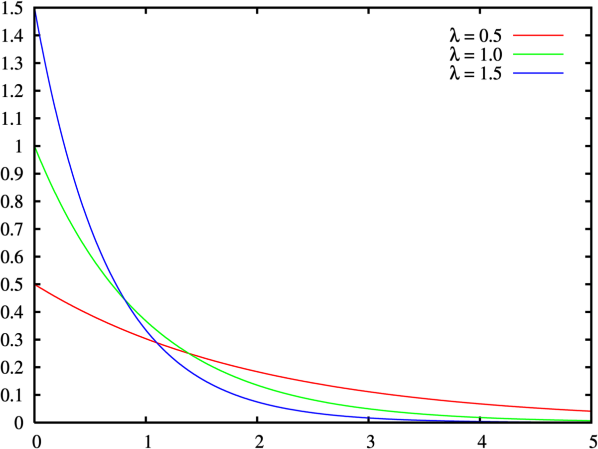
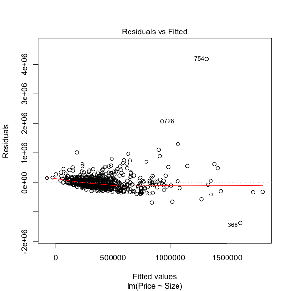

```{r setup, include=FALSE}
library(knitr)
options(servr.deamon = TRUE)
options(htmltools.dir.version = FALSE)
```

<div class="content-page">
  <p class="content-page-title">目录</p>
  <li class="content-page-list">探索性分析</li>
  <li class="content-page-list">实验设计</li>
  <li class="content-page-list">线性回归</li>
</div>

---
class: inverse, center, middle

# 探索性分析

---
class:

## 描述性统计量

.pull-left[
均值：`mean`

极值：`min, max`

中位数：`median`

百分位数：`quantile`

方差和标准差：`var, sd`

极差：
$r = x_{max} - x_{min}$

标准误：
$$s_{\mu} = \dfrac{s}{\sqrt{n}} = \sqrt{\dfrac{1}{n \left(n - 1\right)} \sum_{i = 1}^{n} {\left(x_i - \mu\right)}^2}$$
]

.pull-right[
偏度：`moments::skewness`
$$g_1 = \dfrac{m_3}{{m_2}^{3/2}} = \dfrac{\dfrac{1}{n} \sum_{i=1}^{n} (x_i-\mu)^3}{\left(\dfrac{1}{n} \sum_{i=1}^{n} (x_i-\mu)^2\right)^{3/2}}$$

峰度：`moments::kurtosis`
$$g_2 = \dfrac{m_4}{m_{2}^2} -3 = \dfrac{\dfrac{1}{n} \sum_{i=1}^n (x_i - \mu)^4}{\left(\dfrac{1}{n} \sum_{i=1}^n (x_i - \mu)^2\right)^2} - 3$$
]

---
class:

## 随机变量

$X$是一个给定的样本空间
$\left(S, \mathbb{F}\right)$上的一个实值函数，在样本空间中的每一个时间
$e$都有一个实数
$X\left(e\right)$与其相对应。

**随机变量分为两类**：

**离散型随机变量**：能够取到可数个数值的随机变量。例如：在某批产品中抽检10个，其中质量合格的产品的数量为
$X$，
$X$能够取的值为
$0, 1, ..., 10$，则
$X$是一个离散型随机变量。

**连续型随机变量**：取值个数不可数的随机变量。例如：中国北部某地区的日均降雨量为
$X$，
$X$能够取得值为
$\left[0, \infty\right)$，则
$X$是一个连续型随机变量。

---
class:

## 累积分布函数

连续型随机变量
$X$，对于任意实数
$x$，累积分布函数定义如下：

$$
F\left(x\right) = P\left(X \leq x\right)
$$

表示
$X \leq x$情况的概率之和。累积分布函数具有如下性质：

- 有界性：
$\lim\limits_{x \to - \infty} F\left(x\right) = 0$，
$\lim\limits_{x \to + \infty} F\left(x\right) = 1$。

- 单调性：
$F\left(x_1\right) \leq F\left(x_2\right)$，若
$x_1 \leq x_2$。

- 右连续性：
$\lim\limits_{x \to x_0^+} F\left(x\right) = F\left(x_0\right)$。

---
class:

## 概率密度函数

连续型随机变量
$X$，对于任意实数
$x$，概率密度函数定义如下：

$$
f\left(x\right) = \dfrac{\mathrm{d}F\left(x\right)}{\mathrm{d}x}
$$

其中
$F\left(x\right)$表示累积分布函数。概率密度函数具有如下性质：

- 对于任意
$x$，有
$f\left(x\right) \geq 0$。

- 
$\int_{-\infty}^{+\infty} f\left(x\right) \mathrm{d}x = 1$。

- 对于任意
$a, b$，
$-\infty < a < b < +\infty$，有
$P\left(a < X < b\right) = F\left(b\right) -  F\left(a\right) = \int_{a}^{b} f\left(x\right) \mathrm{d}x$。

---
class:

## 伯努利试验

伯努利试验是只有两种可能结果的单次随机试验，伯努利试验具有如下特征：

- 试验结果仅可能为两个互斥结果中的一个，取值结果用
$0$和
$1$表示。

- 对于两种试验结果的概率，
$P\left(X = 1\right) = p$，
$P\left(X = 0\right) = q$，有
$p + q = 1$。

例如：抛一枚均匀的硬币，正面向上表示成功，反面向上表示失败，该试验即为一个伯努利实验，并且成功额概率
$p = 0.5$。

---
class:

## 常用分布

**二项试验**是由一些列伯努利实验构成，**二项随机变量**
$X$具有如下特征：

- 试验包含
$n$次相同伯努利试验。
- 
$n$次伯努利试验相互独立。
- 二项随机变量
$X$表示
$n$次试验中成功的次数。

则二项随机变量
$X$的概率分布定义为：
$P\left(x\right) = \begin{pmatrix} n \\ x \end{pmatrix}p^x q^{n-x}$

其中，
$p$表示每次试验成功的概率，
$q = 1 - p$表示每次试验失败的概率，
$n$表示伯努利试验的次数，
$x$表示试验成功的次数，
$\begin{pmatrix} n \\ x \end{pmatrix} = \dfrac{n!}{x! \left(n - x\right)!}$。二项随机变量的期望值
$\mu = np$，方差
$\sigma^2 = npq$。 如果一个随机变量
$X$服从参数为
$n$和
$p$的**二项分布**，我们记
$X \sim B\left(n, p\right)$。

---
class:

## 常用分布

在多次伯努利试验中，随机变量
$X$表示直至观察到第
$r$次试验成功时试验的进行的总次数，则随机变量
$X$的概率分布称为**负二项分布**。负二项随机变量
$X$的概率分布定义为：
$P\left(x\right) = \begin{pmatrix} x-1 \\ r-1 \end{pmatrix} p^r q^{x-r}$

其中，
$p$表示每次试验成功的概率，
$q = 1 - p$表示每次试验失败的概率，
$x$表示直至观察到第
$r$次实验成功的试验总次数。负二项随机变量的期望值
$\mu = \dfrac{r}{p}$，方差
$\sigma^2 = \dfrac{rq}{p^2}$。如果一个随机变量
$X$服从参数为
$n$和
$p$的负二项分布，我们记
$X \sim NB\left(n, p\right)$。

对于负二项分布，当参数
$r = 1$时，即第一次观察到试验成功时试验的总次数，则随机变量
$X$的概率分布称为**几何分布**：
$P\left(x\right) = pq^{x-1}$

其中，
$x$表示第一次观察到试验成功时试验的总次数。几何分布的期望值
$\mu = \dfrac{1}{p}$，方差
$\sigma^2 = \dfrac{q}{p^2}$。如果一个随机变量
$X$服从参数为
$p$的几何分布，我们记
$X \sim G\left(p\right)$。

---
class:

## 常用分布

**泊松分布**描述了单位时间内随机事件发生的次数的概率分布。例如：单位时间内机器发生故障的次数，一段时间内来医院就诊的人数等。泊松随机变量具有如下特征：

- 随时事件在单位时间内发生的概率相同。
- 所有随机事件之间相互独立。

则泊松随机变量
$X$的概率分布定义为：
$P\left(x\right) = \dfrac{e^{-\lambda} \lambda^x}{x!}$

其中，
$\lambda$表示单位时间内事件的平均数，
$e$为自然对数的底，
$x$表示随机事件发生的次数。泊松分布的期望值
$\mu = \lambda$，方差
$\sigma^2 = \lambda$。如果一个随机变量
$X$服从参数为
$\lambda$泊松分布，我们记
$X \sim P\left(\lambda\right)$。

---
class:

## 常用分布

**均匀分布**是指，对于均匀分布随机变量
$X$在区间
$\left[a, b\right]$内随机事件发生的概率相等。对于均分分布随机变量
$X$，均匀分布的概率密度函数定义如下：

$$
f\left(x\right) =
\cases{
  \dfrac{1}{b - a} & \text{当}a \leq x \leq b \cr
  0 & \text{其他情况} \\
}
$$

均匀分布的期望值
$\mu = \dfrac{a + b}{2}$，方差
$\sigma^2 = \dfrac{\left(b - a\right)^2}{12}$。

---
class:

## 常用分布

.grid[
.grid-cell-1of3[
**正态分布**是统计学中应用最广泛的一类分布，现实生活中很多事件都服从正态分布。对于正态随机变量
$X$，正态分布的密度函数定义为：
$f\left(x\right) = \dfrac{1}{\sigma \sqrt{2 \pi}} e^{- \dfrac{\left(x - \mu\right)^2}{2 \sigma^2}}$

其中，
$\mu$表示随机变量
$X$的均值，
$\sigma^2$表示随机变量
$X$的方差。
]

.grid-cell-2of3[

]
]

---
class:

## 常用分布

.grid[
.grid-cell-1of3[
**指数分布**可以表示独立随机事件发生的时间间隔。指数分布于泊松分布相关，若单位时间内某随机事件发生的次数服从单位时间内随机事件发生的平均次数为
$1 / \beta$的泊松分布，则任意两个连续发生的随机事件的时间间隔
$X$服从均值为
$\beta$的指数分布。对于指数分布随机变量
$X$，指数分布的密度函数定义为：
$f\left(x\right) = \lambda e^{-\lambda x}, x \geq 0$
]

.grid-cell-2of3[

]
]

---
class:

## 常用分布

.center[
### 数据分布相关函数
]

| 分布类型 | 概率密度函数 | 累积密度函数 | 分位数函数 | 分布数据随机生成函数 |
| :------- | :----------- | :----------- | :--------- | :------------------- |
| 二项分布 | dbinom       | pbinom       | qbinom     | rbinom               |
| 几何分布 | dgeom        | pgeom        | qgeom      | rgeom                |
| 泊松分布 | dpois        | ppois        | qpois      | rpois                |
| 均匀分布 | dunif        | punif        | qunif      | runif                |
| 正态分布 | dnorm        | pnorm        | qnorm      | rnorm                |
| 指数分布 | dexp         | pexp         | qexp       | rexp                 |

---
class: inverse, center, middle

# 实验设计

---
class:

## 假设检验

某厂商购买了10000个电灯保险丝，假设供货商保证在任何特定批次中不合格的产品都不会超过1%。由于厂商不能够把这一批次的全部10000个保险丝都检查，因此必须从这批中选取一个保险丝样本进行检验，根据检验结果决定是接受还是拒绝这批保险丝。比如说，当选取一个数量为100的样本时，不合格产品个数
$Y$比较大，则厂商将拒绝这批保险丝。因此厂商需要通过样本所包含的信息来判断这批保险丝的不合格率
$p$是够超过
$0.01$。如果
$p$的置信区间在
$0.01$的左侧，那么该厂商则可以接受这批保险丝，并且相信不合格品率小于1%，反之，则拒绝<sup>[1]</sup>。

从上例中，可以得出在统计假设检验中，需要有一个作为检验对象的，我们称之为**原假设**或**零假设**（Null Hypothesis），记为
$H_0\left(\theta \in \Theta_0\right)$。与原假设相对应的假设，我们称之为**备选假设**（Alternative Hypothesis），记为
$H_1\left(\theta \in \Theta_1\right)$。对于上例而言，原假设和候选假设分别为：

$$
H_0: \theta \leq 0.01 \quad H_1: \theta > 0.01
$$

.footnote[
[1] 《统计学》，William Mendenhall。
]

---
class:

## 假设检验

其中
$\mu$为是否拒绝原假设所依赖的一个有样本数据计算得到的统计量，我们称之为**检验统计量**。对于一维的实参数检验统计量，原假设和备选假设有如下三种形式：

1. 单边检验
$$
H_0: \theta \leq {\theta}_0 \quad H_1: \theta > {\theta}_0
$$
2. 单边检验
$$
H_0: \theta \geq {\theta}_0 \quad H_1: \theta < {\theta}_0
$$
3. 双边检验
$$
H_0: \theta = {\theta}_0 \quad H_1: \theta \neq {\theta}_0
$$

检验统计量
$\theta$的值可以分为两个集合，当检查统计量处于备选假设中检查统计量的取值范围（例如
$\theta \geq 10$）中时，则接受备选假设，拒绝原假设，则检查统计量的这个集合称之为**拒绝域**。

---
class:

## 假设检验

对于假设检验只可能有两种结果：一个是接受原假设，一个是拒绝原假设。在进行假设检验过程中，容易犯两类错误，分别是：

1. **第一类错误**：拒绝为真的原假设。
2. **第二类错误**：接受为假的原假设。

原假设的真伪情况，接受或拒绝原假设以及所犯错误的类型的对应关系如表所示。

.center[
假设检验的结论与结果
]

| 是否接受原假设 \ 假设真伪 | $H_0$为真  | $H_1$为真  |
| :------------------------ | :--------- | :--------- |
| 拒绝原假设                | 第一类错误 | 正确决策   |
| 接受原假设                | 正确决策   | 第二类错误 |

---
class:

## 假设检验

因此，对于一个假设检验问题，设
$X_1, X_2, ..., X_n$为样本，
$W$为样本空间中的一个子集，则对于给定的
$\alpha \in \left(0, 1\right)$，若
$W$满足
$$
P_{\theta} \lbrace\left(X_1, X_2, ..., X_n\right) \in W\rbrace \leq \alpha, \quad \forall \theta \in \Theta_0
$$

则称有
$W$构成拒绝域的检验方法为**显著性水平**（Evidence Level）为
$\alpha$的检验。

综上所述，可以得到假设检验的一般步骤：

1. 对于待检验的未知参数
$\theta$和实际的问题，构建假设检验的原假设
$H_0$和备选假设
$H_1$.
2. 选择一个合适的显著性水平
$\alpha$，常用的假设显著性水平有
$0.05$，
$0.1$等。
3. 构建一个统计量
$s$，
$s$的大小反映了对原假设的有利情况。
4. 根据上式确定检验
$W$。

.center[
### 参数检验 VS 非参数检验
]

---
class:

## 常用假设检验<sup>[1]</sup>

<br /><br />

| 目的             | 参数检验                     | 非参数检验                 |
| :--------------- | :--------------------------- | :------------------------- |
| 比较2个样本均值  | Student's T Test             | Wilcoxon's U Test          |
| 比较多个样本均值 | ANOVA (Analysis of Variance) | Kruskal--Wallis Test       |
| 比较2个样本方差  | Fisher's F Test              | Ansari-Bradley / Mood Test |
| 比较多个样本方差 | Bartlett Test                | Fligner Test               |

.footnote[
[1] 《统计建模与R语言》 薛毅，陈立萍
]

---
class: inverse, center, middle

# 线性回归

---
class:

## 线性回归

在统计学中变量可以分为两类：被预测（或被建模）的变量
$y$称为因变量（或响应变量），用来预测（或建模）的变量称为自变量，并用符号
$x_1, x_2, ..., x_n$等表示<sup>[1]</sup>。线性回归模型在统计学中是一种联系因变量
$y$和自变量
$x_1, x_2, ..., x_n$之间的模型。

.footnote[
[1] W. Mendenhall, 统计学. 机械工业出版社, 2009.
]

---
class:

## 一元线性回归

.pull-left[
一元线性回归模型是一种简单的线性回归模型，它构建了自变量
$x$和因变量
$y$之间的一个概率模型。

为了方便理解一元线性回归模型，在此引入一个房屋价格的案例。数据集<sup>[1]</sup>包含了San Luis Obispo及其附近房屋数据，字段含义见表。
]

.pull-right[
| 字段          | 说明                 |
| :------------ | :------------------- |
| MLS           | 记录唯一编码         |
| Location      | 房屋地理位置         |
| Price         | 房屋价格（美元）     |
| Bedrooms      | 卧室数量             |
| Bathrooms     | 卫生间数量           |
| Size          | 房屋大小（平方英尺） |
| Price / SQ.ft | 每平方英尺价格       |
| Status        | 销售状态             |
]

.footnote[
[1] https://wiki.csc.calpoly.edu/datasets/wiki/Houses
]

---
class:

## 一元线性回归

.center[
### RealEstate数据集数据示例
]

| MLS    | Location    | Price  | Bedrooms | Bathrooms | Size  | P/SQ.ft | Status     |
| :----- | :---------- | :----- | :------- | :-------- | :---- | :------ | :--------- |
| 132842 | Arroyo Gr.. | 795000 | 3        | 3         | 2371  | 335.3   | Short Sale |
| 134364 | Paso Robles | 399000 | 4        | 3         | 2818  | 141.59  | Short Sale |
| 135141 | Paso Robles | 545000 | 4        | 3         | 3032  | 179.75  | Short Sale |
| 135712 | Morro Bay   | 909000 | 4        | 4         | 3540  | 256.78  | Short Sale |
| 136282 | Santa Mar.. | 109900 | 3        | 1         | 1249  | 87.99   | Short Sale |
| 136431 | Oceano      | 324900 | 3        | 3         | 1800  | 180.5   | Short Sale |

---
class:

## 一元线性回归

一元线性回归模型假设因变量
$y$和自变量
$x$之间存在如下所述关系。

$$
y = \beta_0 + \beta_1 x + \epsilon
$$

其中，
$x$为自变量，
$y$为因变量，
$\beta_0$和
$\beta_1$为模型的确定性分量，
$\epsilon$为随机误差分量。对于一元线性回归，数据需要满足如下假设：

1. 
$\epsilon$服从正态分布。
2. 
$\epsilon$概率分布的均值为$0$，即
$E(\epsilon) =  0$，其中
$E(\epsilon)$表示
$\epsilon$的期望。
3. 对于所有的
$x$，
$\epsilon$的方差等于一个常数，即
$\sigma^2$。
4. 任意两个观测值之间相互独立。

因此，我们可以用一条直线表示数据集中的
$x$和
$y$之间的关系，使得数据点均匀的分布在直线的两侧。

---
class:

## 一元线性回归

```{r echo=F, message=F}
library(tidyverse)

real_estate <- read_csv('../Data/real-estate.csv')
real_estate_lm_model <- lm(Price ~ Size, data=real_estate)
test_size <- data.frame(Size=c(2000, 4000, 8000))
test_price <- data.frame(Price=predict(real_estate_lm_model, test_size))
test_data <- cbind(test_size, test_price)
```

```{r echo=F, fig.width=10, fig.height=6}
p <- ggplot(real_estate, aes(Size, Price))
p <- p + xlab('Size (SQ. ft)')
p <- p + ylab('Price (U.S. dollar)')
p <- p + geom_point(color='black')
p <- p + geom_smooth(method='lm', se=FALSE)
p <- p + theme(text=element_text(size=20))
print(p)
```

---
class:

## 一元线性回归

在R语言中，我们利用lm()进行线性模型拟合，lm()函数定义如下：

```{r eval=F}
lm(formula, data, subset, weights, na.action,
   method = "qr", model = TRUE, x = FALSE, y = FALSE, qr = TRUE,
   singular.ok = TRUE, contrasts = NULL, offset, ...)
```

.center[
`lm()`函数主要参数列表
]

| 参数      | 说明                                                 |
| :-------- | :--------------------------------------------------- |
| formula   | 模型函数表达式                                       |
| data      | 数据集                                               |
| weights   | 拟合过程的权重向量，NULL时使用原始最小二乘法进行拟合 |
| na.action | 缺失值处理方法                                       |

---
class:

## 一元线性回归

在模型函数表达式（formula），除了会用到R语言中的操作符外，还会用到一些特殊的符号和函数。R语言表达式常用的符号和函数如下：

- 
$+$ 自变量分割符号。
- 
$\sim$ 分隔符号。左侧为因变量，右侧为自变量。例如：
$y$与
$x_1$和
$x_2$存在线性关系，则表达式为：
$y \sim x_1 + x_2$
- 
$:$ 存在交互关系的自变量连接符号。例如：
$y$与
$x_1$，
$x_2$和
$x_1$与
$x_2$的交互项存在线性关系，则表达式为：
$y \sim x_1 + x_2 + x_1 : x_2$
- 
$*$ 存在交互关系的自变量简洁表达方式。例如：
$y \sim x_1 * x_2$表示
$y \sim x_1 + x_2 + x_1 : x_2$
- 
$\hat{}$ 表示交互项的次数。例如：
$y \sim (x_1 + x_2 + x_3) ^ 2$表示
$y \sim x_1 + x_2 + x_3 + x_1 : x_2 + x_1 : x_3 + x_2 : x_3$
- 
$.$ 表示数据集中除因变量外的所有变量。例如：某数据集中包含
$x_1$，
$x_2$和
$y$三个变量，则表达式
$y \sim .$表示
$y \sim x_1 + x_2 + x_1 : x_2$

---
class:

## 一元线性回归

- 
$-$ 表示删除某个自变量。例如：
$y \sim (x_1 + x_2 + x_3)^2 - x_1 : x_2$表示
$y \sim x_1 + x_2 + x_3 + x_1 : x_3 + x_2 : x_3$
-	
$-1$ 表示删除常数项。例如：
$y \sim x - 1$表示
$x$与
$y$之间存在线性关系，并且拟合直线通过原点。
-
$I()$ 表示将表达式转化成为一个新的自变量。例如：
$y \sim x_1 + I\left(\left(x_2 + x_3\right) ^ 2\right)$表示将
$\left(x_2 + x_3\right) ^ 2$转化成为一个变量
$x_new$，并存在关系
$y \sim x_1 + x_new$
-	
$\textit{function}$ 表示可用的数学函数。例如：
$y \sim x_1 + log\left(x_2\right)$表示
$y$与
$x_1$和
$\left(x_2\right)$之间存在线性关系

利用lm()函数构建完模型后，R会利用数据和用户输入的参数自动对模型进行参数估计和拟合。模型建立和拟合完成后，用户可以使用工具函数查看模型的各项拟合结果，常用函数如下：

---
class:

## 一元线性回归

- `summary` 查看模型详细信息
- `coef, coefficients` 查看模型参数
- `confint` 查看模型参数置信区间
- `fitted` 查看模型的拟合值
- `residuals` 对模型进行方差分析
- `vcov` 查看模型的协方差矩阵
- `AIC` 查看模型的赤池宏信息量<sup>[1]</sup>
- `BIC` 查看模型的贝叶斯信息量<sup>[2]</sup>

.footnote[
[1] H. Akaike, “A new look at the statistical model identification,” Automatic Control, IEEE Transactions on, vol. 19, no. 6, pp. 716–723, 1974.

[2] G. Schwarz et al., “Estimating the dimension of a model,” The annals of statistics, vol. 6, no. 2, pp. 461–464, 1978.
]

---
class:

## 一元线性回归

在计算过程中并不一定要知道因变量和自变量是否有线性关系。如果不存相，那么回归方程就没有任何意义了。因此，我们需要用假设检验的方法，来验证相关性的有效性。通常会采用三种显著性检验：

- T检验：T检验是检验模型某个自变量
$x_i$对于
$y$的显著性，通常用P-value判断显著性，小于0.01更小时说明这个自变量
$x_i$与
$y$相关关系显著。

- F检验：F检验用于对所有的自变量
$x_i$在整体上看对于
$y$的线性显著性，也是用P-value判断显著性，小于0.01更小时说明整体上自变量与因变量相关关系显著。

- 
$R^2$相关检验：用来判断回归方程的拟合程度，
$R^2$的取值在
$\left(0, 1\right)$之间，越接近1说明拟合程度越好。为了解决多元回归自变量越多，判定系数
$R^2$越大的问题，我们常用调整后的
$R^2$值。

---
class:

## 一元线性回归

在得到的回归模型进行显著性检验后，还要在做残差分析(预测值和实际值之间的差)，检验模型的正确性，残差必须服从正态分布
$N\left(0, σ ^ 2\right)$。

```{r}
real_estate_lm_model_residuals <- residuals(real_estate_lm_model)
shapiro.test(real_estate_lm_model_residuals)
```

对残差进行Shapiro-Wilk正态分布检验，W接近1，p-value>0.05，证明数据集符合正态分布。但是从检验结果来看，上面模型的残差并不符合正态分布。

---
class:

## 一元线性回归

.pull-left[

]

.pull-right[
<br />

.center[**残差和拟合值对比图**]

对残差和拟合值作图，横坐标是拟合值，纵坐标是残差。残差和拟合值之间，数据点均匀分布在
$y=0$两侧，呈现出随机的分布，红色线呈现出一条平稳的曲线并没有明显的形状特征，说明残差数据表现非常好。
]

---
class:

## 一元线性回归

.pull-left[

]

.pull-right[
<br />

.center[**残差QQ图**]

残差QQ图，用来描述残差是否符合正态分布。图中的数据点按对角直线排列，趋于一条直线，并被对角直接穿过，直观上符合正态分布。对于近似服从正态分布的标准化残差，应该有95%的样本点落在
$\left[-2, 2\right]$区间内。
]

---
class:

## 一元线性回归

.pull-left[

]

.pull-right[
<br />

.center[**标准化残差平方根和拟合值对比图**]

对标准化残差平方根和拟合值作图，横坐标是拟合值，纵坐标是标准化后的残差平方根。与残差和拟合值对比图的判断方法类似，数据随机分布，红色线呈现出一条平稳的曲线，无明显的形状特征。
]

---
class:

## 一元线性回归

.pull-left[

]

.pull-right[
<br />

.center[**标准残差和杠杆值对比图**]

对标准化残差和杠杆值作图，虚线表示的Cook距离等高线，通常用Cook距离度量的回归影响点。本图中出现红色的等高线，则说明数据中有影响回归结果的异常点。
]

---
class:

## 一元线性回归

模型构建和拟合完毕后，用户可以使用pridict()函数和拟合好的模型对其他待预测数据进行预测。

```{r eval=F}
predict(object, ...)
```

其中object为拟合的模型，用户可以将待预测数据封装成和拟合使用数据相同格式的数据传入函数即可得到预测结果。

---
class:

## 多元线性回归

多元线性回归是一元线性回归的一种推广，其自变量不再是一个，而是多个。多元线性回归模型假设因变量
$Y$和
$k$个自变量
$x_1, x_2, ..., x_k$之间存在下式述关系。

$$Y = \beta_0 + \beta_1 x_1 + \beta_2 x_2 + ... + \beta_{k - 1} x_{k - 1} + \epsilon$$

其中，
$\beta_i, i = 1, 2, ..., k - 1$称为未知参数，
$\beta_0$称为截矩项。假设主要有以下几点：

1. 响应变量
$Y$和误差项
$\epsilon$正态性：响应变量
$Y$和误差项
$\epsilon$服从正态分布，且
$\epsilon$是一个白噪声过程，因而具有零均值，同方差的特性。
2. 预测量
$x_i$和未知参数
$\beta_i$的非随机性：预测量
$x_i$具有非随机性、可测且不存在测量误差；未知参数
$\beta_i$认为是未知但不具随机性的常数，值得注意的是运用最小二乘法或极大似然法解出的未知参数的估计值
$\hat{\beta_i}$则具有正态性。
3. 研究对象：如前所述普通线性模型的输出项是随机变量
$Y$。在随机变量众多的特点或属性里，比如分布、各种矩、分位数等等，普通线性模型主要研究响应变量的均值
$E\left[Y\right]$。
4. 联接方式：在上面三点假设下，对上式两边取数学期望，可得：
$$E\left[Y\right] = \beta_0 + \beta_1 x_1 + \beta_2 x_2 + ... + \beta_{k - 1} x_{k - 1}$$

---
class:

## 广义线性回归

广义线性模型 (generalized linear model) 正是在普通线性模型的基础上，将上述四点模型假设进行推广而得出的应用范围更广，更具实用性的回归模型。

1. 响应变量的分布推广至指数分散族 (exponential dispersion family)：比如正态分布、泊松分布、二项分布、负二项分布、伽玛分布、逆高斯分布。指数分散族 的详细定义限于篇幅这里不做详细介绍。
2. 预测量
$x_i$和未知参数
$\beta_i$的非随机性：仍然假设预测量
$x_i$具有非随机性、可测且不存在测量误差；未知参数
$\beta_i$认为是未知且不具有随机性的常数。
3. 研究对象：广义线性模型的主要研究对象仍然是响应变量的均值
$E\left[Y\right]$。
4. 联接方式：广义线性模型里采用的联连函数 (link function) 理论上可以是任意的，而不再局限于
$f\left(x\right) = x$。当然了联接函数的选取必然地必须适应于具体的研究案例。同时存在着与假设 里提及的分布一一对应的联接函数称为标准联接函数 (canonical link or standard link)，如正态分布对应于恒等式，泊松分布对应于自然对数函数等。

---
class:

## 最小二乘法

最小二乘法是利用最小二乘准则，对用样本数据对回归方程中参数的一种估计方法。以一元线性回归为例，因变量
$y$和自变量
$x$之间关系为：

$$
y = \beta_0 + \beta_1 x + \epsilon
$$

我们希望找到一条直线
$\hat{y} = \hat{\beta}_0 + \hat{\beta}_1 x$使得样本中的点能够均匀的分布在直线的两边。对于给定的点
$\left(x_i, y_i\right)$，其观测值与真实值的离差为：

$$
y_i - \hat{y_i} = y_i - \hat{\beta}_0 + \hat{\beta}_1 x_i
$$

则所有的样本点的离差的平方和记为SSE：

$$
\text{SSE} = \sum_{i=1}^{n}{\left[y_i - \left(\hat{\beta}_0 + \hat{\beta}_1 x\right)\right]}^2
$$

---
class:

## 最小二乘法

最小二乘法通过最小化SSE来确定
$\hat{\beta}_0$和
$\hat{\beta}_1$，令上式的偏导数为
$0$可以求解
$\hat{\beta}_0$和
$\hat{\beta}_1$。

$$\dfrac{\partial \text{SSE}}{\partial \hat{\beta}_0} = \sum_{i=1}^{n}{2 \left[y_i - \left(\hat{\beta}_0 + \hat{\beta}_1 x\right)\right]} \left(-1\right) = 0$$

$$\dfrac{\partial \text{SSE}}{\partial \hat{\beta}_1} = \sum_{i=1}^{n}{2 \left[y_i - \left(\hat{\beta}_0 + \hat{\beta}_1 x\right)\right]} \left(-x_i\right) = 0$$

通过求解方程组可得：
$\hat{\beta}_1 = \dfrac{SS_{xy}}{SS_{xx}}, \hat{\beta}_0 = \overline{y} - \hat{\beta}_1$，其中：

$$SS_{xy} = \sum_{i=1}^{n}\left(x_i - \overline{x}\right)\left(y_i - \overline{y}\right) = \sum_{i=1}^{n}{x_i y_i} - \dfrac{\left(\sum_{i=1}^{n}x_i\right)\left(\sum_{i=1}^{n}y_1\right)}{n}$$

$$SS_{xx} = \sum_{i=1}^{n}{x_i - \overline{x}}^2 = \sum_{i=1}^{n}x_1^2 - \dfrac{{\left(\sum_{i=1}^{n}x_i\right)}^2}{n}$$

---
class:

## 梯度下降

梯度下降（Gradient Descent）是一种常用的最优化方法，可以用来求解函数最小值和最大值的问题。一个函数
$f(\theta)$的梯度定义为：

$$
\dfrac{\partial f\left(x \right)}{\partial x} = \lim_{\delta x \to 0} \dfrac{f\left(x + \delta x \right) -  f\left(x\right)}{\delta x}
$$
假设在
$a$点
$f(x)$有定义且可微，则函数
$f(x)$在
$a$点沿梯度的相反方向
$-\nabla f(a)$下降最快。同样以一元线性回归为例，梯度下降的目标是最小化损失函数（Cost Function），也就是说损失函数越小，线性回归的拟合效果越好。一元线性回归的损失函数定义为：

$$C\left({\beta}_0, {\beta}_1\right) = \dfrac{1}{2m} \sum_{i=1}^{n}{\left(h_{\beta}\left(x^{\left(i\right)}\right) - y^{\left(i\right)}\right)}^2$$
其中
$x^{(i)}$表示样本中第
$i$个向量
$x$，
$y^{(i)}$表示样本中第
$i$个向量
$y$，
$h_{\beta}\left(x^{(i)}\right)$表示假设函数，
$n$为样本数。

---
class:

## 梯度下降

.pull-left[
- 确定学习速率（Learning Rate），也就是梯度下降过程中的步伐大小
$\alpha$。
- 确定参数的初始值：
${\beta}_0$和
${\beta}_1$。
- 根据函数的梯度方向更新
${\beta}_0$和
${\beta}_1$，即：
$${\beta}_i := {\beta}_i - \alpha \dfrac{\partial}{\partial {\beta}_i} C\left({\beta}_0, {\beta}_1\right)$$
- 当达到终止条件（下降高度小于预设值或达到迭代次数）时，停止更新。
]

.pull-right[

]

---
class: center, middle

# Thanks


本作品采用 [CC BY-NC-SA 4.0](http://creativecommons.org/licenses/by-nc-sa/4.0/) 进行许可