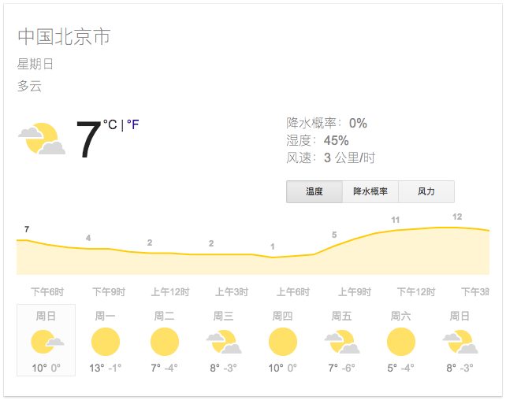
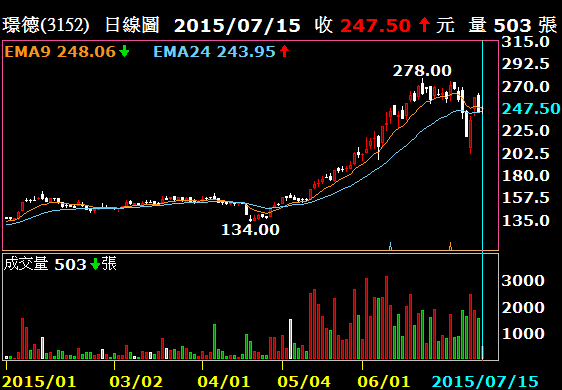

$$
$$

```{r setup, include=FALSE}
library(knitr)
library(tidyverse)
options(servr.deamon = TRUE)
options(htmltools.dir.version = FALSE)
```

<div class="content-page">
  <p class="content-page-title">目录</p>
  <li class="content-page-list">时间序列</li>
  <li class="content-page-list">ARIMA模型</li>
  <li class="content-page-list">季节性分析</li>
</div>

---
class: inverse, center, middle

# 时间序列

---
class:

# 时间序列

**时间序列**是现实生活中经常会碰到的数据形式。例如北京市连续一年的日平均气温、某股票的股票价格、京东上某件商品的日销售件数等等。时间序列分析的的目的是挖掘时间序列中隐含的信息与模式，并借此对此序列数据进行评估以及对系列的后续走势进行预测。

.pull-left[

]

.pull-right[

]

---
class:

# 统计量

假设存在一个时间序列：
$\left\{Y_t | t = 0, \pm 1, \pm 2, ...\right\}$

**均值**定义为：
$\mu_t = E\left(Y_t\right)$

**方差**定义为：
$\sigma_{t}^{2} = E \left(\left(Y_t - \mu_t\right)^2\right)$

**自协方差**定义为：
$\gamma_{t, s} = Cov\left(Y_t, Y_s\right) = E\left(\left(Y_t - \mu_t\right) \left(Y_s - \mu_s\right)\right)$

**自相关系数**定义为：
$\rho_{t, s} = \dfrac{\gamma_{t, s}}{\sqrt{\gamma_{t, t} \gamma_{s, s}}}$

如果忽略元素来自时间序列这一事实，各统计量的意义与普通的统计学中无异。

---
class:

# 白噪声

.pull-left[考虑一个时间序列，其中每一个元素为独立同分布变量，且均值为0。这种时间序列叫做白噪声。之所以叫这个名字，是因为对这种序列的频域分析表明其中平等的包含了各个频率，和物理中的白光类似。

每个元素服从
$N\left(0, 1\right)$，均值
$\mu_t = 0$，方差
$\sigma_t^2 = 1$。每个元素独立，对于任何
$t \neq s$，
$\gamma_{t, s} = 0$，
$\rho_{t, s} = 0$。

我们一般用e表示白噪声，将白噪声序列写作：

$$\left\{e_1, e_2, ..., e_t, ...\right\}$$
]

.pull-right[
```{r echo=F}
Y <- ts(rnorm(100, mean = 0, sd = 1))
plot(Y, type = 'b', col = 'red')
abline(h = 0)
```
]

---
class:

.pull-left[
# 随机游走

考虑一个时间序列，在
$t$时刻的值是白噪声前
$t$个值之和，设
$\left\{e_1, e_2, ..., e_t, ...\right\}$为标准正态的白噪声，则：

$$\begin{split}
Y_1 &= e_1 \\
Y_2 &= e_1 + e_2 \\
&\vdots \\
Y_t &= e_1 + e_2 + ... + e_t \\
&\vdots
\end{split}$$

]

.pull-right[
<br />
```{r echo=F}
Y <- ts(rnorm(100, mean = 0, sd = 1));
for (i in 2:length(Y)) {
    Y[i] <- Y[i] + Y[i-1];
}
plot(Y, type='b', col='red');
abline(h = 0)
```
]

均值：
$\mu_t = E\left(e_1 + ..., + e_t\right) = E\left(e_1\right) + ... + E\left(e_t\right) = 0$ <br />
方差：
$\sigma_t^2 = Var\left(e_1 + ... + e_t\right) = Var\left(e_1\right) + ... + Var\left(e_t\right) = t \sigma^2$

从统计上可以看到，随机游走的“趋势性”实际是个假象，因为其均值函数一直是白噪声的均值，不存在偏离的期望。但方差与时间呈线性增长并且趋向于无穷大，这意味着只要时间够长，随机游走的序列值可以偏离均值任意远，但期望永远在均值处。物理与经济学中很多现象被看做是随机游走，例如分子布朗运动，股票的价格走势等。

---
class:

# 平稳性

平稳性是时间序列分析中很重要的一个概念。一般的，我们认为一个时间序列是平稳的，如果它同时满足一下两个条件：

1. 均值函数是一个常数函数
2. 自协方差函数只与时滞有关，与时间点无关

一般的时间序列分析往往针对平稳序列，对于非平稳序列会通过某些变换将其变为平稳的。

---
class: inverse, center, middle

# ARIMA模型

---
class:

# ARIMA模型

.pull-left[
**ARIMA**模型（Autoregressive Integrated Moving Average model），差分整合移动平均自回归模型，又称整合移动平均自回归模型（移动也可称作滑动），时间序列预测分析方法之一。

$\text{ARIMA} \left(p, d, q\right)$中，
$\text{AR}$是自回归，
$p$为自回归项数；
$\text{MA}$为滑动平均，
$q$为滑动平均项数，
$d$为使之成为平稳序列所做的差分次数（阶数）。

图中自顶向下越来越特化，而自底向上则越来越泛化。
]

.pull-right[

]

---
class:

# AR模型

具有如下结构的模型为
$p$阶自回归模型，记为
$AR\left(p\right)$：

$$Y_t = e_t + \phi_1 Y_{t-1} + \phi_2 Y_{t-2} + ... + \phi_p Y_{t-p}$$

$AR\left(p\right)$模型有三个限制条件：

1. $\phi_p \neq 0$，这个限制条件可以保证模型的最高阶数为
$p$；
2. $e_t \sim N \left(0, \sigma_t^2\right)$，这个限制条件要求随机干扰序列
$e_t$是均值为零的白噪声序列。
3. $E\left(Y_s e_t\right) = 0, \forall s < t$，这个条件限制当前的随机干扰与过去的数据序列值无关。

通常上述三个条件为AR模型的默认条件，因此常将
$AR\left(p\right)$模型简记为：

$$Y_t = \sum_{i=1}^{p}{\phi_i Y_{t-i}} + e_t$$

---
class:

# MA模型

具有如下结构的模型为
$q$阶滑动平均模型，记为
$MA\left(q\right)$：

$$Y_t = e_t - \theta_1 e_{t-1} - \theta_2 e_{t-2} - ... - \theta_q e_{t-q}$$

$MA\left(q\right)$模型有两个限制条件：

1. $\theta_q \neq 0$，这个限制条件可以保证模型的最高阶数为
$q$；
2. $e_t \sim N \left(0, \sigma_t^2\right)$，这个限制条件要求随机干扰序列
$e_t$是均值为零白噪声序列。

通常上述两个条件为MA模型的默认条件，因此常将
$MA\left(q\right)$模型简记为：

$$Y_t = e_t - \sum_{i=1}^{q}{\theta_i e_{t-i}}$$

---
class:

# ARMA模型

如果一个时间序列兼有AR和MA部分，并且是平稳的，则构成ARMA模型。一般
$ARMA\left(p, q\right)$的表达式为：

$$Y_t = e_t + \sum_{i=1}^{p}{\phi_i Y_{t-i}} - \sum_{j=1}^{q}{\theta_j e_{t-j}}$$

令：

$$\Phi\left(L\right) = 1 - \phi_1 L - \phi_2 L^2 - ... - \phi_p L^p$$

$$\Theta\left(L\right) = 1 + \theta_1 L + \theta_2 L^2 + ... + \theta_q L^q$$

则上式可简写为：

$$\Phi\left(L\right)Y_t = \delta + \Theta\left(L\right) e_t$$

其中，
$L$称之为滞后算子。

---
class:

# ARIMA模型

ARIMA和ARMA的区别就是，将公式中
$Y_t$替换为差分算子，即：

$$\Phi\left(L\right) \Delta^d Y_t = \delta + \Theta\left(L\right) e_t$$

差分算子为：

$$\begin{split}
\Delta Y_t &= Y_t - Y_{t-1} = Y_t - L Y_t = \left(1 - L\right) Y_t \\
\Delta^2 Y_t &= \Delta Y_t - \Delta Y_{t-1} = \left(1 - L\right) Y_t - \left(1 - L\right) Y_{t-1} = \left(1 - L\right)^2 Y_t \\
\Delta^d Y_t &= \left(1 - L\right)^d Y_t
\end{split}$$

参数优化：

1. 确定差分阶数
$d$，从而保证差分后的时间序列是平稳的。
2. 确定AR和MA模型的参数
$p$和
$q$，例如AIC等。

---
class:

# ARIMA模型

`skirts.dat`数据记录了1866年到1911年每年女人们裙子的直径：

.pull-left[
```{r eval=F}
skirts <- read_csv(
    '../Data/skirts.dat',
    skip = 4)

skirts_ts <- ts(skirts, 
    start = c(1866))

skirts_df <- data.frame(
    time = time(skirts_ts),
    skirt = unname(skirts)
)

ggplot(skirts_df, 
       aes(time, skirt)) +
    geom_line()
```
]

.pull-right[
```{r echo=F, message=F}
skirts <- read_csv('../Data/skirts.dat', skip = 4)
skirts_ts <- ts(skirts, start = c(1866))
skirts_df <- data.frame(
    time = time(skirts_ts),
    skirt = unname(skirts)
)
ggplot(skirts_df, aes(time, skirt)) + geom_line() +
    theme(text=element_text(size=25))
```
]

---
class:

# ARIMA模型

```{r eval=F}
auto.arima(y, d = NA, D = NA, max.p = 5, max.q = 5, max.P = 2,
  max.Q = 2, max.order = 5, max.d = 2, max.D = 1, start.p = 2,
  start.q = 2, start.P = 1, start.Q = 1, stationary = FALSE,
  seasonal = TRUE, ic = c("aicc", "aic", "bic"), stepwise = TRUE,
  trace = FALSE, approximation = (length(x)>150 | frequency(x)>12),
  truncate = NULL, xreg = NULL, test = c("kpss", "adf", "pp"),
  seasonal.test = c("ocsb", "ch"), allowdrift = TRUE,
  allowmean = TRUE, lambda = NULL, biasadj = FALSE,
  parallel = FALSE, num.cores = 2, x = y, ...)
```

- p, q, d, P, Q, D为ARIMA参数。
- ic为定阶方法。
- seasonal为是否使用季节性ARIMA模型。
- trace为是否显示模型选择过程。

---
class:

# ARIMA模型

```{r}
library(forecast)
skirts_arima <- auto.arima(skirts_ts, seasonal = F, trace = T)
```

---
class:

# ARIMA模型

```{r}
forecast(skirts_arima, h=6)
```

---
class:

# ARIMA模型

```{r fig.width=10, fig.height=5}
skirts_arima %>% forecast(h=6) %>% autoplot(lim.size = 3) +
    theme(text = element_text(size=25)) +
    theme(title = element_blank())
```

---
class: inverse, center, middle

# 季节性分析

---
class:

# 季节性分析

一个季节性时间序列包含一个趋势部分，一个季节性部分和一个不规则部分。分解时间序列就意味着要把时间序列分解称为这三个部分，也就是估计出这三个部分。

`nybirths.dat`数据记录了从1946年1月到1959年12月的纽约每月出生人口数量，纽约每月出生人口数量是在夏季有峰值、冬季有低谷的时间序列。

.pull-left[
```{r eval=F}
nybirths <- read_csv(
    '../Data/nybirths.dat',
    col_names = F)
nybirths_ts <- ts(nybirths,
    frequency = 12,
    start = c(1946, 1))
nybirths_df <- data.frame(
    time = time(nybirths_ts),
    nybirths=unname(nybirths))
ggplot(nybirths_df, 
       aes(time, nybirths)) + 
    geom_line()
```
]

.pull-right[
```{r echo=F, message=F, fig.height=6}
nybirths <- read_csv('../Data/nybirths.dat', col_names=F)
nybirths_ts <- ts(nybirths, frequency=12, start=c(1946, 1))
nybirths_df <- data.frame(
    time = time(nybirths_ts),
    nybirths = unname(nybirths)
)
ggplot(nybirths_df, aes(time, nybirths)) + geom_line() +
    theme(text=element_text(size=25))
```
]

---
class:

# 季节性分析

利用滑动平均进行季节性分解：

```{r eval=F}
decompose(x, type = c("additive", "multiplicative"), filter = NULL)
```

- `x`为时间序列
- `type`为时间序列类型，`additive`为相加，`multiplicative`为相乘。

利用Loess进行季节性分解：

```{r eval=F}
stl(x, s.window, s.degree = 0, t.window = NULL, t.degree = 1,
    l.window = nextodd(period), l.degree = t.degree,
    s.jump = ceiling(s.window/10), t.jump = ceiling(t.window/10),
    l.jump = ceiling(l.window/10), robust = FALSE, 
    inner = if(robust) 1 else 2, outer = if(robust) 15 else 0,
    na.action = na.fail)
```

---
class:

# 季节性分析

```{r fig.width=10, fig.height=5.5}
nybirths_components <- decompose(nybirths_ts)
plot(nybirths_components)
```

---
class:

# 季节性分析

```{r eval=F}
library(ggseas)
ggsdc(nybirths_df, aes(time, nybirths), method='decompose') +
    geom_line()
```
```{r echo=F, message=F, warning=F, fig.width=10, fig.height=5}
library(ggseas)
ggsdc(nybirths_df, aes(time, nybirths), method='decompose') +
    geom_line() +
    theme(text=element_text(size=16))
```

---
class:

# 其他时间序列分析工具

- 经验模态分解
  - 用于处理非平稳序列
  - R包：hht, Rlibeemd
- 深度学习
  - RNN，LSTM
  - R包：CNTK-R, Keras
- prophet
  - Fackbook出品，值的信赖
  - 更适用于工业界

---
class: center, middle

# Thanks


本作品采用 [CC BY-NC-SA 4.0](http://creativecommons.org/licenses/by-nc-sa/4.0/) 进行许可